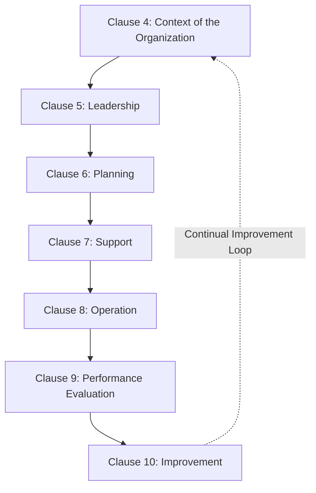
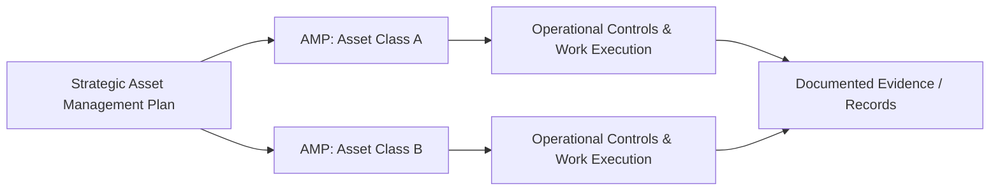
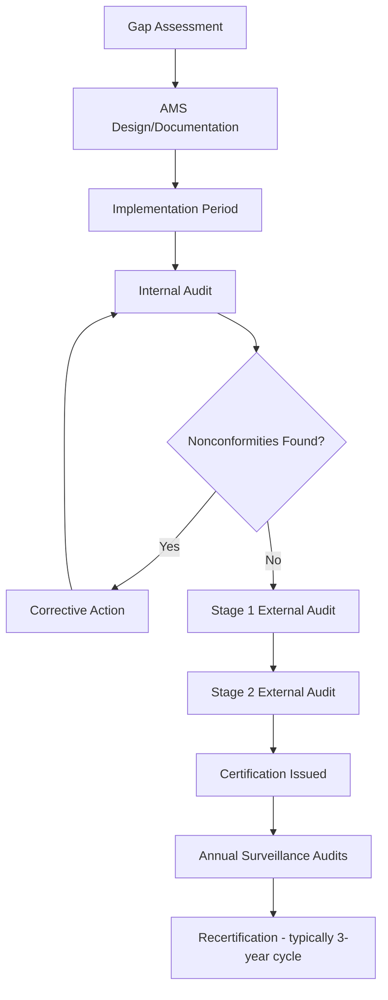

## ISO 55001 Requirements for an Asset Management System

### Overview and Purpose

ISO 55001 is the certifiable standard within the ISO 55000 family, specifying the requirements for establishing, implementing, maintaining, and improving a management system for asset management, referred to as an "asset management system" (AMS). Where ISO 55000 provides vocabulary and conceptual fundamentals, ISO 55001 translates those fundamentals into auditable "shall" statements—specific, verifiable requirements that a third-party certification body assesses during an audit.

ISO 55001 follows the **Annex SL high-level structure** common to modern ISO management system standards (shared with ISO 9001, ISO 14001, ISO 45001), which facilitates integrated management system audits and reduces documentation duplication for organizations holding multiple certifications.

### High-Level Structure (Clause Overview)

Clauses 1–3 (Scope, Normative References, Terms and Definitions) contain no auditable requirements and reference ISO 55000 directly for terminology. Clauses 4–10 contain the substantive requirements.

### Clause 4: Context of the Organization

**Key Points**

- Requires the organization to determine internal and external issues relevant to its purpose and affecting its ability to achieve intended AMS outcomes
- Requires identification of stakeholders and their requirements relevant to asset management
- Requires the organization to define the **scope** of the asset management system, including the asset portfolio covered
- Establishes the requirement for a documented **Strategic Asset Management Plan (SAMP)**, linking organizational objectives to asset management objectives

**Example**

A rail operator scoping its AMS might explicitly include rolling stock, track infrastructure, and signaling systems while excluding administrative office buildings, documenting this boundary decision as part of Clause 4 compliance.

### Clause 5: Leadership

**Key Points**

- Top management must demonstrate leadership and commitment to the AMS, not merely delegate it
- Requires establishment of an **asset management policy**—a documented statement of intent, aligned with organizational objectives, approved by top management
- Requires definition of organizational roles, responsibilities, and authorities relevant to asset management
- Reinforces the "Leadership" fundamental from ISO 55000: culture and top-down commitment are treated as auditable, not aspirational, elements

Auditors under this clause typically interview senior leadership directly to verify genuine understanding and commitment, rather than relying solely on documentation review.

### Clause 6: Planning

**Key Points**

- Requires the organization to determine risks and opportunities that need to be addressed to give assurance the AMS can achieve its intended outcomes
- Requires establishment of **asset management objectives** at relevant functions and levels, consistent with the asset management policy and SAMP
- Requires planning of actions to achieve these objectives, including resource allocation, timeframes, and methods of evaluating results
- Introduces the concept of **decision-making criteria**—documented, consistent criteria for prioritizing asset management activities and resource allocation across the portfolio

$$\text{Risk Priority} = f(\text{Probability of Failure}, \text{Consequence of Failure}, \text{Organizational Risk Appetite})$$

This clause is where formal line-of-sight documentation (linking strategic objectives to specific, measurable asset management objectives) is most rigorously audited.

### Clause 7: Support

**Key Points**

- **Resources**: the organization must determine and provide resources needed for the AMS (personnel, technology, financial)
- **Competence**: personnel performing work affecting asset management performance must be competent, with training and competency records maintained
- **Awareness**: personnel must be aware of the asset management policy, their contribution to AMS effectiveness, and implications of non-conformance
- **Communication**: internal and external communication processes relevant to the AMS must be determined and implemented
- **Documented information**: requirements for creating, updating, and controlling documentation (SAMP, AMPs, policies, procedures, records)

**Example**

A utility company must demonstrate that field technicians performing condition assessments have documented competency certifications and that assessment procedures are version-controlled, with obsolete procedure versions clearly marked or removed from active circulation.

### Clause 8: Operation

**Key Points**

- Requires **operational planning and control**—implementing processes needed to meet AMS requirements and asset management objectives established in Clause 6
- Requires management of change: processes for evaluating and managing risks associated with planned or unplanned changes that impact asset management (new asset types, organizational restructuring, regulatory changes)
- Requires outsourcing controls: where asset management activities or asset-related decisions are outsourced, the organization must ensure control over these outsourced processes

This clause is where the **Asset Management Plans (AMPs)** developed under the SAMP are actually executed—the "Do" phase of the PDCA cycle.

### Clause 9: Performance Evaluation

**Key Points**

- **Monitoring, measurement, analysis, and evaluation**: the organization must determine what needs to be monitored, methods for monitoring, and when results are analyzed and evaluated
- **Internal audit**: requires a planned internal audit program to verify the AMS conforms to both ISO 55001 requirements and the organization's own AMS requirements
- **Management review**: top management must review the AMS at planned intervals to ensure continuing suitability, adequacy, and effectiveness, with specific required inputs (audit results, stakeholder feedback, risk status, prior corrective actions) and outputs (decisions on improvement opportunities, resource needs)

This clause operationalizes the "Assurance" fundamental from ISO 55000—providing structured, evidence-based confidence that the AMS functions as intended.

### Clause 10: Improvement

**Key Points**

- **Nonconformity and corrective action**: requires a documented process for reacting to nonconformities, evaluating the need for corrective action, and reviewing the effectiveness of corrective actions taken
- **Continual improvement**: requires the organization to continually improve the suitability, adequacy, and effectiveness of the AMS

This clause closes the PDCA loop, feeding performance evaluation findings back into Clause 4–6 planning activities for the next cycle.

### Certification Process Overview

**Example**

A typical ISO 55001 certification journey for a mid-sized infrastructure organization follows this general sequence:

1. **Gap assessment** against ISO 55001 clauses (often performed internally or with consultant support)
2. **AMS design and documentation** (policy, SAMP, AMPs, procedures)
3. **Implementation period** (typically 6–18 months, [Inference] varying significantly based on organizational size, existing process maturity, and asset portfolio complexity)
4. **Internal audit** cycle to identify and correct nonconformities prior to external audit
5. **Stage 1 external audit**: documentation review by the certification body, checking readiness for Stage 2
6. **Stage 2 external audit**: on-site (or remote, depending on certification body policy) verification of implementation and operational effectiveness
7. **Certification decision** and issuance (typically valid three years, subject to annual surveillance audits)

### Distinguishing "Shall" Requirements from Guidance

**Key Points**

- ISO 55001 uses the word "shall" to denote mandatory, auditable requirements; deviation constitutes a nonconformity during certification audits.
- ISO 55002 (the companion implementation guidance standard) uses "should" and provides suggested approaches for meeting ISO 55001's "shall" requirements, but organizations are not required to follow ISO 55002's specific suggestions as long as the underlying ISO 55001 requirement is demonstrably met through some other valid method.
- This distinction gives organizations flexibility in *how* they satisfy requirements while maintaining consistency in *what* must be satisfied.

### Common Certification Challenges

- **Insufficient leadership engagement (Clause 5)**: auditors frequently identify a gap between documented policy commitment and actual demonstrated leadership behavior during interviews
- **Weak line-of-sight documentation (Clause 6)**: organizations often struggle to show clear, traceable linkage between high-level organizational objectives and specific, measurable asset management objectives
- **Inconsistent decision-making criteria**: prioritization decisions (which assets get renewed, repaired, or replaced) are made ad hoc rather than against documented, consistently applied criteria
- **Incomplete competency records (Clause 7)**: gaps in documented evidence that personnel performing asset-critical work hold verified competencies
- [Inference] Organizations transitioning from a purely maintenance-management-oriented culture toward full ISO 55001 compliance often underestimate the Clause 6 planning and Clause 9 performance evaluation requirements, since these represent the most significant conceptual shift from operational to strategic asset thinking; this pattern is commonly reported anecdotally in asset management practitioner literature but is not derived from a single authoritative statistical source.

### Conclusion

ISO 55001 operationalizes the conceptual fundamentals of ISO 55000 into a structured, auditable management system framework spanning organizational context, leadership commitment, planning, resource support, operational execution, performance evaluation, and continual improvement. Its Annex SL structure enables integration with other ISO management systems, and its certification process provides external, independent verification that an organization's asset management practices meet a globally recognized benchmark. [Unverified] The specific business value or return on investment attributable to ISO 55001 certification, as distinct from simply adopting equivalent internal asset management practices without pursuing formal certification, varies by organization and has not been definitively established as universally justifying certification costs across all sectors.

**Related Topics**

- ISO 55000 Terminology, Scope, and Guiding Principles
- ISO 55002 Implementation Guidelines and Practical Application
- Strategic Asset Management Plan (SAMP) Development and Structure
- Internal Audit Program Design for Asset Management Systems
- Management Review Processes and Required Inputs/Outputs
- Risk-Based Decision-Making Criteria for Asset Prioritization
- Asset Management Maturity Models and Gap Assessments
- Integration of ISO 55001 with ISO 9001/14001/45001 Management Systems