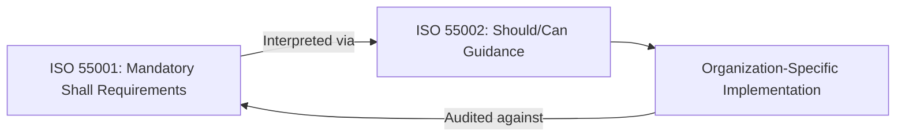
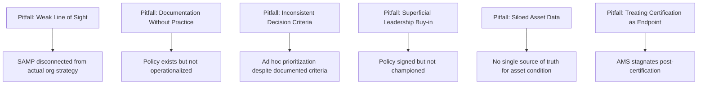

## ISO 55002 Implementation Guidance and Common Certification Pitfalls

### Overview and Purpose

ISO 55002 is the third standard in the ISO 55000 family, providing guidance for the application of the asset management system requirements specified in ISO 55001. Unlike ISO 55001, which uses mandatory "shall" language for auditable requirements, ISO 55002 uses advisory "should" and "can" language, offering interpretive guidance, examples, and practical approaches for organizations implementing an asset management system (AMS).

ISO 55002 is not itself certifiable and does not introduce new requirements beyond those in ISO 55001. Its function is purely interpretive: it clarifies ambiguous or abstractly worded ISO 55001 clauses, offers implementation examples, and helps organizations translate "shall" requirements into concrete organizational practice.

### Structural Relationship to ISO 55001

**Key Points**

- ISO 55002 mirrors the clause structure of ISO 55001 (Clauses 4–10), providing guidance aligned to each corresponding requirement
- For each ISO 55001 "shall" statement, ISO 55002 typically offers: (a) clarifying explanation of intent, (b) examples of acceptable evidence or documentation, and (c) common implementation approaches
- Organizations are free to satisfy ISO 55001 requirements through methods not explicitly described in ISO 55002, provided they can demonstrate the underlying requirement is genuinely met—ISO 55002 examples are illustrative, not exhaustive or mandatory

### Key Areas of Implementation Guidance

#### Guidance on Context and Scope (Clause 4)

ISO 55002 elaborates on how organizations should determine AMS scope boundaries, offering guidance on documenting inclusion/exclusion decisions for asset classes, geographic locations, or business units. It provides worked examples of stakeholder identification matrices and methods for capturing stakeholder requirements systematically rather than informally.

#### Guidance on Leadership and Policy (Clause 5)

The standard offers example structures for an asset management policy statement, typically recommending that policy documents address:

- Commitment to compliance with applicable legal and regulatory requirements
- Commitment to continual improvement of the AMS
- Alignment with organizational objectives and other management system policies
- A framework for setting asset management objectives

**Example**

ISO 55002 guidance suggests that an asset management policy should be concise (often one to two pages), be communicated throughout the organization, and be made available to relevant stakeholders—contrasted with the more detailed, technical content appropriate for the SAMP.

#### Guidance on Planning and Decision-Making Criteria (Clause 6)

This is one of the most heavily elaborated sections, since Clause 6 of ISO 55001 is frequently identified as conceptually abstract. ISO 55002 provides:

- Example frameworks for risk identification and assessment specific to asset management contexts
- Guidance on establishing **decision-making criteria**—documented, consistent methods for prioritizing competing asset investments (e.g., weighted scoring models incorporating risk, cost, and value dimensions)
- Clarification on how asset management objectives should cascade from, and remain traceable to, the SAMP and organizational objectives

$$\text{Composite Priority Score} = w_1(\text{Risk Reduction}) + w_2(\text{Cost Efficiency}) + w_3(\text{Strategic Alignment})$$

where $w_1, w_2, w_3$ are organization-defined weighting factors reflecting relative priority.

#### Guidance on Support and Competence (Clause 7)

ISO 55002 provides example competency frameworks, suggesting organizations define required competencies by role (e.g., asset planners, maintenance technicians, executive sponsors) and maintain evidence trails linking training records to demonstrated competency, not merely course completion.

#### Guidance on Operational Planning (Clause 8)

The standard offers guidance on structuring Asset Management Plans (AMPs), including recommended content areas: asset condition data, planned interventions, resource requirements, risk treatment plans, and performance targets. It also elaborates on managing outsourced asset management activities, suggesting contractual and oversight mechanisms to maintain control despite third-party execution.

#### Guidance on Performance Evaluation (Clause 9)

ISO 55002 provides example approaches to defining asset management performance indicators, distinguishing between:

- **Leading indicators**: predictive measures (e.g., percentage of preventive maintenance completed on schedule)
- **Lagging indicators**: outcome measures (e.g., actual failure rates, unplanned downtime)

It also offers guidance on structuring internal audit programs and management review agendas to ensure required inputs and outputs under Clause 9 are systematically captured.

### Common Certification Pitfalls

**Key Points**

Certification bodies and asset management consultants commonly report recurring nonconformity patterns during ISO 55001 audits. [Inference] The specific pitfalls below are drawn from widely reported practitioner experience across certification bodies and asset management literature; exact frequency rankings vary by source and industry, and no single authoritative global dataset ranks these pitfalls definitively.

#### Pitfall 1: Weak Line-of-Sight Documentation

Organizations frequently produce a SAMP that reads as a generic asset management aspiration document rather than a genuine translation of specific organizational strategic objectives into measurable asset management objectives. Auditors probe this by asking staff at multiple levels to explain how their daily work connects to organizational goals; inconsistent or vague answers signal weak alignment (the "Alignment" fundamental from ISO 55000).

#### Pitfall 2: Documentation Without Operational Practice

A common gap is "paper compliance"—well-written policies, SAMPs, and procedures that do not reflect actual day-to-day practice. Auditors cross-reference documented procedures against interviews, work records, and physical/site evidence; discrepancies between stated process and observed practice are among the most frequently cited nonconformities.

#### Pitfall 3: Inconsistent Application of Decision-Making Criteria

Organizations often document formal, sophisticated prioritization frameworks (risk matrices, weighted scoring models) but fail to apply them consistently in actual capital planning decisions, reverting to informal or political prioritization under budget pressure. This creates a direct conflict between documented Clause 6 planning processes and observed Clause 8 operational execution.

#### Pitfall 4: Superficial Leadership Commitment

Leadership may formally approve an asset management policy without genuinely integrating asset management considerations into executive decision-making, resource allocation, or strategic planning cycles. ISO 55002 guidance emphasizes that leadership commitment should be demonstrable through resource allocation patterns and inclusion of asset management performance in executive reporting, not merely policy signature.

#### Pitfall 5: Siloed or Inconsistent Asset Data

Where asset data is fragmented across multiple systems, spreadsheets, or departmental silos without a reconciled asset register, organizations struggle to demonstrate the data-driven decision-making that Clauses 6, 8, and 9 require. This is a particularly common pitfall in organizations that have grown through acquisition or that maintain legacy departmental systems predating a unified AMS initiative.

#### Pitfall 6: Treating Certification as a Terminal Milestone

[Inference] A pattern frequently observed—though difficult to quantify precisely—is organizational effort intensifying sharply in the months before initial certification, followed by reduced momentum afterward, leading to Clause 10 (Improvement) becoming a nonconformity area during subsequent surveillance audits. This reflects a cultural rather than technical failure: treating certification as an endpoint rather than as validation of an ongoing, continually improving system.

### Practical Mitigation Approaches

**Example**

An organization preparing for ISO 55001 certification can mitigate common pitfalls through:

1. **Cross-level line-of-sight workshops**: facilitated sessions where operational staff articulate, in their own words, how their role connects to strategic objectives, surfacing genuine gaps before an external auditor does
2. **Pre-certification mock audits**: engaging an independent party (distinct from the eventual certification body) to conduct a rigorous internal audit simulating external audit scrutiny
3. **Data consolidation initiatives**: establishing a single authoritative asset register prior to certification pursuit, rather than attempting to certify around fragmented data sources
4. **Embedding AMS performance into executive dashboards**: ensuring asset management KPIs appear alongside financial and operational KPIs in routine leadership reporting, reinforcing genuine (not superficial) leadership engagement
5. **Post-certification governance calendar**: scheduling recurring management reviews, internal audits, and SAMP refresh cycles immediately upon certification to prevent post-certification momentum loss

### Relationship Between the Three Standards in Practice

| Standard | Function | Language | Certifiable |
| --- | --- | --- | --- |
| ISO 55000 | Terminology and fundamentals | Descriptive | No |
| ISO 55001 | Requirements specification | "Shall" (mandatory) | Yes |
| ISO 55002 | Implementation guidance | "Should"/"Can" (advisory) | No |

**Conclusion**

ISO 55002 serves as the practical bridge between ISO 55001's abstract mandatory requirements and an organization's concrete operational reality, offering interpretive clarity and implementation examples without imposing additional certifiable obligations. The recurring certification pitfalls—weak line-of-sight documentation, paper compliance, inconsistent decision-making criteria application, superficial leadership engagement, fragmented data, and post-certification stagnation—largely stem not from misunderstanding the standards' text, but from the organizational and cultural challenge of operationalizing genuine, sustained asset management discipline. [Unverified] The relative severity or frequency ranking of these pitfalls has not been established through a single comprehensive global audit dataset and should be treated as consolidated practitioner observation rather than definitive statistical fact.

**Related Topics**

- ISO 55001 Requirements for an Asset Management System
- ISO 55000 Terminology, Scope, and Guiding Principles
- Strategic Asset Management Plan (SAMP) Development
- Asset Management Policy Design and Governance
- Decision-Making Criteria and Weighted Prioritization Frameworks
- Internal Audit Program Design for Asset Management Systems
- Asset Data Governance and Single Source of Truth Architecture
- Post-Certification Continual Improvement Practices