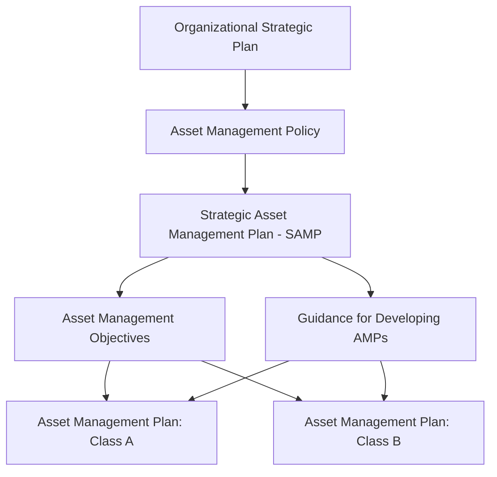
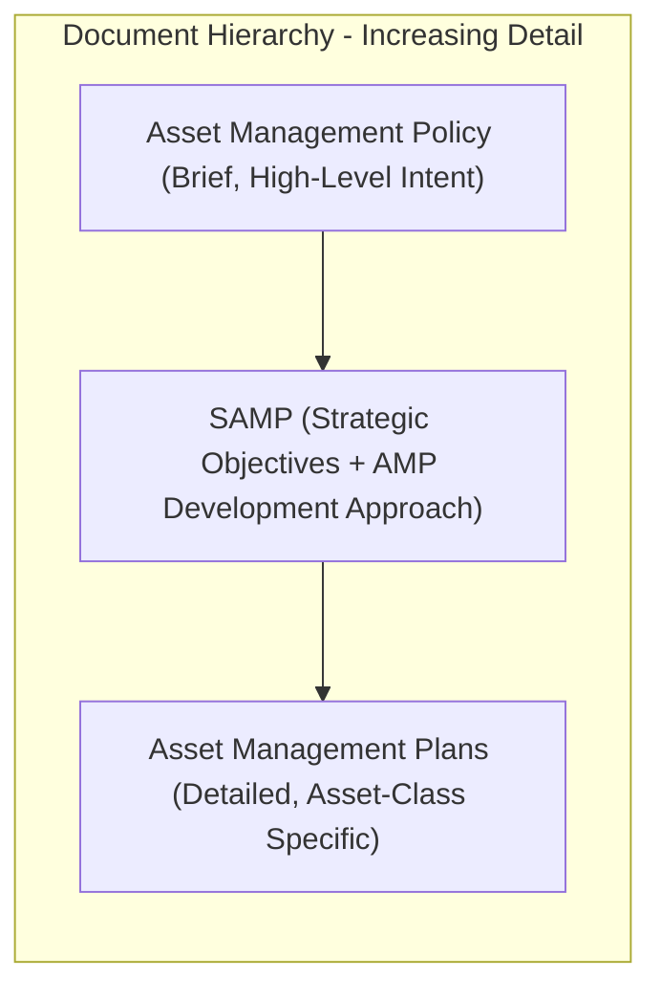
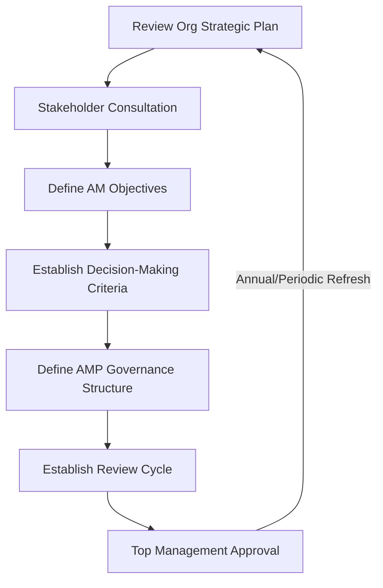

## The Strategic Asset Management Plan and Its Role in the Standard

### Definition and Position within ISO 55000

The Strategic Asset Management Plan (SAMP) is documented information, required under ISO 55001, that specifies how organizational objectives are to be converted into asset management objectives, the approach for developing asset management plans (AMPs), and the role of the asset management system (AMS) in supporting the achievement of those objectives. It is the single most important structural artifact connecting organizational strategy to operational asset activity, and it is the formal mechanism through which the "Alignment" fundamental from ISO 55000 is documented and made auditable.

The SAMP is not itself the asset management plan for any specific asset class—it is a higher-order document that governs *how* and *why* asset management plans are developed, prioritized, and resourced.

### Position in the ISO 55001 Clause Structure

**Key Points**

- The SAMP requirement originates primarily in **Clause 4.4** (Asset Management System) and **Clause 6.2** (Asset Management Objectives and Planning to Achieve Them) of ISO 55001
- The SAMP is explicitly required to be **documented information**, meaning it must be created, controlled, retained, and available for audit—not merely an informal or verbal strategic understanding
- Auditors treat the SAMP as primary evidence when assessing whether an organization satisfies the "Alignment" fundamental, since it is the concrete artifact demonstrating the strategy-to-asset decomposition

### Core Content Typically Addressed in a SAMP

While ISO 55001 does not prescribe an exact SAMP template (ISO 55002 offers guidance rather than a mandatory format), well-constructed SAMPs typically address the following elements:

| SAMP Component | Purpose |
| --- | --- |
| Organizational context summary | Establishes the strategic backdrop the SAMP must align to |
| Asset management policy reference | Links SAMP to the higher-level policy commitment |
| Asset management objectives | Specific, measurable objectives derived from organizational goals |
| Asset portfolio overview | Scope of assets covered under the AMS |
| Approach to developing AMPs | Methodology, templates, and governance for asset-class-level plans |
| Decision-making criteria | Documented framework for prioritizing competing asset investments |
| Risk management approach | How asset-related risks are identified, assessed, and treated |
| Resourcing and competency requirements | Human, financial, and technological resources needed |
| Review and revision cycle | How often the SAMP itself is reassessed and updated |
| Performance monitoring framework | How achievement of asset management objectives will be measured |

### Distinguishing the SAMP from the Asset Management Policy and AMPs

**Key Points**

- **Asset Management Policy**: a brief, high-level statement of organizational intent and commitment (often one to two pages), approved by top management
- **SAMP**: a more detailed strategic document translating the policy and organizational objectives into specific, measurable asset management objectives and the governance approach for achieving them
- **Asset Management Plans (AMPs)**: detailed, asset-class-specific or individual-asset-specific operational plans, developed *in accordance with* the SAMP's guidance, containing concrete activities, budgets, timelines, and resource assignments

**Example**

A transit authority's **policy** states commitment to "safe, reliable, and sustainable transit asset management." Its **SAMP** translates this into specific objectives such as "achieve 99.5% fleet availability by 2028" and establishes decision-making criteria weighting safety risk at 40%, cost efficiency at 35%, and environmental impact at 25% for capital prioritization decisions. Its **AMPs** then detail, for the bus fleet specifically, the exact replacement schedule, maintenance budget, and technician staffing plan needed to hit that 99.5% availability target.

### The SAMP's Role in Decision-Making Criteria

One of the SAMP's most functionally important roles is establishing consistent, documented **decision-making criteria** used across the organization to prioritize competing asset investments. Without this, individual asset managers or business units may prioritize based on inconsistent or purely local considerations, undermining organization-wide value optimization.

$$\text{Investment Priority Score} = w_1(\text{Risk Reduction}) + w_2(\text{Strategic Alignment}) + w_3(\text{Financial Return}) + w_4(\text{Regulatory/Compliance Urgency})$$

where the weights $w_1, w_2, w_3, w_4$ are defined within the SAMP and applied consistently across all AMPs, enabling like-for-like comparison of investment options across otherwise dissimilar asset classes (e.g., comparing a pump replacement against a building roof renewal on a common prioritization basis).

### Development Process for a SAMP

**Example**

A typical SAMP development sequence in a mid-sized organization proceeds as follows:

1. **Review organizational strategic plan** and extract relevant strategic objectives that asset management can influence or support
2. **Conduct stakeholder consultation** to identify value expectations across departments (finance, operations, risk, sustainability, customer service)
3. **Define asset management objectives**, ensuring each is specific, measurable, and explicitly traceable to a parent organizational objective
4. **Establish decision-making criteria and weighting framework** for cross-portfolio prioritization
5. **Define governance structure** for how AMPs will be developed, reviewed, approved, and monitored under the SAMP
6. **Establish SAMP review cycle** (commonly annual or aligned to organizational strategic planning cycles)
7. **Obtain top management approval**, formally linking the SAMP to leadership commitment (Clause 5)

### Common Weaknesses in SAMP Documentation (Certification Context)

**Key Points**

- **Generic objectives disconnected from actual strategy**: SAMPs that state broadly applicable aspirations (e.g., "optimize asset performance") without tracing to specific, named organizational strategic goals fail to demonstrate genuine alignment
- **Absence of decision-making criteria**: a SAMP that describes objectives but provides no consistent framework for prioritizing investment across the portfolio leaves Clause 6 planning requirements only partially satisfied
- **Static documents with no review cycle**: SAMPs that are written once during initial certification preparation and never revisited fail to reflect organizational objective drift over time, creating a stale line-of-sight artifact
- [Inference] Organizations that involve only the asset management department in SAMP development, without broader stakeholder or executive input, often produce SAMPs that pass initial certification documentation review but struggle during audit interviews when non-asset-management staff cannot corroborate the stated strategic linkages; this pattern is commonly discussed in asset management practitioner circles though not derived from a single definitive study.

### SAMP Review and Maintenance Cadence

The SAMP is not a static, one-time deliverable. ISO 55001's continual improvement requirement (Clause 10) and the PDCA structure necessitate periodic SAMP review, typically triggered by:

- Scheduled review cycles (commonly annual, aligned with organizational strategic or budget planning)
- Material changes to organizational strategy (mergers, new regulatory requirements, market shifts)
- Significant findings from internal audits or management reviews indicating misalignment
- Major changes to the asset portfolio (new asset classes acquired, major divestitures)

### Conclusion

The Strategic Asset Management Plan functions as the connective document translating organizational strategic intent into a governed, prioritized, and measurable asset management program. It sits structurally between the brief, aspirational asset management policy and the detailed, execution-focused asset management plans, and it is the primary artifact through which ISO 55001 auditors assess whether an organization's asset management activities are genuinely aligned with organizational objectives rather than operating as an disconnected technical function. [Unverified] The optimal review frequency and level of granular detail for a SAMP varies considerably by organizational size, asset portfolio complexity, and industry regulatory context, and no single universally applicable SAMP template or review cadence has been established as best practice across all sectors.

**Related Topics**

- ISO 55001 Requirements for an Asset Management System
- Asset Management Policy Design and Governance
- Decision-Making Criteria and Weighted Prioritization Frameworks
- Value Realization and Line of Sight to Organizational Objectives
- Asset Management Plans (AMPs): Structure and Content Development
- Risk-Based Capital Planning and Investment Prioritization
- Management Review Processes Under Clause 9
- Continual Improvement and SAMP Revision Cycles