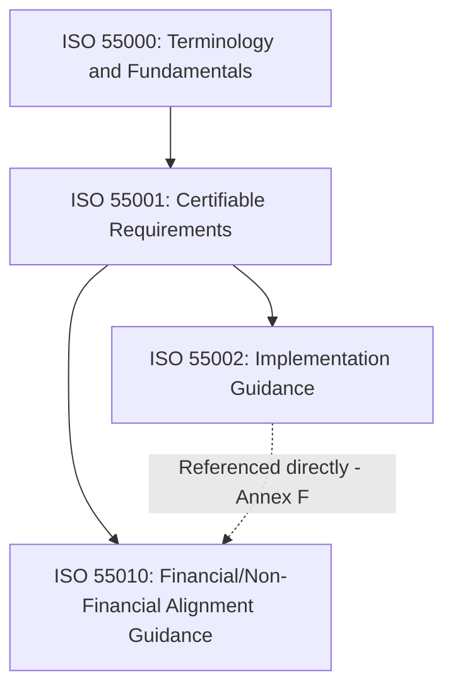
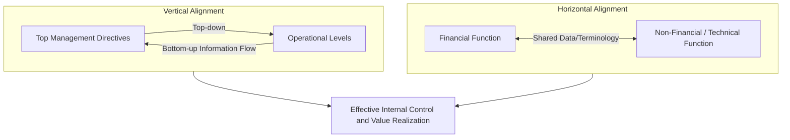

## ISO 55010 and the Alignment of Financial and Non-Financial Functions

### Overview and Standard Classification

ISO/TS 55010 is a Technical Specification (TS)—not a full International Standard like ISO 55001—published by ISO/TC 251, the technical committee responsible for the ISO 55000 asset management family. Its scope is to give guidelines for the alignment between financial and non-financial asset management functions, in order to improve internal control as part of an organization's management system. The original edition was published in 2019, with a second edition, ISO/TS 55010:2024, superseding it. [ISO](https://www.iso.org/standard/72700.html)

Critically, the guidance in this document is consistent with the requirements of ISO 55001 for an asset management system but does not add new requirements to ISO 55001 or provide interpretations of the requirements of ISO 55001. This positions ISO 55010 as complementary guidance rather than a certifiable or interpretive standard—organizations cannot be certified against it, and it does not modify ISO 55001 audit criteria. [ISO](https://www.iso.org/standard/72700.html)

The standard explicitly connects to ISO 55002:2018, Annex F, and notes that alignment of financial and non-financial functions will enable the realization of value derived from the implementation of asset management detailed within ISO 55000, ISO 55001 and ISO 55002—tying it directly back to the value realization fundamental established in ISO 55000. [Accuris Technologies](https://store.accuristech.com/standards/iso-ts-55010-2019?product_id=2086533)[Accuris Technologies](https://store.accuristech.com/standards/iso-ts-55010-2019?product_id=2086533)

### Intended Audience

**Key Points**

The standard is explicitly written for two distinct audiences with different starting knowledge and priorities:

- ISO 55010 provides guidance for CFO's and their financial teams to help them understand how they can fit together financial and non-financial aspects and become even better in controlling the organization's risks and costs [iso](https://committee.iso.org/sites/tc251/home/projects/published/isots-55010.html)
- ISO 55010 is also for COO's and technical managers of engineering and planning departments, plus any other non-financial functions involved in asset management, who need to understand why finance departments require relevant and timely information for accurate reporting [iso](https://committee.iso.org/sites/tc251/home/projects/published/isots-55010.html)

This dual-audience framing reflects the standard's core diagnosis: asset management failures often stem not from technical incompetence in either domain, but from the two domains failing to communicate in terms the other understands.

### The Core Problem: Organizational Silos

**Key Points**

- In many organizations, the financial and non-financial functions of asset management are inadequately aligned [Iteh](https://cdn.standards.iteh.ai/samples/72700/badde6efddcd49ad920ac2d432949bfe/ISO-TS-55010-2019.pdf)
- Often the financial accounting functions are predominantly focused on retrospective reporting of accounting/regulatory financial activities, while there is a growing awareness in organizations of the need to focus on providing a managerial costing approach in order to support decision-making for the future [Iteh](https://cdn.standards.iteh.ai/samples/72700/badde6efddcd49ad920ac2d432949bfe/ISO-TS-55010-2019.pdf)[Iteh](https://cdn.standards.iteh.ai/samples/72700/badde6efddcd49ad920ac2d432949bfe/ISO-TS-55010-2019.pdf)
- The standard cites an authoritative source noting that silos are necessary to allow for the required level of specialization, but if these silos do not communicate, inefficiencies and errors in asset management result [Iteh](https://cdn.standards.iteh.ai/sist-preview/84051/8afdd95e90574bb4a7609caf562f59dc/SIST-TS-ISO-TS-55010-2024.pdf)
- Critically, when asset management implementation fails, it is often because asset management staff and senior management are not in alignment [Iteh](https://cdn.standards.iteh.ai/sist-preview/84051/8afdd95e90574bb4a7609caf562f59dc/SIST-TS-ISO-TS-55010-2024.pdf)

This framing positions financial/non-financial misalignment not as a peripheral administrative inconvenience but as a primary root cause of broader asset management system failure—directly relevant to the certification pitfalls discussed under ISO 55002.

### Vertical and Horizontal Alignment

The standard's central conceptual framework distinguishes two alignment axes:

- **Vertical alignment**: Vertical alignment "top-down and bottom-up information flow" means that financial and non-financial asset-related directives by top management are informed by accurate upward information flows, effectively implemented across the appropriate levels of the organization [Singaporestandardseshop](https://www.singaporestandardseshop.sg/Product/GetPdf?fileName=250710102113TR%20ISO%20TS%2055010-2025%20Preview.pdf&pdtid=08969e3e-f360-402a-aa23-56944d4a6e0e)
- **Horizontal alignment**: concerns the lateral integration between the financial function and non-financial (engineering, operations, planning) functions, ensuring shared terminology, consistent data, and mutual understanding of each function's constraints and requirements

### Relationship to Accounting Standards (GAAP/IFRS)

**Key Points**

A notable design decision in ISO 55010 is its careful boundary-setting relative to formal accounting standards:

- The standard explicitly distinguishes its terminology from Generally Accepted Accounting Principles (GAAP) or the International Financial Reporting Standards (IFRS) [Iteh](https://cdn.standards.iteh.ai/samples/72700/badde6efddcd49ad920ac2d432949bfe/ISO-TS-55010-2019.pdf)
- The term "asset" as primarily used in this document is defined in ISO 55000 and organizations need to be aware of this to avoid any misunderstanding. For the authoritative GAAP or IFRS definitions of asset, refer to the appropriate accounting standards, internal policies and experts [Iteh](https://cdn.standards.iteh.ai/samples/72700/badde6efddcd49ad920ac2d432949bfe/ISO-TS-55010-2019.pdf)
- The document references internationally recognised good practice such as IFRS and has been developed with input from experts in both asset management and finance [LinkedIn](https://www.linkedin.com/pulse/new-asset-management-guidance-financial-non-financial-knight)[iso](https://committee.iso.org/sites/tc251/home/news/content-left-area/news-and-updates/new-isots-55010-launched.html)

This distinction matters practically: the ISO 55000 definition of "asset" (anything of potential or actual value) is broader than the accounting definition of an asset recognized on a balance sheet, and organizations implementing ISO 55010 guidance must navigate this terminology gap deliberately rather than assuming the terms are interchangeable.

### Structure and Content Areas

**Example**

Based on the standard's published scope, ISO 55010's guidance is organized around a practical change-management logic rather than a technical specification format:

1. The benefits of alignment to support the case for making change — building the business case for why financial/non-financial alignment matters [LinkedIn](https://www.linkedin.com/pulse/new-asset-management-guidance-financial-non-financial-knight)
2. Enablers for alignment to scope the change — identifying organizational prerequisites and levers for achieving alignment [LinkedIn](https://www.linkedin.com/pulse/new-asset-management-guidance-financial-non-financial-knight)
3. How to achieve alignment to support a plan for change — practical implementation guidance [LinkedIn](https://www.linkedin.com/pulse/new-asset-management-guidance-financial-non-financial-knight)
4. Annexes with more detail on the elements mentioned in the "how to" section with examples, including a worked example: for an example of an organization aligning its asset management functions, see Annex F [LinkedIn](https://www.linkedin.com/pulse/new-asset-management-guidance-financial-non-financial-knight)[ISO](https://www.iso.org/standard/72700.html)

### Why This Matters for Asset Lifecycle Management

**Key Points**

- Full lifecycle costing (TCO across CapEx, OpEx, and disposal) requires financial and technical data to be genuinely reconcilable, not maintained in parallel, disconnected systems
- Capital planning decisions—renewal timing, replace-vs-repair analysis, disposal valuation—require financial teams and asset engineers to share a common evidentiary basis rather than negotiating from separate, unreconciled data sets
- Value realization and line-of-sight traceability (the strategic-to-asset decomposition chain) depends on financial metrics (ROI, NPV) and non-financial metrics (reliability, condition, risk) being interpretable side-by-side by decision-makers who may not share the same professional background
- [Inference] Organizations pursuing ISO 55001 certification that have not addressed financial/non-financial alignment are plausibly more susceptible to the "inconsistent decision-making criteria" and "siloed asset data" certification pitfalls discussed elsewhere in this standards family, since those pitfalls often manifest precisely at the finance/engineering interface; ISO 55010 was developed in response to this recognized gap, though the standard itself does not present statistical failure-rate data quantifying the connection.

### Applicability

**Key Points**

- This document is applicable to all types of assets and by all types and sizes of organizations, mirroring the broad applicability scope established in ISO 55000 [ISO](https://www.iso.org/standard/84051.html)
- As a Technical Specification rather than a full International Standard, ISO 55010 is explicitly positioned as guidance to be adapted rather than a rigid compliance checklist: this specification is not developed as a certifiable specification, it has no requirements as such [iso](https://committee.iso.org/sites/tc251/home/projects/published/isots-55010.html)
- The stated goal is that this can encourage the breakdown of silos and improve cooperation making better use of every department's expertise in achieving the organizational objectives as effectively and efficiently as possible [iso](https://committee.iso.org/sites/tc251/home/projects/published/isots-55010.html)

### Practical Application Example

**Example**

A manufacturing organization applying ISO 55010 guidance might address the finance/engineering silo problem as follows: the engineering/maintenance function maintains detailed condition assessment data and remaining-useful-life estimates for a production line, while finance maintains depreciation schedules based on accounting useful-life assumptions that may not reflect actual physical condition. Under ISO 55010-aligned practice, these two data sets would be reconciled through joint review processes—finance adjusting managerial costing models to reflect engineering condition data, and engineering framing renewal recommendations in financial terms (NPV, risk-adjusted cost avoidance) that resonate with capital budget approval processes. This reconciliation directly supports the decision-making criteria required under ISO 55001 Clause 6, ensuring capital prioritization decisions rest on genuinely integrated rather than parallel-but-disconnected data.

### Conclusion

ISO/TS 55010 addresses a structural gap identified across the ISO 55000 family's implementation experience: that asset management systems frequently fail not from inadequate technical or financial competence individually, but from the persistent organizational silo between these two functions. As non-certifiable guidance rather than a requirements standard, it supplements ISO 55001 and ISO 55002 by giving both financial and non-financial (engineering/operations) practitioners a shared vocabulary and practical roadmap for vertical and horizontal alignment, directly supporting the value realization and internal control objectives at the heart of the broader standards family. [Unverified] The extent to which formal adoption of ISO 55010 guidance measurably improves certification outcomes or reduces the financial/non-financial misalignment pitfalls commonly reported in ISO 55001 audits has not been established through published comparative data, and should be understood as the standard's design intent rather than an empirically confirmed outcome.

**Related Topics**

- ISO 55001 Requirements for an Asset Management System
- ISO 55002 Implementation Guidance and Common Certification Pitfalls
- The Strategic Asset Management Plan and Its Role in the Standard
- Total Cost of Ownership (TCO) and Lifecycle Costing Models
- Managerial Costing vs. Financial/Regulatory Accounting in Asset Management
- Decision-Making Criteria and Weighted Prioritization Frameworks
- Asset Data Governance and Single Source of Truth Architecture
- GAAP/IFRS Asset Definitions vs. ISO 55000 Asset Definition