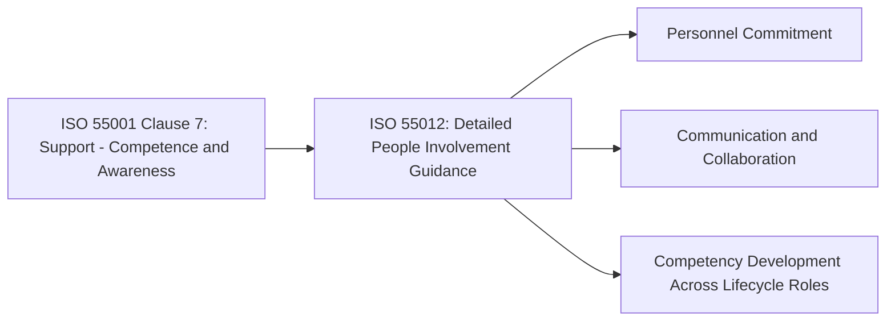
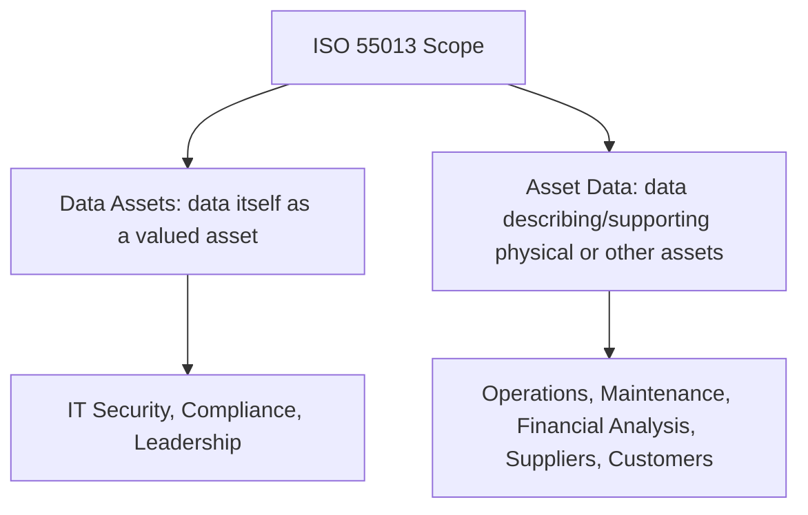
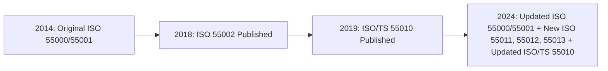

## ISO 55011, ISO 55012, and ISO 55013 as Extensions of the Family


### Overview and Position within the Standards Family

ISO 55011, ISO 55012, and ISO 55013 are guidance documents launched alongside the 2024 editions of ISO 55000 and ISO 55001, extending the standards family beyond its original three-document core (ISO 55000, 55001, 55002). Along with the earlier ISO 55010 (financial/non-financial alignment), these documents represent ISO/TC 251's response to a decade of implementation experience since the original 2014 publication, addressing specific dimensions of asset management that the original family treated only at a general, principle-based level.

ISO 55000:2024 itself formally describes the role of each: ISO 55011, which offers guidance for developing public policy to promote asset management, focusing on the external context of organizations responsible for assets, with the aim of creating an enabling environment through consistent public policy instruments; ISO 55012, which focuses on people involvement and competence within an asset management system, offering guidance to enhance personnel commitment, effectiveness, knowledge and awareness, and promoting continual improvement; and ISO 55013, which provides guidance on managing data assets, helping organizations increase and sustain the usefulness of data assets to meet asset management and organizational objectives.

```mermaid
flowchart TD
    Core[Core Family: ISO 55000, 55001, 55002] --> Ext[Extension / Supporting Guidance Standards]
    Ext --> S10[ISO 55010: Financial / Non-Financial Alignment]
    Ext --> S11[ISO 55011: Public Policy Guidance]
    Ext --> S12[ISO 55012: People Involvement and Competence]
    Ext --> S13[ISO 55013: Data Asset Management]
    S10 -.->2024 update.-> S10b[Updated Edition]
```

None of these three documents are certifiable; like ISO 55002 and ISO 55010, they use advisory language and supplement rather than modify the auditable requirements set out in ISO 55001. A structural detail worth noting: the ISO 55000 standards in the series, with one exception, cite ISO 55000 as their only normative reference, reinforcing ISO 55000's role in setting context for the entire family. ISO 55013's exception is it lists both ISO 55000 and ISO 55001 as normative references, since ISO 55001 is listed as a normative reference in ISO 55013 due to its explicit alignment with ISO 55001 requirements—reflecting how tightly data management guidance ties to auditable AMS requirements compared to the other extensions.

### ISO 55011: Guidance for the Development of Public Policy to Enable Asset Management

**Key Points**

ISO 55011 is distinct from the rest of the family in a fundamental way: its intended audience is not primarily individual organizations, but governments, regulators, and policy-makers.

- ISO 55011 is intended for those who seek to advance and support asset management in their respective countries or jurisdictions through public policy
- Its focus is the external context of organizations responsible for assets, with the aim of creating an enabling environment through consistent public policy instruments
- This positions ISO 55011 as an outward-facing counterpart to the rest of the family, which is otherwise oriented toward internal organizational management systems

**Example**

[Inference] A plausible application of ISO 55011 guidance, consistent with its stated scope, would be a national infrastructure regulator drafting sector-wide policy requiring water utilities to maintain documented asset management plans as a condition of tariff approval, or a transportation ministry establishing consistent asset condition reporting requirements across municipal road authorities. This example illustrates the standard's intended use case rather than a documented case study, since the standard's full text is not reproduced in public sources reviewed.

### ISO 55012: Guidance on People Involvement and Competence

**Key Points**

ISO 55012 addresses a dimension of asset management systems that the original ISO 55001 treats relatively briefly under Clause 7 (Support)—the human and cultural factors underpinning AMS effectiveness.

- People involvement is crucial for numerous activities through different stages of the life cycle of an asset
- The standard offers guidance for enhancing the involvement of people within an asset management system, as well as developing the required competencies to participate appropriately in asset management activities
- It stresses the need for effective communication and collaboration within the organization
- ISO 55000:2024 further describes its aim as offering guidance to enhance personnel commitment, effectiveness, knowledge and awareness, and promoting continual improvement

This positions ISO 55012 as a direct elaboration of the "Leadership" fundamental from ISO 55000 and the competence/awareness requirements under ISO 55001 Clause 7, providing the practical depth that a high-level certifiable requirement alone cannot offer.



**Example**

[Inference] Consistent with its stated scope, ISO 55012 guidance would plausibly address scenarios such as ensuring field technicians performing condition assessments understand not just *how* to record data but *why* it matters to strategic asset decisions—directly reinforcing the line-of-sight concept discussed elsewhere in this standards family—though the specific worked examples within the standard's text were not available in the sources reviewed.

### ISO 55013: Guidance on the Management of Data Assets

**Key Points**

ISO 55013 addresses what is arguably the most operationally urgent extension topic, given the increasing centrality of data-driven decision-making in asset management.

- The new ISO 55013 provides comprehensive support for data asset and asset data management, involving strategic decision-making by organizational leaders, daily operations by asset management professionals, data security by IT experts, financial analysis, compliance oversight, supplier support, and customer feedback
- It aims to achieve organizational objectives through effective and compliant data asset and asset data management practices
- ISO 55000:2024 describes its purpose as helping organizations increase and sustain the usefulness of data assets to meet asset management and organizational objectives

A notable conceptual distinction embedded in ISO 55013's scope is between **"data assets"** (data itself treated as something of value, per the ISO 55000 definition of asset) and **"asset data"** (data *about* physical or other assets used to support their management)—the standard addresses both categories.



**Example**

[Inference] A plausible application, consistent with the standard's stated multi-stakeholder scope, involves an organization ensuring that asset condition data captured by field sensors (asset data) is governed with the same data quality and security discipline as customer or financial data (data assets)—since ISO 55013 explicitly names IT security experts, financial analysts, and compliance overseers as stakeholders in the same data governance framework. This reflects the standard's stated intent rather than a specific documented case example.

### Timeline and Publication Context

**Key Points**

- ISO 55011 and ISO 55012 were published as entirely new standards in 2024, alongside updated 2024 editions of ISO 55000 and ISO 55001
- ISO 55013 was also newly published in 2024, alongside the update to ISO/TS 55010
- The 2024 edition of ISO 55001 includes more precise requirements for decision-making, value realization from assets, asset management planning, risk and opportunity management, data and knowledge management, and life cycle operations, reflecting incorporation of a decade of insights and experiences from over 50 countries since the 2014 original
- [Unverified] One industry source describes a further ISO/TS 55014 as forthcoming as part of a five-document supporting guidance set (55010 through 55014), though this could not be independently confirmed against the official ISO/TC 251 committee page content reviewed, and its scope and publication status should be verified directly against current ISO or national standards body catalogues before being relied upon.



### How the Extensions Relate to Core Certification Requirements

**Key Points**

- None of ISO 55010, 55011, 55012, or 55013 introduce new auditable "shall" requirements beyond those already established in ISO 55001; they function as deep-dive guidance on specific themes that ISO 55001 addresses only at a general level
- Organizations pursuing or maintaining ISO 55001 certification are not required to demonstrate conformance to these extension documents specifically, but auditors assessing Clause 6 (Planning), Clause 7 (Support), and data-related aspects of Clause 8/9 may reference the concepts in these documents as benchmarks of good practice when evaluating whether an organization's approach is adequate
- [Inference] Given that ISO 55012 (people) and ISO 55013 (data) directly address two of the most commonly cited certification pitfalls discussed under ISO 55002—competency record gaps and siloed/fragmented asset data—organizations preparing for certification would likely benefit from consulting these extensions even though they are not mandatory reference documents; this is a reasonable inference from the content overlap rather than an explicit requirement stated in ISO 55001 itself.

### Conclusion

ISO 55011, ISO 55012, and ISO 55013 extend the ISO 55000 family into three specialized domains—public policy enablement, human competence and involvement, and data asset management—that the original 2014-era core standards addressed only at a general, principle-based level. Alongside ISO 55010's financial/non-financial alignment guidance, they reflect ISO/TC 251's response to accumulated global implementation experience, providing organizations (and, uniquely in ISO 55011's case, policy-makers) with deeper practical guidance without altering the certifiable requirements baseline established in ISO 55001. [Unverified] The complete technical content of these three standards is paywalled and was not directly reviewed in full for this material; the descriptions above are synthesized from ISO's own published standard abstracts, committee summaries, and secondary industry commentary, and organizations seeking to apply these standards should consult the full official ISO texts directly rather than relying solely on secondary summaries.

**Related Topics**

- ISO 55000 Terminology, Scope, and Guiding Principles
- ISO 55001 Requirements for an Asset Management System
- ISO 55002 Implementation Guidance and Common Certification Pitfalls
- ISO 55010 and the Alignment of Financial and Non-Financial Functions
- Asset Data Governance and Single Source of Truth Architecture
- Competency Frameworks for Asset Management Personnel
- Public Policy and Regulatory Frameworks for Infrastructure Asset Management
- Data Assets vs. Asset Data: Conceptual Distinctions in Digital Asset Management