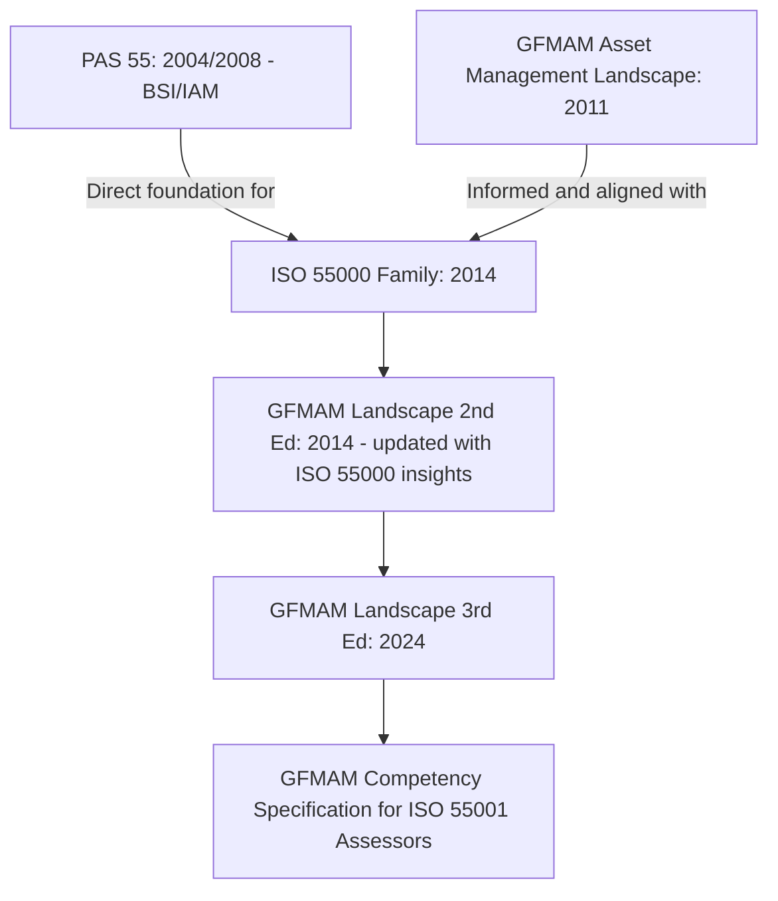
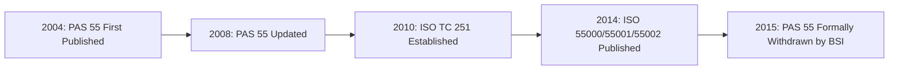
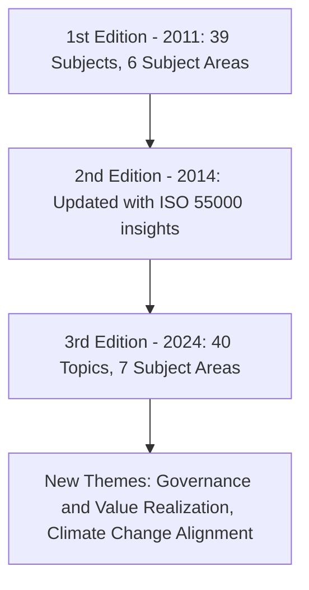
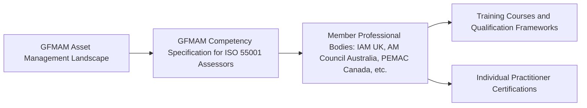

## The Legacy of PAS 55 and the GFMAM Competency Framework

### Overview: Two Distinct but Complementary Legacies

This topic covers two separate but historically linked contributions to the asset management discipline: **PAS 55**, the pre-ISO British specification that directly shaped ISO 55000, and the **GFMAM (Global Forum on Maintenance and Asset Management) Asset Management Landscape and Competency Framework**, a globally coordinated reference for asset management knowledge, subjects, and personnel competency that continues to operate alongside and in support of the ISO 55000 family today.

### Origins of PAS 55

**Key Points**

- In 2002-2004 the Institute of Asset Management (IAM) in conjunction with British Standards Institution (BSI) developed PAS 55, the first publicly available specification for optimised management of physical assets
- The origin of PAS-55 can be traced back to various interested parties who recognized the need of a "common language" for asset management, including forward looking individuals who worked in the oil and gas, utilities, transportation, and manufacturing sectors in and around the United Kingdom
- PAS 55 answers questions stemming from the privatization of the utilities and transport sectors in the United Kingdom, reflecting its origins in sectors where regulators and shareholders demanded rigorous, demonstrable asset stewardship following privatization
- The standard has been developed by the industry, with the water, gas and electricity branch in particular making an active contribution to the development of this standard, before other sectors adopted it

### PAS 55 Structure and Update Cycle

**Key Points**

- The first version of PAS 55 was published in 2004, the latest version in 2008
- The 2008 update (PAS 55:2008) was developed by 50 organisations from 15 industry sectors in 10 countries, reflecting substantial cross-industry consensus-building even before it became an international standard
- The document comes in two parts: PAS 55-1:2008 outlines a checklist of the requirements that need to be in place for asset management, while PAS 55-2:2008 serves as a guide to achieving these requirements

This two-part structure—a requirements specification paired with a companion implementation guide—directly foreshadows the later ISO 55001 (requirements) / ISO 55002 (guidance) relationship.

### The Critical Scope Limitation: Physical Assets Only

**Key Points**

- PAS 55, clearly covers physical or tangible assets only—unlike ISO 55001, which is a standard for ANY asset type
- This scope difference is one of the most significant distinctions between PAS 55 and its ISO successor: ISO 55000's broad, value-based definition of "asset" (covering financial, digital, intangible, and human/informational assets) represents a deliberate expansion beyond PAS 55's physical-asset-only foundation

### From PAS 55 to ISO 55000: The Transition

**Key Points**

- The International Standards Organisation (ISO) then accepted PAS 55 as the basis for development of the new ISO 55000 series of international standards, with the initial launch of the project following a preliminary meeting in London in June 2010
- In 2010, the International Organization for Standardization (ISO) established Technical Committee TC 251 — Asset Management — with a mandate to develop an international standard, drawing heavily on PAS 55 as a foundation, but with a broader scope and a modern management system structure
- The ISO 55000 series was published in January 2014, and following its publication, BSI formally withdrew PAS 55 in 2014-2015 (specifically, PAS 55 was replaced and officially withdrawn in January 2015, twelve months after ISO 55000 was launched)
- Most important features of PAS 55 are well represented and indeed expanded-upon in ISO 55000, however the structure of the requirements specification is substantially changed, because all ISO standards for management systems must now follow the standardised terminology and layout specified in Annex SL

### Structural Differences: PAS 55 vs. ISO 55001

| Dimension | PAS 55 | ISO 55001 |
| --- | --- | --- |
| Asset scope | Physical assets only | Any asset type (physical, financial, intangible, digital) |
| Structural framework | Two-part checklist + guide | Annex SL high-level structure (8 clauses, 4 annexes) |
| Certifiability | Yes (via BSI-accredited bodies, now discontinued) | Yes (via accredited certification bodies globally) |
| Geographic origin/adoption | Primarily UK-centric, later international | Designed from inception for global consensus (31+ participating countries) |
| Current status | Withdrawn (2015) | Current, actively maintained (2024 edition) |

### Continuing Relevance of PAS 55 Despite Withdrawal

**Key Points**

- Even though PAS 55 was 'withdrawn' as a BSI formal Specification in 2015, organizations may find that there is ongoing value of PAS 55 as useful guidance and education material
- If your organization has been using PAS 55, then migrating to ISO 55000 is fairly straightforward, since although the structure is very different, most of the elements are incorporated into the requirements of ISO 55001
- [Inference] Organizations that built asset management maturity around PAS 55 prior to 2014 likely found the transition to ISO 55001 conceptually smoother than organizations starting from no formal framework, given the substantial content overlap; this is a reasonable inference from the documented continuity between the two standards, though it is not a formally quantified claim.

### The GFMAM: Origins and Mission

**Key Points**

- The Global Forum on Maintenance and Asset Management (GFMAM) was formed in 2011 to bring together various experts, practitioners, academics, and other professionals who are active in the field of asset and maintenance management
- The primary mission of GFMAM is to develop and promote knowledge, standards, and education for the maintenance and asset management professions
- GFMAM is described as the world's peak body for Maintenance and Asset Management, functioning as a non-commercial global association of professional asset management bodies rather than a single national institute

### The Asset Management Landscape: Structure and Evolution

The GFMAM's flagship deliverable is the **Asset Management Landscape**, a framework document defining the subjects, knowledge areas, and structure of the asset management discipline globally.

**Key Points**

- GFMAM published the first edition of the GFMAM Asset Management Landscape in 2011, developing an 'Asset Management Landscape' document which defines 39 subjects on asset management, grouped into six main subject areas
- All endorsed asset management competency frameworks, training courses, and qualifications will be aligned with the 39 subjects, and all endorsed asset management maturity assessments and awards will be aligned with those same subjects—establishing the Landscape as a unifying taxonomy across otherwise independent national and professional bodies
- The Landscape document was updated with the release of its second version in April 2014, aiming to update it in 2014 with insights from ISO 5500x and to make it more specific, becoming a reference for developing asset management knowledge globally
- The Global Forum on Maintenance and Asset Management (GFMAM) launched version 3 of its "Asset Management Landscape" on June 5, 2024, which reflects updates to address modern challenges like climate change, including new subjects like Governance and Value Realization to align asset management with contemporary governance standards and ensure value creation
- The Third Edition (2024) spans seven subject areas and forty topics, an expansion from the original six subject areas and 39 subjects

### GFMAM Member Alignment and Downstream Impact

**Example**

Because GFMAM operates as a forum of member professional bodies rather than issuing standards directly to organizations, its Landscape updates ripple outward through member organizations' own frameworks. Following the 2024 Landscape update: the Asset Management Council in Australia, for example, has commenced a process for reviewing and updating its Conceptual Model, Systems Model and Capability Model, while the Institute of Asset Management in the UK is in the process of reviewing and updating its Competences Framework as a precursor to possible changes to its training course syllabi and qualifications framework. This illustrates how a single GFMAM taxonomy update cascades into revised certification and training content across multiple independent national bodies.

### The GFMAM Competency Specification for ISO 55001 Assessors

**Key Points**

- In 2013, members and stakeholders of the global asset management community sought assistance in maximising benefits from the ISO 55000 Asset Management Standards published in 2014, particularly since organisations require competent and capable people, who may be employed as staff or brought in from external organisations, to assess against or comply with ISO 55001
- GFMAM published a document that sets out the minimum knowledge and comprehension specification for personnel to audit or assess to ISO 55001 based on the Asset Management Landscape
- The GFMAM specification plays a pivotal role in guiding professional bodies in certifying individuals who possess the necessary knowledge in asset management to carry out effective audits and assessments, helping asset owners identify qualified individuals for audits

This competency specification is the direct organizational ancestor and complement to the more recent ISO 55012 (people involvement and competence) standard—GFMAM's work operates as an independent, cross-body reference rather than an ISO-published document, but addresses overlapping ground.

### Relationship Between GFMAM and the ISO 55000 Family

**Key Points**

- GFMAM's role is complementary rather than competitive with ISO/TC 251's work: while ISO 55000/55001/55002 (and their extensions) define the certifiable organizational management system, GFMAM's Landscape defines the broader body-of-knowledge taxonomy and, critically, the competency expectations for the *people* who implement and audit that system
- [Inference] The relationship can be understood as ISO defining "what an organization's asset management system must do" while GFMAM defines "what practitioners and assessors need to know and be able to do" to operate within that system effectively; this framing is a reasonable synthesis of the two bodies' stated missions rather than an officially declared division of labor between them.

### Conclusion

PAS 55 and the GFMAM Asset Management Landscape represent two parallel streams of pre-ISO and ongoing-alongside-ISO infrastructure that shaped the modern asset management discipline. PAS 55 provided the direct structural and conceptual foundation later formalized and internationalized as ISO 55000/55001/55002, though its physical-asset-only scope was substantially broadened in the ISO transition. GFMAM's Asset Management Landscape and associated competency specifications continue to operate as a globally coordinated taxonomy and practitioner-competency reference, evolving through successive editions (2011, 2014, 2024) to remain aligned with ISO developments while addressing dimensions—particularly detailed competency and cross-body knowledge coordination—that the ISO family addresses only partially even with the newer ISO 55012 extension. [Unverified] The precise degree of current overlap or divergence between GFMAM's 2024 Landscape topics and the ISO 55000 family's 2024 updates has not been exhaustively cross-mapped in the sources reviewed, and practitioners seeking to use both frameworks together should consult current primary GFMAM and ISO documentation directly for the most precise alignment.

**Related Topics**

- ISO 55000 Terminology, Scope, and Guiding Principles
- ISO 55001 Requirements for an Asset Management System
- ISO 55011, ISO 55012, and ISO 55013 as Extensions of the Family
- GFMAM Asset Management Landscape: Subject Areas and Structure
- Competency Frameworks for Asset Management Personnel
- Institute of Asset Management (IAM) Certification and Training Pathways
- History of Terotechnology and Early Physical Asset Management Practice
- Asset Management Maturity Models and Gap Assessments