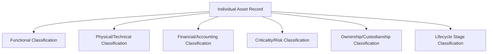
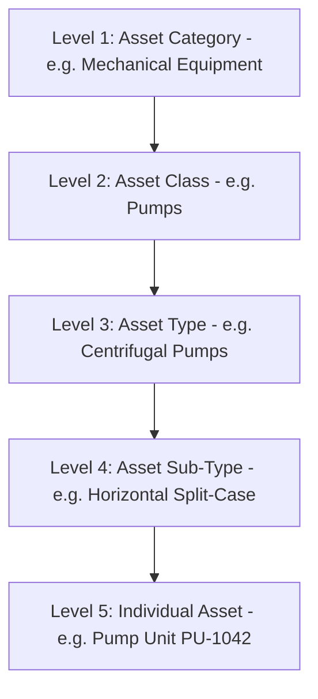
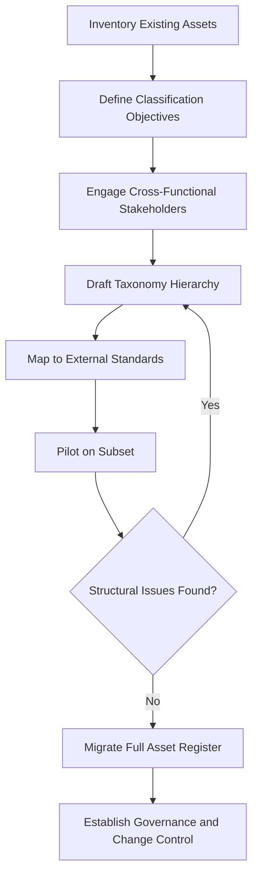

## Building a Formal Asset Classification Scheme

### Definition and Purpose

An asset classification scheme is a documented, hierarchical structure used to organize an organization's asset portfolio into consistent, logical categories based on shared characteristics such as function, criticality, ownership, physical type, or lifecycle stage. It serves as the foundational taxonomy underlying the asset register, enabling consistent data capture, aggregated reporting, cross-portfolio comparison, and alignment with the line-of-sight decomposition from organizational objectives down to individual assets.

Without a formal classification scheme, asset registers tend to develop organically and inconsistently—different departments naming and categorizing similar assets differently—undermining the data integrity required for reliable capital planning, risk assessment, and ISO 55001 Clause 6 decision-making criteria.

### Why Classification Matters in Asset Lifecycle Management

**Key Points**

- Enables **aggregation**: rolling up individual asset data into class-level, portfolio-level, and organizational reporting
- Enables **consistent decision-making criteria application**: prioritization frameworks (risk, cost, strategic alignment) can only be applied fairly across assets if those assets are consistently classified into comparable groups
- Enables **benchmarking**: comparing performance, cost, or reliability across similar asset classes, whether internally over time or externally against industry peers
- Enables **systems integration**: EAM/CMMS systems, GIS platforms, and financial systems all rely on a shared classification taxonomy to exchange and reconcile data correctly
- Supports **line of sight**: a well-designed hierarchy allows a strategic objective (e.g., "reduce unplanned outages") to be traced down through asset classes to specific assets, and asset-level performance data to be aggregated back up to inform strategic reporting

### Core Classification Dimensions

A mature asset classification scheme typically layers multiple independent classification dimensions rather than relying on a single hierarchy, since different questions require different lenses on the same asset.

#### 1. Functional Classification

Groups assets by the service or business function they support, independent of physical type. This dimension most directly supports line-of-sight traceability back to organizational objectives.

**Example**

In a water utility, functional classification might include: Water Treatment, Water Distribution, Wastewater Collection, Wastewater Treatment, and Customer Service Infrastructure—each traceable to a distinct strategic service outcome.

#### 2. Physical/Technical Classification

Groups assets by their physical nature, engineering discipline, or technical characteristics (e.g., mechanical, electrical, civil/structural, IT/digital).

**Example**

A hospital's technical classification might distinguish Medical Equipment (further subdivided into Imaging, Laboratory, Life Support), Building Systems (HVAC, Electrical, Plumbing), and IT Infrastructure (Servers, Network, Clinical Systems).

#### 3. Financial/Accounting Classification

Aligns with depreciation schedules, capital vs. operating expense treatment, and financial reporting categories, often mapped to (but not identical with) GAAP/IFRS asset classes, as distinguished in the ISO 55010 discussion of financial/non-financial terminology gaps.

#### 4. Criticality/Risk Classification

Groups assets by the consequence of failure—often expressed as tiers (e.g., Critical, Essential, Standard, Non-Essential)—feeding directly into risk-based decision-making criteria and maintenance prioritization.

$$\text{Criticality Score} = \text{Probability of Failure} \times \text{Consequence of Failure}$$

#### 5. Ownership/Custodianship Classification

Identifies which organizational unit, department, or individual role is accountable for the asset's management, critical for governance and Clause 5 (Leadership/Roles) accountability under ISO 55001.

#### 6. Lifecycle Stage Classification

Tracks where an asset currently sits in its lifecycle (planned, in acquisition, operational, in major renewal, pending disposal), supporting portfolio-level lifecycle stage reporting.

### Hierarchical Structure Design

**Key Points**

- Most formal schemes use a **multi-level hierarchy**: Asset Class → Asset Type → Asset Sub-Type → Individual Asset, allowing reporting at any level of granularity
- The hierarchy should be **mutually exclusive and collectively exhaustive (MECE)** at each level—every asset should fit into exactly one category at each tier, with no ambiguous overlaps
- Depth should be **proportionate to portfolio complexity**: an organization with a small, homogeneous asset base may need only 2-3 hierarchy levels, while a large multi-sector organization may require 4-5

**Example**

A manufacturing organization's hierarchy might read: Category = "Production Equipment" → Class = "Conveying Systems" → Type = "Belt Conveyors" → Sub-Type = "Inclined Belt Conveyor" → Individual Asset = "Conveyor BC-204, Line 3."

### Step-by-Step Development Process

**Example**

1. **Inventory the existing asset base** — conduct a data audit of all current asset records across departments, systems, and spreadsheets to understand what currently exists and how inconsistently it is currently classified
2. **Define classification objectives** — determine which dimensions (functional, technical, financial, criticality, ownership, lifecycle) the organization actually needs, driven by what decisions the classification must support
3. **Engage cross-functional stakeholders** — involve finance, operations, engineering, and IT early, since misaligned classification definitions between departments (the ISO 55010 silo problem) are a leading cause of scheme failure
4. **Draft the taxonomy hierarchy** — build the multi-level structure, testing it against a representative sample of real assets to check for MECE violations and ambiguous edge cases
5. **Map to external standards where relevant** — align, where practical, with recognized external classification systems (e.g., Uniclass, OmniClass, UNSPSC for procurement-linked classification, or sector-specific taxonomies)
6. **Pilot on a subset of the portfolio** — apply the draft scheme to one asset class or business unit before organization-wide rollout, surfacing structural issues early
7. **Migrate and reclassify the full asset register** — systematically re-tag existing asset records according to the new scheme, documented as a formal data migration project
8. **Govern and maintain** — establish a change-control process for adding new categories as new asset types are acquired, preventing classification drift over time

### Common External Reference Taxonomies

**Key Points**

- **Uniclass / OmniClass**: construction and built-environment classification systems, commonly referenced by facilities and infrastructure organizations for consistency with design and BIM (Building Information Modeling) data
- **UNSPSC (United Nations Standard Products and Services Code)**: widely used for procurement-linked asset and spare-parts classification, useful where asset classification must interoperate with supply chain systems
- **Industry-specific taxonomies**: sector bodies (utilities, rail, aviation) often maintain recommended classification structures reflecting common regulatory reporting requirements
- [Inference] Organizations that align their internal classification scheme with a recognized external taxonomy, even partially, likely reduce long-term integration friction when adopting new software systems or engaging external benchmarking services, though the degree of benefit varies by how standardized the organization's specific sector's external taxonomies actually are.

### Classification Attributes vs. Classification Hierarchy

**Key Points**

- The **hierarchy** answers "what kind of asset is this?" (a fixed, structural categorization)
- **Attributes** are the variable data fields captured within each classification node (e.g., manufacturer, installation date, capacity, material) and should not be confused with hierarchy levels themselves
- A common design mistake is embedding what should be an attribute into the hierarchy itself (e.g., creating separate hierarchy branches for "Pumps - Steel" and "Pumps - Cast Iron" rather than treating "Material" as an attribute of a single "Pumps" category), which causes hierarchy bloat and inconsistent classification over time

**Example**

Rather than creating a hierarchy branch for every pump manufacturer, a well-designed scheme keeps "Centrifugal Pump" as the classification node and captures "Manufacturer," "Model," "Capacity (L/s)," and "Installation Year" as attributes attached to that node—preserving a stable, manageable hierarchy while still supporting rich, granular data capture.

### Governance and Maintenance

**Key Points**

- A classification scheme requires a **designated data governance owner** (often a data steward role within the asset management function) responsible for approving new categories and preventing uncontrolled taxonomy sprawl
- **Version control** is essential: as the scheme evolves, historical asset data classified under prior versions must be reconciled or clearly flagged to avoid silently corrupting trend analysis
- Periodic **taxonomy health reviews** (e.g., annually) should check for: categories with very few or zero assigned assets (candidates for consolidation), assets forced into "Other/Miscellaneous" categories at unusually high rates (a sign of taxonomy gaps), and inconsistent classification of newly acquired assets

### Common Pitfalls

- **Over-granularity**: excessive hierarchy depth or category count makes the scheme unusable in practice, leading staff to default to generic "Other" categories, undermining the scheme's entire purpose
- **Under-granularity**: overly broad categories that blend assets with meaningfully different risk profiles or maintenance needs, reducing the scheme's analytical usefulness
- **Departmental silos creating parallel taxonomies**: without early cross-functional engagement, finance, engineering, and operations may develop and maintain separate, unreconciled classification schemes for the same physical assets—directly echoing the ISO 55010 silo problem
- **No linkage to decision-making criteria**: a classification scheme built purely for physical/technical description, without an explicit criticality or risk dimension, cannot directly support ISO 55001 Clause 6 prioritization requirements
- **Static scheme with no governance**: taxonomies that are never revisited after initial creation gradually diverge from operational reality as new asset types are acquired

### Conclusion

A formal asset classification scheme is the structural backbone that allows an asset register to function as more than a flat list of items—it enables aggregation, consistent decision-making, cross-system integration, and the strategic line-of-sight traceability central to mature asset lifecycle management. Building one well requires balancing multiple classification dimensions (functional, technical, financial, criticality, ownership, lifecycle), designing a hierarchy that is neither too shallow nor too granular, engaging stakeholders across departmental silos from the outset, and establishing ongoing governance to prevent taxonomy drift. [Unverified] The optimal number of hierarchy levels, classification dimensions, or degree of alignment with external taxonomies varies substantially by industry, portfolio size, and organizational maturity, and no single universal classification template has been established as best practice across all sectors.

**Related Topics**

- The Asset Register: Structure, Data Fields, and Governance
- Asset Criticality Assessment Frameworks
- Decision-Making Criteria and Weighted Prioritization Frameworks
- ISO 55010 and the Alignment of Financial and Non-Financial Functions
- Data Governance for Asset Performance Traceability
- Enterprise Asset Management (EAM) System Selection and Configuration
- Master Data Management in Asset-Intensive Organizations
- Value Realization and Line of Sight to Organizational Objectives