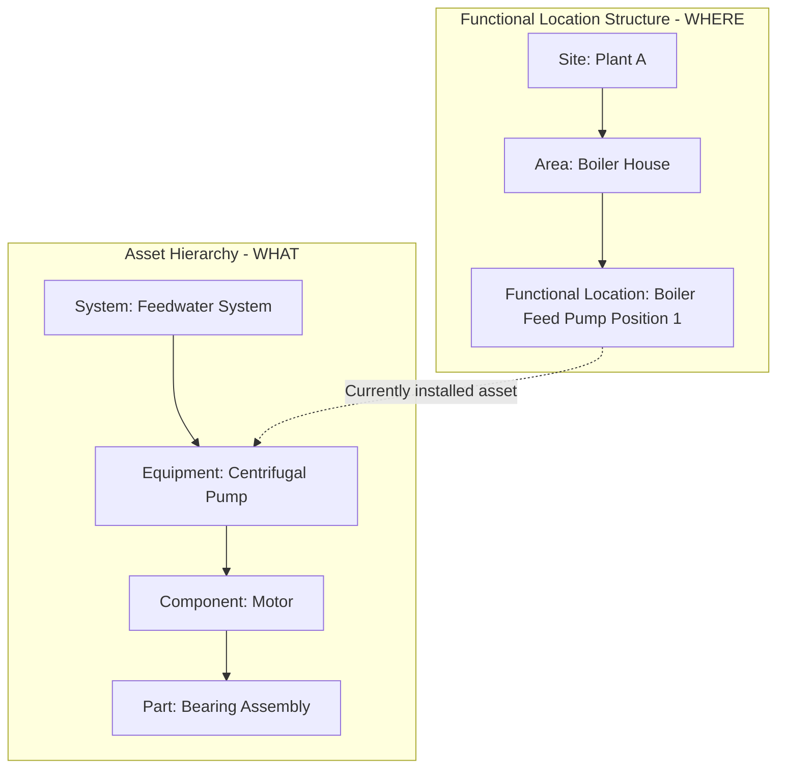
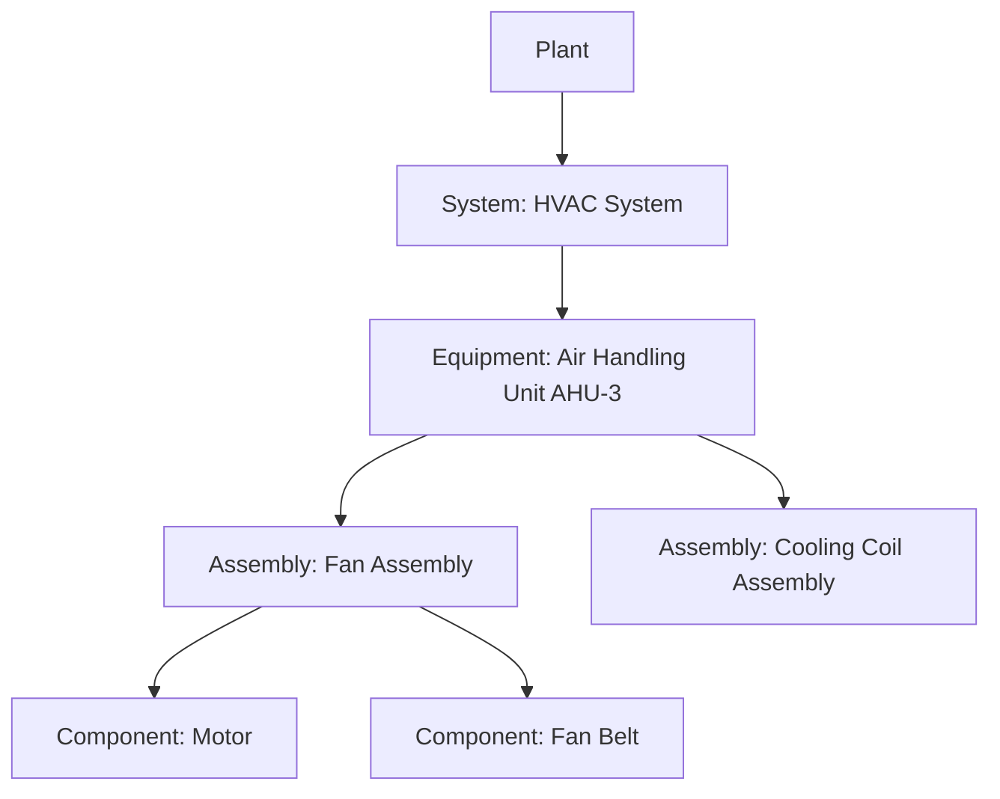
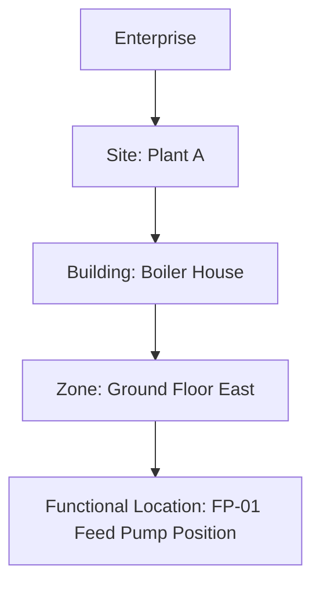
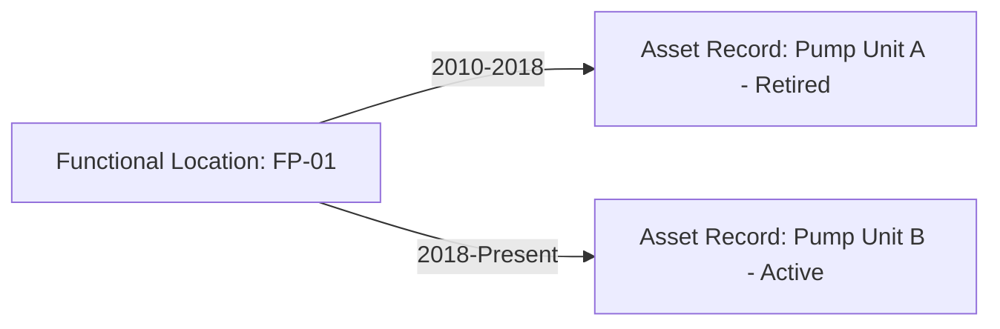

## Asset Hierarchies and Functional Location Structures

### Definition and Conceptual Distinction

Asset hierarchies and functional location structures are two related but distinct organizing frameworks used in Enterprise Asset Management (EAM) and CMMS systems to represent how assets relate to one another and to the physical or operational spaces they occupy.

- An **asset hierarchy** organizes assets by their physical or logical composition—how components nest within larger equipment, and how equipment nests within systems (a "what is part of what" structure).
- A **functional location structure** organizes the physical or operational *space* an asset occupies, independent of which specific asset currently sits there (a "where" structure that persists even when the asset installed at that location is replaced).

This distinction—asset identity versus location identity—is one of the most consequential design decisions in EAM system configuration, and confusing the two is a common source of long-term data degradation.

### Why the Distinction Matters

**Key Points**

- Functional locations persist through asset replacement, swaps, or relocation, preserving the historical performance and maintenance record *of that position* even as physical equipment cycles through it over decades
- Asset records persist through relocation, allowing an organization to track a specific physical asset's full history even if it is moved to a different functional location
- Without this separation, replacing a failed pump with a new unit either loses the historical maintenance record tied to that position, or incorrectly attributes the new pump's early life to the old pump's failure history—both are significant data integrity failures
- [Inference] This distinction becomes increasingly critical as asset portfolios mature and undergo multiple renewal cycles; organizations that conflate location and asset identity from the outset often face a costly re-architecture of their EAM data model once the first major asset replacement cycle occurs, though the precise timeline at which this becomes a serious problem varies by asset type and replacement frequency.

**Example**

A pump located at "Feedwater Pump Position 1" fails after 15 years and is replaced with a new pump model from a different manufacturer. Under a properly separated structure, the functional location "Feedwater Pump Position 1" retains its full maintenance and failure history, the retired asset record for the old pump is closed out (moved to inactive/disposed status while retaining its own history), and a new asset record for the new pump is created and linked to that same functional location going forward—preserving both the positional history and the individual asset's own lifecycle record.

### Asset Hierarchy Structure

**Key Points**

- Asset hierarchies typically follow a **parent-child (top-down) composition model**, reflecting physical or logical containment: System → Equipment → Assembly → Component → Part
- Each level in the hierarchy can carry its own maintenance strategy, criticality rating, and cost tracking, while also allowing costs and performance data to roll up to higher levels for aggregated reporting
- Hierarchy depth should reflect the level at which the organization actually needs to plan, budget, and analyze failures—excessive depth (tracking down to individual bolts) creates unsustainable data maintenance burden, while insufficient depth (treating an entire production line as one asset) prevents meaningful failure analysis

### Functional Location Structure

**Key Points**

- Functional locations are typically organized geographically or operationally: Enterprise → Site/Plant → Area/Building → Zone/Room → Specific Position
- This structure supports spatial reporting (e.g., "show all maintenance costs for Building C") independent of what equipment currently occupies each position
- Functional location codes are often designed as structured, hierarchical alphanumeric codes (e.g., `PLANT-A.BOILERHSE.FEEDPUMP-01`) allowing systems to parse hierarchy level directly from the code structure, though many modern EAM systems use relational database links rather than encoded strings

### The Asset-to-Functional-Location Linkage Model

**Key Points**

- The relationship between an asset record and a functional location record is typically a **time-bound assignment**, not a permanent one: an asset occupies a functional location for a defined period, and that assignment history is itself tracked
- This enables queries such as "what asset was installed at this location on a given date" (supporting historical failure investigation) and "where has this specific asset been installed over its life" (supporting asset-level lifecycle tracking across relocations)
- Some assets are **mobile** (vehicles, portable equipment) and may not have a fixed functional location at all, or may have a functional location that changes frequently (e.g., a "fleet depot" rather than a fixed operational position); mobile asset tracking typically relies more heavily on the asset hierarchy and less on functional location structures

### Practical Design Considerations

**Example**

Designing an EAM data model for a manufacturing plant typically involves these decisions:

1. **Determine which asset types require functional location tracking** — fixed, position-critical equipment (production line stations, building systems) benefits most; highly mobile or low-value assets may not warrant the overhead
2. **Define the functional location hierarchy depth** based on the granularity at which maintenance work orders, cost centers, and safety zones are actually managed
3. **Define the asset hierarchy depth** based on the granularity at which failure analysis, spare parts management, and maintenance strategies (e.g., reliability-centered maintenance) need to operate
4. **Establish the linkage/assignment mechanism**, ensuring the system captures assignment start/end dates whenever an asset is installed, removed, or relocated
5. **Align both structures with the asset classification scheme**, ensuring functional location types and asset classes use consistent naming and coding conventions

### Common Implementation Pitfalls

**Key Points**

- **Conflating asset and location into a single structure**: the most common and consequential design error, typically discovered only when the first major equipment replacement occurs and historical data becomes ambiguous or is lost
- **Mirroring organizational reporting structure instead of physical reality**: functional locations should reflect physical/operational geography, not shifting departmental org charts, since organizational restructuring is far more frequent than physical plant reconfiguration
- **Inconsistent coding conventions across sites**: multi-site organizations that allow each site to independently define its own functional location coding scheme lose the ability to perform consistent cross-site reporting and benchmarking
- **Retrofitting hierarchy after go-live**: restructuring asset hierarchies or functional locations after significant historical data has accumulated is a costly and error-prone data migration exercise; [Inference] this cost is one of the strongest arguments for investing adequate design time in hierarchy and functional location architecture before EAM/CMMS system go-live rather than treating it as a configuration detail to be refined later, though the specific magnitude of rework cost will vary by system, data volume, and how deeply the flawed structure has been embedded into downstream reports and integrations.

### Relationship to Reliability and Maintenance Analysis

**Key Points**

- Functional-location-based failure history (tracking recurring failures *at a position* regardless of which physical asset occupies it) is essential input to reliability-centered maintenance (RCM) analysis, since recurring failures tied to a specific position may indicate an environmental or systemic root cause (e.g., vibration, corrosive atmosphere) rather than a defect in any single asset unit
- Asset-based failure history (tracking a specific physical unit's failure record across its life, including if relocated) supports manufacturer/model-level reliability analysis and warranty claim substantiation
- A well-separated hierarchy and functional location model allows both analyses to be performed independently and correctly from the same underlying data set

$$\text{Mean Time Between Failures (Position)} \neq \text{Mean Time Between Failures (Specific Asset Unit)}$$

These two MTBF calculations answer different reliability questions and require the asset/location separation to be calculated correctly.

### Conclusion

Asset hierarchies and functional location structures serve complementary but distinct organizing purposes within an EAM system: the hierarchy captures physical/logical composition ("what is part of what"), while the functional location structure captures spatial and operational context ("where," independent of which asset currently occupies that position). Properly separating these two structures, with a time-bound linkage model connecting them, is foundational to preserving accurate historical data through asset replacement cycles, supporting both position-based and asset-based reliability analysis, and avoiding costly data model rework as an asset portfolio matures. [Unverified] The optimal hierarchy depth, functional location granularity, and coding convention approach vary considerably across industries and specific EAM/CMMS software platforms, and organizations should validate design choices against their specific software vendor's data model capabilities and their own reporting and reliability analysis requirements rather than applying a universal template.

**Related Topics**

- Building a Formal Asset Classification Scheme
- The Asset Register: Structure, Data Fields, and Governance
- Reliability-Centered Maintenance (RCM) Methodology
- Enterprise Asset Management (EAM) System Selection and Configuration
- Asset Criticality Assessment Frameworks
- CMMS vs. EAM Data Model Differences
- Mobile and Fleet Asset Tracking Approaches
- Master Data Management in Asset-Intensive Organizations