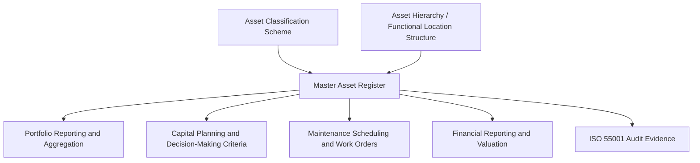
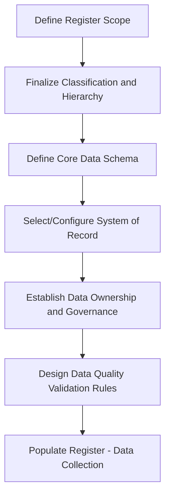
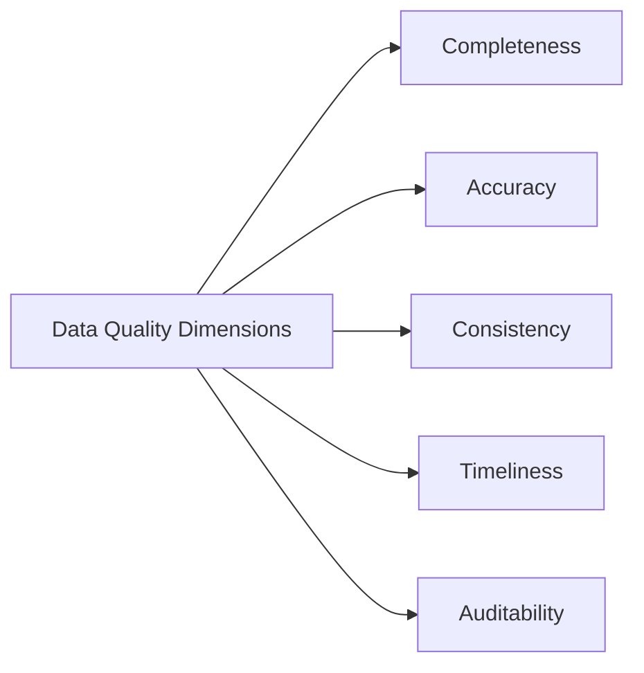

## Designing and Populating a Master Asset Register

### Definition and Role within Asset Lifecycle Management

The master asset register is the authoritative, single source of truth listing every asset within an organization's defined asset management scope, along with the core data attributes needed to identify, locate, value, and manage each asset throughout its lifecycle. It is the operational database underpinning virtually every other ALM activity: capital planning, maintenance scheduling, financial reporting, risk assessment, and ISO 55001 compliance evidence all depend on the asset register being complete, accurate, and consistently structured.

Where the asset classification scheme defines *how* assets are categorized, and the asset hierarchy/functional location structure defines *how* assets relate to one another and to physical space, the asset register is the actual populated dataset that instantiates both frameworks with real, specific assets.

### Core Data Fields in a Master Asset Register

**Key Points**

A well-designed asset register captures data across several functional categories. No single universal field list applies to all organizations, but mature registers typically include:

| Category | Example Fields |
| --- | --- |
| Identification | Unique asset ID, asset name/description, classification code, functional location |
| Physical/Technical | Manufacturer, model, serial number, capacity/rating, material, installation date |
| Financial | Acquisition cost, current book value, depreciation method, useful life, disposal value |
| Condition/Performance | Current condition rating, last inspection date, remaining useful life estimate |
| Risk/Criticality | Criticality tier, consequence of failure rating, probability of failure rating |
| Ownership/Governance | Responsible department, asset owner/custodian, maintenance responsibility |
| Lifecycle Status | Lifecycle stage (planned, active, in renewal, disposed), warranty status |
| Regulatory/Compliance | Applicable regulatory requirements, inspection/certification due dates |

### Unique Asset Identification

**Key Points**

- Every asset requires a **unique, immutable identifier** that persists for the asset's entire lifecycle, independent of its functional location, classification changes, or ownership transfers
- Identifier schemes range from simple sequential numbers to structured codes embedding classification or location information—structured codes offer human-readability but risk becoming invalid if the asset is reclassified or relocated, since a code embedding "PUMP-BLDG3-001" is misleading once the asset moves to Building 5
- [Inference] Best practice generally favors a simple, meaningless sequential or system-generated unique identifier as the permanent primary key, with classification, location, and other descriptive attributes stored as separate, updatable fields rather than embedded in the ID itself—this avoids the identifier becoming stale as the asset's context changes, though some organizations with strong barcode/asset-tag legacy practices may reasonably retain structured codes for operational familiarity despite this tradeoff.

### Design Process: Building the Register Structure

**Example**

1. **Define register scope** — determine which asset classes, value thresholds, or organizational units fall within the register's scope (not every minor item needs to be individually tracked; many organizations set a capitalization or criticality threshold below which assets are tracked only in aggregate)
2. **Finalize the classification scheme and hierarchy** — the register's structure depends directly on the classification and hierarchy/functional location design decisions made previously
3. **Define the core data schema** — specify every field, its data type, whether it is mandatory or optional, and validation rules (e.g., installation date cannot be later than today, criticality must be one of a defined set of values)
4. **Select or configure the system of record** — determine whether the register lives in a dedicated EAM system, a CMMS, a GIS-integrated platform, or (for smaller organizations) a rigorously governed spreadsheet or database
5. **Establish data ownership and governance roles** — assign responsibility for maintaining accuracy of each data category (e.g., finance owns cost/depreciation fields, engineering owns technical/condition fields)
6. **Design data quality validation rules** — build in checks for completeness, consistency, and plausibility (e.g., flagging assets with no recorded installation date, or condition ratings that haven't been updated in an implausibly long period)

### Population Strategies: Sourcing the Initial Data

**Key Points**

Populating a master asset register from scratch, or consolidating fragmented legacy records, is typically the most resource-intensive phase of the project.

- **Existing system extraction**: consolidating data already captured in legacy CMMS systems, spreadsheets, financial fixed-asset registers, and departmental records
- **Physical asset verification/walkdown**: field teams physically inspect and verify assets against existing records, correcting discrepancies and capturing assets missing from any prior record (often necessary since legacy records frequently diverge from physical reality over time)
- **Engineering drawing and as-built document review**: extracting asset data from design documentation, particularly useful for infrastructure and building systems where physical walkdowns of every component are impractical
- **Reconciliation across sources**: cross-referencing financial records, technical records, and physical verification findings to resolve discrepancies (e.g., an asset listed as disposed in finance records but still physically present and operating)

**Example**

A municipal water utility populating its register for buried pipe infrastructure might combine GIS records showing pipe location and material (from engineering as-built drawings), financial records showing original installation cost and depreciation schedule, and condition assessment data from recent CCTV pipe inspections—reconciling all three sources into a single register entry per pipe segment, with discrepancies (e.g., GIS shows cast iron, financial records show an installation date inconsistent with when cast iron was used) flagged for field verification.

### Data Quality Dimensions

**Key Points**

- **Completeness**: the proportion of required fields populated across the register; incomplete records undermine aggregated reporting and risk analysis
- **Accuracy**: the degree to which recorded data reflects physical/actual reality, typically degrading over time without active maintenance
- **Consistency**: uniform application of classification, units of measure, and terminology across the entire register, avoiding the "silo" problem where different data sources use incompatible conventions
- **Timeliness**: how current the data is relative to the asset's actual present condition and status—critical for condition-based decision-making
- **Auditability**: the ability to trace when and by whom a given data field was last updated, essential for both internal governance and ISO 55001 audit evidence

### Governance and Ongoing Maintenance

**Key Points**

- A master asset register is a **living dataset**, not a one-time deliverable; without ongoing governance it degrades as assets are acquired, relocated, modified, and disposed without corresponding record updates
- Establishing **data stewardship roles**—individuals or teams accountable for specific data domains (financial, technical, spatial)—prevents the register from becoming an orphaned dataset that nobody actively maintains
- **Change triggers** should be defined and operationalized: new asset commissioning, asset relocation, major refurbishment, and disposal should each have a defined workflow that updates the register as a mandatory step, not an optional afterthought
- Periodic **register audits or reconciliation exercises** (e.g., annual physical spot-checks against register records) catch drift before it accumulates into a major data integrity problem
- This ongoing maintenance function directly supports the "assurance" fundamental from ISO 55000 and the data/documented-information requirements distributed across ISO 55001 clauses

### Common Pitfalls

**Key Points**

- **Treating population as a one-time project**: organizations that invest heavily in an initial data population exercise but establish no ongoing governance see rapid data decay, often within one to two years
- **Insufficient field-level ownership**: without clear accountability for who updates which fields, no one takes responsibility when data becomes stale, and the register slowly loses credibility across the organization
- **Over-engineering the initial schema**: attempting to capture every conceivable data field before any assets are populated delays the entire project and creates a schema too complex for field staff to complete during data collection
- **Ignoring the classification/hierarchy dependency**: populating a register before the classification scheme and hierarchy/functional location design are finalized typically requires a costly retroactive reclassification and remapping exercise once those upstream frameworks are established
- **No reconciliation between financial and technical registers**: maintaining separate, unreconciled asset lists in finance and engineering systems recreates the ISO 55010 silo problem at the most foundational data layer

### Relationship to Broader Asset Lifecycle Management

**Example**

The master asset register's quality directly determines the reliability of downstream ALM activities. A capital planner attempting to apply the decision-making criteria established in a SAMP cannot meaningfully prioritize competing investments if the underlying register has inconsistent criticality ratings, missing condition data, or duplicate/orphaned asset records. In this sense, the asset register is not merely an administrative database but the evidentiary foundation upon which the entire value-realization and line-of-sight chain depends—strategic-to-asset traceability is only as trustworthy as the register data supporting it.

### Conclusion

Designing and populating a master asset register requires sequencing decisions carefully—classification and hierarchy design must precede schema design, and schema design must precede data population—while balancing schema completeness against practical data collection feasibility. The most common cause of long-term register failure is not poor initial design but inadequate ongoing governance: without designated data stewardship, defined change triggers, and periodic reconciliation, even a well-designed register degrades into an unreliable dataset that undermines every ALM activity depending on it. [Unverified] The appropriate balance between initial data population thoroughness and phased/iterative population approaches varies by organizational resource constraints and portfolio urgency, and no universal sequencing or timeline benchmark applies uniformly across all sectors or portfolio sizes.

**Related Topics**

- Building a Formal Asset Classification Scheme
- Asset Hierarchies and Functional Location Structures
- Data Governance for Asset Performance Traceability
- Enterprise Asset Management (EAM) System Selection and Configuration
- Asset Criticality Assessment Frameworks
- ISO 55010 and the Alignment of Financial and Non-Financial Functions
- ISO 55013 and Guidance on Data Asset Management
- Master Data Management in Asset-Intensive Organizations