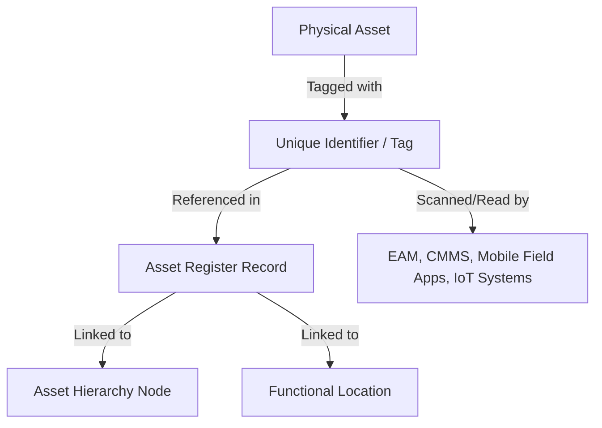
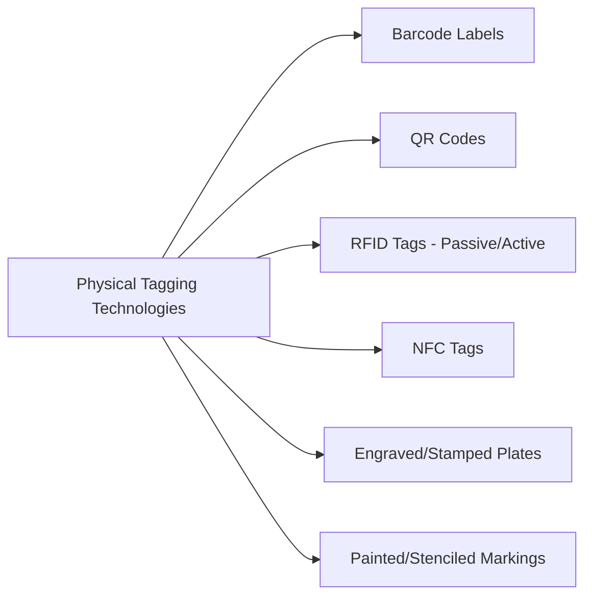
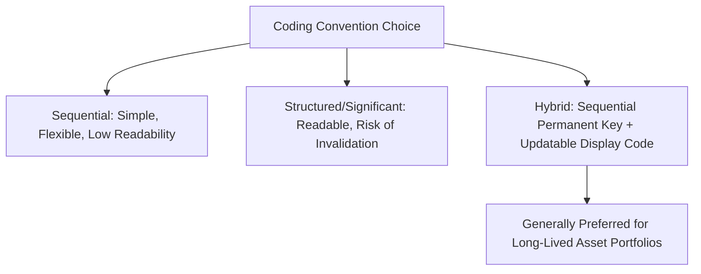

## Asset Identification, Tagging, and Naming Conventions

### Definition and Purpose

Asset identification, tagging, and naming conventions comprise the systematic methods used to uniquely and consistently label, mark, and reference physical and logical assets throughout their lifecycle. This discipline sits at the intersection of the asset register (discussed previously), the classification scheme, and the physical/operational reality of assets in the field—it is the mechanism that connects a physical object in the real world to its digital record in the asset register.

Poor identification and naming practices are among the most common root causes of asset register data degradation, duplicate records, and failed system integrations, making this a foundational rather than cosmetic concern within Asset Lifecycle Management.

### Core Concepts: Identifiers vs. Names vs. Tags

**Key Points**

- **Unique identifier (asset ID)**: a permanent, immutable reference key assigned to an asset record, typically system-generated or sequentially issued, that never changes for the life of the asset regardless of relocation, reclassification, or ownership transfer
- **Asset name/description**: a human-readable label describing the asset, which may change over time (e.g., if reclassified or if naming conventions are updated) without affecting the underlying unique identifier
- **Physical tag**: the actual physical marking device (barcode label, RFID tag, QR code, engraved plate, or painted marking) attached to the asset itself, which encodes or references the unique identifier for field scanning and verification

Conflating these three concepts—particularly embedding descriptive or locational information directly into the permanent unique identifier—is the single most common design flaw in asset identification schemes, as discussed in the master asset register topic regarding identifier immutability.

### Naming Convention Design Principles

**Key Points**

- **Consistency**: naming conventions should apply uniformly across all asset classes, sites, and business units to support reliable searching, filtering, and reporting
- **Human readability**: while the underlying unique identifier can be a meaningless sequential code, the accompanying name/description field should be meaningful enough for field staff and planners to recognize the asset without needing to look up additional records
- **Avoid embedding volatile information**: naming conventions should avoid encoding data likely to change (department name, location, responsible manager) directly into the name itself, since these should live as separate, updatable attributes rather than being baked into a static label
- **Length and format constraints**: naming conventions must respect the character limits and format constraints of downstream systems (CMMS fields, barcode label size, mobile app display constraints)
- **Language and localization**: multinational organizations must decide whether naming conventions are standardized in a single language or support localized naming, with implications for consistency versus local usability

**Example**

A naming convention template might follow the pattern: `[Asset Type Abbreviation]-[Sequential Number] – [Brief Descriptor]`, producing names such as `PMP-0142 – Feedwater Circulation Pump` or `AHU-0087 – Rooftop Air Handler, East Wing`. This balances a structured, sortable prefix with a human-readable descriptor, while the true permanent database key remains a separate, meaningless sequential ID.

### Physical Tagging Technologies

#### Barcode Labels

Cost-effective, widely supported by mobile scanning apps and legacy CMMS systems. Requires direct line-of-sight scanning and can degrade in harsh environmental conditions (heat, chemical exposure, UV) unless specified in durable, industrial-grade material.

#### QR Codes

Can encode more data directly (including a URL linking to the asset's digital record), readable by standard smartphone cameras without dedicated scanning hardware, making them attractive for field workforce mobility initiatives. Subject to similar durability constraints as barcodes.

#### RFID Tags (Radio Frequency Identification)

- **Passive RFID**: no internal power source, read at short range when energized by a reader; lower cost, suitable for high-volume asset tracking (e.g., IT equipment, tools)
- **Active RFID**: battery-powered, readable at longer range, often used for high-value or safety-critical mobile asset tracking (e.g., tracking equipment location within a large facility)
- RFID does not require line-of-sight, offering advantages in harsh, dirty, or visually obstructed environments compared to barcodes

#### Engraved or Stamped Plates

Used for extremely long-lived or harsh-environment assets (heavy industrial equipment, outdoor infrastructure) where adhesive labels would not survive the asset's operational life; typically paired with a separately maintained digital record since engraved plates cannot be easily updated.

#### Painted or Stenciled Markings

Common for large infrastructure assets (pipeline segments, structural elements) where a physical tag device is impractical; usually paired with GPS coordinates or functional location references in the digital record for precise identification.

### Selecting a Tagging Technology

**Example**

Selection typically depends on:

1. **Environmental conditions** — outdoor, high-heat, corrosive, or high-vibration environments favor RFID or engraved plates over adhesive barcode/QR labels
2. **Read distance and access requirements** — assets in hard-to-reach or hazardous locations benefit from RFID's non-line-of-sight, longer-range reading capability
3. **Asset value and volume** — high-value, safety-critical assets may justify active RFID's higher cost; high-volume, lower-value assets (IT peripherals, tools) often use barcodes for cost efficiency
4. **Existing system compatibility** — the organization's EAM/CMMS platform and mobile scanning infrastructure may constrain which technologies integrate cleanly without additional investment
5. **Regulatory or industry-specific requirements** — some sectors (aviation, pharmaceuticals, nuclear) impose specific traceability and marking requirements that dictate tagging technology choices

[Inference] Organizations increasingly favor QR codes for new asset tagging initiatives due to widespread smartphone camera compatibility eliminating the need for dedicated scanning hardware, though this preference depends heavily on field workforce device policies and the durability requirements of the specific operating environment, and RFID remains preferred where line-of-sight scanning is impractical or unsafe.

### Coding Convention Structures

**Key Points**

Beyond the physical tag itself, organizations must design the underlying alphanumeric or numeric coding logic embedded in or referenced by the tag.

- **Sequential numbering**: simplest approach, assigning the next available number regardless of asset type or location; maximizes long-term flexibility but sacrifices any embedded meaning
- **Structured/significant coding**: embeds classification, site, or type information directly into the code (e.g., `WTP-PMP-0042` for "Water Treatment Plant, Pump, unit 42"); offers immediate human interpretability but risks invalidation if the asset is reclassified, relocated, or the coding scheme's embedded categories change over time
- **Hybrid approach**: uses a meaningless sequential number as the true permanent database key, while allowing structured, human-readable codes to exist as a separate, updatable "display code" or "asset tag number" field that can be reissued if circumstances change without breaking the underlying record linkage

### Governance of Naming and Tagging Standards

**Key Points**

- A documented **naming and tagging standard** should be formally approved and maintained as a governed reference document, not left to informal or department-specific convention
- **New asset commissioning workflows** should mandate tag assignment and naming convention application as a required step before an asset is considered fully registered, preventing untagged "orphan" assets from entering operational service
- **Retagging and relabeling triggers** (physical tag damage, asset relocation, reclassification) should be defined so that physical tags remain synchronized with digital records over time
- **Multi-site standardization** is particularly important for organizations operating across multiple facilities or business units, since inconsistent local naming conventions undermine cross-site reporting and benchmarking—directly paralleling the classification scheme governance challenges discussed previously

### Common Pitfalls

**Key Points**

- **Embedding volatile data in permanent identifiers**: structured codes that bake in location or department information become misleading once an asset moves, yet are costly to change since the ID may be referenced across multiple integrated systems
- **Inconsistent tagging technology across a portfolio without a clear rationale**: mixing barcode, QR, and RFID inconsistently across similar asset types without a documented decision framework increases field workforce training burden and scanning equipment costs
- **No retagging process for physical tag degradation**: over time, physical tags fade, fall off, or become illegible in harsh environments; without a defined replacement process, the physical-to-digital linkage silently breaks
- **Duplicate identifier assignment**: inadequate identifier governance (e.g., allowing multiple departments to independently assign asset numbers without a central registry) leads to duplicate or colliding identifiers, corrupting the asset register's uniqueness guarantee
- **Ignoring mobile/field workforce usability**: naming and tagging conventions designed purely for back-office database elegance, without field-testing with actual maintenance technicians, often prove impractical to read, scan, or reference under real operating conditions

### Conclusion

Asset identification, tagging, and naming conventions form the critical link between an asset's physical existence and its digital representation in the asset register. Sound practice separates the permanent, immutable unique identifier from human-readable names and physical tags, selects tagging technology appropriate to environmental conditions and asset value, and establishes governed standards with defined triggers for retagging and identifier issuance—preventing the identifier drift, duplicate records, and physical-to-digital desynchronization that undermine asset register data quality over time. [Unverified] The specific optimal tagging technology, coding structure, and naming convention format vary substantially by industry, environmental conditions, and existing system infrastructure, and organizations should validate any chosen approach through field piloting rather than assuming a single universal best practice applies across all asset types and operating environments.

**Related Topics**

- Designing and Populating a Master Asset Register
- Building a Formal Asset Classification Scheme
- Asset Hierarchies and Functional Location Structures
- Enterprise Asset Management (EAM) System Selection and Configuration
- Mobile and Fleet Asset Tracking Approaches
- Data Governance for Asset Performance Traceability
- IoT and Sensor-Based Asset Condition Monitoring
- Master Data Management in Asset-Intensive Organizations