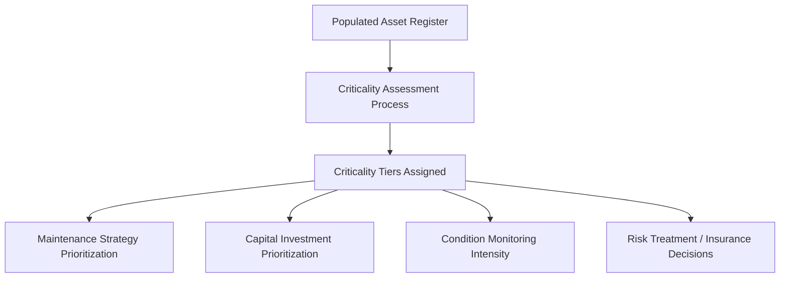
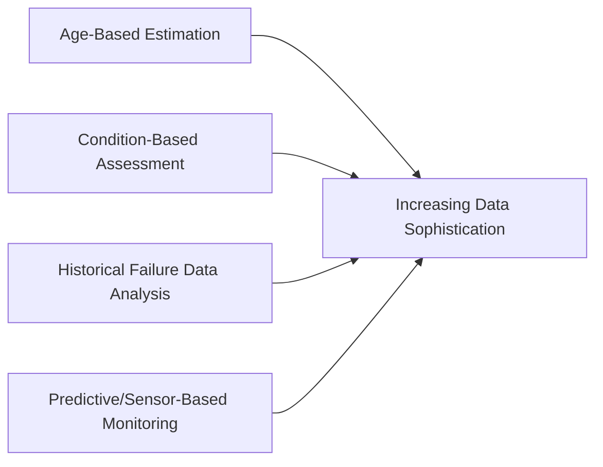
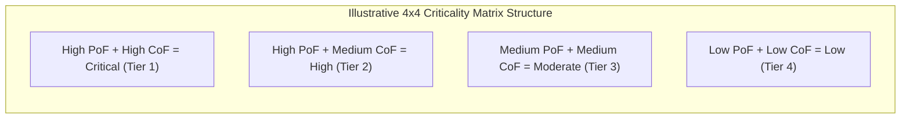
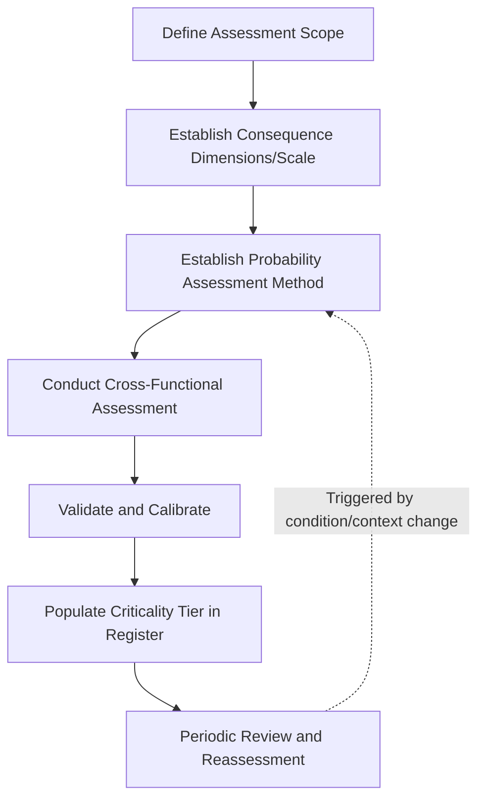

## Asset Criticality Classification and Risk Ranking

### Definition and Purpose

Asset criticality classification and risk ranking is the systematic process of evaluating and categorizing assets according to the consequence and likelihood of their failure, producing a structured ranking that guides maintenance prioritization, capital investment decisions, and risk mitigation strategies. It is the analytical layer that transforms a populated asset register from a passive inventory into an active decision-support tool, directly operationalizing the risk-based decision-making criteria required under ISO 55001 Clause 6.

Criticality classification answers the question: *"If this asset fails, how much does it matter, and how likely is that failure?"*—and the answer determines how much attention, budget, and monitoring rigor an asset warrants relative to every other asset in the portfolio.

### The Foundational Risk Equation

**Key Points**

Asset criticality is fundamentally a function of two independent dimensions, consistent with standard risk management theory (ISO 31000 alignment):

$$\text{Risk} = \text{Probability of Failure (PoF)} \times \text{Consequence of Failure (CoF)}$$

- **Probability of Failure (PoF)**: the likelihood that an asset will fail within a defined time horizon, informed by asset age, condition, historical failure data, operating environment, and manufacturer reliability data
- **Consequence of Failure (CoF)**: the magnitude of impact should failure occur, spanning multiple impact dimensions rather than a single financial figure

An asset can be high-risk either because it is highly likely to fail (even with modest consequence) or because failure consequence is severe (even with low likelihood)—both cases warrant elevated attention, though the appropriate risk treatment strategy differs significantly between them.

### Consequence of Failure: Multi-Dimensional Assessment

**Key Points**

Mature criticality frameworks assess consequence across multiple independent dimensions rather than collapsing everything into a single cost figure, since different stakeholders weight different impacts differently.

| Consequence Dimension | Example Considerations |
| --- | --- |
| Safety | Risk of injury or fatality to workers, public, or users |
| Environmental | Risk of spill, emission, contamination, or ecological harm |
| Financial | Direct repair/replacement cost, consequential business loss |
| Operational/Service | Loss of production capacity, service interruption, customer impact |
| Reputational | Public trust impact, media exposure, regulatory scrutiny |
| Regulatory/Compliance | Risk of fines, license suspension, legal liability |

**Example**

A backup generator at a hospital and a decorative fountain pump at a corporate headquarters might have similar financial replacement costs, but their consequence-of-failure profiles differ dramatically: the generator's failure carries severe safety consequence (life-support systems), while the fountain pump's failure carries only minor reputational/aesthetic consequence. A criticality framework must be structured to reflect this difference even when financial cost alone would rank them similarly.

### Probability of Failure: Assessment Approaches

**Key Points**

- **Age-based estimation**: using asset age relative to expected useful life as a proxy for failure probability, simplest to implement but least precise since it ignores actual condition and usage intensity
- **Condition-based assessment**: incorporating inspection findings, condition ratings, and degradation trends, offering more accurate probability estimates but requiring active condition monitoring infrastructure
- **Historical failure/reliability data analysis**: using an organization's own failure history (mean time between failures, failure mode frequency) or manufacturer/industry reliability data (e.g., bathtub curve modeling) to statistically estimate failure probability
- **Predictive/condition-based monitoring**: leveraging sensor data (vibration, temperature, oil analysis) and, increasingly, machine learning-based predictive models to generate dynamic, continuously updated probability estimates

### Criticality Risk Matrix Design

**Key Points**

The most common tool for combining PoF and CoF into an actionable criticality ranking is a risk matrix, typically a 3x3, 4x4, or 5x5 grid plotting probability against consequence.

**Example**

A typical 4-tier criticality classification might define:

- **Tier 1 (Critical)**: failure causes safety risk, major service interruption, or severe regulatory consequence — highest priority for preventive/predictive maintenance and rapid capital renewal
- **Tier 2 (High)**: failure causes significant but contained operational or financial impact — proactive maintenance strategy, elevated monitoring
- **Tier 3 (Moderate)**: failure causes localized, manageable impact — standard preventive maintenance, routine monitoring
- **Tier 4 (Low)**: failure causes minimal impact, acceptable to run largely to failure — reactive/corrective maintenance strategy, minimal proactive investment

### Consistency and the Weighted Scoring Alternative

**Key Points**

- Simple risk matrices can suffer from **subjective inconsistency** when different assessors apply "high," "medium," and "low" ratings differently across asset classes or business units
- **Weighted scoring models** address this by assigning numerical weights to each consequence dimension and probability factor, producing a composite score for objective, consistent ranking across dissimilar asset types

$$\text{Composite Criticality Score} = w_1(\text{Safety}) + w_2(\text{Environmental}) + w_3(\text{Financial}) + w_4(\text{Operational}) + w_5(\text{Regulatory})$$

where weights $w_1$ through $w_5$ are defined at the organizational level (often within the SAMP's decision-making criteria) and applied uniformly, enabling direct comparability between, for example, a pump and a building roof despite their entirely different physical nature.

- [Inference] Weighted scoring models generally scale better across large, heterogeneous asset portfolios than qualitative risk matrices, since numerical scores support more precise sorting and threshold-setting; however, qualitative matrices remain popular for smaller portfolios or organizations earlier in their asset management maturity journey due to their simplicity and ease of stakeholder communication, and neither approach is universally superior across all organizational contexts.

### Process for Conducting a Criticality Assessment

**Example**

1. **Define assessment scope** — determine which asset classes or portfolio segments require formal criticality assessment (often prioritizing higher-value or higher-risk classes first in a phased rollout)
2. **Establish consequence dimensions and scoring scale** — agree organization-wide definitions for what constitutes "high," "medium," and "low" consequence in each dimension (safety, financial, environmental, etc.), avoiding the inconsistency pitfall noted above
3. **Establish probability assessment method** — select the appropriate PoF methodology given available data maturity (age-based through predictive, as outlined above)
4. **Conduct the assessment** — apply the scoring methodology systematically across the in-scope asset population, ideally involving cross-functional input (engineering, operations, safety, finance) to avoid single-perspective bias
5. **Validate and calibrate** — spot-check resulting rankings against practitioner intuition and historical incident data to identify miscalibration before rollout
6. **Populate criticality tier into the asset register** — record the resulting criticality classification as a formal, governed data field, feeding directly into maintenance strategy assignment and capital planning tools
7. **Establish a review cadence** — criticality is not static; changing operating conditions, consequence exposure (e.g., regulatory changes), or asset condition require periodic reassessment

### Application to Maintenance and Capital Prioritization

**Key Points**

- Criticality tiers directly inform **maintenance strategy selection**: Tier 1 assets typically justify predictive or reliability-centered maintenance approaches; Tier 4 assets may be deliberately run to failure as the most cost-effective strategy
- Criticality feeds directly into the **decision-making criteria** documented in the SAMP, ensuring capital renewal and repair-vs-replace decisions weight risk consistently across the portfolio rather than defaulting to whichever asset's failure happened most recently or loudest
- Criticality also informs **spare parts inventory strategy**, **inspection frequency**, and **insurance/risk transfer decisions**, extending its influence well beyond maintenance scheduling alone

### Common Pitfalls

**Key Points**

- **Financial-only consequence scoring**: reducing consequence assessment to replacement cost alone systematically underrates safety-critical or environmentally sensitive low-cost assets (e.g., a cheap relief valve whose failure could cause a major safety incident)
- **Static, one-time assessment**: treating criticality as a fixed classification rather than periodically revisiting it as conditions, regulations, or operating context change
- **Inconsistent application across business units**: without centrally governed scoring definitions, different departments' "high" and "low" ratings become incomparable, undermining organization-wide prioritization
- **Ignoring interdependencies**: assessing individual asset criticality in isolation without considering cascading failure risk (e.g., a moderately critical asset whose failure could trigger failure of several dependent downstream assets) can understate true systemic risk
- [Inference] Organizations transitioning from purely reactive maintenance cultures toward criticality-based prioritization frequently encounter internal resistance when the assessment reveals that historically well-maintained but low-criticality assets have been over-serviced while genuinely critical assets have been under-attended; this pattern is commonly discussed in maintenance transformation literature, though the frequency and severity of this resistance is not derived from a single quantified source and will vary by organizational culture.

### Conclusion

Asset criticality classification and risk ranking transforms a populated asset register into an active prioritization tool by systematically combining probability and consequence of failure across safety, environmental, financial, operational, and regulatory dimensions. Whether implemented as a qualitative risk matrix or a quantitative weighted scoring model, the resulting criticality tiers directly drive maintenance strategy selection, capital investment prioritization, and risk treatment decisions—forming the practical, operational expression of the decision-making criteria required under ISO 55001 and central to the value realization and line-of-sight principles underlying the broader asset management system. [Unverified] The optimal number of criticality tiers, specific consequence dimension weightings, and probability assessment sophistication level vary considerably by industry, regulatory context, and organizational data maturity, and no single universal criticality framework has been established as best practice applicable identically across all sectors.

**Related Topics**

- Designing and Populating a Master Asset Register
- Building a Formal Asset Classification Scheme
- Decision-Making Criteria and Weighted Prioritization Frameworks
- Reliability-Centered Maintenance (RCM) Methodology
- The Strategic Asset Management Plan and Its Role in the Standard
- Predictive Maintenance and IoT-Based Condition Monitoring
- Risk-Based Capital Planning and Investment Prioritization
- ISO 31000 Risk Management Principles and Asset Management Integration