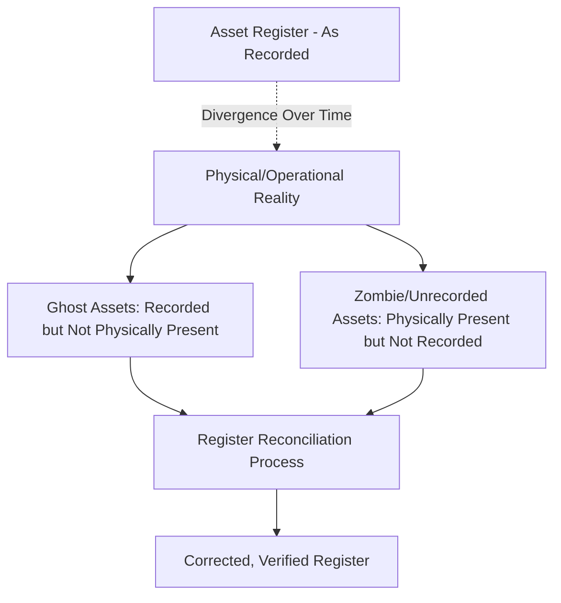
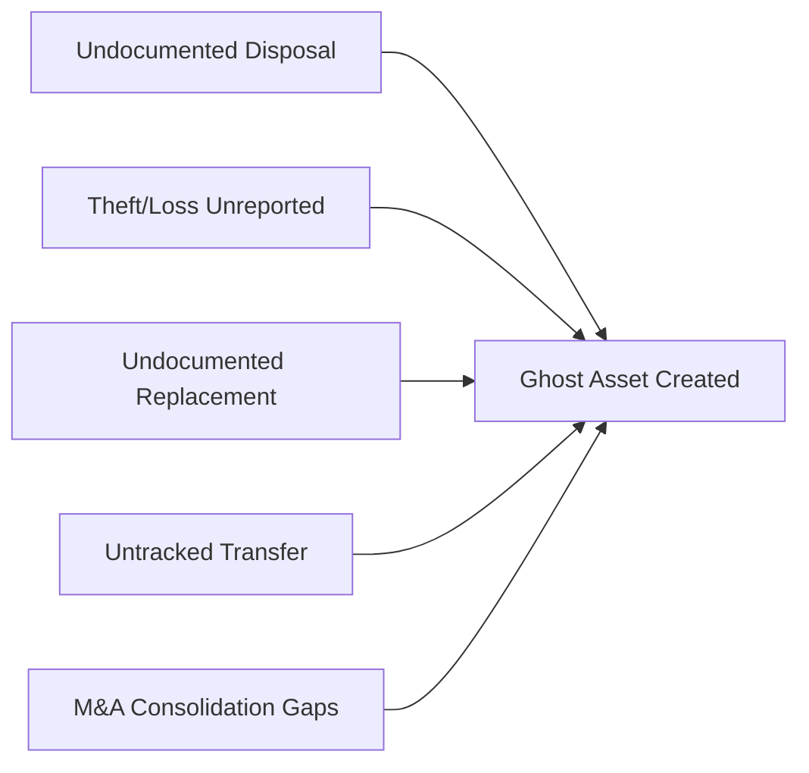
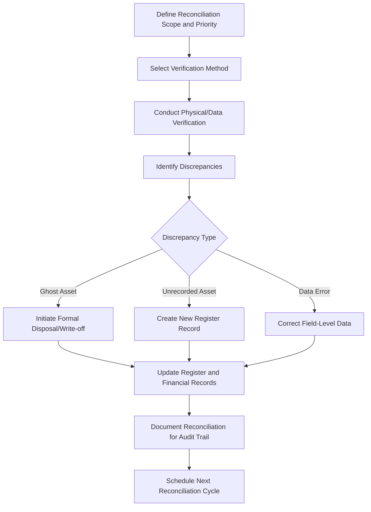

## Ghost Assets, Data Quality, and Register Reconciliation

### Definition and Scope

Ghost assets, data quality degradation, and register reconciliation together describe the ongoing problem of divergence between an organization's asset register and physical/operational reality, along with the systematic processes used to detect and correct that divergence. Where prior topics addressed *building* a sound register, this topic addresses the reality that even well-designed registers degrade over time without active maintenance—and the specific techniques used to restore and preserve register integrity.

### Defining Ghost Assets

**Key Points**

- A **ghost asset** is an asset that remains listed as active in the asset register (and often continues to be depreciated, insured, maintained, or budgeted for) but no longer physically exists, has been disposed of, stolen, scrapped, or replaced without a corresponding register update
- Ghost assets are a specific category of data quality failure distinct from simple data entry errors—they represent assets whose *lifecycle event* (disposal, theft, replacement) was never captured in the register, leaving a stale record that continues to generate downstream consequences
- The inverse problem—physically present assets with no corresponding register record—is sometimes termed an **unrecorded or "zombie" asset**, and is equally damaging to register integrity though it manifests differently

### How Ghost Assets Accumulate

**Key Points**

- **Undocumented disposal**: assets scrapped, sold, or discarded without following the formal disposal workflow that should trigger register deactivation
- **Theft or loss**: particularly common for high-value, portable assets (IT equipment, tools, vehicles) that disappear without a corresponding incident report reaching the asset register owner
- **Undocumented replacement**: an asset is swapped out during emergency repair or informal maintenance without the replacement being properly logged against the correct functional location, leaving the old asset record active and orphaning the new asset entirely (directly connecting to the functional location/asset linkage concepts discussed earlier)
- **Departmental transfers without record updates**: assets physically relocated between business units or sites without the corresponding ownership and location fields being updated in the register
- **Mergers, acquisitions, and reorganizations**: consolidating asset registers from multiple predecessor organizations frequently surfaces large numbers of ghost assets that were never reconciled during the transition

### Consequences of Ghost Assets

**Key Points**

- **Financial misstatement**: continuing to depreciate or carry book value for non-existent assets distorts balance sheet accuracy and can create audit findings under financial reporting standards
- **Unnecessary insurance premiums**: insuring assets that no longer exist wastes budget on coverage providing no actual risk transfer value
- **Wasted maintenance planning effort**: work orders, inspections, or preventive maintenance schedules generated against ghost assets waste planner time and can distort maintenance KPI reporting (e.g., artificially inflating "scheduled maintenance completion" denominators)
- **Distorted capital planning**: criticality assessments, decision-making criteria, and renewal forecasting that include ghost assets produce inaccurate portfolio-level risk and investment projections
- **Compliance and audit exposure**: under ISO 55001, inaccurate documented information undermines the "assurance" fundamental and can constitute an audit nonconformity if discovered during certification review
- [Inference] The cumulative financial impact of ghost assets—spanning misstated depreciation, wasted insurance, and misallocated maintenance effort—is frequently cited across asset management and fixed-asset auditing literature as a materially significant hidden cost for large asset-intensive organizations, though the specific magnitude is highly organization-dependent and no single universal percentage or dollar-impact figure applies reliably across all portfolios or industries.

### Data Quality Degradation Beyond Ghost Assets

**Key Points**

Ghost assets are the most visible symptom of a broader data quality degradation problem, which also includes:

- **Stale condition/inspection data**: condition ratings or inspection dates that have not been updated despite scheduled reassessment intervals passing
- **Incorrect classification drift**: assets reclassified informally by field staff without following governed classification change procedures, creating inconsistency with the formal taxonomy
- **Duplicate records**: the same physical asset represented by multiple register entries, often arising from parallel data entry across departments or system migrations
- **Orphaned functional location assignments**: assets linked to functional locations that no longer exist or have been restructured, breaking the location-based reporting integrity discussed in the asset hierarchy topic
- **Incomplete mandatory fields**: records missing critical data (criticality rating, installation date, responsible owner) that were never fully populated during initial data entry

### Register Reconciliation: Process Overview

**Key Points**

Reconciliation is the systematic process of comparing the asset register against independent sources of truth (physical verification, financial records, other departmental systems) to identify and correct discrepancies.

#### 1. Physical Verification/Walkdown

Field teams physically inspect assets against register records, confirming existence, condition, location, and identifying tag/label status. Most reliable but most resource-intensive method, typically prioritized for high-value or high-criticality asset classes first.

#### 2. Cross-System Data Reconciliation

Comparing the asset register against financial fixed-asset ledgers, procurement/purchasing records, insurance schedules, and departmental spreadsheets to identify assets present in one system but absent from another—directly addressing the ISO 55010 financial/non-financial silo problem at the data level.

#### 3. Sampling-Based Verification

For very large asset populations where full physical verification is impractical, statistically representative sampling can estimate the overall ghost asset rate and data quality level, informing whether a full reconciliation effort is warranted and helping prioritize which asset classes need attention first.

#### 4. Exception-Based Detection

Automated data quality rules flag likely problem records without requiring physical verification: assets with no maintenance activity recorded for an implausibly long period, assets whose depreciation has fully lapsed but remain listed as active, or duplicate records sharing identical serial numbers or locations.

**Example**

A manufacturing organization conducting its first formal reconciliation might prioritize its top 20% of asset value (following a Pareto-style approach), physically verify that subset via walkdown, cross-reference the remaining 80% against financial and procurement records for exception flags, and use statistical sampling to estimate the residual ghost asset rate across low-value consumable-type assets that don't justify full physical verification.

### Governance to Prevent Recurrence

**Key Points**

- **Mandatory disposal workflows**: no asset should be physically removed, scrapped, or sold without a corresponding register deactivation step built into the formal process, with accountability assigned to a specific role
- **Change-triggered register updates**: relocation, replacement, and major modification events should be structurally linked to required register updates (e.g., a work order for asset replacement cannot be closed until the register reflects the new asset and retires the old one)
- **Periodic reconciliation cadence**: establishing a recurring reconciliation schedule (e.g., annual physical verification for critical assets, biennial for standard assets) rather than treating reconciliation as a one-time cleanup project
- **Data stewardship accountability**: as discussed in the master asset register topic, assigning clear ownership for specific data domains makes it far more likely that lifecycle events are captured promptly rather than accumulating into a future reconciliation burden
- **Exception reporting dashboards**: implementing automated, recurring data quality exception reports (stale records, missing fields, orphaned locations) allows issues to be caught incrementally rather than discovered only during periodic full reconciliations

### Relationship to Financial Auditing and ISO 55001

**Key Points**

- Ghost asset elimination is a long-standing concern in traditional fixed-asset accounting and financial auditing, predating and existing independently of the ISO 55000 framework, but the two disciplines are strongly complementary
- Under ISO 55001, register accuracy is directly tied to the "documented information" requirements distributed across multiple clauses, and reconciliation evidence (physical verification records, discrepancy logs, correction audit trails) serves as auditable proof that the organization's asset management system maintains the data integrity underpinning its decision-making
- [Inference] Organizations that already conduct rigorous financial fixed-asset audits are likely to have partially addressed ghost asset issues from a financial-value perspective, but this does not guarantee equivalent data quality in the technical/engineering attributes (condition, criticality, functional location) that ISO 55001 and broader ALM practice depend on, since financial audits typically focus on value existence and correct depreciation rather than full technical data completeness.

### Common Pitfalls

**Key Points**

- **Treating reconciliation as a one-time cleanup rather than an ongoing discipline**: without embedded governance and recurring cadence, ghost assets and data quality issues re-accumulate after an initial cleanup effort
- **Reconciling only high-value assets**: while risk-based prioritization is reasonable, entirely ignoring lower-value asset classes allows systemic process failures (e.g., broken disposal workflows) to continue generating new ghost assets undetected
- **No root-cause correction**: fixing discovered discrepancies without addressing the underlying process failure (e.g., correcting a ghost asset record without fixing the disposal workflow that allowed it) guarantees recurrence
- **Underestimating cross-departmental reconciliation complexity**: reconciling finance, engineering, and operational records often surfaces genuine definitional disagreements (e.g., what counts as "disposed") requiring governance resolution, not just data correction

### Conclusion

Ghost assets and broader data quality degradation represent the natural entropy that asset registers experience without active governance, arising primarily from undocumented disposal, replacement, transfer, and loss events. Reconciliation—through physical verification, cross-system comparison, sampling, and exception-based detection—provides the systematic correction mechanism, but sustainable data quality ultimately depends on preventive governance: mandatory disposal and change-triggered update workflows that stop new ghost assets from being created in the first place, rather than relying solely on periodic cleanup efforts. [Unverified] The appropriate reconciliation frequency, verification method mix, and acceptable data quality thresholds vary considerably by asset criticality, portfolio size, and regulatory context, and no single universal reconciliation cadence or methodology has been established as best practice applicable uniformly across all organizations.

**Related Topics**

- Designing and Populating a Master Asset Register
- Asset Identification, Tagging, and Naming Conventions
- Asset Hierarchies and Functional Location Structures
- ISO 55010 and the Alignment of Financial and Non-Financial Functions
- Data Governance for Asset Performance Traceability
- Fixed Asset Accounting and Depreciation Reconciliation
- ISO 55013 and Guidance on Data Asset Management
- Asset Disposal and Decommissioning Workflow Design