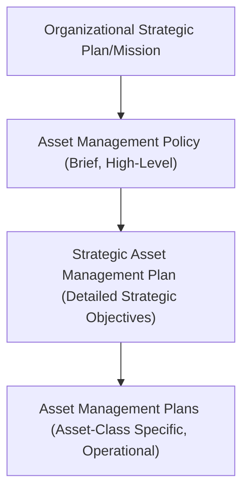
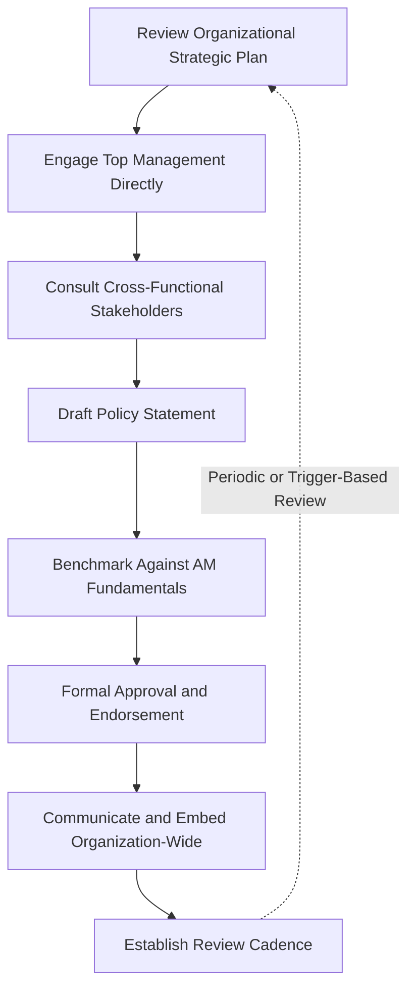

## Developing an Organizational Asset Management Policy

### Definition and Position within the Governance Hierarchy

An organizational asset management policy is a brief, high-level statement of intent and direction, formally approved by top management, that establishes the organization's commitment to sound asset management practice and provides the overarching framework within which the Strategic Asset Management Plan (SAMP) and subsequent Asset Management Plans (AMPs) are developed. It is the topmost document in the asset management documentation hierarchy under ISO 55001, and its existence and quality are directly assessed under Clause 5 (Leadership).

The policy is not a technical or operational document—it does not specify how assets will be managed in detail—but rather establishes *why* the organization manages assets the way it does and what principles will govern all subsequent, more detailed planning.

### Purpose and Function of the Policy

**Key Points**

- Establishes formal, visible **top management commitment** to asset management, satisfying the "Leadership" fundamental from ISO 55000
- Provides the **mandate and authority** under which the asset management function operates, resourcing decisions are made, and organizational roles are established
- Sets the **guiding principles** (risk appetite, value priorities, sustainability commitments) that the SAMP must translate into specific, measurable objectives
- Serves as a **communication tool**, signaling to all levels of the organization—and to external stakeholders such as regulators, investors, or customers—that asset management is a genuine strategic priority rather than a peripheral technical function
- Functions as **audit evidence** during ISO 55001 certification, demonstrating that leadership commitment is documented, not merely assumed

### Core Content Typically Addressed in an Asset Management Policy

**Key Points**

While no single mandatory template exists, well-constructed policies typically address the following elements concisely:

| Policy Element | Purpose |
| --- | --- |
| Statement of commitment | Top management's explicit endorsement of asset management as a strategic priority |
| Alignment with organizational objectives | Explicit linkage to the organization's mission, vision, and strategic goals |
| Guiding principles | Core values governing asset decisions (e.g., safety-first, sustainability, value optimization, risk tolerance) |
| Scope statement | The breadth of assets and organizational units the policy applies to |
| Commitment to compliance | Legal, regulatory, and standards commitments (e.g., ISO 55001 conformance) |
| Commitment to continual improvement | Acknowledgment that the asset management system will be reviewed and improved over time |
| Roles and accountability framework reference | High-level acknowledgment of where asset management authority and responsibility sit |
| Review commitment | Statement of how often the policy itself will be reviewed and reaffirmed |

### Recommended Characteristics: Brevity and Clarity

**Key Points**

- Policy documents should be concise—commonly one to two pages—in deliberate contrast to the more detailed technical content appropriate for the SAMP
- The policy should be written in **plain, accessible language**, since it is intended to be understood and internalized across all organizational levels, not just by asset management specialists
- It should be **stable over time**: unlike the SAMP (which may be refreshed annually as strategic objectives evolve), the policy is intended to reflect enduring organizational principles and should not require frequent rewriting
- It must be **formally approved and visibly endorsed** by top management (typically board-level or C-suite signature), reinforcing the leadership commitment principle rather than being delegated entirely to a technical department

### Development Process

**Example**

1. **Review organizational mission, vision, and strategic plan** — the policy must be demonstrably derived from and consistent with the organization's overarching strategic direction, not developed in isolation by the asset management function
2. **Engage top management directly** — since genuine leadership commitment (not merely signature approval) is the objective, policy development should involve substantive executive discussion of asset management principles and risk appetite, not simply present a pre-written document for rubber-stamping
3. **Consult key internal stakeholders** — engineering, operations, finance, risk, safety, and sustainability functions should have input, ensuring the policy's guiding principles reflect genuine cross-functional consensus rather than a single department's perspective (avoiding the ISO 55010 silo problem at the very top of the governance hierarchy)
4. **Draft the policy statement** — applying the brevity and clarity principles above, typically iterating through several drafts with executive review
5. **Benchmark against ISO 55000 fundamentals and, where relevant, sector norms** — ensuring the policy reflects the value, alignment, leadership, and assurance fundamentals in substance, even without using ISO terminology explicitly
6. **Formal approval and endorsement** — securing documented sign-off from the appropriate top management authority (board, CEO, or equivalent, depending on organizational governance structure)
7. **Communicate and embed** — actively disseminating the policy across the organization (not merely publishing it in a document repository), ensuring staff at all levels can articulate its core commitments
8. **Establish review cadence** — defining how often the policy will be formally reviewed (commonly every three to five years, or triggered by major organizational or strategic change)

### Example Policy Structure (Illustrative Template)

**Example**

A representative asset management policy might be structured as follows:

> **[Organization Name] Asset Management Policy**
>
> [Organization Name] is committed to managing its assets to deliver safe, reliable, and sustainable value in support of its mission to [organizational mission statement]. This commitment is achieved through:
>
> - Prioritizing the safety of our employees, customers, and the communities we serve in all asset-related decisions
> - Optimizing the balance of cost, risk, and performance across the full asset lifecycle
> - Ensuring asset management decisions are demonstrably aligned with our organizational strategic objectives
> - Complying with all applicable legal, regulatory, and safety requirements
> - Continually improving our asset management system through structured planning, monitoring, and review
> - Ensuring all personnel understand their role in delivering effective asset management
>
> This policy applies to all assets under [Organization Name]'s management and is reviewed every [X] years or upon significant change to organizational strategy.
>
> Approved by: [Top Management Signature] Date: [Date]

This structure deliberately avoids technical prescription, focusing instead on principle-level commitments that the SAMP will subsequently operationalize into specific, measurable objectives.

### Distinguishing the Policy from the SAMP

**Key Points**

- The policy states *that* the organization is committed to sound asset management and *what principles* will govern it; the SAMP states *how* organizational objectives will be translated into specific asset management objectives and *how* AMPs will be developed
- The policy is typically stable for years; the SAMP is expected to be refreshed on a regular cycle (often annually) as strategic priorities and portfolio conditions evolve
- Confusing the two—producing an overly detailed, technical "policy" document, or a vague, aspirational "SAMP" lacking measurable objectives—is a common structural error that weakens the overall governance hierarchy's coherence and can create certification audit findings

### Common Pitfalls in Policy Development

**Key Points**

- **Delegating policy development entirely to the asset management department**: without genuine executive engagement, the resulting document may satisfy the letter of the ISO 55001 requirement while failing to reflect authentic leadership commitment—a gap frequently exposed during certification audit interviews, as discussed in the ISO 55002 certification pitfalls topic
- **Generic, templated language with no organizational specificity**: policies copied from generic templates without genuine adaptation to the organization's actual mission, risk profile, and stakeholder context read as hollow compliance exercises rather than authentic commitments
- **Overly technical or lengthy content**: including operational detail, specific KPIs, or technical procedures in the policy blurs the distinction from the SAMP and undermines the policy's intended stability and accessibility
- **Infrequent communication after initial approval**: a policy that is approved once and then never actively referenced, discussed, or reinforced in organizational communication fails to achieve genuine cultural embedding, regardless of its written quality
- **No defined review trigger**: policies that are never revisited become stale as organizational strategy evolves, creating a growing disconnect between the policy's stated principles and the SAMP's actual objectives

### Conclusion

Developing an effective organizational asset management policy requires balancing brevity and accessibility against genuine substantive content, and—most critically—securing authentic top management engagement rather than treating the policy as a compliance formality. As the foundational document anchoring the entire asset management governance hierarchy, the policy's quality directly influences whether the "Leadership" fundamental from ISO 55000 is genuinely satisfied or merely superficially documented, with downstream consequences for how convincingly the organization can demonstrate alignment during ISO 55001 certification and, more importantly, for whether asset management genuinely functions as a strategic priority in practice. [Unverified] The optimal policy length, review frequency, and level of stakeholder consultation depth vary by organizational size, sector, and governance culture, and no single universal template guarantees genuine leadership commitment, since that ultimately depends on organizational behavior beyond what any document alone can establish.

**Related Topics**

- The Strategic Asset Management Plan and Its Role in the Standard
- ISO 55001 Requirements for an Asset Management System
- ISO 55002 Implementation Guidance and Common Certification Pitfalls
- Value Realization and Line of Sight to Organizational Objectives
- ISO 55010 and the Alignment of Financial and Non-Financial Functions
- Organizational Roles and Accountability in Asset Management Governance
- Decision-Making Criteria and Weighted Prioritization Frameworks
- Continual Improvement and Policy Revision Cycles