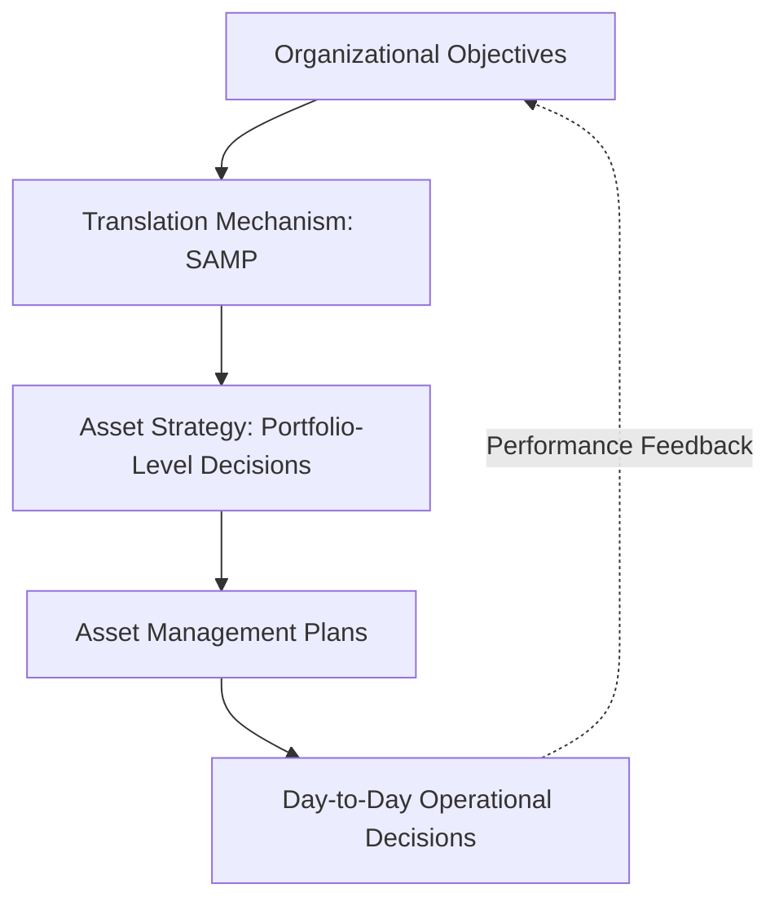
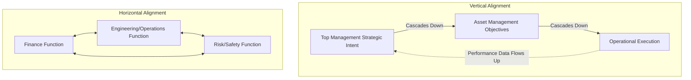
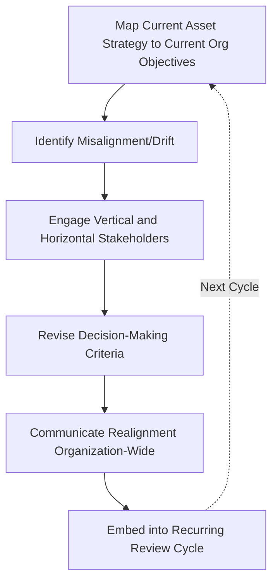

## Aligning Asset Strategy with Organizational Objectives

### Definition and Conceptual Foundation

Aligning asset strategy with organizational objectives is the deliberate, structured process of ensuring that every level of asset-related decision-making—from portfolio-wide capital planning down to individual maintenance task selection—demonstrably serves the organization's broader strategic goals. This is the practical execution of the "Alignment" fundamental from ISO 55000 and directly operationalizes the value realization and line-of-sight concepts established earlier: alignment is what makes line of sight *real* rather than merely documented.

While the asset management policy establishes the principle of alignment and the SAMP documents the intended translation mechanism, this topic addresses the ongoing analytical and organizational discipline required to keep asset strategy genuinely synchronized with organizational objectives as both evolve over time.

### Why Alignment Requires Active Management, Not Just Documentation

**Key Points**

- Organizational objectives are not static: mergers, regulatory shifts, market disruption, technology change, and leadership transitions all alter strategic priorities over time
- Asset portfolios have long lifecycles (often decades for infrastructure), meaning assets acquired under one strategic context frequently continue operating under substantially different strategic conditions
- Without active realignment, asset strategy can drift into **strategic obsolescence**—assets and asset management plans that remain internally well-executed but increasingly disconnected from what the organization actually needs
- [Inference] This drift risk is arguably greater in asset-intensive, long-lived-infrastructure sectors than in asset-light, fast-moving sectors, since the mismatch between asset lifespan and strategic planning cycles is structurally larger; this is a reasonable inference from the differing time horizons involved rather than a claim backed by cross-sector quantitative comparison.

### The Vertical and Horizontal Dimensions of Alignment

Consistent with the alignment framing introduced in ISO 55010, achieving genuine strategy-to-asset alignment requires attention along two axes.

- **Vertical alignment**: ensuring strategic intent flows accurately downward into operational decisions, and that operational performance data flows accurately back upward to inform strategic review—breaking down either direction of this flow undermines genuine alignment even if documentation appears complete
- **Horizontal alignment**: ensuring different functions (finance, engineering, risk, safety, sustainability) share a consistent understanding of organizational priorities and apply consistent decision-making criteria, rather than each function pursuing locally optimal but organizationally inconsistent asset decisions

### Mechanisms for Achieving and Maintaining Alignment

#### 1. Decision-Making Criteria as the Alignment Mechanism

**Key Points**

- Formally documented, weighted decision-making criteria (introduced in the SAMP discussion) are the primary practical mechanism translating strategic priorities into consistent operational choices
- When organizational objectives shift, the decision-making criteria weightings should be among the first elements revisited, since they directly determine how competing asset investments are prioritized

$$\text{Investment Priority} = w_1(\text{Strategic Objective A Contribution}) + w_2(\text{Strategic Objective B Contribution}) + \ldots$$

**Example**

If an organization's strategic priorities shift from pure cost minimization toward sustainability leadership, the weighting $w$ applied to environmental impact in the investment priority formula should increase correspondingly—and this recalibration should be traceable to the specific strategic decision that prompted it, not left as an informal or inconsistently applied adjustment.

#### 2. Line-of-Sight Traceability Documentation

**Key Points**

- Maintaining an explicit, documented mapping (introduced earlier as the value chain from strategic objective to individual asset) allows any asset management decision to be traced back to the specific organizational objective it serves
- This traceability should be bidirectional: not only can a strategic objective be decomposed downward to specific asset activities, but asset performance data should be aggregable upward into metrics that directly report against strategic objectives

#### 3. Governance Review Cycles

**Key Points**

- Regular, structured review points—SAMP refresh cycles, management reviews under ISO 55001 Clause 9, stage-gate reviews for major capital projects—provide the formal occasions where alignment is deliberately re-examined rather than assumed to persist automatically
- [Inference] Organizations that rely solely on informal or ad hoc realignment (waiting for visible misalignment to surface as a problem) are likely more prone to accumulated strategic drift than those with scheduled, proactive review cycles, though the specific review frequency that best balances thoroughness against administrative burden depends on how quickly an organization's strategic context typically changes.

#### 4. Cross-Functional Governance Structures

**Key Points**

- Asset investment steering committees, capital planning boards, or similar cross-functional governance bodies that include both strategic/executive and technical/operational representation help ensure horizontal alignment is maintained at the point of actual decision-making, not merely documented in planning artifacts
- These structures provide a forum where finance, engineering, risk, and strategic planning perspectives are reconciled before major asset decisions are finalized, directly addressing the horizontal alignment dimension

### Practical Process for Assessing and Improving Alignment

**Example**

1. **Map current asset strategy against current organizational objectives** — conduct an explicit exercise tracing existing AMPs and major capital plans back to the specific strategic objectives they are intended to serve, identifying gaps or orphaned initiatives with no clear strategic linkage
2. **Identify misalignment or drift** — flag asset management activities that no longer clearly serve any current strategic objective (candidates for deprioritization or divestment) and strategic objectives with no corresponding, adequately resourced asset management activity (candidates for new investment)
3. **Engage stakeholders across the vertical and horizontal dimensions** — validate findings with both executive leadership (vertical) and cross-functional technical teams (horizontal) to build shared understanding of where realignment is needed
4. **Revise decision-making criteria and resource allocation** — update the SAMP's weighted prioritization framework and reallocate capital planning priorities to reflect the corrected alignment
5. **Communicate the realignment** — ensure operational teams understand not just *what* has changed in priorities but *why*, reinforcing the vertical information flow
6. **Embed into the ongoing review cycle** — ensure this alignment assessment becomes a recurring element of the SAMP refresh and management review process rather than a one-time corrective exercise

### Indicators of Poor Alignment

**Key Points**

- Front-line asset managers or maintenance staff cannot articulate how their work connects to organizational strategic goals, even in general terms (a diagnostic technique noted in the ISO 55002 certification pitfalls discussion)
- Capital investment decisions are made primarily based on departmental advocacy strength, historical precedent, or the loudest recent failure, rather than consistent application of documented decision-making criteria
- Asset management objectives in the SAMP read as generic aspirations ("optimize performance," "improve reliability") without specific, traceable linkage to named organizational strategic goals
- Performance reporting exists at the operational level (uptime, cost, work order completion) but is never aggregated or translated into terms meaningful to executive strategic review
- Different departments maintain inconsistent or contradictory understandings of which asset investments are currently highest priority

### Common Pitfalls

**Key Points**

- **Treating alignment as achieved once and permanent**: failing to recognize that organizational objectives evolve, requiring genuinely recurring realignment effort rather than a single foundational exercise
- **Vertical-only focus**: investing heavily in top-down strategic communication while neglecting the upward flow of operational performance data needed to validate whether strategic assumptions about asset performance are actually correct
- **Horizontal misalignment masked by vertical documentation**: an organization can have an excellent, well-documented SAMP while finance and engineering functions continue applying inconsistent, unreconciled criteria in actual practice—documentation quality does not guarantee behavioral alignment
- **Change without communication**: revising decision-making criteria or strategic priorities at the executive level without adequately communicating the change downward, leaving operational teams continuing to apply outdated prioritization logic
- **No feedback mechanism**: lacking a structured way for operational and technical staff to surface emerging risks or opportunities that should inform strategic-level reconsideration, breaking the bottom-up half of vertical alignment

### Conclusion

Aligning asset strategy with organizational objectives is not a static achievement documented once in a SAMP, but an ongoing discipline requiring active maintenance across both vertical (strategy-to-operations-and-back) and horizontal (cross-functional) dimensions. The practical mechanisms—weighted decision-making criteria, bidirectional line-of-sight traceability, structured governance review cycles, and cross-functional decision-making bodies—exist precisely because genuine alignment degrades naturally over time as organizational objectives evolve faster than long-lived asset portfolios can be restructured. Organizations that treat alignment as a recurring governance discipline, with explicit mechanisms for detecting and correcting drift, are better positioned to sustain the value realization outcomes that asset management ultimately exists to deliver. [Unverified] The specific frequency and formality of realignment review that best suits a given organization depends heavily on the pace of strategic change in its sector and its asset portfolio's typical lifespan, and no universal review cadence or realignment methodology has been established as optimal across all organizational contexts.

**Related Topics**

- Developing an Organizational Asset Management Policy
- The Strategic Asset Management Plan and Its Role in the Standard
- Value Realization and Line of Sight to Organizational Objectives
- ISO 55010 and the Alignment of Financial and Non-Financial Functions
- Decision-Making Criteria and Weighted Prioritization Frameworks
- Management Review Processes Under Clause 9
- Organizational Roles and Accountability in Asset Management Governance
- Asset Criticality Classification and Risk Ranking