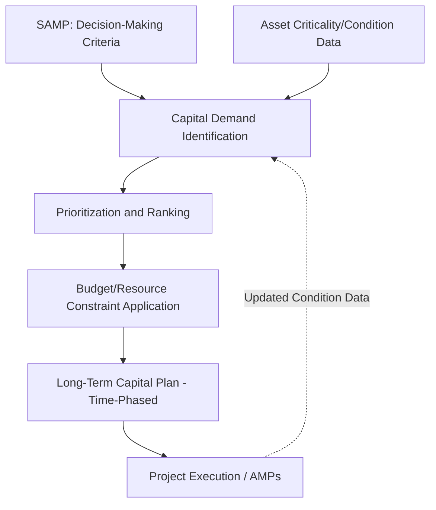
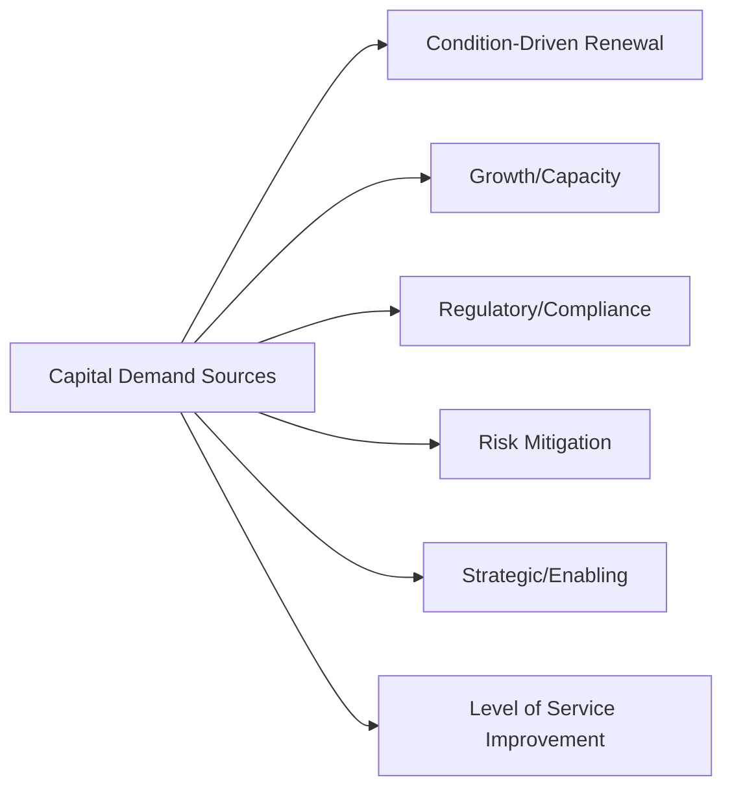
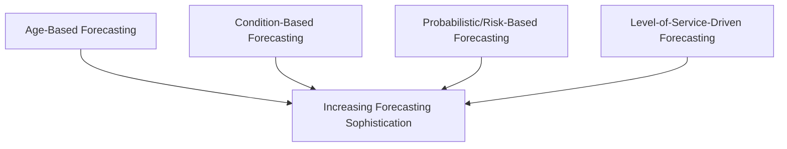
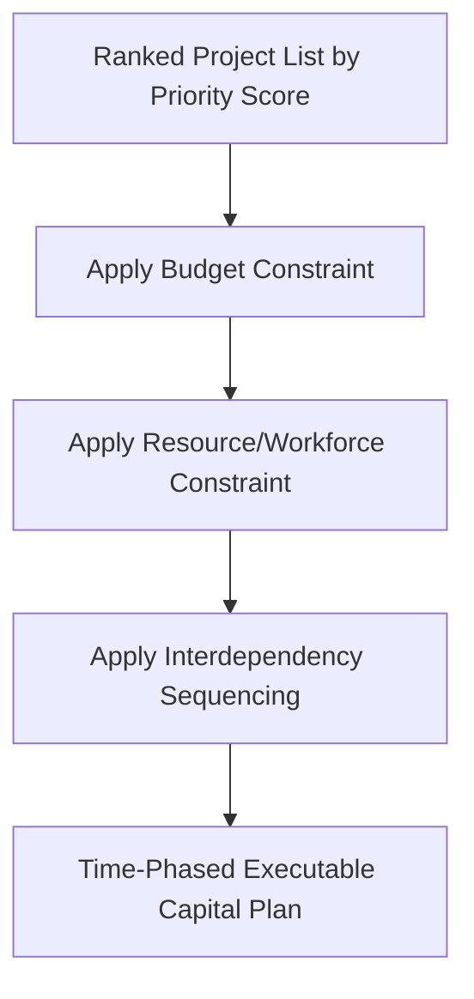

## Long-Term Capital Planning and Investment Prioritization

### Definition and Role within Asset Lifecycle Management

Long-term capital planning and investment prioritization is the structured process of forecasting future asset investment needs across an extended time horizon (typically 10 to 30+ years for infrastructure-intensive organizations) and systematically ranking competing capital projects and renewal decisions against consistent, documented criteria. It is the mechanism through which the SAMP's decision-making criteria are operationalized into an actual, resourced, time-phased program of asset investment—the point where strategic alignment and asset criticality assessment converge into concrete budget commitments.

Where the SAMP establishes *how* decisions should be prioritized in principle, long-term capital planning applies that framework to the organization's actual, current portfolio of competing investment needs to produce an executable, resource-constrained plan.

### Sources of Capital Investment Demand

**Key Points**

Long-term capital plans must aggregate demand from multiple distinct drivers, each with different urgency profiles and justification logic:

- **Condition-driven renewal**: assets approaching or exceeding useful life, or exhibiting degraded condition, requiring replacement or major refurbishment
- **Growth/capacity investment**: new assets required to meet increasing demand, service area expansion, or new service offerings
- **Regulatory/compliance-driven investment**: mandated upgrades required to meet new legal, safety, or environmental standards
- **Risk mitigation investment**: capital deployed specifically to reduce identified high-consequence risks, even where the underlying asset is not yet at end of useful life
- **Strategic/enabling investment**: capital supporting new capabilities or strategic initiatives not directly tied to replacing or expanding existing asset function (e.g., digital transformation infrastructure)
- **Level of service improvement**: investment intended to raise service quality or performance above current baseline, distinct from simply maintaining existing service levels

### Forecasting Methodologies

**Key Points**

#### Age-Based / Useful-Life Forecasting

Projects renewal needs based on installation date and expected useful life, generating a simple but often unrealistic "replacement wall" if a large cohort of assets was installed in the same era (common in post-war infrastructure booms). Simple to calculate but ignores actual condition variability within an asset class.

#### Condition-Based Forecasting

Uses current condition assessment data and degradation modeling to project when assets will reach a defined intervention threshold, producing more accurate and typically smoother investment timing than pure age-based approaches, but requiring mature condition monitoring data to be reliable.

$$\text{Remaining Useful Life} = f(\text{Current Condition}, \text{Degradation Rate}, \text{Intervention Threshold})$$

#### Probabilistic / Risk-Based Forecasting

Incorporates failure probability distributions (rather than deterministic single-point estimates) to model a range of possible investment timing and cost scenarios, often using Monte Carlo simulation approaches to express capital needs as a probability-weighted range rather than a single forecast figure.

#### Level-of-Service-Driven Forecasting

Works backward from a target service outcome (e.g., a maximum acceptable failure rate, minimum system availability) to calculate the capital investment rate required to sustain that target, directly linking capital planning to the value realization and line-of-sight framework established earlier.

### Prioritization Frameworks

**Key Points**

Once capital demand is identified and forecast, competing projects must be ranked against one another using consistent criteria, typically the weighted decision-making framework established in the SAMP.

$$\text{Project Priority Score} = w_1(\text{Risk Reduction}) + w_2(\text{Strategic Alignment}) + w_3(\text{Financial Return/Cost Avoidance}) + w_4(\text{Regulatory Urgency}) + w_5(\text{Level of Service Impact})$$

**Example**

A transit authority comparing a signal system upgrade (regulatory-driven, high safety consequence, moderate cost) against a station accessibility improvement (strategic/level-of-service driven, moderate community benefit, moderate cost) and a depot expansion (growth-driven, high cost, multi-year benefit horizon) would apply consistent weighted scoring across all three—despite their very different natures—to produce a single rank-ordered priority list rather than evaluating each in a separate, incomparable silo.

#### Common Prioritization Techniques

- **Weighted scoring/multi-criteria decision analysis (MCDA)**: as illustrated above, combining multiple weighted factors into a composite score
- **Cost-benefit analysis / Net Present Value (NPV)**: comparing the discounted financial value of benefits against costs, particularly suited to projects with clearly quantifiable financial returns

$$NPV = \sum_{t=0}^{n} \frac{CF_t}{(1+r)^t}$$

where $CF_t$ is the net cash flow in period $t$ and $r$ is the discount rate

- **Risk-cost-benefit optimization**: explicitly modeling the trade-off between deferring investment (accepting elevated failure risk and potential consequence cost) versus accelerating investment (incurring capital cost sooner than strictly necessary)
- **Portfolio optimization / mathematical programming**: for large, complex portfolios, using optimization techniques to maximize aggregate value subject to budget and resource constraints across many candidate projects simultaneously

### Constraint Application: From Ranked List to Executable Plan

**Key Points**

- A prioritized project list must be tested against real-world constraints: available capital budget, workforce/contractor capacity, supply chain lead times, and permitting/regulatory approval timelines
- **Budget-constrained scheduling**: applying the annual (or multi-year) capital budget ceiling to the ranked project list, typically funding projects in priority order until the budget is exhausted, deferring lower-priority projects to future years
- **Resource-constrained scheduling**: even with sufficient budget, organizations may be limited by the physical capacity to execute multiple major projects simultaneously (specialized labor, contractor availability, outage windows), requiring sequencing adjustments beyond pure financial prioritization
- **Interdependency sequencing**: some projects must occur in a specific order (e.g., upgrading a substation before the distribution lines it feeds can be expanded), requiring the plan to respect logical dependencies rather than pure priority-score ordering

### Long-Term Planning Horizon Structuring

**Example**

Mature capital plans typically structure the planning horizon into tiers of decreasing certainty:

1. **Committed/near-term (Years 1-2)**: fully budgeted, detailed project scope, high confidence in cost and timing
2. **Planned/medium-term (Years 3-5)**: reasonably well-defined scope and cost estimate, subject to routine annual refinement as the project approaches
3. **Forecast/long-term (Years 6-15+)**: high-level, often aggregate rather than project-specific, based on condition/age forecasting models, subject to significant revision as conditions and priorities evolve
4. **Strategic outlook (Years 15-30+)**: directional investment trend projections for long-lived infrastructure classes, informing long-range financial and rate/tariff planning rather than specific project commitments

### Scenario Planning and Sensitivity Analysis

**Key Points**

- Given the inherent uncertainty in long-horizon forecasting, mature capital planning practice incorporates **scenario analysis**—modeling capital plan outcomes under varying assumptions (accelerated deterioration, budget constraint changes, demand growth variations, regulatory change)
- **Sensitivity analysis** identifies which input assumptions most significantly affect plan outcomes, focusing data quality improvement efforts on the assumptions that matter most rather than uniformly improving all input data
- [Inference] Organizations with more mature asset data (condition-based rather than purely age-based forecasting) generally produce more reliable scenario outputs, since probabilistic and condition-based models propagate uncertainty more realistically than deterministic age-based models; the specific improvement in forecast accuracy attributable to data maturity has not been established as a standardized, quantified benchmark applicable across all sectors.

### Governance and Approval

**Key Points**

- Long-term capital plans typically require formal governance approval at a level commensurate with their financial magnitude—board approval for major multi-year capital programs, with delegated authority for smaller, routine renewal projects
- Capital planning should be explicitly linked to the annual SAMP refresh cycle and management review process (ISO 55001 Clause 9), ensuring the plan is periodically re-validated against current strategic objectives rather than executed on autopilot from an outdated baseline
- Documentation of the prioritization methodology and criteria weightings should be maintained as auditable evidence, both for internal governance accountability and for ISO 55001 certification purposes

### Common Pitfalls

**Key Points**

- **"Squeaky wheel" prioritization**: allowing recent visible failures or vocal departmental advocacy to override consistent, documented decision-making criteria, undermining the entire purpose of a formal prioritization framework
- **Age-based forecasting without condition validation**: relying purely on installation date projections without incorporating actual condition data can produce dramatically inaccurate capital demand forecasts, particularly for asset classes with wide condition variability at similar ages
- **Ignoring resource constraints**: producing a financially feasible plan that is not actually executable due to workforce, contractor, or supply chain capacity limits, leading to chronic project deferral and credibility erosion of the planning process
- **Static, infrequently updated plans**: treating a long-term capital plan as fixed once approved, rather than as a living forecast requiring regular refinement as new condition data, cost information, and strategic priorities emerge
- **Underinvestment in the "boring middle" of the portfolio**: prioritization frameworks can inadvertently favor either highly visible, high-consequence Tier 1 assets or cheap, easy wins, systematically underfunding moderate-criticality assets that collectively represent significant aggregate risk

### Conclusion

Long-term capital planning and investment prioritization is the operational culmination of the asset management planning hierarchy, translating the SAMP's decision-making criteria and asset criticality data into an actual, resource-constrained, time-phased program of capital investment. Its effectiveness depends on forecasting methodology maturity (condition-based and probabilistic approaches generally outperforming simple age-based projection), disciplined application of consistent prioritization criteria rather than reactive or politically-driven decision-making, and realistic incorporation of budget, workforce, and supply chain constraints into an executable rather than merely aspirational plan. [Unverified] The optimal planning horizon length, tiering structure, and forecasting methodology sophistication vary substantially by asset class longevity, industry regulatory context, and organizational data maturity, and no single universal capital planning framework has been established as best practice applicable identically across all asset-intensive sectors.

**Related Topics**

- The Strategic Asset Management Plan and Its Role in the Standard
- Asset Criticality Classification and Risk Ranking
- Decision-Making Criteria and Weighted Prioritization Frameworks
- Aligning Asset Strategy with Organizational Objectives
- Total Cost of Ownership (TCO) and Lifecycle Costing Models
- Renewal, Refurbishment, and Replacement Decision Frameworks
- Risk-Based Capital Planning and Investment Prioritization
- Predictive Maintenance and IoT-Based Condition Monitoring