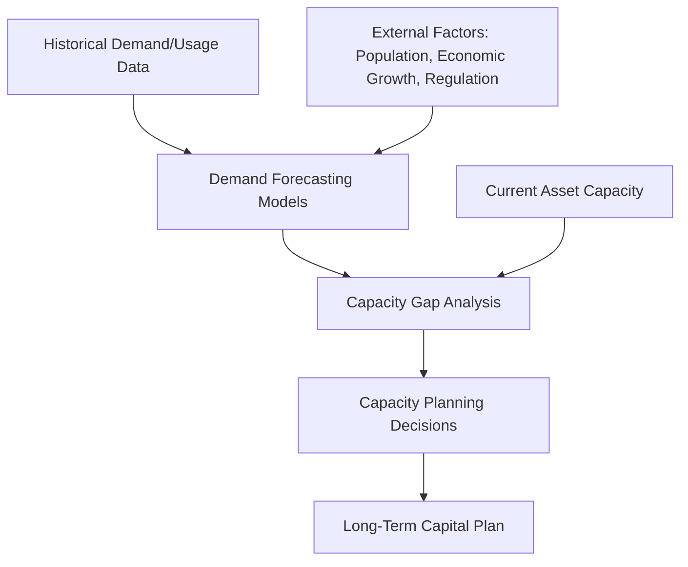
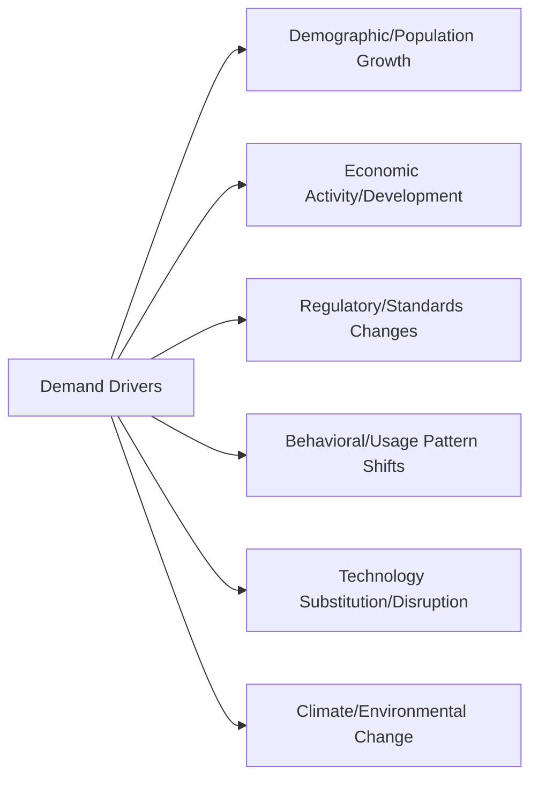
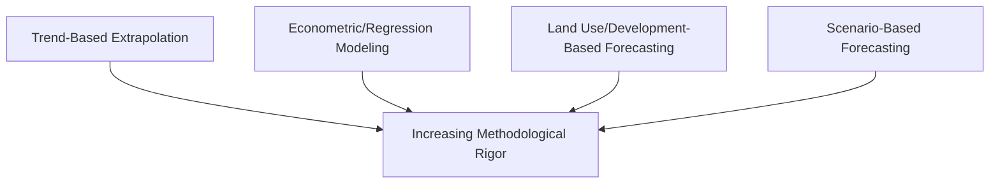
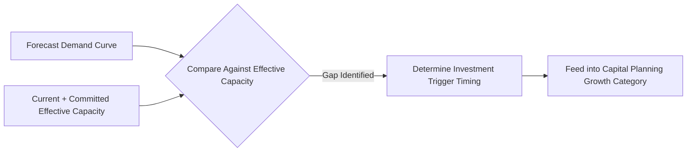
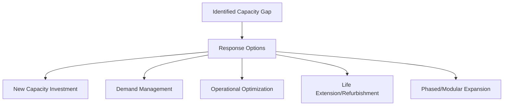

## Demand Forecasting and Capacity Planning for Assets

### Definition and Position within Asset Lifecycle Management

Demand forecasting and capacity planning is the discipline of projecting future service or output requirements and determining the asset capacity needed to meet those requirements over time, without over- or under-investing relative to actual need. Where long-term capital planning (covered previously) addresses *how to prioritize and fund* asset investment once a need is established, demand forecasting addresses the upstream question of *whether and when* new capacity is actually required in the first place—distinguishing genuine growth-driven investment need from condition-driven renewal need.

This distinction matters because conflating the two—treating capacity expansion decisions with the same logic as like-for-like asset renewal—frequently leads to either premature overinvestment in capacity that is never fully utilized, or reactive, poorly planned expansion undertaken only after service failure has already occurred.

### Distinguishing Demand Forecasting from Condition-Based Renewal Forecasting

**Key Points**

- **Condition-based renewal forecasting** (introduced in the capital planning topic) asks: "when will this existing asset need to be replaced due to degradation?"
- **Demand forecasting** asks: "will the existing asset base—even if fully functional—still be sufficient to meet future service requirements?"
- An asset can simultaneously be in excellent physical condition and functionally inadequate due to insufficient capacity relative to growing demand, or conversely, be deteriorating but still adequately sized for a shrinking or stable demand base
- [Inference] Organizations that apply only condition-based renewal logic without separate demand forecasting risk either replacing aging assets on a like-for-like basis into a capacity shortfall that recurs almost immediately, or conversely over-building capacity into a declining-demand environment; this is a reasonable inference from the conceptual distinction between the two forecasting types rather than a claim backed by a specific cross-industry study.

### Categories of Demand Drivers

**Key Points**

- **Demographic/population growth**: relevant to utilities, transportation, healthcare, and public infrastructure where service area population directly drives demand
- **Economic activity and development**: industrial, commercial, or residential development driving increased load on power, water, transportation, or telecommunications infrastructure
- **Regulatory and standards changes**: new emissions standards, safety codes, or service level mandates that effectively increase required capacity even without underlying usage growth
- **Behavioral and usage pattern shifts**: changing consumer or user behavior (e.g., electric vehicle adoption affecting electricity grid load patterns, remote work affecting commercial building space demand) that can shift demand independent of population change
- **Technology substitution/disruption**: emerging technologies that either increase demand on certain asset classes (data center power demand from AI infrastructure) or decrease demand on others (declining demand for certain legacy telecommunications infrastructure)
- **Climate and environmental change**: shifting precipitation patterns affecting water infrastructure capacity needs, or increasing extreme weather frequency affecting resilience-related capacity requirements

### Forecasting Methodologies

#### Trend-Based Extrapolation

Projects future demand based on historical growth rates, simplest to apply but assumes continuation of past patterns, which can be unreliable during periods of structural change (economic disruption, technology shifts, demographic inflection points).

#### Econometric/Regression-Based Modeling

Models demand as a function of measurable independent variables (population, GDP, housing starts, employment), allowing forecasts to be updated as underlying driver projections change, and enabling scenario analysis by varying driver assumptions.

$$\text{Demand}_t = \beta_0 + \beta_1(\text{Population}_t) + \beta_2(\text{Economic Activity}_t) + \epsilon_t$$

#### Land Use / Development-Based Forecasting

Common in utilities and municipal infrastructure planning, projecting demand based on planned or zoned land development, building permits, and municipal growth plans rather than purely historical trends—particularly valuable for capturing known future development that historical trend data would not yet reflect.

#### Scenario-Based Forecasting

Given genuine uncertainty in long-range demand drivers, developing multiple explicit scenarios (low/medium/high growth, or scenario-specific narratives such as "accelerated electrification" versus "baseline") rather than a single point forecast, allowing capacity planning to explicitly account for a plausible range of futures.

**Example**

A regional water utility forecasting future demand might combine econometric modeling (using historical correlation between population growth and water consumption) with land-use-based forecasting (incorporating known approved but not-yet-built residential developments) and scenario analysis (modeling both a "continued suburban growth" scenario and a "densification/lower per-capita consumption" scenario), presenting capacity planners with a forecast range rather than a single deterministic number.

### Capacity Gap Analysis

**Key Points**

- Capacity gap analysis compares forecast future demand against current and committed asset capacity across the planning horizon, identifying the timing and magnitude of any projected shortfall
- This analysis should account for **effective capacity** (accounting for redundancy requirements, maintenance downtime allowances, and safety margins) rather than theoretical maximum capacity, since operating at theoretical maximum leaves no margin for planned or unplanned outages
- Gap analysis outputs directly feed the "growth/capacity investment" category of capital demand identified in long-term capital planning, with timing derived from when the forecast demand curve is projected to intersect available effective capacity

### Capacity Planning Response Strategies

**Key Points**

Once a capacity gap is identified, several strategic responses are available, not all of which involve new asset construction:

- **New capacity investment**: constructing or acquiring additional asset capacity to meet the projected gap directly
- **Demand management**: influencing usage patterns to reduce or reshape demand rather than expanding supply-side capacity (e.g., time-of-use pricing to shift electricity demand away from peak periods, water conservation programs)
- **Operational optimization**: improving the utilization efficiency of existing assets through better scheduling, load balancing, or process improvement, effectively increasing usable capacity without new capital investment
- **Asset life extension/refurbishment**: extending the effective capacity life of existing assets through refurbishment rather than replacement, deferring the need for full capacity expansion
- **Phased/modular expansion**: incrementally adding capacity in smaller increments aligned closely with actual demand realization, reducing the risk of stranded/underutilized capacity compared to large, discrete capacity additions

**Example**

An electricity distribution utility facing a projected substation capacity shortfall in a growing suburban area might evaluate: building a new substation (new capacity), implementing demand response programs with large commercial customers (demand management), upgrading transformer cooling systems to increase existing equipment's rated capacity (operational optimization), or phasing substation expansion in modular increments tied to actual new-connection uptake rather than building full ultimate capacity immediately (phased expansion)—with the final decision informed by relative cost, risk of over/under-building, and lead time considerations for each option.

### Managing Forecast Uncertainty

**Key Points**

- Long-range demand forecasts carry inherent and often substantial uncertainty, particularly beyond a five-to-ten-year horizon; capacity planning must explicitly account for this rather than treating point forecasts as certain
- **Real options thinking**: structuring capacity investments to preserve future flexibility (e.g., designing a facility with expansion capability rather than fixed final capacity) can reduce the cost of forecast error compared to committing to large, inflexible capacity additions based on uncertain long-range projections
- **Trigger-based planning**: rather than committing to a fixed capacity expansion date based on a point forecast, establishing monitored demand thresholds that trigger the next phase of investment when actually reached, reducing exposure to both premature and delayed investment
- [Inference] Phased and trigger-based approaches generally reduce the financial risk of forecast error compared to large discrete capacity investments based on long-range point forecasts, though phased approaches can carry higher per-unit construction costs due to lost economies of scale, meaning the optimal approach depends on the specific cost structure and uncertainty profile of the asset class in question rather than being universally superior in all cases.

### Integration with Long-Term Capital Planning

**Key Points**

- Demand forecasting outputs feed directly into the capital demand identification stage of long-term capital planning, specifically informing the "growth/capacity investment" category of capital demand
- The prioritization of growth-driven capacity investment against condition-driven renewal, regulatory-driven, and risk-mitigation-driven investment (the other demand categories from long-term capital planning) occurs through the same weighted decision-making criteria framework, ensuring capacity expansion is evaluated on a comparable basis to other investment types rather than treated as automatically justified simply because demand data supports it

### Common Pitfalls

**Key Points**

- **Relying solely on historical trend extrapolation**: assuming past growth patterns will continue linearly, missing structural shifts (economic disruption, technology substitution, demographic inflection) that trend-based methods cannot anticipate
- **Ignoring effective versus theoretical capacity**: planning against theoretical maximum capacity rather than effective capacity leaves no operational margin, creating service risk even when forecasts appear satisfied on paper
- **Single-point forecasting without scenario range**: presenting capacity decisions based on a single demand forecast number, without acknowledging or planning for forecast uncertainty, leads to either overconfident overbuilding or underprepared shortfall exposure
- **Treating demand forecasting as a one-time exercise**: failing to periodically refresh forecasts against actual observed demand trends, meaning capacity plans become increasingly detached from reality as the planning horizon progresses
- **Neglecting demand management alternatives**: defaulting to new capacity investment as the only response to a projected gap, without evaluating whether demand-side interventions could defer or eliminate the need for capital expenditure at lower cost

### Conclusion

Demand forecasting and capacity planning addresses a distinct question from condition-based asset renewal: not whether existing assets are physically adequate, but whether the asset base as a whole will be sufficient to meet evolving future service requirements. Effective practice requires selecting forecasting methodology appropriate to data maturity and demand driver complexity, conducting rigorous capacity gap analysis against effective (not theoretical) capacity, evaluating the full range of response strategies beyond simple new-build expansion, and explicitly managing the substantial uncertainty inherent in long-range demand projections through scenario planning and flexible, trigger-based investment approaches. [Unverified] The optimal forecasting methodology sophistication, planning horizon, and response strategy mix vary considerably by sector, demand driver volatility, and asset class characteristics, and no single universal demand forecasting framework has been established as best practice applicable identically across all asset-intensive industries.

**Related Topics**

- Long-Term Capital Planning and Investment Prioritization
- Aligning Asset Strategy with Organizational Objectives
- Asset Criticality Classification and Risk Ranking
- Total Cost of Ownership (TCO) and Lifecycle Costing Models
- Renewal, Refurbishment, and Replacement Decision Frameworks
- Scenario Planning and Real Options Analysis in Asset Investment
- Climate Resilience and Adaptation Planning for Infrastructure Assets
- Predictive Maintenance and IoT-Based Condition Monitoring