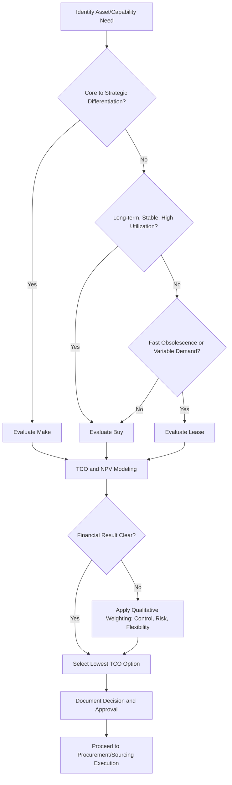

## Make, Buy, or Lease Analysis and Sourcing Strategy

### Overview

Make, Buy, or Lease analysis is a structured decision framework used within asset lifecycle management to determine the optimal acquisition method for an asset or capability. The analysis compares the total cost, risk profile, and strategic fit of three sourcing paths: internally producing/maintaining an asset or capability (Make), purchasing it outright from a third party (Buy), or obtaining usage rights through a lease or rental arrangement (Lease). This decision sits within the broader discipline of Strategic Sourcing and directly informs capital planning, asset acquisition policy, and lifecycle cost management.

### Purpose Within Asset Lifecycle Management

**Key Points**

- Determines the acquisition pathway during the Plan/Acquire phase of the asset lifecycle
- Directly affects capital expenditure (CapEx) versus operating expenditure (OpEx) classification
- Influences balance sheet treatment, particularly under lease accounting standards (ASC 842, IFRS 16)
- Establishes the baseline for total cost of ownership (TCO) tracking throughout the asset's operational life
- Supports portfolio-level asset strategy by aligning acquisition method with asset criticality, utilization, and technology obsolescence risk

### Core Decision Drivers

#### Strategic Fit

- **Core competency alignment**: Assets or capabilities central to competitive advantage are typically retained in-house (Make); non-core, commoditized functions are candidates for Buy or Lease
- **Control requirements**: Regulatory, safety, or IP-sensitive functions often require the control level only Make provides
- **Speed to capability**: Buy or Lease generally accelerates time-to-operation compared to internal build-out

#### Financial Drivers

- **Capital availability**: Constrained CapEx budgets push toward Lease or outsourced Buy models
- **Total Cost of Ownership (TCO)**: Full lifecycle cost comparison, not just acquisition price
- **Tax treatment**: Depreciation schedules (Make/Buy) versus lease expense deductibility differ by jurisdiction and lease classification
- **Residual value risk**: Ownership retains upside/downside of resale value; leasing transfers this risk to the lessor

#### Operational Drivers

- **Utilization rate**: Low or intermittent utilization favors Lease/rental; high, continuous utilization favors ownership
- **Technology obsolescence rate**: Fast-obsolescing assets (IT hardware, specialized equipment) favor Lease to enable refresh cycles
- **Maintenance burden**: Leasing can shift maintenance responsibility to the lessor (operating leases, full-service leases)
- **Scalability needs**: Variable demand favors Lease or Buy-as-a-Service models over fixed Make investment

### The Three Sourcing Pathways

#### Make (Insource/Build)

Internal development, manufacturing, or long-term construction of the asset or capability using organizational resources.

**Key Points**

- Requires upfront capital investment and internal capacity (labor, facilities, expertise)
- Provides maximum control over design, quality, scheduling, and IP
- Full lifecycle responsibility (acquisition, operation, maintenance, disposal) resides internally
- Appropriate when the asset delivers sustained competitive differentiation or when no adequate market alternative exists
- Highest fixed-cost commitment and slowest time-to-availability, typically

#### Buy (Outright Purchase)

Acquiring the asset as a capital purchase, transferring ownership and associated risks to the buying organization at the point of sale.

**Key Points**

- Ownership transfers depreciation rights, residual value, and disposal responsibility to the buyer
- Generally the most cost-efficient path for assets with long useful life and stable, predictable utilization
- Requires upfront capital outlay (or debt financing), impacting balance sheet CapEx
- Full maintenance and lifecycle management burden falls on the owner, unless supplemented by service contracts
- Suitable for high-utilization, long-life, strategically important assets not requiring frequent technology refresh

#### Lease (Operating or Finance)

Obtaining the right to use an asset for a defined period in exchange for periodic payments, without necessarily transferring ownership.

**Key Points**

- **Operating lease**: Shorter-term, lessor typically retains residual risk and often maintenance responsibility; treated as a right-of-use asset with corresponding liability under ASC 842/IFRS 16
- **Finance lease (capital lease)**: Economically resembles ownership; asset and liability recognized on balance sheet, asset depreciated by lessee
- Preserves capital for other investments; converts CapEx to predictable OpEx-like payment streams (though modern standards require balance-sheet recognition for most leases)
- Facilitates technology refresh cycles and reduces obsolescence exposure
- May include bundled maintenance, insurance, or end-of-term upgrade options
- Total payments over the lease term typically exceed the outright purchase price, reflecting the lessor's financing and risk margin

### Comparative Framework

| Dimension | Make | Buy | Lease |
| --- | --- | --- | --- |
| Upfront capital | Highest | High | Low to none |
| Balance sheet impact | CapEx, depreciation | CapEx, depreciation | Right-of-use asset/liability (ASC 842/IFRS 16) |
| Control over asset | Full | Full | Partial to full (finance lease) |
| Obsolescence risk | Borne internally | Borne internally | Often transferred to lessor |
| Maintenance responsibility | Internal | Internal (or contracted) | Often lessor/bundled |
| Flexibility to exit | Low | Low (resale needed) | High (contract term-based) |
| Best fit | Core, differentiating capability | Long-life, stable-use, strategic assets | Fast-obsolescing, variable-use, capital-constrained scenarios |

### Total Cost of Ownership (TCO) Modeling

A rigorous Make/Buy/Lease decision requires TCO modeling across the full expected holding period, not just initial acquisition cost.

**Key Points**

- Components typically include: acquisition/financing cost, installation/commissioning, maintenance and repair, energy/consumables, downtime cost, insurance, disposal/decommissioning, and residual/salvage value
- Cash flows should be modeled on a consistent time horizon across all three options
- Net Present Value (NPV) is the standard technique to compare options with different payment timing structures

For comparing cash flow streams across options, the discounted cost of each option is calculated as:

$$TCO_{NPV} = \sum_{t=0}^{n} \frac{C_t}{(1+r)^t}$$

Where $C_t$ represents the net cash outflow in period $t$, $r$ is the organization's discount rate (typically weighted average cost of capital), and $n$ is the analysis horizon in periods.

**Example**

Comparing a 5-year Buy versus Lease decision for a fleet vehicle:

- **Buy**: $40,000 upfront, $3,000/year maintenance, $8,000 residual value at year 5
- **Lease**: $0 upfront, $9,500/year lease payment (maintenance included), $0 residual (returned to lessor)

At a 6% discount rate, the Buy option's discounted maintenance stream plus upfront cost, net of discounted residual value, is compared against the discounted sum of five annual lease payments. The option with the lower $TCO_{NPV}$ is financially preferable, though the comparison must still be weighted against qualitative factors (flexibility, technology refresh cadence, balance sheet preference).

### Lease Versus Buy Breakeven Analysis

A simplified breakeven approach identifies the utilization level or time horizon at which Buy becomes more economical than Lease.

$$T_{breakeven} = \frac{P - S}{L - M}$$

Where $P$ is the purchase price, $S$ is the estimated residual/salvage value, $L$ is the annual lease payment, and $M$ is the annual maintenance cost avoided or included under ownership. When the planned holding period exceeds $T_{breakeven}$, ownership (Buy) typically becomes the more cost-effective option, assuming utilization and maintenance assumptions hold. [Inference: actual breakeven points are highly sensitive to financing rates, tax treatment, and residual value forecasts, which vary by asset class and market conditions.]

### Decision Process Flow

### Sourcing Strategy Considerations

#### Vendor and Market Analysis

- **Key Points**
  - Market maturity and competitiveness affect Buy/Lease pricing leverage
  - Supplier financial stability and long-term viability matter for multi-year lease commitments
  - Single-source versus multi-source availability affects negotiating position and supply risk

#### Risk Allocation

- **Key Points**
  - Make retains all technical, schedule, and cost overrun risk internally
  - Buy transfers point-in-time quality/performance risk to the seller (via warranty) but retains ongoing operational risk
  - Lease can transfer residual value risk, obsolescence risk, and sometimes maintenance risk to the lessor, depending on contract structure

#### Contractual Structuring (for Buy and Lease)

- **Key Points**
  - Service Level Agreements (SLAs) define performance and uptime expectations
  - Warranty and maintenance terms should be explicitly reconciled with internal maintenance capability
  - Lease contracts require careful review of end-of-term options: return, renew, or purchase (fair market value vs. fixed-price buyout)
  - Early termination clauses and penalty structures materially affect flexibility value

### Accounting and Regulatory Considerations

**Key Points**

- Under ASC 842 (US GAAP) and IFRS 16, most leases (operating and finance) must be recognized on the balance sheet as a right-of-use asset with a corresponding lease liability, reducing the historical off-balance-sheet advantage of operating leases
- Finance leases are depreciated similarly to owned assets; operating lease expense is generally recognized on a straight-line basis
- Tax treatment of lease payments versus depreciation deductions varies by jurisdiction and should be validated with tax/finance stakeholders before finalizing a sourcing decision [Unverified: specific tax treatment depends on current local tax code, which is outside static reference material and should be confirmed with a qualified tax advisor]

### Integration with Asset Management Policy

**Key Points**

- Make/Buy/Lease criteria should be codified in organizational Asset Acquisition Policy to ensure consistent, auditable decision-making
- Decision thresholds (e.g., dollar value triggers requiring formal TCO analysis) should be defined in policy
- Outcomes feed into the Asset Register and lifecycle cost baseline used for later performance benchmarking (per ISO 55000 asset management principles)
- Recurring review cycles should reassess prior Make/Buy/Lease decisions as utilization, technology, and market conditions evolve

### Common Pitfalls

**Key Points**

- Comparing only upfront acquisition price without full TCO modeling
- Ignoring residual value and disposal cost in ownership scenarios
- Underestimating internal maintenance capability or capacity constraints in Make decisions
- Failing to account for lease-end obligations (return conditions, excess wear/usage penalties)
- Treating the decision as one-time rather than revisiting it at key lifecycle checkpoints (mid-life refresh, contract renewal)

### Related Topics

- Total Cost of Ownership (TCO) Modeling for Physical Assets
- Capital Budgeting and Asset Investment Appraisal
- Lease Accounting Standards (ASC 842 / IFRS 16) Compliance
- Strategic Sourcing and Vendor Risk Management
- Asset Acquisition Policy Development
- Residual Value Forecasting and Depreciation Methods
- Outsourcing and Third-Party Maintenance Contracts
- ISO 55000 Asset Management Framework Alignment