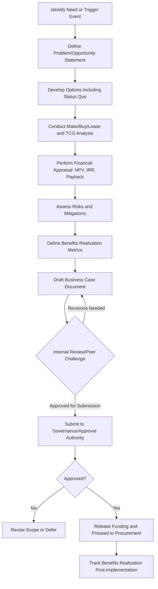

## Building the Business Case for Asset Investment

### Overview

A business case for asset investment is a structured, evidence-based justification presented to decision-makers to secure approval and funding for acquiring, replacing, or upgrading an asset. Within asset lifecycle management, the business case functions as the formal gate between strategic planning and capital commitment, translating operational needs and financial analysis into a decision-ready document that aligns the investment with organizational strategy, risk appetite, and available capital.

### Purpose and Role in the Asset Lifecycle

**Key Points**

- Serves as the formal justification artifact at the Plan/Acquire gate of the asset lifecycle
- Converts identified need (from asset condition assessments, demand forecasts, or strategic plans) into an actionable funding request
- Provides the baseline against which post-investment performance is later measured (benefits realization)
- Supports portfolio-level capital prioritization by enabling like-for-like comparison across competing investment proposals
- Creates an auditable decision trail required for governance, regulatory compliance, and board-level capital approval processes

### Triggers for a Business Case

**Key Points**

- Asset nearing end of useful life or failing condition/performance thresholds identified via condition assessment
- Capacity constraints where current assets can no longer meet demand
- Regulatory or compliance-driven mandates requiring new or upgraded assets
- Strategic initiatives requiring new capability (expansion, new product line, technology modernization)
- Outcome of a Make/Buy/Lease analysis indicating a preferred sourcing path requiring capital approval
- Risk mitigation needs identified through asset risk registers (safety, environmental, reputational exposure)

### Core Components of the Business Case

#### Executive Summary

- **Key Points**
  - Concise statement of the problem, proposed solution, cost, benefit, and recommendation
  - Written last but placed first; must stand alone for time-constrained decision-makers

#### Problem/Opportunity Statement

- **Key Points**
  - Clearly articulates the current-state gap: failing asset performance, capacity shortfall, compliance exposure, or strategic opportunity
  - Should be quantified wherever possible (e.g., downtime hours, failure rate, capacity utilization percentage)

#### Options Analysis

- **Key Points**
  - Presents a "do nothing" baseline (status quo) alongside at least two viable alternatives
  - Frequently incorporates the outputs of Make/Buy/Lease Analysis as candidate options
  - Each option assessed on cost, benefit, risk, and strategic alignment using consistent criteria

#### Financial Analysis

- **Key Points**
  - Quantifies costs and benefits over the asset's expected life using standard capital appraisal techniques
  - Should reconcile with the organization's capital planning and budget cycle
  - Sensitivity analysis on key assumptions (utilization, discount rate, cost escalation) strengthens credibility

#### Risk Assessment

- **Key Points**
  - Identifies implementation risk (schedule, cost overrun, technical), operational risk (post-deployment performance), and risk of inaction (continuing with status quo)
  - Should include a basic risk register with likelihood, impact, and proposed mitigation

#### Benefits Realization Plan

- **Key Points**
  - Defines measurable success criteria and the mechanism/timeline for tracking them post-implementation
  - Distinguishes tangible benefits (cost savings, revenue, avoided downtime) from intangible benefits (safety, reputation, employee experience)

#### Implementation Plan and Timeline

- **Key Points**
  - High-level schedule covering procurement, installation/commissioning, transition, and stabilization phases
  - Identifies resource requirements, dependencies, and key milestones

#### Recommendation and Approval Request

- **Key Points**
  - States the recommended option clearly and the specific approval being sought (funding amount, authority level, timing)

### Financial Justification Techniques

A rigorous business case relies on standard capital appraisal methods to quantify the investment decision in comparable terms.

#### Net Present Value (NPV)

Discounts all projected future cash flows (both costs and benefits) to present value, summing them to determine whether the investment creates net value.

$$NPV = \sum_{t=0}^{n} \frac{CF_t}{(1+r)^t} - C_0$$

Where $CF_t$ is the net cash flow in period $t$, $r$ is the discount rate, $n$ is the analysis horizon, and $C_0$ is the initial investment outlay. A positive $NPV$ indicates the investment is expected to generate value in excess of the cost of capital.

#### Internal Rate of Return (IRR)

The discount rate at which $NPV$ equals zero; used to express investment attractiveness as a percentage comparable across projects.

$$0 = \sum_{t=0}^{n} \frac{CF_t}{(1+IRR)^t} - C_0$$

An investment is generally considered financially attractive when $IRR$ exceeds the organization's hurdle rate (minimum acceptable rate of return, often tied to weighted average cost of capital).

#### Payback Period

The time required for cumulative net benefits to equal the initial investment.

$$Payback\ Period = \frac{C_0}{Average\ Annual\ Cash\ Inflow}$$

Payback period is intuitive for stakeholders but does not account for the time value of money or cash flows occurring after the payback point; it is typically presented alongside NPV/IRR rather than as a standalone justification.

#### Return on Investment (ROI)

$$ROI = \frac{Net\ Benefit}{Investment\ Cost} \times 100$$

**Example**

A manufacturing facility is evaluating replacement of an aging production line costing $500,000, expected to generate $150,000/year in net benefits (efficiency gains plus avoided downtime) over a 5-year horizon, with a 8% discount rate:

- Discounted benefit stream over 5 years at 8% totals approximately $598,900
- $NPV \approx \$598,900 - \$500,000 = \$98,900$ (positive, supporting investment)
- Simple payback period $= \$500,000 / \$150,000 \approx 3.3\ years$

These figures would be presented alongside a sensitivity analysis (e.g., benefit realization at 80% and 120% of forecast) to demonstrate robustness of the recommendation.

### Business Case Development Process

### Stakeholder Engagement and Governance

**Key Points**

- Early engagement with finance, operations, and end-user stakeholders reduces late-stage rework and builds approval consensus
- Capital approval authority thresholds (e.g., departmental manager vs. capital committee vs. board) should be identified early to tailor the level of detail and formality required
- Peer review or independent challenge of assumptions (particularly benefit estimates) improves credibility and reduces optimism bias
- Alignment with the organization's documented Asset Management Policy and Strategic Asset Management Plan (SAMP), consistent with ISO 55001 requirements, strengthens governance defensibility

### Common Pitfalls

**Key Points**

- Overly optimistic benefit estimates without sensitivity analysis (optimism bias)
- Omitting the "do nothing" option, which understates the true comparative cost of inaction
- Underestimating implementation costs (training, integration, transition disruption)
- Failing to define measurable benefits realization criteria, making post-investment tracking impossible
- Treating the business case as a one-time document rather than a living reference updated if scope or assumptions change materially before approval

### Benefits Realization and Post-Investment Review

**Key Points**

- Actual performance should be tracked against the business case's projected benefits at defined intervals post-implementation (e.g., 6, 12, 24 months)
- Variances between projected and actual outcomes should feed back into future business case assumptions to improve estimation accuracy over time
- Formal post-implementation reviews support continuous improvement of the organization's capital planning maturity [Inference: the specific review cadence and governance rigor applied varies by organizational maturity and asset criticality, and is not universally standardized.]

### Related Topics

- Make, Buy, or Lease Analysis and Sourcing Strategy
- Capital Budgeting and Portfolio Prioritization
- Life Cycle Costing (LCC) for Asset Investment Decisions
- Risk-Based Asset Investment Planning
- Strategic Asset Management Plan (SAMP) Development under ISO 55001
- Benefits Realization Management
- Condition Assessment and Asset Renewal Triggers
- Capital Approval Governance Frameworks