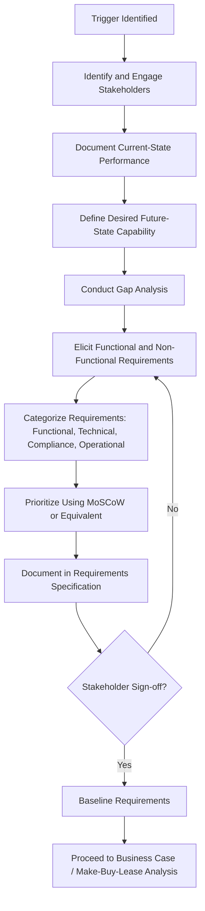

## Needs Assessment and Requirements Definition

### Overview

Needs Assessment and Requirements Definition is the foundational stage of the asset acquisition process, occurring before sourcing, vendor engagement, or procurement activity begins. It systematically identifies the functional, operational, technical, and compliance requirements an asset must satisfy, ensuring that subsequent Make/Buy/Lease decisions, business case development, and procurement specifications are grounded in validated organizational need rather than assumption. Poorly defined requirements at this stage are among the most common root causes of asset acquisition failure, cost overrun, and stakeholder dissatisfaction downstream.

### Purpose and Role in the Asset Lifecycle

**Key Points**

- Precedes and informs the Business Case and Make/Buy/Lease Analysis stages by establishing what the asset must actually do
- Converts operational pain points, strategic objectives, or compliance mandates into structured, verifiable requirements
- Provides the baseline specification against which vendor proposals and acquired assets are later evaluated
- Reduces scope creep, specification mismatch, and post-acquisition rework by capturing stakeholder needs early and formally
- Establishes traceability from organizational strategy through to individual asset specifications, supporting governance and audit requirements

### Triggers for Needs Assessment

**Key Points**

- Asset performance or condition decline identified through condition assessment or maintenance data
- Capacity or throughput shortfall relative to current or forecast demand
- New regulatory, safety, or environmental compliance requirements
- Strategic initiatives requiring new capability (new service line, facility expansion, technology modernization)
- End-of-life or end-of-support notifications from vendors (particularly relevant for IT and technology assets)
- Recurring operational incidents or failure patterns pointing to an underlying asset deficiency

### The Needs Assessment Process

#### Stakeholder Identification and Engagement

- **Key Points**
  - Identify all parties affected by or influential to the asset decision: end users, operations, maintenance, finance, safety/compliance, IT, and executive sponsors
  - Engagement methods include structured interviews, workshops, surveys, and observation of current operations
  - Conflicting stakeholder priorities should be surfaced early and resolved through prioritization frameworks rather than left implicit

#### Current-State Analysis

- **Key Points**
  - Documents existing asset performance, capacity, condition, and known limitations
  - Establishes quantifiable baseline metrics (throughput, downtime, failure rate, utilization) against which the need is measured
  - Identifies root causes of the performance gap rather than only symptoms, often using techniques such as root cause analysis or the "5 Whys"

#### Gap Analysis

- **Key Points**
  - Compares current-state capability against desired future-state capability to define the magnitude and nature of the gap
  - Gap should be expressed in measurable terms (e.g., "current capacity 500 units/day vs. required 750 units/day")
  - Distinguishes gaps addressable by process/operational changes from gaps requiring new or replacement assets

#### Requirements Elicitation and Documentation

- **Key Points**
  - Requirements are gathered, categorized, and documented in a structured requirements register or specification document
  - Ambiguous or conflicting requirements are clarified with stakeholders before finalization
  - Requirements should be validated against strategic objectives to ensure alignment before proceeding to sourcing

### Requirements Categorization

#### Functional Requirements

- **Key Points**
  - Describe what the asset must do: capacity, output, throughput, performance capability
  - Example: "The pump must sustain a flow rate of 500 liters/minute at 40 PSI"

#### Non-Functional (Performance/Quality) Requirements

- **Key Points**
  - Describe how well the asset must perform: reliability, availability, durability, precision, energy efficiency
  - Example: "The system must achieve 99.5% uptime measured monthly"

#### Technical/Interface Requirements

- **Key Points**
  - Compatibility with existing infrastructure, systems, and standards (electrical specifications, communication protocols, physical dimensions/footprint)
  - Integration requirements with existing enterprise asset management (EAM) or SCADA/control systems

#### Compliance and Regulatory Requirements

- **Key Points**
  - Safety standards, environmental regulations, industry certifications (e.g., ISO, OSHA, local building codes)
  - Non-negotiable constraints that any candidate solution must satisfy regardless of cost or performance advantages elsewhere

#### Operational and Support Requirements

- **Key Points**
  - Maintenance accessibility, spare parts availability, training requirements, warranty and vendor support expectations
  - Operating environment constraints (temperature range, space, utility availability)

#### Financial/Budgetary Constraints

- **Key Points**
  - Capital budget ceiling, expected total cost of ownership tolerance, funding cycle timing
  - Should be documented as a boundary condition informing but not overriding functional requirements

### Requirements Prioritization Framework: MoSCoW

A widely used method for prioritizing requirements when trade-offs are necessary due to budget, schedule, or vendor availability constraints.

| Category | Definition | Example |
| --- | --- | --- |
| Must Have | Non-negotiable; solution is unacceptable without it | Regulatory safety certification |
| Should Have | Important but not critical; workarounds possible | Remote monitoring capability |
| Could Have | Desirable if cost/schedule allow | Extended color display options |
| Won't Have (this time) | Explicitly excluded from current scope | Fully automated operation in phase 1 |

**Key Points**

- Prevents "gold-plating" of specifications that inflates cost without proportional value
- Provides an explicit basis for evaluating trade-offs during vendor negotiation if all "should" and "could" requirements cannot be met within budget

### Requirements Definition Process Flow

### Writing Verifiable Requirements

**Key Points**

- Each requirement should be specific, measurable, achievable, and testable — vague statements such as "the asset should be reliable" are unverifiable and should be reworded with a quantifiable threshold
- Use consistent requirement language conventions (e.g., "shall" for mandatory requirements, "should" for recommended) to avoid ambiguity in vendor interpretation
- Each requirement should be traceable to a source (stakeholder, regulation, strategic objective) to support later change control and audit

**Example**

Poorly written requirement: "The generator should be efficient and reliable."

Well-written requirement: "The generator shall achieve a fuel efficiency of no less than 0.35 L/kWh at 75% load and demonstrate a Mean Time Between Failures (MTBF) of at least 8,000 operating hours, verified through manufacturer test data or third-party certification."

### Requirements Traceability

**Key Points**

- A requirements traceability matrix (RTM) links each requirement to its originating need, the specification document, and later the vendor proposal evaluation criteria and acceptance testing criteria
- Supports impact analysis if requirements change mid-process (identifying which downstream evaluation criteria or contract clauses are affected)
- Provides an audit trail demonstrating that the final procured asset meets the originally validated organizational need

### Common Pitfalls

**Key Points**

- Skipping stakeholder engagement and relying solely on the requesting department's perspective, leading to gaps discovered post-acquisition
- Writing requirements around a specific vendor's product rather than the underlying need, which improperly narrows competition and may violate procurement fairness policies
- Over-specifying non-critical requirements ("gold-plating"), inflating cost without proportional value
- Failing to distinguish "must have" from "nice to have," resulting in vendor proposals that are difficult to compare objectively
- Treating requirements as static once documented, rather than subjecting changes to a formal change control process
- Confusing symptoms with root causes during current-state analysis, resulting in requirements that solve the wrong problem

### Related Topics

- Building the Business Case for Asset Investment
- Make, Buy, or Lease Analysis and Sourcing Strategy
- Vendor Evaluation and Request for Proposal (RFP) Development
- Requirements Traceability Matrix (RTM) Management
- Total Cost of Ownership (TCO) Modeling
- Specification Writing and Technical Documentation Standards
- Stakeholder Analysis and Engagement Planning
- Acceptance Testing and Commissioning Criteria