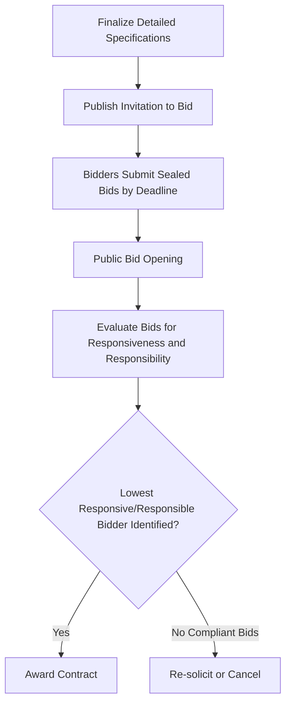
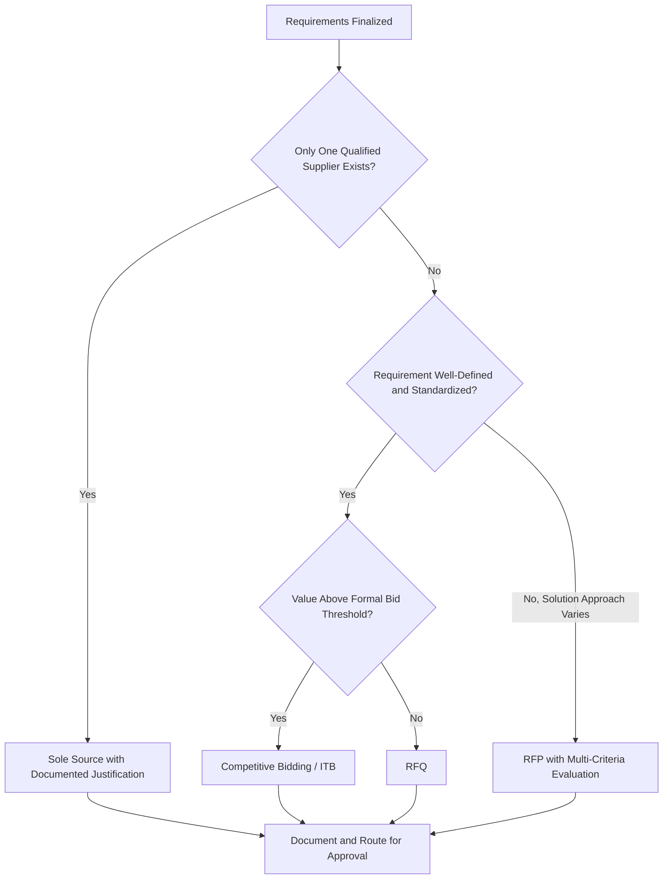

## Procurement Methods including Competitive Bidding, RFP, RFQ, and Sole Source

### Overview

Procurement methods define the formal mechanisms an organization uses to solicit, evaluate, and award contracts for assets, goods, or services once requirements have been defined. The choice of procurement method affects competition level, cycle time, price discovery, supplier relationship structure, and audit/compliance exposure. Within asset lifecycle management, selecting the appropriate procurement method translates validated requirements and the Make/Buy/Lease decision into an actionable, legally sound acquisition process.

### Purpose and Role in the Asset Lifecycle

**Key Points**

- Operationalizes the requirements defined during Needs Assessment into a formal solicitation and award process
- Balances competing objectives: cost minimization, quality assurance, speed, supplier relationship management, and regulatory compliance
- Determines the level of price and quality competition introduced into the acquisition
- Establishes the contractual and legal framework governing supplier obligations, warranties, and performance remedies
- Directly affects procurement cycle time, which in turn impacts asset availability dates and project schedules

### Selecting a Procurement Method: Key Decision Factors

**Key Points**

- **Value/dollar threshold**: Most organizations and public procurement regulations set formal thresholds above which competitive processes (RFP/formal bid) are mandatory
- **Market competitiveness**: Commoditized markets with many qualified suppliers favor competitive bidding or RFQ; specialized or monopolistic markets may necessitate sole source
- **Complexity of requirements**: Well-defined, standardized specifications favor RFQ/competitive bid; complex, solution-based needs favor RFP
- **Urgency**: Emergency or time-critical needs may justify sole source or expedited procurement even where competition would normally be required
- **Regulatory/policy constraints**: Public sector and government-funded procurement is typically governed by statute requiring documented justification for any non-competitive method

### Competitive Bidding (Invitation to Bid / ITB)

A formal process in which the organization solicits sealed price bids from qualified suppliers for a precisely specified good or service, with award typically going to the lowest responsive and responsible bidder.

**Key Points**

- Best suited to well-defined, standardized requirements where quality and specification are fixed and price is the primary differentiator
- Sealed bidding processes typically prohibit negotiation after bid submission, preserving fairness and reducing collusion risk
- Award criteria are generally objective and price-driven, minimizing subjective evaluation
- Common in public sector construction, commodity purchases, and standardized equipment procurement
- Disadvantages include limited flexibility to negotiate scope, terms, or innovative alternatives once bids are submitted

#### Competitive Bidding Process Flow

### Request for Proposal (RFP)

A solicitation method used when the organization knows the problem or need but is open to multiple solution approaches, inviting suppliers to propose both a technical solution and pricing.

**Key Points**

- Appropriate for complex acquisitions where technical approach, methodology, or design varies meaningfully between suppliers
- Evaluation is typically multi-criteria, weighing technical merit, vendor qualifications, and price rather than price alone
- Allows for negotiation, clarification questions, and sometimes vendor presentations/demonstrations before award
- Longer cycle time than RFQ or competitive bid due to the complexity of proposal evaluation
- Common structure includes: statement of need/scope of work, evaluation criteria and weighting, submission requirements, and terms and conditions

#### Typical RFP Evaluation Criteria Weighting

| Criterion | Typical Weight Range | Notes |
| --- | --- | --- |
| Technical approach/solution fit | 30-50% | Assessed against requirements from Needs Assessment |
| Vendor qualifications/experience | 10-20% | Past performance, references, financial stability |
| Price/cost proposal | 20-40% | Often evaluated separately from technical score to reduce bias |
| Implementation timeline | 5-15% | Schedule risk and realism |
| Risk and compliance | 5-15% | Regulatory, safety, warranty terms |

**Key Points**

- Weighting should be defined and documented before proposals are received to preserve evaluation objectivity and defensibility
- Separating technical and price evaluation (technical review completed before price is disclosed to evaluators) is a common practice to reduce anchoring bias

### Request for Quotation (RFQ)

A solicitation method used for well-defined, standardized goods or services where the primary decision variable is price, typically for lower-complexity or lower-value purchases than RFP.

**Key Points**

- Requirements are precisely specified (make, model, quantity, delivery terms), leaving little room for supplier interpretation
- Faster cycle time than RFP due to simplified evaluation, often price and delivery-lead-time driven
- Frequently used for repeat/commodity purchases, spare parts, and standardized equipment
- Multiple quotes are typically solicited to establish price competitiveness and satisfy internal procurement policy documentation requirements

### Sole Source Procurement

Direct award of a contract to a single supplier without a competitive process, justified by specific, documented circumstances.

**Key Points**

- Requires formal, documented justification demonstrating why competition is not feasible or appropriate
- Common justifications include: proprietary technology or intellectual property held by only one supplier, sole authorized dealer/distributor, compatibility with existing installed systems, emergency/urgent operational need, or a supplier possessing unique qualifications unavailable elsewhere
- Carries the highest audit and governance scrutiny among procurement methods due to reduced price/quality competition
- Should include a market analysis or "sole source justification memo" demonstrating due diligence was performed before bypassing competition
- Overuse of sole source procurement is a common audit finding and governance red flag, particularly in public sector and grant-funded environments

**Example**

A hospital requires a replacement component compatible with an existing, proprietary MRI system. The original equipment manufacturer (OEM) is the only entity authorized to supply the compatible component under warranty terms. A sole source justification would document: (1) the technical incompatibility of third-party components, (2) the warranty voidance risk of non-OEM parts, and (3) confirmation that no alternative supplier is authorized to provide an equivalent compatible part.

### Comparative Summary

| Method | Best Fit | Competition Level | Cycle Time | Primary Award Basis |
| --- | --- | --- | --- | --- |
| Competitive Bid (ITB) | Standardized, well-defined specs | High | Moderate | Lowest responsive/responsible price |
| RFP | Complex, solution-based needs | High | Longest | Best value (technical + price) |
| RFQ | Simple, low-complexity, standardized goods | Moderate to High | Shortest | Lowest price among qualified quotes |
| Sole Source | Proprietary, emergency, unique capability | None | Variable | Direct negotiation |

### Procurement Method Selection Decision Flow

### Governance, Fairness, and Compliance Considerations

**Key Points**

- Conflict-of-interest disclosures should be obtained from all individuals involved in evaluation to preserve procurement integrity
- Bid/proposal evaluation criteria must be applied consistently across all suppliers to avoid protest risk or allegations of favoritism
- Public sector procurement is typically governed by statutory thresholds and mandated methods; private sector procurement is generally governed by internal policy but should still maintain documented, defensible processes
- Record retention of solicitation documents, evaluation scoring, and award justification supports audit readiness and protest defense
- Segregation of duties between requisitioner, evaluator, and approver reduces fraud and bias risk

### Common Pitfalls

**Key Points**

- Using RFQ/competitive bid for complex, solution-dependent needs, resulting in non-comparable or low-quality vendor responses
- Writing RFP specifications that inadvertently favor a single vendor's proprietary offering, undermining fair competition
- Insufficient documentation to justify sole source awards, creating audit and legal exposure
- Failing to separate technical and price evaluation in RFPs, allowing price to unduly influence technical scoring
- Setting unrealistic response timelines that discourage qualified suppliers from submitting competitive proposals
- Neglecting to define evaluation criteria and weighting before proposals are received, opening the process to challenge

### Related Topics

- Needs Assessment and Requirements Definition
- Vendor Evaluation and Supplier Qualification
- Contract Negotiation and Terms and Conditions
- Procurement Policy and Governance Frameworks
- Conflict of Interest and Procurement Ethics
- Public Sector Procurement Regulations and Thresholds
- Bid Protest and Dispute Resolution Processes
- Supplier Relationship Management