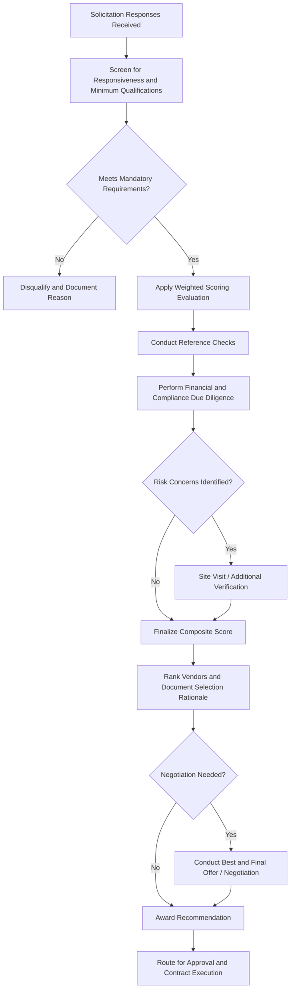

## Vendor Evaluation, Selection, and Due Diligence

### Overview

Vendor Evaluation, Selection, and Due Diligence is the structured process of assessing prospective suppliers against defined criteria to identify the vendor best positioned to fulfill an asset acquisition requirement reliably, compliantly, and at appropriate value. It occurs after procurement solicitation (RFP/RFQ/bid responses received) and before contract award, converting subjective vendor impressions into a documented, defensible selection decision. Rigorous due diligence at this stage mitigates downstream risks including supplier failure, quality non-conformance, financial instability, and compliance exposure.

### Purpose and Role in the Asset Lifecycle

**Key Points**

- Bridges the gap between procurement solicitation (RFP/RFQ/bid) and contract award by systematically comparing supplier responses
- Validates that a vendor's claimed capabilities are real, sustainable, and verifiable before organizational dependency is created
- Reduces supply chain and operational risk by screening for financial instability, quality issues, or compliance gaps before commitment
- Establishes the performance baseline and expectations that will later underpin contract management and vendor performance monitoring
- Provides an auditable record demonstrating that selection was merit-based and defensible against protest or internal audit challenge

### Vendor Evaluation Criteria Framework

#### Technical and Functional Capability

- **Key Points**
  - Degree to which the vendor's proposed solution meets the functional and technical requirements defined during Needs Assessment
  - Assessed through proposal review, technical demonstrations, site visits, or proof-of-concept trials where appropriate

#### Financial Stability

- **Key Points**
  - Assessment of the vendor's ongoing viability as a going concern for the duration of the asset's expected life and any warranty/support period
  - Common indicators include credit ratings, financial statement review (liquidity, debt ratios), Dun & Bradstreet or equivalent business credit reports, and years in business
  - Particularly critical for long-term contracts, sole-source relationships, or vendors providing multi-year maintenance/support commitments

#### Quality and Compliance

- **Key Points**
  - Certifications relevant to the asset class (ISO 9001 quality management, ISO 14001 environmental, industry-specific certifications)
  - Regulatory compliance history, including any past violations, recalls, or sanctions
  - Quality control processes and documented defect/non-conformance rates where available

#### Past Performance and References

- **Key Points**
  - Direct reference checks with prior customers, ideally including at least one reference of comparable scale and complexity
  - Review of past performance on similar contracts, including on-time delivery history and issue resolution track record
  - For public sector vendors, past performance databases or debarment/suspension lists should be checked

#### Operational and Support Capability

- **Key Points**
  - Geographic proximity/service coverage relevant to maintenance response time requirements
  - Availability of spare parts, technical support responsiveness, and training resources
  - Supply chain resilience, including sub-supplier dependencies and single points of failure

#### Pricing and Commercial Terms

- **Key Points**
  - Total cost of ownership implications of pricing structure, not list price alone
  - Payment terms, warranty terms, and any escalation clauses in multi-year agreements
  - Comparison against independent cost benchmarks or engineering estimates to identify outlier pricing (unusually high or unusually low, both of which warrant scrutiny)

### Weighted Scoring Evaluation Model

A structured, weighted scoring model is the standard mechanism for converting multi-criteria vendor evaluation into a comparable, defensible score.

$$Score_{vendor} = \sum_{i=1}^{n} (w_i \times s_i)$$

Where $w_i$ is the weight assigned to criterion $i$ (weights summing to 1 or 100%), and $s_i$ is the vendor's score on that criterion, typically on a standardized scale (e.g., 1-5 or 1-10).

**Example**

| Criterion | Weight | Vendor A Score (1-10) | Weighted | Vendor B Score (1-10) | Weighted |
| --- | --- | --- | --- | --- | --- |
| Technical fit | 35% | 8 | 2.80 | 7 | 2.45 |
| Financial stability | 15% | 6 | 0.90 | 9 | 1.35 |
| Past performance | 20% | 9 | 1.80 | 6 | 1.20 |
| Price competitiveness | 20% | 7 | 1.40 | 8 | 1.60 |
| Support/service capability | 10% | 8 | 0.80 | 7 | 0.70 |
| **Total** | 100% |  | **7.70** |  | **7.30** |

In this example, Vendor A's stronger technical fit and past performance outweigh Vendor B's pricing and financial stability advantage, resulting in a higher composite score. Weighting should be finalized and documented before proposals are opened to preserve evaluation objectivity.

### Due Diligence Process

#### Documentation Review

- **Key Points**
  - Business licenses, insurance certificates, bonding capacity (particularly for construction/installation contracts), and regulatory registrations
  - Financial statements or credit reports, typically for the most recent 2-3 fiscal years
  - Certificate of good standing and confirmation of legal entity status

#### Reference and Background Checks

- **Key Points**
  - Structured reference interviews using standardized questions to enable comparison across vendors
  - Verification of claimed past projects, including confirmation of scope, scale, and outcome with the referenced client
  - Litigation history search and, where relevant, debarment/exclusion list checks (e.g., government exclusion databases)

#### Site Visits and Audits

- **Key Points**
  - Physical inspection of manufacturing facilities, quality control processes, or service capability, particularly for high-value or safety-critical assets
  - Third-party quality audits may be commissioned for critical suppliers where internal audit capability is insufficient

#### Risk Assessment

- **Key Points**
  - Supply chain risk (single-source dependency, geographic/geopolitical exposure, raw material availability)
  - Cybersecurity posture, particularly for vendors providing connected/IoT-enabled assets or requiring system integration access
  - Concentration risk if the vendor represents a disproportionate share of the organization's total procurement spend

### Vendor Evaluation and Selection Process Flow

### Vendor Risk Categorization

**Key Points**

- Vendors are often segmented by criticality and risk exposure to calibrate the depth of due diligence applied (proportionality principle)
- **Strategic/critical vendors**: High spend or high operational dependency; warrant full financial, compliance, and site-visit due diligence
- **Leverage vendors**: High spend but multiple alternative suppliers exist; warrant strong price/commercial scrutiny with moderate risk due diligence
- **Bottleneck vendors**: Low spend but high supply risk (sole source, proprietary); warrant strong continuity/risk due diligence despite low spend
- **Routine vendors**: Low spend, low risk, readily substitutable; warrant lighter-touch due diligence (e.g., basic compliance documentation only)

Applying disproportionate due diligence effort to low-risk, low-value vendors is an inefficient use of procurement resources; the categorization above supports risk-proportionate effort allocation. [Inference: exact segmentation thresholds and labels vary across organizations and procurement frameworks (e.g., Kraljic Matrix terminology), though the underlying proportionality principle is broadly consistent.]

### Negotiation and Award

**Key Points**

- Best and Final Offer (BAFO) rounds may be used in RFP processes to allow shortlisted vendors to refine pricing or terms before final award
- Negotiation should focus on total value (price, warranty, service levels, delivery terms) rather than price alone
- Award decisions and evaluation scoring should be documented in a formal award justification memo, particularly where the lowest-priced bidder was not selected

### Common Pitfalls

**Key Points**

- Relying solely on vendor-provided references, which are inherently selected to be favorable; supplementing with independent reference sourcing improves objectivity
- Underweighting financial stability for long-term or sole-source relationships, creating supply continuity risk if the vendor later becomes insolvent
- Failing to document evaluation scoring rationale, weakening defensibility if a losing vendor challenges the award decision
- Allowing informal relationships or past familiarity to substitute for structured evaluation, introducing bias and audit risk
- Insufficient due diligence depth applied uniformly regardless of vendor risk/spend category, wasting resources on low-risk vendors while under-scrutinizing critical ones
- Overlooking cybersecurity and data access risk when vendors require system integration or remote access to organizational assets

### Related Topics

- Procurement Methods including Competitive Bidding, RFP, RFQ, and Sole Source
- Needs Assessment and Requirements Definition
- Contract Negotiation and Terms and Conditions
- Supplier Relationship Management and Performance Monitoring
- Supply Chain Risk Management
- Vendor Financial Health Assessment Techniques
- Procurement Policy and Governance Frameworks
- Kraljic Matrix and Supplier Segmentation Models