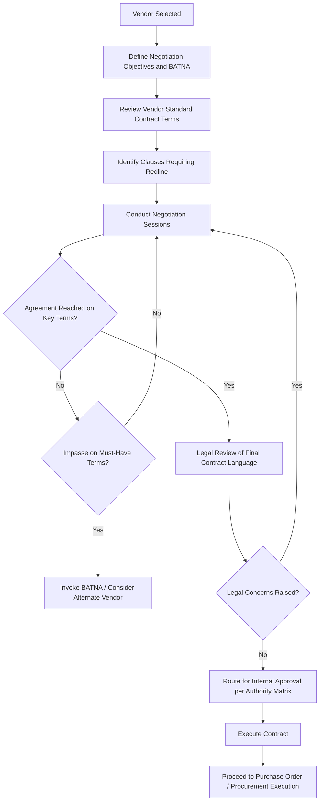

## Contract Negotiation and Terms for Asset Purchases

### Overview

Contract Negotiation and Terms for Asset Purchases is the process of translating a selected vendor's proposal into a legally binding agreement that allocates risk, defines obligations, and protects organizational interests over the asset's acquisition and operational life. This stage follows Vendor Evaluation and Selection and precedes contract execution, procurement finalization, and asset commissioning. Well-structured contract terms materially affect total cost of ownership, warranty recourse, and the organization's ability to enforce performance expectations after the asset is in service.

### Purpose and Role in the Asset Lifecycle

**Key Points**

- Converts the selected vendor's proposal and negotiated terms into an enforceable legal agreement
- Formally allocates risk between buyer and seller across price, performance, delivery, and post-sale support
- Establishes the contractual baseline used later for contract management, warranty claims, and dispute resolution
- Directly affects total cost of ownership through payment terms, warranty scope, and maintenance/service inclusions
- Provides the mechanism to enforce requirements defined during Needs Assessment if the delivered asset fails to conform

### Pre-Negotiation Preparation

**Key Points**

- Establish negotiation objectives and priorities in advance, distinguishing "must achieve" terms from "desirable but tradeable" terms
- Identify the organization's Best Alternative to a Negotiated Agreement (BATNA) — the fallback position if negotiation fails to reach acceptable terms
- Determine internal approval authority limits and escalation path before entering negotiation to avoid overcommitting beyond delegated authority
- Review vendor's standard contract terms in advance to identify clauses requiring redline or negotiation (limitation of liability, indemnification, termination rights)
- Benchmark pricing and terms against market data or prior comparable contracts to establish a negotiation anchor

### Core Contract Terms for Asset Purchases

#### Price and Payment Terms

- **Key Points**
  - Fixed price versus cost-reimbursable structures; fixed price transfers cost overrun risk to the vendor, appropriate for well-defined scope
  - Payment milestones tied to deliverables (e.g., deposit, delivery, commissioning, final acceptance) rather than time-based payment schedules, to preserve leverage
  - Price escalation clauses for long-lead-time or multi-year contracts, typically indexed to a published cost index
  - Currency and exchange rate risk allocation for international vendor contracts

#### Delivery and Performance Schedule

- **Key Points**
  - Specific delivery dates or milestones with clearly defined completion criteria
  - Liquidated damages clauses specifying pre-agreed financial penalties for late delivery, providing a remedy without requiring proof of actual damages in litigation
  - Force majeure provisions defining excusable delay circumstances (natural disasters, labor disputes, supply chain disruption) and notice requirements

#### Warranty Terms

- **Key Points**
  - Warranty period length and scope (parts only, parts and labor, full replacement)
  - Distinction between manufacturer warranty (often narrower, factory-default terms) and negotiated extended warranty
  - Warranty start trigger point (delivery date, installation date, or acceptance date) materially affects effective coverage duration
  - Remedy hierarchy typically specified: repair, replace, or refund, in that order, with defined response time commitments

#### Acceptance Criteria and Testing

- **Key Points**
  - Objective, measurable acceptance criteria tied back to the original requirements specification
  - Factory Acceptance Testing (FAT) and/or Site Acceptance Testing (SAT) procedures for complex equipment, defining pass/fail thresholds
  - Formal acceptance sign-off procedure that triggers final payment release and warranty period commencement

#### Limitation of Liability and Indemnification

- **Key Points**
  - Limitation of liability clauses cap the vendor's financial exposure for damages, often excluding consequential/indirect damages
  - Indemnification clauses allocate responsibility for third-party claims arising from the vendor's negligence, IP infringement, or product defects
  - Buyers should assess whether liability caps are proportionate to the asset's criticality and potential failure consequences, particularly for safety-critical assets

#### Intellectual Property and Data Rights

- **Key Points**
  - Ownership of custom-developed designs, software, or configurations created specifically for the buyer
  - Data ownership and access rights for connected/IoT-enabled assets generating operational data
  - License terms for embedded or bundled third-party software components

#### Maintenance and Support Terms

- **Key Points**
  - Service Level Agreements (SLAs) defining response time, resolution time, and uptime/availability commitments
  - Spare parts availability commitments and pricing terms for the expected asset life
  - Right to use third-party maintenance providers without voiding warranty (particularly relevant given "right to repair" regulatory developments in some jurisdictions)

#### Termination Rights

- **Key Points**
  - Termination for cause (vendor breach, non-performance) versus termination for convenience (buyer's unilateral right to exit, often with defined compensation)
  - Post-termination obligations: transition assistance, return of buyer property, data handoff

### Risk Allocation Summary

| Contract Term | Risk to Buyer if Weak | Typical Mitigation |
| --- | --- | --- |
| Fixed price vs. cost-reimbursable | Cost overrun exposure | Favor fixed price for well-defined scope |
| Liquidated damages | No recourse for late delivery | Pre-agreed daily/weekly penalty rate |
| Warranty start trigger | Shortened effective coverage | Tie warranty start to acceptance, not delivery |
| Limitation of liability cap | Inadequate remedy for major failure | Negotiate cap proportionate to asset criticality |
| Acceptance criteria | Ambiguous non-conformance disputes | Objective, measurable, requirements-linked criteria |
| Termination for convenience | Locked into failing vendor relationship | Negotiate reasonable exit with defined notice period |

### Negotiation Process Flow

### Negotiation Strategies and Tactics

**Key Points**

- **Principled negotiation**: Focus on underlying interests rather than fixed positions, seeking mutually beneficial trade-offs (e.g., trading extended payment terms for a price concession)
- **Bundling and unbundling**: Combining multiple line items or contract years can unlock volume discounts; unbundling maintenance from purchase price improves price transparency
- **Competitive tension**: Maintaining a credible alternative vendor option throughout negotiation preserves leverage, provided the RFP/procurement process legally permits continued comparison
- **Total value framing**: Negotiating on total cost of ownership (including warranty, maintenance, and support terms) rather than headline purchase price alone often yields better long-term outcomes

### Legal and Governance Review

**Key Points**

- Legal counsel review of final contract language is standard practice before execution, particularly for non-standard redlines to vendor paper
- Contract value and risk level typically determine the required internal approval authority (per delegation of authority policy)
- Standard contract templates and pre-approved clause libraries can accelerate negotiation for routine, lower-risk purchases while reserving full legal review for high-value or high-risk agreements

### Common Pitfalls

**Key Points**

- Accepting vendor standard terms without review, particularly limitation of liability and warranty start-trigger clauses that can materially reduce buyer protection
- Negotiating purchase price in isolation without considering total cost of ownership implications of payment terms, warranty scope, and maintenance pricing
- Vague or subjective acceptance criteria, leading to disputes over whether delivered performance satisfies contractual obligations
- Failing to define liquidated damages or delay remedies, leaving the buyer without contractual recourse for late delivery
- Entering negotiation without a defined BATNA, weakening the buyer's position and increasing pressure to accept unfavorable terms
- Overlooking data and IP ownership terms for connected or software-embedded assets, creating disputes over data access post-contract

### Related Topics

- Vendor Evaluation, Selection, and Due Diligence
- Procurement Methods including Competitive Bidding, RFP, RFQ, and Sole Source
- Warranty Management and Claims Processing
- Contract Management and Vendor Performance Monitoring
- Total Cost of Ownership (TCO) Modeling
- Acceptance Testing and Commissioning Criteria
- Service Level Agreement (SLA) Design
- Delegation of Authority and Procurement Governance