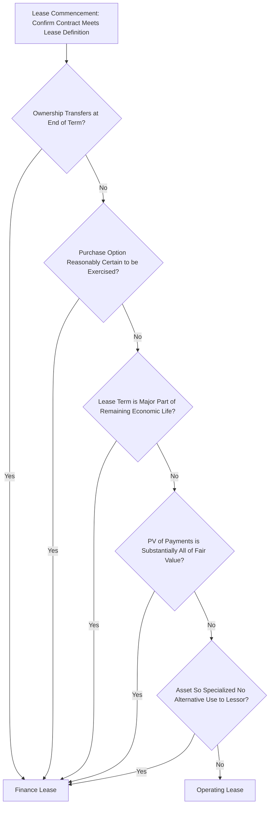

## Capital Lease versus Operating Lease Decisions

### Overview

Capital Lease versus Operating Lease Decisions concerns how an asset acquired through leasing is classified for accounting and financial reporting purposes, and how that classification affects balance sheet presentation, expense recognition timing, and financial ratios. Although "capital lease" was the terminology under the legacy US GAAP standard ASC 840, the concept persists today as the "finance lease" classification under the current standard, ASC 842, and under IFRS 16 for international reporting. This decision is distinct from, but closely related to, the Make/Buy/Lease sourcing decision: once leasing has been selected as the sourcing path, this topic addresses how that lease must be accounted for.

### Terminology Note: Capital Lease to Finance Lease

**Key Points**

- Under the legacy standard ASC 840, leases were classified as either "capital lease" or "operating lease"
- ASC 842, the current FASB lease accounting standard, renamed the "capital lease" classification to "finance lease," though the underlying concept of a lease that transfers the risks and rewards of ownership to the lessee remains the same [FinQuery](https://finquery.com/blog/capital-finance-lease-vs-operating-lease-asc-842/)[FinQuery](https://finquery.com/blog/asc-842-summary-new-lease-accounting-standards/)
- The main substantive difference in updated terminology relates to ownership characteristics, with the classification concept otherwise preserved [Trullion](https://trullion.com/blog/capital-lease-vs-operating-lease/)
- The terms "capital lease" and "finance lease" are frequently used interchangeably in practice and in job/industry terminology, even though "finance lease" is the technically current term under ASC 842

### Why Classification Still Matters Under ASC 842

**Key Points**

- Lease classification determines how expense and income are recognized as well as which assets and liabilities are recorded [FinQuery](https://finquery.com/blog/capital-finance-lease-vs-operating-lease-asc-842/)
- A critical change from the prior standard is that ASC 842 mandates that both finance and operating leases must be on the balance sheet for US GAAP reporting, eliminating the historical off-balance-sheet treatment operating leases previously received [FinQuery](https://finquery.com/blog/capital-finance-lease-vs-operating-lease-asc-842/)
- Before ASC 842, the distinction between operating and capital leases determined whether a liability showed up on the balance sheet at all, but that off-balance-sheet treatment for operating leases no longer applies [Capveri](https://www.capveri.com/resources/operating-lease-vs-finance-lease)
- Despite both lease types now appearing on the balance sheet, the income statement and expense recognition pattern still differs materially between the two classifications [Houseblend](https://www.houseblend.io/articles/asc-842-operating-vs-finance-leases)

### The Five Finance Lease Classification Criteria (ASC 842)

If any of the five criteria in ASC 842-10-25-2 are met, a lessee classifies the lease as a finance lease. If none of the criteria are met, the lease is classified as an operating lease. [PwC](https://viewpoint.pwc.com/dt/us/en/pwc/accounting_guides/leases/leases__4_US/chapter_3_lease_clas_US/33_lease_classificat_US.html)

#### Criterion 1: Ownership Transfer

- **Key Points**
  - If ownership of the leased asset transfers to the lessee when the lease term ends, the contract must be classified as a finance lease, determined by clauses referring to title transfer or automatic ownership conveyance at termination [NS Propertese](https://propertese.com/blog/asc-lease-classification/)
  - Common in equipment leases structured as financed purchases

#### Criterion 2: Purchase Option Reasonably Certain to Be Exercised

- **Key Points**
  - If a lessee is reasonably certain to exercise an option to purchase the asset — particularly if the option is priced attractively (a bargain purchase option) — the lease is classified as finance [NS Propertese](https://propertese.com/blog/asc-lease-classification/)
  - A lease including a bargain purchase option at lease end qualifies as a finance lease under ASC 842 [Trullion](https://trullion.com/blog/capital-lease-vs-operating-lease/)

#### Criterion 3: Lease Term is a Major Part of Remaining Economic Life

- **Key Points**
  - A commonly applied benchmark is that a lease term exceeding roughly 75% of the asset's remaining useful life supports finance lease classification [iLeasePro](https://ileasepro.com/asc-842-lease-classification/)
  - This 75% figure is a benchmark carried over from the prior ASC 840 standard rather than a hard numeric threshold explicitly written into ASC 842 itself [Inference: organizations should apply judgment consistent with their accounting policy and auditor guidance rather than treating 75% as an absolute bright line, since the standard describes this qualitatively as a "major part" of remaining economic life] [iLeasePro](https://ileasepro.com/asc-842-lease-classification/)

#### Criterion 4: Present Value of Lease Payments Represents Substantially All Fair Value

- **Key Points**
  - A commonly applied benchmark is that if the present value of lease payments exceeds roughly 90% of the leased asset's fair value, this supports finance lease classification [iLeasePro](https://ileasepro.com/asc-842-lease-classification/)
  - This test requires selecting an appropriate discount rate, typically the rate implicit in the lease or the lessee's incremental borrowing rate

#### Criterion 5: Asset is So Specialized It Has No Alternative Use to the Lessor

- **Key Points**
  - If an asset is built to the tenant's or lessee's highly specific specification with no alternative use to the lessor at the end of the lease term, this criterion is met [Capveri](https://www.capveri.com/resources/operating-lease-vs-finance-lease)
  - This criterion rarely applies to standard commercial arrangements such as typical office or retail real estate leases, since most such spaces retain alternative use value [Capveri](https://www.capveri.com/resources/operating-lease-vs-finance-lease)

### Lessee Classification Decision Flow

### Accounting Treatment Comparison

| Aspect | Finance Lease | Operating Lease |
| --- | --- | --- |
| Balance sheet | Right-of-use asset and lease liability recognized | Right-of-use asset and liability also recognized (still capitalized under ASC 842) |
| Income statement pattern | Front-loaded expense recognition: separate interest expense (declining) and amortization expense | Straight-line expense recognition over the lease term |
| Expense character | Interest expense + amortization expense (two line items) | Single lease cost recognized on a straight-line basis |
| Lease liability measurement | Present value of lease payments | Measured the same way as for finance leases (present value of lease payments) |
| ROU asset amortization | Amortized similarly to an owned asset (often straight-line over useful life or lease term) | ROU asset reduces as a balancing plug to achieve straight-line total expense |

### Worked Numerical Comparison

**Example**

A hypothetical operating lease with $20,000 total annual expense results in a net ROU asset reduction of $2,682 in Year 1, with total expense of $20,000 recognized straight-line each year. Had the same arrangement instead been classified as a finance lease, Year 1 would show approximately $17,318 in amortization expense plus $4,330 in interest expense, totaling roughly $21,648 — a higher combined expense in the early years of the lease term compared to the operating lease treatment. [US GAAP Buddy](https://usgaapbuddy.com/learn/en/asc-842-operating-vs-finance-lease)[US GAAP Buddy](https://usgaapbuddy.com/learn/en/asc-842-operating-vs-finance-lease)

This illustrates the core practical distinction: finance leases front-load total expense recognition (higher combined interest-plus-amortization cost early in the term, declining over time as the interest component shrinks), whereas operating leases spread the identical cash payment evenly across the term.

### Impact on Financial Statements and Ratios

**Key Points**

- Finance lease classification increases EBITDA relative to operating lease classification, because finance lease costs are split into interest and amortization (both below the operating line), whereas operating lease cost is a single operating expense
- Debt-related financial covenants tied to EBITDA or debt-to-equity ratios can be affected differently depending on classification, even though total lease liability recognition is similar under ASC 842
- Analysts and lenders evaluating leverage ratios should be aware that, unlike under ASC 840, both lease types now appear on the balance sheet, reducing (but not eliminating) the ratio distortion that previously existed between the two classifications [Inference: the degree of remaining ratio impact depends on the specific ratio formula used and whether it separates interest/amortization from straight-line lease expense, which varies by analyst methodology]

### Lessor-Side Classification

**Key Points**

- If any of the five criteria are met, the lessor classifies the corresponding lease as a sales-type lease; if none of the criteria are met, a lessor may classify a lease as a direct financing lease if additional specified criteria are met, and otherwise as an operating lease [PwC](https://viewpoint.pwc.com/dt/us/en/pwc/accounting_guides/leases/leases__4_US/chapter_3_lease_clas_US/33_lease_classificat_US.html)
- Lessor accounting under ASC 842 is substantially unchanged from the legacy ASC 840 standard, retaining the three lessor lease classifications: sales-type, direct financing, or operating [Houseblend](https://www.houseblend.io/articles/asc-842-operating-vs-finance-leases)
- A lease arrangement containing variable lease payments not tied to an index or rate must be classified by the lessor as an operating lease at commencement if classifying it as sales-type or direct financing would otherwise result in recognition of a day-one selling loss [PwC](https://viewpoint.pwc.com/dt/us/en/pwc/accounting_guides/leases/leases__4_US/chapter_3_lease_clas_US/33_lease_classificat_US.html)

### Practical Decision Considerations for Asset Managers

**Key Points**

- Classification is determined at lease commencement based on facts and circumstances at that time, and is generally not revisited unless the lease is subsequently modified
- Organizations should document the classification test results (all five criteria) for each material lease to support audit readiness, since the determination directly drives journal entries and disclosure requirements
- A reporting entity that elects the short-term lease measurement and recognition exemption does not apply the lease classification criteria at all, which can simplify treatment for genuinely short-duration equipment or space leases [PwC](https://viewpoint.pwc.com/dt/us/en/pwc/accounting_guides/leases/leases__4_US/chapter_3_lease_clas_US/33_lease_classificat_US.html)
- Lease modifications (term extension, payment changes, scope changes) generally require reassessment of classification and remeasurement of the lease liability and ROU asset

### IFRS 16 Contrast

**Key Points**

- IFRS 16 differs from ASC 842 in overall approach and resulting outcomes, most notably in that IFRS 16 does not retain a dual operating/finance classification for lessees at all — under IFRS 16, virtually all lessee leases are treated using a single on-balance-sheet model resembling finance lease accounting [Inference: this single-model characterization of IFRS 16 reflects its well-established general design; organizations reporting under both US GAAP and IFRS should confirm current treatment with their accounting standards team, as interpretive guidance can be refined over time] [Houseblend](https://www.houseblend.io/articles/asc-842-operating-vs-finance-leases)
- Multinational organizations managing a mixed lease portfolio should coordinate closely with corporate accounting to ensure consistent treatment where dual reporting (US GAAP and IFRS) is required

### Common Pitfalls

**Key Points**

- Assuming operating lease classification avoids balance sheet impact, a carryover misconception from the pre-ASC 842 era that no longer applies
- Treating the 75% useful-life and 90% fair-value figures as rigid legal thresholds rather than the qualitative benchmarks they represent in practice
- Failing to reassess lease classification after a material lease modification, resulting in incorrect ongoing expense recognition
- Overlooking the lessor-side classification implications when the organization is leasing out its own assets rather than only leasing assets in
- Neglecting to align lease classification decisions with covenant and ratio impacts before executing long-term lease commitments

### Related Topics

- Make, Buy, or Lease Analysis and Sourcing Strategy
- Total Cost of Ownership (TCO) Modeling for Physical Assets
- Contract Negotiation and Terms for Asset Purchases
- Right-of-Use Asset Measurement and Amortization
- IFRS 16 Lease Accounting Fundamentals
- Financial Ratio Impact of Balance Sheet Lease Recognition
- Lease Modification and Remeasurement Procedures
- Asset Depreciation Methods and Useful Life Estimation