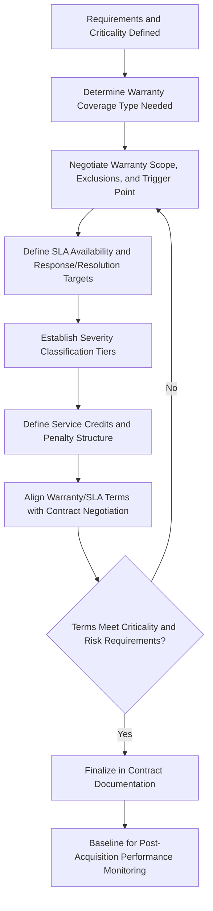

## Warranty Structures and Service Level Agreements at Acquisition

### Overview

Warranty Structures and Service Level Agreements (SLAs) at Acquisition define the post-purchase protections and performance commitments negotiated as part of an asset acquisition, establishing the vendor's obligations for defect remedy, ongoing support, and measurable service performance once the asset enters operation. These provisions are typically finalized during Contract Negotiation but require dedicated technical attention because they materially affect total cost of ownership, operational risk exposure, and the asset's effective availability throughout its lifecycle.

### Purpose and Role in the Asset Lifecycle

**Key Points**

- Establishes the vendor's contractual remedy obligations if the acquired asset fails to perform as specified after acceptance
- Defines the performance floor the asset and its ongoing support must meet, providing an objective basis for post-acquisition vendor accountability
- Directly affects total cost of ownership by determining what maintenance, repair, and downtime costs are borne by the vendor versus the asset owner
- Provides the baseline against which warranty claims and SLA breach remedies are measured during the operate/maintain phase
- Reduces operational risk exposure during the asset's most failure-prone early operating period (infant mortality phase of the bathtub curve)

### Warranty Structures

#### Types of Warranty Coverage

- **Key Points**
  - **Manufacturer's standard warranty**: Factory-default coverage terms set by the original equipment manufacturer (OEM), typically the narrowest and shortest coverage
  - **Extended warranty**: Negotiated or purchased coverage extending beyond the standard manufacturer term, often available at additional cost
  - **Parts-only warranty**: Covers replacement components but excludes labor cost for installation/repair
  - **Parts-and-labor warranty**: Covers both component replacement and the labor required to install it, providing more complete cost protection
  - **Full replacement warranty**: Vendor replaces the entire asset or unit rather than repairing it, typically reserved for lower-cost or high-criticality items

#### Warranty Scope Considerations

- **Key Points**
  - Coverage should be evaluated against the specific failure modes most relevant to the asset class (mechanical wear, electronic component failure, software defects)
  - Exclusions are as important as inclusions: warranties commonly exclude damage from improper use, unauthorized modification, non-OEM parts/consumables, or failure to follow maintenance schedules
  - Consequential damage exclusions are standard in most commercial warranties, meaning downtime or lost production costs are typically not recoverable through warranty claims alone

#### Warranty Trigger Point

- **Key Points**
  - The event that starts the warranty clock materially affects effective coverage duration: delivery date, installation date, commissioning date, or formal acceptance date
  - Tying warranty commencement to formal acceptance (rather than delivery) protects the buyer from losing effective coverage time during installation, commissioning, and testing periods
  - Multi-component systems may have staggered warranty start dates if components are delivered and commissioned at different times, requiring careful contractual clarity

#### Remedy Hierarchy

- **Key Points**
  - Standard warranty remedy sequence is typically repair first, replace if repair is not feasible or repeatedly fails, and refund/credit as a last resort
  - Response time commitments (time to acknowledge a claim, time to begin remedy, time to complete remedy) should be explicitly defined rather than left to vendor discretion
  - Escalation procedures for disputed or unresolved warranty claims should be documented, including any independent inspection or arbitration provisions

### Service Level Agreements (SLAs)

An SLA defines measurable performance and support commitments for the ongoing operation of the asset, distinct from (though often bundled alongside) warranty coverage.

#### Core SLA Components

- **Key Points**
  - **Availability/uptime commitment**: The percentage of scheduled operating time the asset must be functional, often expressed to multiple decimal places for critical systems
  - **Response time**: Maximum time allowed between a service request or fault report and vendor acknowledgment/initial response
  - **Resolution time**: Maximum time allowed to fully resolve the reported issue, often tiered by severity level
  - **Severity classification**: Issues are typically categorized (e.g., critical, major, minor) with different response/resolution time commitments for each tier
  - **Service credits/penalties**: Financial remedies owed to the buyer if the vendor fails to meet committed SLA thresholds

#### Availability Calculation

Uptime/availability is typically calculated as a percentage of scheduled operating time during which the asset is fully functional:

$$Availability\ (\%) = \frac{Scheduled\ Operating\ Time - Downtime}{Scheduled\ Operating\ Time} \times 100$$

**Example**

An SLA specifies 99.5% monthly availability for a production asset operating 720 hours per month (24/7 schedule). The maximum permissible downtime to remain compliant is calculated as:

$$Max\ Downtime = 720 \times (1 - 0.995) = 3.6\ hours/month$$

If actual downtime for a given month totals 5.2 hours, the vendor has breached the 99.5% SLA threshold, and the buyer would be entitled to whatever service credit or remedy is specified in the contract for that breach tier.

#### Severity-Based Response Time Tiers

| Severity | Definition | Typical Response Time | Typical Resolution Target |
| --- | --- | --- | --- |
| Critical | Asset fully non-operational; safety or major production impact | 15-60 minutes | 4 hours |
| Major | Significant functionality impaired; workaround may exist | 2-4 hours | 24 hours |
| Minor | Limited functional impact; workaround available | 1 business day | 5 business days |
| Cosmetic/Informational | No functional impact | 3-5 business days | Best effort |

**Key Points**

- Severity definitions should be objectively defined and mutually agreed at contract signing to avoid disputes over classification during an actual incident
- Response and resolution time targets are typically differentiated by severity tier rather than applied uniformly across all issue types

### Warranty and SLA Structuring Process Flow

### Service Credits and Penalty Structures

**Key Points**

- Service credits typically take the form of a percentage reduction in the periodic maintenance/service fee, proportional to the severity and duration of the SLA breach
- Tiered penalty structures (escalating credit percentages for repeated or prolonged breaches) create stronger vendor incentive than flat, one-time penalties
- Service credits should be distinguished from liquidated damages: credits typically address ongoing service performance, while liquidated damages more commonly address one-time events such as late delivery
- Caps on total service credits (maximum percentage of fees recoverable in a period) are common vendor-side protections and should be evaluated against the buyer's actual risk exposure

### Aligning Warranty/SLA Terms with Asset Criticality

**Key Points**

- Safety-critical or production-critical assets warrant the most stringent SLA response times and broadest warranty coverage, even at higher acquisition cost
- Non-critical or easily substitutable assets may not justify premium extended warranty or aggressive SLA terms, where standard manufacturer coverage is often sufficient
- Asset criticality classification (informed by risk assessment conducted during Needs Assessment) should directly drive the level of warranty/SLA investment, following a proportionality principle similar to that applied in vendor due diligence

### Interaction with Maintenance Strategy

**Key Points**

- Warranty terms often require adherence to a specified maintenance schedule (using OEM parts, following prescribed service intervals) as a condition of coverage validity
- Organizations should reconcile vendor-required maintenance schedules with their internal Preventive Maintenance program to avoid inadvertently voiding warranty coverage
- Right-to-repair considerations, including whether third-party or in-house maintenance is permitted without voiding warranty, should be explicitly clarified in the contract given evolving regulatory attention to this issue in some jurisdictions [Inference: the specific right-to-repair regulatory landscape varies by jurisdiction and asset category, and is evolving over time, so contract language should be validated against current local requirements at negotiation]

### Common Pitfalls

**Key Points**

- Accepting vague SLA language ("commercially reasonable effort") instead of specific, measurable response and resolution time commitments
- Overlooking the warranty trigger point, resulting in effective coverage loss during extended installation or commissioning periods
- Failing to align warranty maintenance requirements with the organization's actual maintenance capability, inadvertently voiding coverage through non-compliant internal servicing
- Treating warranty and SLA terms as boilerplate rather than negotiating them proportionally to asset criticality
- Not defining severity classification criteria in advance, leading to disputes over response time obligations during an actual incident
- Ignoring service credit caps that may leave the buyer under-compensated for prolonged or severe SLA breaches

### Related Topics

- Contract Negotiation and Terms for Asset Purchases
- Vendor Evaluation, Selection, and Due Diligence
- Preventive Maintenance Program Design
- Total Cost of Ownership (TCO) Modeling
- Asset Criticality and Risk-Based Classification
- Acceptance Testing and Commissioning Criteria
- Contract Management and Vendor Performance Monitoring
- Downtime and Availability Metrics in Asset Performance Management