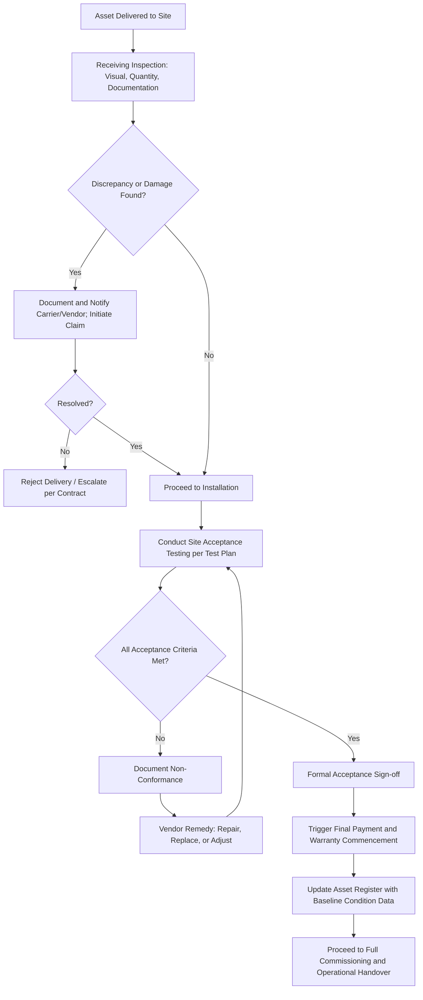

## Receiving Inspection and Acceptance Testing

### Overview

Receiving Inspection and Acceptance Testing is the formal verification process performed when an asset physically arrives at its destination, confirming that the delivered item matches contractual specifications before it is accepted, paid for in full, and released into deployment or commissioning. This stage functions as the quality control gate between Procurement/Contract execution and Installation/Commissioning, providing the last opportunity to identify defects, damage, or non-conformance before the organization assumes full ownership responsibility and the warranty clock begins.

### Purpose and Role in the Asset Lifecycle

**Key Points**

- Serves as the formal verification gate between asset delivery and deployment/commissioning
- Confirms the delivered asset conforms to the requirements and specifications defined during Needs Assessment and formalized in the purchase contract
- Triggers contractual milestones, including final payment release and the commencement of the warranty period
- Provides the documented basis for rejecting non-conforming deliveries or invoking contractual remedies before the buyer assumes full risk of loss
- Establishes the condition baseline recorded in the asset register at the point of entry into the organization's asset inventory

### Receiving Inspection

#### Purpose and Scope

- **Key Points**
  - Verifies that the physical delivery matches the purchase order/contract in quantity, model/part number, and configuration
  - Identifies visible shipping damage, missing components, or incorrect items before acceptance of delivery from the carrier
  - Distinct from Acceptance Testing in that receiving inspection is typically a physical/administrative check, while acceptance testing verifies functional performance

#### Receiving Inspection Checklist Elements

- **Key Points**
  - Packing slip/bill of lading reconciliation against the purchase order
  - Visual inspection for shipping damage (dents, cracks, water damage, broken seals)
  - Quantity verification (count of units, components, spare parts, accessories)
  - Model/serial number verification against the purchase order and any applicable compliance certificates
  - Documentation completeness check (manuals, warranty certificates, calibration certificates, compliance/conformity certificates)

#### Damage and Discrepancy Handling

- **Key Points**
  - Visible damage should be documented (photographed) and noted on the carrier's delivery receipt before signing, to preserve claim rights against the carrier or vendor
  - Concealed damage discovered after signing typically requires prompt notification within a contractually or carrier-defined claim window
  - Discrepancies (wrong item, quantity shortfall) should be documented and reported to the vendor/procurement team immediately to initiate correction before proceeding further

### Acceptance Testing

#### Purpose and Scope

- **Key Points**
  - Verifies that the asset performs according to the functional and performance specifications defined in the requirements and contract, going beyond the physical/visual checks of receiving inspection
  - Provides the objective basis for formal acceptance sign-off, which triggers contractual milestones including final payment and warranty commencement
  - Should be traceable back to the original Requirements Specification and Requirements Traceability Matrix established during Needs Assessment

#### Types of Acceptance Testing

- **Key Points**
  - **Factory Acceptance Testing (FAT)**: Conducted at the vendor's facility before shipment, verifying functional performance under controlled conditions prior to transport; commonly used for complex, custom, or high-value equipment
  - **Site Acceptance Testing (SAT)**: Conducted at the final installation location after delivery and installation, verifying the asset performs correctly in its actual operating environment, including integration with existing systems and utilities
  - **Performance/Reliability Testing**: Extended-duration testing to verify sustained performance under normal operating load, sometimes conducted over days or weeks before final acceptance is granted
  - **Burn-in Testing**: Short-duration continuous operation testing intended to surface early-life ("infant mortality") failures before formal acceptance, particularly relevant for electronic and mechanical systems exhibiting a bathtub-curve failure pattern

#### FAT vs. SAT Comparison

| Aspect | Factory Acceptance Testing (FAT) | Site Acceptance Testing (SAT) |
| --- | --- | --- |
| Location | Vendor's manufacturing/assembly facility | Final installation site |
| Timing | Before shipment | After delivery and installation |
| Environment | Controlled, simulated conditions | Actual operating environment |
| Primary purpose | Verify core functionality before costly transport | Verify integration, environment fit, and end-to-end performance |
| Typical scope | Component and subsystem functional tests | Full system integration and operational tests |
| Cost of failure detection | Lower (correction before shipment) | Higher (correction after installation, potential schedule delay) |

**Key Points**

- Conducting FAT before shipment reduces the cost and schedule impact of defect discovery, since correction at the vendor's facility is generally less disruptive than post-installation rework
- SAT remains necessary even after successful FAT because site-specific conditions (power quality, ambient environment, integration with existing systems) cannot always be fully replicated at the factory

### Acceptance Testing Process Flow

### Developing the Acceptance Test Plan

**Key Points**

- Acceptance criteria should be defined and mutually agreed with the vendor before delivery, ideally as part of contract negotiation, to avoid disputes over subjective pass/fail interpretation
- Each test criterion should be traceable to a specific requirement from the original Requirements Specification, using a requirements traceability matrix to confirm complete coverage
- Test procedures should specify: the exact test method, required instrumentation/calibration standards, acceptable tolerance ranges, and the pass/fail threshold for each parameter
- Roles and responsibilities during testing (who operates the equipment, who witnesses/certifies results, who has authority to accept or reject) should be defined in advance

**Example**

An acceptance test plan for an industrial compressor might specify: "The compressor shall sustain a discharge pressure of 120 PSI ± 5 PSI at rated flow for a continuous 4-hour test period, with vibration levels not exceeding 4.5 mm/s RMS as measured by a calibrated vibration analyzer at the designated bearing locations." This is directly traceable to the original functional and performance requirements and provides an objective, verifiable pass/fail threshold.

### Handling Non-Conformance

**Key Points**

- Non-conformances identified during acceptance testing should be documented in a formal non-conformance report (NCR), specifying the deviation, its severity, and reference to the violated requirement or specification
- Minor non-conformances may be accepted with a documented punch list and vendor commitment to remedy within a defined timeframe, without blocking overall acceptance
- Major or safety-critical non-conformances should block formal acceptance until remedied and re-tested
- Repeated failure of the same test parameter across remedy attempts may trigger contractual remedies such as liquidated damages, replacement, or contract termination for cause, depending on the terms negotiated during Contract Negotiation

### Documentation and Record-Keeping

**Key Points**

- Signed acceptance test records, including raw data, instrumentation calibration records, and any punch list items, should be retained as part of the permanent asset record
- Acceptance documentation supports future warranty claims by establishing the verified baseline condition and performance at the point of acceptance
- Formal acceptance sign-off should be executed by an individual with appropriate delegated authority, consistent with the organization's procurement governance framework
- Acceptance records feed directly into the Asset Register, establishing the commissioning date, baseline performance data, and warranty start date used throughout the asset's operational life

### Common Pitfalls

**Key Points**

- Signing carrier delivery receipts without noting visible damage, forfeiting claim rights against the carrier
- Conducting only receiving inspection (physical/visual) without functional acceptance testing, allowing latent defects to surface only after warranty-sensitive time has elapsed
- Vague or subjective acceptance criteria that create disputes over whether a non-conformance is grounds for rejection
- Granting full acceptance despite unresolved major non-conformances, weakening the buyer's contractual leverage to compel vendor remedy
- Failing to trace acceptance test criteria back to the original requirements, allowing gaps where a delivered asset technically "passes" testing without truly meeting the operational need
- Inadequate documentation of test results, undermining future warranty claims or dispute resolution

### Related Topics

- Contract Negotiation and Terms for Asset Purchases
- Warranty Structures and Service Level Agreements at Acquisition
- Needs Assessment and Requirements Definition
- Installation and Commissioning Procedures
- Asset Register and Baseline Data Management
- Non-Conformance and Corrective Action Processes
- Calibration and Instrumentation Standards
- Reliability Testing and Bathtub Curve Failure Analysis