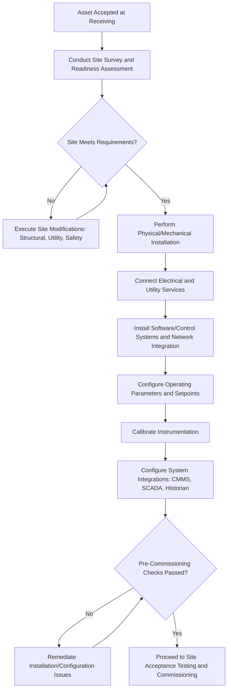

## Installation, Configuration, and Site Preparation

### Overview

Installation, Configuration, and Site Preparation encompasses the physical and technical work required to transform an accepted asset into a fully deployed, operational unit at its intended location. This stage follows Receiving Inspection and Acceptance Testing and precedes full Commissioning, and it involves preparing the physical environment, executing the mechanical/electrical/technical installation, and configuring the asset's operating parameters and integrations to meet the organization's specific operational requirements.

### Purpose and Role in the Asset Lifecycle

**Key Points**

- Converts an accepted, delivered asset into a physically installed and technically configured unit ready for commissioning and operational use
- Ensures the physical environment (site) meets the asset's operating requirements before the asset is placed into service
- Establishes the configuration baseline (settings, integrations, calibration) that determines how the asset performs against the original requirements
- Provides the foundation on which Site Acceptance Testing and formal commissioning depend, since testing cannot validate performance in an improperly prepared or configured environment
- Directly affects long-term reliability, since improper installation is a well-documented root cause of premature asset failure

### Site Preparation

#### Site Survey and Readiness Assessment

- **Key Points**
  - Conducted before delivery to confirm the destination location can physically and technically accommodate the asset
  - Assesses structural load capacity, available space/clearances, access routes for delivery and future maintenance, and environmental conditions (temperature, humidity, dust, vibration exposure)
  - Identifies any required site modifications (foundation work, structural reinforcement, access widening) with sufficient lead time before asset arrival

#### Utility and Infrastructure Readiness

- **Key Points**
  - Electrical supply verification: voltage, phase, amperage capacity, and any dedicated circuit or transformer requirements
  - Mechanical utilities: compressed air, water, steam, ventilation, or process piping connections as applicable to the asset type
  - Data/network connectivity: network drops, wireless coverage, or fieldbus/protocol compatibility for connected or IoT-enabled assets
  - Environmental controls: HVAC capacity for temperature/humidity-sensitive equipment, dust or contamination control for cleanroom-sensitive assets

#### Safety and Regulatory Site Requirements

- **Key Points**
  - Confirmation that the site meets applicable building codes, fire/life-safety codes, and industry-specific regulatory requirements before asset placement
  - Identification of required safety systems (emergency shutoffs, guarding, ventilation for hazardous materials) that must be in place before commissioning
  - Environmental permits or approvals that may be required before installation of certain asset classes (e.g., emissions-generating equipment)

### Installation

#### Physical/Mechanical Installation

- **Key Points**
  - Positioning, anchoring, and alignment of the asset according to manufacturer specifications and engineering drawings
  - Torque specifications, leveling tolerances, and vibration isolation requirements should follow OEM installation manuals precisely, since deviation is a common root cause of premature mechanical failure
  - Rigging and lifting plans for heavy or oversized assets should be developed and reviewed for safety before installation day

#### Electrical and Utility Connection

- **Key Points**
  - Connection work should be performed by appropriately licensed/qualified personnel in accordance with applicable electrical codes
  - Verification of correct voltage, phase rotation, and grounding before energizing the asset
  - Utility connections (compressed air, water, process piping) should be pressure-tested or leak-checked before full operational use

#### Software and Systems Integration Installation

- **Key Points**
  - For asset classes incorporating embedded software, control systems, or IoT connectivity, installation includes network integration, firmware/software installation, and initial system pairing
  - Integration with existing enterprise systems (SCADA, building management systems, Enterprise Asset Management/CMMS platforms) should be planned and tested during this phase
  - Cybersecurity considerations, including network segmentation and credential management for connected assets, should be addressed during installation rather than deferred

### Configuration

#### Parameter and Operating Setpoint Configuration

- **Key Points**
  - Operating parameters (speed, pressure, temperature setpoints, alarm thresholds) are configured to match the specific operational requirements defined during Needs Assessment
  - Default manufacturer settings frequently require adjustment for the specific application, load profile, or environmental conditions at the installation site
  - Configuration decisions should be documented to establish a reproducible baseline for future troubleshooting or asset replacement

#### Calibration

- **Key Points**
  - Instrumentation and measurement components should be calibrated against traceable reference standards before the asset is placed into service
  - Calibration certificates should be retained as part of the permanent asset record, supporting both quality assurance and regulatory compliance requirements
  - Initial calibration establishes the baseline for future periodic recalibration scheduled as part of the maintenance program

#### Integration and Interoperability Configuration

- **Key Points**
  - Configuration of data exchange protocols, communication addresses, and system-to-system interfaces for assets integrated into broader operational technology (OT) or information technology (IT) environments
  - Validation that configured integrations produce accurate, timely data flow to downstream systems (CMMS/EAM, historian databases, monitoring dashboards)

### Installation and Configuration Process Flow

### Roles and Responsibilities

**Key Points**

- Installation is frequently a shared responsibility between vendor technicians (particularly for warranty-sensitive or complex equipment) and internal maintenance/engineering personnel
- Clear delineation of responsibility should be established in the contract to avoid warranty disputes arising from improper installation by unauthorized personnel
- A designated installation supervisor or project lead should coordinate across trades (electrical, mechanical, controls/IT) to manage sequencing and interdependencies
- Safety oversight (lockout/tagout procedures, permit-to-work systems) should be actively managed throughout installation, not only during final commissioning

### Documentation Requirements

**Key Points**

- As-built drawings reflecting the actual installed configuration (which may differ from original design drawings) should be captured and retained
- Configuration settings, calibration certificates, and installation checklists should be compiled into the asset's permanent record
- Installation documentation feeds directly into the Asset Register, establishing baseline configuration data referenced throughout the operate/maintain phase
- Photographic documentation of installation, particularly for concealed connections (below-grade utilities, internal wiring), assists future maintenance and troubleshooting

### Common Pitfalls

**Key Points**

- Proceeding with installation before confirming site readiness, resulting in delays, rework, or damage to the asset during installation attempts
- Deviating from manufacturer installation specifications (torque, alignment, clearance) without engineering review, risking premature failure and potential warranty voidance
- Failing to pressure-test or leak-check utility connections before full operational use, deferring discovery of installation defects to the commissioning or early-operation phase
- Overlooking cybersecurity configuration for network-connected assets, leaving default credentials or unsegmented network access in place
- Inadequate as-built documentation, complicating future maintenance, troubleshooting, or asset replacement decisions
- Insufficient coordination between trades (electrical, mechanical, controls), leading to sequencing conflicts and schedule delays

### Related Topics

- Receiving Inspection and Acceptance Testing
- Commissioning and Operational Handover
- Calibration and Instrumentation Standards
- Asset Register and Baseline Data Management
- Cybersecurity for Connected and IoT-Enabled Assets
- Preventive Maintenance Program Design
- Lockout/Tagout and Permit-to-Work Safety Systems
- Enterprise Asset Management (EAM) and CMMS Integration