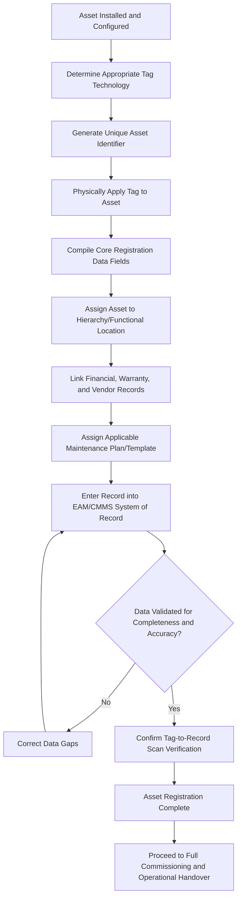

## Asset Tagging and Registration into the System of Record

### Overview

Asset Tagging and Registration into the System of Record is the process of assigning a unique, traceable identifier to a physical asset and formally entering its complete data profile into the organization's authoritative asset management system, typically an Enterprise Asset Management (EAM) or Computerized Maintenance Management System (CMMS) platform. This stage follows Installation, Configuration, and Site Preparation and is a prerequisite for full Commissioning, since accurate downstream maintenance scheduling, financial depreciation tracking, and lifecycle reporting all depend on the asset being correctly and completely registered at this point.

### Purpose and Role in the Asset Lifecycle

**Key Points**

- Establishes the single, authoritative digital record for the asset that will be referenced throughout its entire operational life
- Enables physical-to-digital traceability, allowing field personnel to identify an asset and retrieve its full history, specifications, and maintenance requirements
- Provides the foundational data required for preventive maintenance scheduling, financial depreciation tracking, warranty management, and regulatory compliance reporting
- Supports accurate asset inventory counts, audit readiness, and loss/theft prevention through physical tag reconciliation
- Creates the data backbone required for portfolio-level asset analytics, condition assessment, and lifecycle cost tracking

### Asset Tagging

#### Tagging Technologies

- **Key Points**
  - **Barcode labels**: Low-cost, widely compatible with standard mobile scanning apps and handheld scanners; require direct line-of-sight scanning
  - **QR codes**: Higher data density than barcodes, scannable via standard smartphone cameras without dedicated scanning hardware, increasingly common for maintenance work order initiation
  - **RFID (Radio Frequency Identification)**: Enables non-line-of-sight scanning and bulk/batch reading, suited to high-volume inventory environments or assets in physically inaccessible locations; higher per-unit cost than barcode/QR
  - **NFC (Near Field Communication)**: Short-range tag reading via smartphone tap, commonly used for equipment requiring quick, contactless identification during rounds/inspections
  - **Engraved/etched metal tags**: Durable physical marking for harsh environments (high heat, chemical exposure, outdoor weathering) where adhesive labels degrade

#### Tag Selection Criteria

- **Key Points**
  - Environmental durability requirements (temperature extremes, moisture, chemical exposure, UV exposure) should drive tag material and technology selection
  - Read range and line-of-sight requirements depend on asset accessibility (e.g., overhead equipment, buried assets, assets in confined spaces)
  - Integration compatibility with existing scanning infrastructure and the organization's EAM/CMMS platform should be confirmed before large-scale tag procurement
  - Cost-per-tag should be evaluated against asset value and volume; RFID is generally reserved for higher-value or high-throughput tracking scenarios given its greater per-unit cost

#### Tag Placement and Physical Application

- **Key Points**
  - Tags should be placed in a consistent, accessible location across asset classes to support efficient field scanning during inspections and maintenance
  - Placement should avoid areas subject to heat, abrasion, or fluid exposure that would degrade tag readability over the asset's life
  - For assets with replaceable major components, consideration should be given to whether sub-components require their own traceable tags (parent-child asset hierarchy)

### Unique Asset Identifier Design

**Key Points**

- Identifier schemes typically encode structured information such as asset class, location/facility code, and sequential number, though pure sequential numbering with no embedded meaning is also a valid and sometimes preferred approach for long-term flexibility
- Identifiers must be guaranteed unique within the system of record to prevent data integrity issues; auto-generated system identifiers reduce the risk of manual duplication
- Identifier format should remain stable over the asset's life even if the asset is relocated, reassigned to a different department, or its classification changes, to preserve historical record continuity
- Legacy or pre-existing asset numbering schemes should be reconciled or cross-referenced during system migration to avoid breaking historical maintenance and financial records

### Registration into the System of Record

#### Core Data Fields for Registration

- **Key Points**
  - **Identification data**: Unique asset ID, tag technology/number, serial number, model number, manufacturer
  - **Classification data**: Asset class/category, criticality rating, functional location/hierarchy position
  - **Financial data**: Acquisition cost, acquisition date, depreciation method and useful life, capital vs. expense classification
  - **Warranty and vendor data**: Vendor/supplier record, warranty start/end dates, warranty terms reference, SLA reference
  - **Technical/specification data**: Key technical specifications, configuration settings established during Installation and Configuration, calibration certificates
  - **Location data**: Physical location, facility, functional/process area, GPS coordinates where applicable for mobile or field assets
  - **Maintenance data**: Applicable preventive maintenance plan/template assignment, criticality-driven maintenance strategy classification

#### Asset Hierarchy and Functional Location

- **Key Points**
  - Assets are typically registered within a hierarchical structure reflecting physical or functional relationships (site > building > system > equipment > component)
  - Proper hierarchy placement enables roll-up reporting (e.g., total maintenance cost by building or system) and supports meaningful failure/reliability analysis at the appropriate level
  - Parent-child relationships between major assets and their significant sub-components should be established where component-level tracking and maintenance history matter

### Tagging and Registration Process Flow

### Data Quality and Validation

**Key Points**

- A physical scan verification step (scanning the applied tag and confirming it correctly links to the intended digital record) should be performed before registration is considered complete
- Mandatory field validation within the EAM/CMMS system reduces the risk of incomplete records that undermine later reporting and maintenance scheduling
- Duplicate detection logic should be applied during registration to prevent the same physical asset from being registered more than once under different identifiers
- Data governance standards (naming conventions, required fields, classification taxonomies) should be documented and consistently enforced across all registering personnel to maintain data integrity at scale

### Integration with Enterprise Systems

**Key Points**

- Asset registration data typically needs to synchronize with financial/ERP systems for depreciation tracking and fixed asset accounting
- Integration with procurement systems allows automatic population of vendor, warranty, and cost data at registration, reducing manual data entry and transcription errors
- Mobile scanning applications connected to the EAM/CMMS enable field technicians to retrieve asset history and initiate work orders directly from a tag scan
- API-based or middleware integration is commonly used to maintain data consistency across the EAM/CMMS, ERP, and any specialized condition-monitoring or IoT platforms [Inference: the specific integration architecture and middleware approach varies significantly by organization's existing technology stack and is not standardized across the industry]

### Periodic Reconciliation and Audit

**Key Points**

- Physical asset audits (periodic tag-to-record verification) should be scheduled to detect missing, relocated, or improperly registered assets
- Discrepancies identified during reconciliation (assets found without tags, tags found without corresponding records) should trigger a formal investigation and correction process
- Asset audits support both financial accuracy (fixed asset register reconciliation) and operational accuracy (ensuring maintenance is being scheduled against a complete, correct asset population)

### Common Pitfalls

**Key Points**

- Incomplete data entry at registration (missing warranty dates, cost data, or maintenance plan assignment), which degrades downstream reporting and maintenance scheduling accuracy
- Inconsistent identifier or naming conventions across departments or facilities, complicating enterprise-wide reporting and analytics
- Selecting tag technology without evaluating environmental durability, resulting in premature tag degradation and loss of traceability
- Failing to register sub-components requiring independent maintenance history, forcing maintenance records to be recorded at an inappropriately coarse level
- Neglecting periodic physical-to-digital reconciliation, allowing the asset register to drift out of sync with actual field conditions over time
- Registering assets without linking them to an appropriate maintenance plan, resulting in assets that fall outside the preventive maintenance program entirely

### Related Topics

- Installation, Configuration, and Site Preparation
- Enterprise Asset Management (EAM) and CMMS Fundamentals
- Asset Hierarchy and Functional Location Design
- Preventive Maintenance Program Design
- Fixed Asset Accounting and Depreciation Methods
- Physical Asset Audits and Inventory Reconciliation
- RFID and IoT-Enabled Asset Tracking
- Data Governance for Asset Management Systems