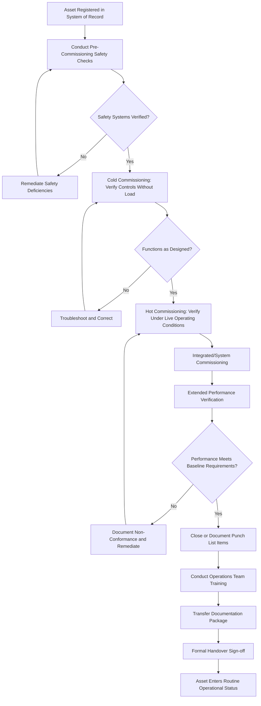

## Commissioning Procedures and Handover to Operations

### Overview

Commissioning Procedures and Handover to Operations is the culminating stage of asset deployment, in which an installed, configured, and registered asset is formally verified as fully functional and safe under actual operating conditions, and responsibility for its ongoing operation and maintenance is transferred from the project/deployment team to the operations and maintenance organization. This stage follows Asset Tagging and Registration and marks the formal transition point from the Acquisition/Deployment phase into the Operate/Maintain phase of the asset lifecycle.

### Purpose and Role in the Asset Lifecycle

**Key Points**

- Provides the final, integrated verification that the asset performs safely and correctly under real operating conditions, building on but going beyond the discrete checks performed during Site Acceptance Testing
- Formally transfers ownership, operational responsibility, and accountability from the deployment/project team to the operations and maintenance organization
- Establishes the definitive performance and condition baseline against which future condition monitoring and reliability tracking are measured
- Confirms that operations and maintenance personnel possess the training, documentation, and spare parts support needed to sustain the asset independently
- Marks the point at which the asset formally enters routine operational status and is subject to standard preventive maintenance, monitoring, and performance management processes

### Commissioning Types and Scope

#### Cold Commissioning

- **Key Points**
  - Verification of installation correctness, safety interlocks, and control system function without introducing process media, full load, or live production conditions
  - Confirms wiring, instrumentation, and control logic function as designed before energization or process startup risk is introduced

#### Hot Commissioning

- **Key Points**
  - Verification of asset performance under live operating conditions, including actual process media, full electrical load, or production-representative operating parameters
  - Represents the highest-risk phase of commissioning, since failures manifest under real operating stress rather than simulated conditions

#### Integrated/System Commissioning

- **Key Points**
  - Verification that the newly commissioned asset functions correctly within the broader system or process it is part of, not merely as a standalone unit
  - Particularly critical for assets that interface with existing equipment, control systems, or production lines, where integration failures may not surface during isolated testing

### Commissioning Process Components

#### Pre-Commissioning Checks

- **Key Points**
  - Verification that all Installation and Configuration activities are complete, including utility connections, calibration, and safety system installation
  - Confirmation that all Site Acceptance Testing non-conformances have been resolved and closed before proceeding
  - Safety system verification: emergency stops, interlocks, guarding, and lockout/tagout points confirmed functional before any energization

#### Functional Verification

- **Key Points**
  - Systematic testing of each functional mode and operating parameter against the original requirements and acceptance criteria
  - Alarm and safety interlock testing to confirm correct triggering thresholds and system response
  - Control system logic verification, including manual and automatic operating mode transitions where applicable

#### Performance Verification

- **Key Points**
  - Extended-duration operation under representative load to confirm sustained performance meets specification, often overlapping with or extending Performance/Reliability Testing conducted during Acceptance Testing
  - Data logging during this period establishes the initial performance baseline used for later condition monitoring and degradation trend analysis

#### Punch List Closure

- **Key Points**
  - Any outstanding minor non-conformances or deficiencies identified during commissioning are documented in a punch list with assigned responsibility and target closure dates
  - Formal commissioning sign-off should specify whether outstanding punch list items block full handover or are permitted to be closed post-handover under vendor or internal commitment

### Commissioning and Handover Process Flow

### Operational Readiness and Handover Package

#### Training and Knowledge Transfer

- **Key Points**
  - Operations and maintenance personnel should receive hands-on training covering normal operation, routine maintenance tasks, and emergency/abnormal response procedures
  - Training should be documented, including attendee records and competency verification, particularly for safety-critical or specialized equipment
  - Vendor-delivered training sessions during commissioning are common for complex or novel equipment and should be scheduled with sufficient lead time before handover

#### Documentation Package Transfer

- **Key Points**
  - Complete documentation package typically includes: as-built drawings, operating manuals, maintenance manuals, spare parts lists, calibration certificates, warranty documentation, and commissioning test records
  - Documentation should be indexed and stored in the organization's document management system with linkage to the asset's record in the EAM/CMMS
  - Any vendor-proprietary software licenses, configuration backup files, or control system source code/logic documentation should be captured and securely archived

#### Spare Parts and Support Readiness

- **Key Points**
  - Initial spare parts inventory (recommended by the vendor or determined through criticality analysis) should be stocked before handover, particularly for long-lead-time components
  - Maintenance strategy and preventive maintenance plan assignment should be finalized and active in the CMMS/EAM before handover, ensuring the asset does not enter an operational gap without scheduled maintenance coverage
  - Vendor support contact information, escalation procedures, and active warranty/SLA terms should be clearly communicated to the operations team

### Formal Handover Sign-off

**Key Points**

- A formal handover document, signed by representatives of both the project/deployment team and the receiving operations organization, should confirm acceptance of responsibility
- The sign-off should explicitly reference completion (or documented exception) of all commissioning checklist items, training, and documentation transfer
- Handover sign-off is distinct from the earlier contractual Acceptance Testing sign-off with the vendor; handover concerns the internal transfer of operational responsibility, whereas acceptance concerns the contractual relationship with the vendor
- Clear handover accountability prevents ambiguity over who is responsible for the asset during any transitional period between project completion and full operational integration

### Roles and Responsibilities

**Key Points**

- Commissioning is typically led by a designated commissioning engineer or project lead, coordinating vendor technicians, internal engineering, and operations representatives
- Operations and maintenance personnel should be actively involved throughout commissioning, not only at the final handover meeting, to build familiarity and surface operational concerns early
- Safety personnel or a safety officer should have authority to halt commissioning activities if safety deficiencies are identified, independent of schedule pressure

### Common Pitfalls

**Key Points**

- Compressing or skipping cold commissioning steps under schedule pressure, increasing risk of safety incidents during hot commissioning
- Handing over an asset before maintenance plans are active in the CMMS/EAM, creating a gap in preventive maintenance coverage from day one of operation
- Incomplete or poorly organized documentation transfer, leaving operations teams unable to efficiently troubleshoot issues post-handover
- Insufficient operator training, particularly for complex or novel equipment, leading to operational errors or premature failures attributable to misuse rather than asset defect
- Allowing punch list items to be indefinitely deferred without a clear closure commitment, resulting in unresolved deficiencies that persist through the asset's operational life
- Treating handover as a single event rather than a verified transition, without confirming operations' actual readiness and capability to sustain the asset independently

### Related Topics

- Receiving Inspection and Acceptance Testing
- Installation, Configuration, and Site Preparation
- Asset Tagging and Registration into the System of Record
- Preventive Maintenance Program Design
- Spare Parts Inventory and Criticality Analysis
- Enterprise Asset Management (EAM) and CMMS Fundamentals
- Lockout/Tagout and Permit-to-Work Safety Systems
- Reliability Testing and Bathtub Curve Failure Analysis