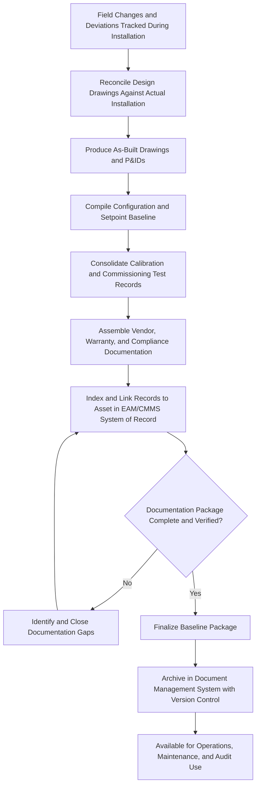

## Baseline Documentation and As-Built Records

### Overview

Baseline Documentation and As-Built Records is the discipline of capturing, organizing, and preserving the complete and accurate technical record of an asset's actual configuration, installation, and initial performance at the point it enters operational service. This differs deliberately from original design documentation: as-built records reflect what was actually installed and configured, including any field modifications, substitutions, or deviations from the original design intent. This documentation, finalized during Commissioning and Handover, becomes the authoritative reference used throughout the asset's entire operate/maintain phase for troubleshooting, modification planning, regulatory compliance, and eventual decommissioning.

### Purpose and Role in the Asset Lifecycle

**Key Points**

- Establishes the single source of truth for the asset's actual configuration at the point of commissioning, distinct from and often differing meaningfully from original design documents
- Provides the reference baseline against which future condition monitoring, performance degradation, and modification decisions are measured
- Supports efficient troubleshooting and maintenance by giving field personnel accurate configuration and wiring/piping information rather than outdated design intent
- Satisfies regulatory, insurance, and audit requirements that mandate accurate documentation of installed safety systems, electrical work, and structural modifications
- Reduces institutional knowledge loss when personnel turnover occurs, preserving critical installation-specific details that would otherwise exist only in individual memory

### Distinction Between Design Documents and As-Built Records

**Key Points**

- Design documents represent the original engineering intent before construction/installation begins and frequently change during actual execution due to field conditions, substitutions, or design errors discovered during installation
- As-built records capture the final, actual state after all field changes, substitutions, and corrections have been incorporated, making them the only reliable reference for the asset as it truly exists
- Failure to reconcile design documents into accurate as-built records is a common and consequential documentation gap, since maintenance personnel relying on outdated design drawings may misdiagnose issues or introduce new errors during repair

### Categories of Baseline Documentation

#### As-Built Drawings and Technical Documentation

- **Key Points**
  - Mechanical, electrical, and piping/instrumentation diagrams (P&IDs) updated to reflect actual installed routing, component locations, and connections
  - Structural or civil drawings reflecting any field modifications to foundations, supports, or building integration
  - Control system architecture diagrams reflecting actual network topology, addressing schemes, and integration points

#### Configuration and Settings Baseline

- **Key Points**
  - Recorded operating parameters, setpoints, alarm thresholds, and control logic configuration established during Installation, Configuration, and Site Preparation
  - Control system firmware/software versions and configuration file backups at the point of commissioning
  - Any customizations or deviations from vendor default configuration, with rationale documented

#### Calibration and Test Records

- **Key Points**
  - Initial calibration certificates for all measurement and control instrumentation, establishing the traceable baseline for future recalibration intervals
  - Commissioning test records and performance verification data captured during the Commissioning Procedures stage, establishing the initial performance baseline
  - Acceptance testing records carried forward from the Receiving Inspection and Acceptance Testing stage

#### Vendor and Warranty Documentation

- **Key Points**
  - Operating and maintenance manuals, spare parts lists, and vendor technical support contact information
  - Warranty terms, start/end dates, and SLA documentation established during Contract Negotiation
  - Compliance and conformity certificates relevant to the asset's regulatory classification

#### Safety and Compliance Documentation

- **Key Points**
  - Documentation of installed safety systems (interlocks, guarding, emergency shutoffs) and their verified function at commissioning
  - Permit and inspection records required by local building, electrical, or environmental codes
  - Hazard/risk assessments specific to the installed configuration, distinct from generic vendor-provided risk documentation

### Baseline Documentation Compilation Process

### Documentation Management Practices

#### Version Control and Change Management

- **Key Points**
  - As-built records must be treated as living documents subject to formal revision control whenever the asset is later modified, upgraded, or repaired in a way that changes its configuration
  - Each revision should be dated, attributed to a responsible party, and reference the change order or work order that triggered the update
  - Superseded document versions should be retained (not deleted) to preserve historical traceability, with the current version clearly distinguished

#### Linkage to the System of Record

- **Key Points**
  - Baseline documentation should be directly linked to the asset's record in the EAM/CMMS system established during Asset Tagging and Registration, rather than stored in a disconnected file repository
  - Field technicians accessing the asset record via tag scan should be able to retrieve current as-built documentation without separate lookup
  - Document management systems with revision control and access permissions reduce the risk of technicians referencing outdated or unauthorized document versions

#### Retention and Accessibility

- **Key Points**
  - Retention periods for as-built and compliance documentation are often driven by regulatory, warranty, or insurance requirements and should be defined in organizational records management policy
  - Documentation should remain accessible in a format usable over the asset's full expected life, which may span decades for long-life infrastructure assets, raising considerations about format obsolescence for digital records [Inference: specific retention duration requirements vary significantly by asset class, industry, and jurisdiction, and should be confirmed against applicable regulatory and organizational policy rather than assumed uniform]

### Using Baseline Documentation Throughout the Lifecycle

**Key Points**

- **Troubleshooting**: Maintenance personnel reference as-built configuration and wiring/piping diagrams to accurately diagnose faults without relying on potentially outdated design intent
- **Modification planning**: Engineering teams planning upgrades or repairs use the current as-built baseline to understand actual installed conditions before designing changes
- **Condition assessment**: Baseline performance and calibration data provide the reference point against which degradation trends are measured during periodic condition assessments
- **Regulatory audits**: Inspectors and auditors rely on accurate as-built and compliance documentation to verify the installed asset meets applicable code and permit requirements
- **Decommissioning**: Accurate as-built records, particularly for hazardous materials, embedded utilities, or structural integration, are essential for safe and complete decommissioning planning at end of life

### Common Pitfalls

**Key Points**

- Treating original design drawings as sufficient documentation without reconciling field changes into true as-built records
- Failing to update as-built documentation after subsequent modifications, allowing the baseline to drift out of sync with actual asset condition over time
- Storing documentation in disconnected file systems rather than linked to the asset's record in the EAM/CMMS, making retrieval difficult during time-sensitive troubleshooting
- Losing configuration backups or control system logic documentation, forcing costly reverse-engineering if the asset requires reconfiguration after a control system failure
- Inadequate version control, resulting in field personnel referencing outdated or superseded document versions
- Underestimating long-term document retention and format accessibility needs for assets with multi-decade operational lives

### Related Topics

- Commissioning Procedures and Handover to Operations
- Asset Tagging and Registration into the System of Record
- Installation, Configuration, and Site Preparation
- Enterprise Asset Management (EAM) and CMMS Fundamentals
- Change Management and Modification Control for Assets
- Condition Assessment and Asset Renewal Triggers
- Calibration and Instrumentation Standards
- Decommissioning and Disposal Documentation Requirements