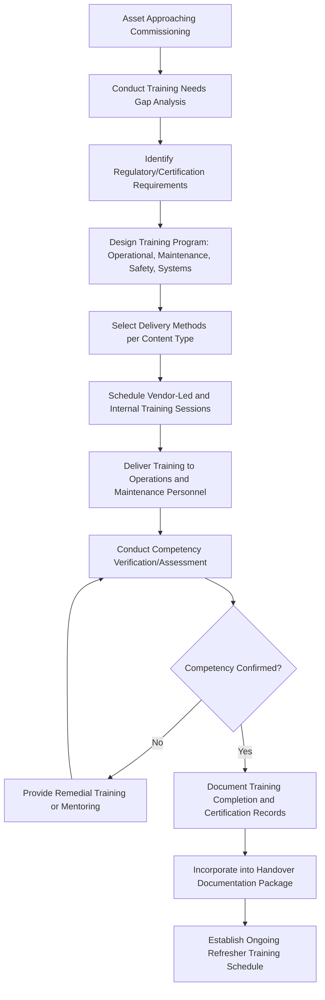

## Training and Knowledge Transfer for New Assets

### Overview

Training and Knowledge Transfer for New Assets is the structured process of building the operational and maintenance competency required for personnel to safely and effectively work with a newly deployed asset. While training activities begin during Commissioning Procedures and Handover to Operations, this topic addresses the full training lifecycle in depth: needs identification, program design, delivery methods, competency verification, and sustainment beyond the initial handover period. Effective knowledge transfer directly determines whether an asset achieves its designed performance and reliability potential or suffers preventable failures attributable to operator or maintainer error.

### Purpose and Role in the Asset Lifecycle

**Key Points**

- Ensures operations and maintenance personnel possess the competency required to safely operate, maintain, and troubleshoot the asset before full operational responsibility transfers
- Directly affects asset reliability and safety outcomes, since improper operation or maintenance is a well-documented contributor to premature failure and safety incidents
- Bridges the knowledge gap between vendor/OEM expertise (concentrated at time of delivery) and the organization's internal personnel who will sustain the asset for its operational life
- Supports long-term knowledge retention and succession planning, reducing dependency on any single individual's tacit knowledge of the asset
- Provides the competency verification basis that underpins formal Commissioning handover sign-off

### Training Needs Identification

**Key Points**

- Training scope should be derived from a gap analysis comparing required competencies (based on asset complexity, criticality, and safety risk) against the current skill level of assigned operations and maintenance personnel
- Asset complexity and novelty relative to existing organizational experience should drive training depth: a routine replacement of familiar equipment requires less intensive training than a first-of-its-kind installation
- Safety-critical or high-consequence-of-failure assets warrant more rigorous, formally verified training regardless of apparent operational simplicity
- Regulatory or code-mandated training requirements (e.g., certified operator requirements for certain equipment classes) must be identified early, since they may require lead time for scheduling and certification

### Categories of Training Content

#### Operational Training

- **Key Points**
  - Normal startup, operation, and shutdown procedures under standard operating conditions
  - Recognition and appropriate response to abnormal operating conditions, alarms, and off-normal indications
  - Human-machine interface (HMI) or control system navigation and operation

#### Maintenance Training

- **Key Points**
  - Preventive maintenance task execution, including inspection points, lubrication schedules, and adjustment procedures
  - Troubleshooting methodology and diagnostic procedures specific to the asset's failure modes
  - Component replacement and repair procedures, including any special tools or techniques required

#### Safety Training

- **Key Points**
  - Lockout/tagout procedures specific to the asset's energy isolation points
  - Emergency shutdown procedures and emergency response protocols
  - Hazard recognition specific to the asset (chemical exposure, electrical hazards, moving parts, confined space entry where applicable)

#### Systems and Software Training

- **Key Points**
  - Control system configuration, alarm management, and data historian/reporting functions for connected or software-driven assets
  - Cybersecurity practices relevant to personnel interacting with networked control systems
  - Integration points with enterprise systems (CMMS work order initiation, condition monitoring dashboards)

### Training Delivery Methods

| Method | Best Fit | Advantages | Limitations |
| --- | --- | --- | --- |
| Vendor-led classroom/hands-on | Complex, novel, or safety-critical equipment | Direct access to OEM expertise; hands-on practice | Higher cost; scheduling dependency on vendor availability |
| Internal train-the-trainer | Recurring or scalable training needs | Builds sustainable internal capability; lower long-term cost | Requires initial internal expert development |
| Simulation/virtual training | Complex control systems, high-risk scenarios | Safe practice of abnormal/emergency scenarios without production risk | Requires investment in simulation platform; may not capture all physical nuances |
| Written procedures/job aids | Routine tasks, ongoing reference | Low cost; always available reference | Insufficient alone for complex or safety-critical tasks |
| On-the-job mentoring | Skill reinforcement post-initial training | Reinforces learning in real operating context | Depends on availability of experienced mentor |

**Key Points**

- Complex or safety-critical assets typically warrant a blended approach combining vendor-led instruction, hands-on practice, and follow-up mentoring rather than relying on any single method
- Simulation-based training is particularly valuable for practicing emergency or abnormal scenarios that would be unsafe or disruptive to rehearse on the live asset

### Training and Knowledge Transfer Process Flow

### Competency Verification

**Key Points**

- Training completion (attendance) should be distinguished from competency verification (demonstrated ability to perform the task correctly and safely)
- Verification methods may include written assessments, hands-on skills demonstrations, or supervised task performance sign-off
- Competency records should be retained as part of the asset's training documentation, particularly for safety-critical or regulatory-mandated skills
- Formal competency sign-off should feed into the broader handover documentation established during Commissioning Procedures and Handover to Operations

### Documentation and Knowledge Retention

**Key Points**

- Training materials, procedures, and job aids developed during the initial deployment should be retained as reusable assets for future personnel onboarding, not treated as one-time deliverables
- Vendor-provided training content should be captured (recordings, materials, presenter notes) where possible to preserve institutional access after the initial training engagement concludes
- Tacit knowledge from experienced personnel (workarounds, known quirks, informal troubleshooting tips) should be deliberately captured through structured knowledge-capture sessions, since this information is easily lost through personnel turnover if left undocumented
- Training records and materials should be linked to the asset's record in the EAM/CMMS system of record, consistent with the broader documentation approach established for Baseline Documentation and As-Built Records

### Sustaining Competency Over Time

**Key Points**

- Refresher training should be scheduled at defined intervals, particularly for safety-critical procedures or infrequently performed tasks where skill decay is a known risk
- Personnel turnover requires a defined onboarding pathway for new operations/maintenance staff to reach the same competency level as originally trained personnel, rather than relying on informal peer-to-peer knowledge transfer alone
- Post-incident or near-miss reviews should feed back into training content updates where a knowledge or skill gap contributed to the event
- Periodic competency reassessment, particularly following any significant asset modification or control system upgrade, helps ensure training remains aligned with the asset's current as-built configuration

### Common Pitfalls

**Key Points**

- Treating vendor training delivered at commissioning as sufficient for the asset's entire operational life without a sustainment or refresher plan
- Conflating attendance at a training session with verified competency, leading to gaps discovered only when a real fault or emergency occurs
- Failing to capture tacit knowledge from experienced personnel before turnover, resulting in preventable loss of institutional expertise
- Under-investing in training for assets perceived as "simple" that nonetheless carry meaningful safety or reliability risk if misoperated
- Not updating training materials after asset modifications, leaving personnel trained against an outdated configuration
- Insufficient documentation of training completion and competency records, creating gaps in audit readiness for regulatory-mandated training requirements

### Related Topics

- Commissioning Procedures and Handover to Operations
- Baseline Documentation and As-Built Records
- Preventive Maintenance Program Design
- Lockout/Tagout and Permit-to-Work Safety Systems
- Enterprise Asset Management (EAM) and CMMS Fundamentals
- Root Cause Analysis and Post-Incident Review
- Succession Planning and Institutional Knowledge Retention
- Regulatory Compliance Training Requirements by Asset Class