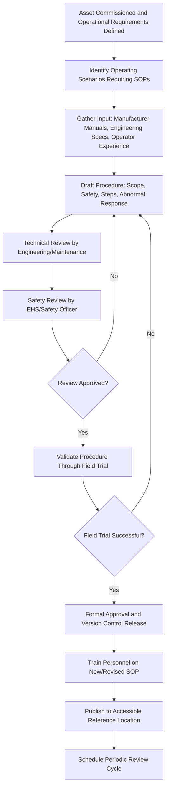

## Standard Operating Procedures for Asset Utilization

### Overview

Standard Operating Procedures (SOPs) for Asset Utilization are the documented, step-by-step instructions that govern how personnel operate an asset during routine, day-to-day use to achieve consistent, safe, and efficient performance. Distinct from the training activities that build initial competency, SOPs are the enduring reference documents that standardize operation across shifts, personnel, and time, forming a core element of the Operate/Maintain phase of asset lifecycle management. Well-designed SOPs reduce variability in how an asset is used, which directly affects reliability, safety outcomes, and the accuracy of performance benchmarking.

### Purpose and Role in the Asset Lifecycle

**Key Points**

- Standardizes asset operation across personnel, shifts, and time to reduce performance variability attributable to inconsistent operating practice
- Provides the documented basis for training, onboarding, and competency verification established during Training and Knowledge Transfer
- Supports safety by codifying correct operating sequences, hazard controls, and emergency response steps in an authoritative, accessible format
- Enables accurate performance benchmarking, since utilization performance can only be meaningfully compared across time or personnel if the underlying operating method is consistent
- Provides a defensible reference in incident investigation, demonstrating whether an event resulted from a procedural gap, a procedural violation, or an unforeseen failure mode

### Core Components of an SOP

#### Scope and Applicability

- **Key Points**
  - Clearly defines which specific asset, asset class, or operating scenario the SOP applies to, avoiding ambiguity when multiple similar assets exist
  - States any prerequisites (certification, training completion, permit requirements) personnel must satisfy before performing the procedure

#### Safety Precautions and Hazard Controls

- **Key Points**
  - Identifies specific hazards associated with the procedure (energy sources, moving parts, chemical exposure, ergonomic risk)
  - References required personal protective equipment (PPE) and any lockout/tagout or permit-to-work requirements applicable to the task
  - Should be positioned prominently within the SOP rather than buried after operational steps, ensuring hazard awareness precedes task execution

#### Step-by-Step Operating Instructions

- **Key Points**
  - Sequential, unambiguous instructions covering startup, normal operation, adjustment, and shutdown
  - Each step should specify the expected result or verification check, allowing the operator to confirm correct progress before proceeding
  - Critical steps (those where an error could cause safety incidents, equipment damage, or quality defects) should be visually distinguished (e.g., bolded, boxed, or flagged) within the document

#### Abnormal Condition and Emergency Response

- **Key Points**
  - Defines recognizable abnormal indications (unusual noise, vibration, temperature, alarm conditions) and the corresponding operator response
  - Specifies emergency shutdown sequences and escalation/notification requirements distinct from routine shutdown procedures
  - Should be developed in coordination with the asset's documented failure modes where available, ensuring the SOP addresses realistic abnormal scenarios rather than only idealized normal operation

#### Roles and Responsibilities

- **Key Points**
  - Specifies which personnel role (operator, technician, supervisor) is authorized to perform each step, particularly for steps requiring specific certification or authority
  - Clarifies handoff points where responsibility transfers between roles or shifts during multi-stage procedures

### SOP Development Process

### Writing Effective SOPs

**Key Points**

- Instructions should use clear, imperative language ("Open valve V-101 slowly until pressure gauge reads 40 PSI") rather than passive or ambiguous phrasing
- Visual aids (photographs, diagrams, flowcharts) significantly improve comprehension and reduce misinterpretation, particularly for complex multi-step procedures
- SOPs should be written at a reading and technical level appropriate to the actual workforce performing the task, avoiding unnecessary jargon while retaining necessary technical precision
- Procedures should reflect the actual as-built configuration and current operating parameters established during Baseline Documentation, not generic manufacturer defaults that may not match the specific installation

**Example**

A poorly structured instruction: "Start the pump and monitor pressure."

A well-structured instruction: "1. Confirm suction valve V-201 is fully open. 2. Press START on the pump control panel. 3. Within 30 seconds, confirm discharge pressure gauge PG-105 reads between 85-95 PSI. 4. If pressure does not reach 85 PSI within 30 seconds, execute emergency stop and refer to Troubleshooting Procedure TSP-14."

### Version Control and Change Management

**Key Points**

- SOPs must be maintained under formal version/document control, with each revision dated, numbered, and attributed to a responsible author and approver
- Changes to SOPs should be triggered by defined events: asset modification, incident/near-miss findings, regulatory changes, or scheduled periodic review, rather than informal ad hoc edits
- Superseded versions should be archived (not discarded) to preserve historical traceability, particularly relevant for incident investigation into events that occurred under a prior procedure version
- Personnel should be retrained on material SOP changes before the revised procedure takes effect, with old procedure copies removed from circulation to prevent inadvertent use

### Accessibility and Compliance Verification

**Key Points**

- Current SOP versions should be readily accessible at or near the point of use, whether in physical binder form, posted job aids, or digital access via mobile device/tablet
- Periodic audits (direct observation of task performance against the documented SOP) verify actual compliance and identify drift between documented procedure and real practice
- Discrepancies discovered between documented SOPs and actual practice should be resolved deliberately: either the SOP is updated to reflect a validated improved practice, or personnel are retrained to correct a procedural deviation — silent divergence should not be allowed to persist

### Linking SOPs to Performance Management

**Key Points**

- Consistent SOP adherence supports more reliable utilization and performance benchmarking, since output and reliability metrics are more meaningfully compared when the underlying operating method is standardized
- Deviation from SOPs is frequently identified as a contributing factor in root cause analysis following asset failures or quality incidents, making SOP compliance auditing a preventive rather than purely reactive control
- Utilization metrics collected under consistent SOP-driven operation provide a more reliable basis for future capacity planning and Needs Assessment than data collected under inconsistent operating practice

### Common Pitfalls

**Key Points**

- Developing SOPs once at commissioning and failing to update them as the asset is modified or as operating conditions change, resulting in a growing gap between documented and actual practice
- Writing procedures that are overly generic (copied from manufacturer manuals without site-specific adaptation), reducing their practical usefulness to operators
- Burying safety precautions within the body of the procedure rather than presenting them prominently before task steps begin
- Failing to validate draft SOPs through an actual field trial before formal release, allowing impractical or incorrect steps to reach production use
- Inconsistent enforcement, where SOP deviations are tolerated informally rather than triggering either retraining or formal procedure revision
- Inaccessible SOPs (outdated physical copies, procedures not available at the point of use), undermining their practical value regardless of document quality

### Related Topics

- Training and Knowledge Transfer for New Assets
- Baseline Documentation and As-Built Records
- Preventive Maintenance Program Design
- Root Cause Analysis and Post-Incident Review
- Lockout/Tagout and Permit-to-Work Safety Systems
- Asset Utilization and Performance Benchmarking
- Document Control and Change Management Systems
- Reliability-Centered Maintenance Principles