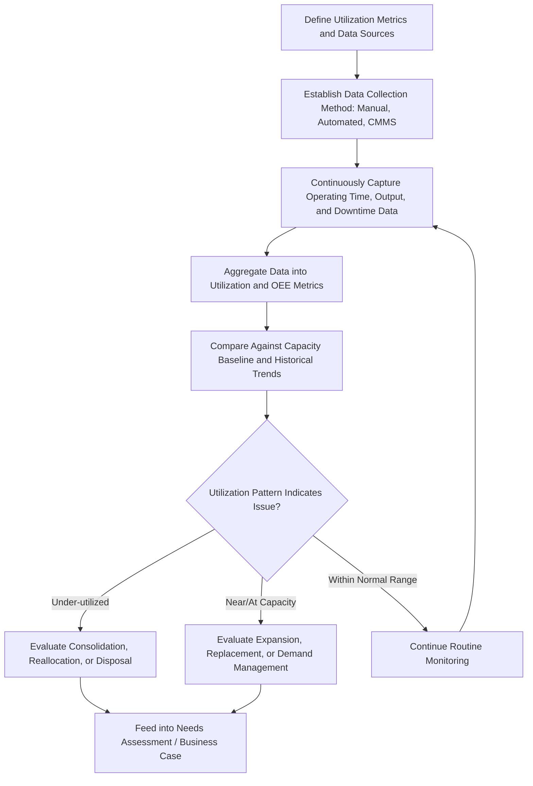

## Monitoring Asset Utilization and Capacity

### Overview

Monitoring Asset Utilization and Capacity is the ongoing measurement and analysis of how intensively and effectively an asset is used relative to its available capacity, during the Operate/Maintain phase of the asset lifecycle. This discipline provides the data foundation for capacity planning, investment justification, and operational efficiency improvement, converting SOP-driven operation into quantifiable performance data that feeds decisions ranging from maintenance scheduling to future Needs Assessment for replacement or expansion.

### Purpose and Role in the Asset Lifecycle

**Key Points**

- Provides objective, quantifiable data on how an asset's available capacity is actually being used, distinct from theoretical or nameplate capacity
- Supports capacity planning decisions, identifying whether assets are under-utilized (candidates for consolidation, disposal, or reallocation) or approaching capacity limits (candidates for expansion or replacement)
- Feeds directly into future Needs Assessment and Business Case development by establishing the quantified current-state baseline against which future capability gaps are measured
- Enables identification of utilization patterns (peak demand periods, seasonal variation, underused shifts) that inform scheduling and operational efficiency improvements
- Provides an evidentiary basis for Make/Buy/Lease and replacement decisions, since utilization intensity is a primary driver of ownership versus lease economics

### Core Utilization Metrics

#### Utilization Rate

The proportion of available time or capacity during which an asset is actively performing productive work.

$$Utilization\ Rate\ (\%) = \frac{Actual\ Output\ or\ Operating\ Time}{Available\ Capacity\ or\ Time} \times 100$$

**Key Points**

- "Available" time/capacity should be clearly defined (calendar time, scheduled operating time, or theoretical maximum capacity), since the choice of denominator significantly affects the resulting percentage and comparability across assets
- Low utilization may indicate over-investment in capacity, poor scheduling, or declining demand; high or near-100% utilization may indicate capacity constraint risk and insufficient buffer for maintenance or unexpected demand

#### Overall Equipment Effectiveness (OEE)

A composite metric widely used in manufacturing and production environments, combining three factors into a single utilization/effectiveness score.

$$OEE = Availability \times Performance \times Quality$$

Where:

$$Availability = \frac{Operating\ Time}{Planned\ Production\ Time}$$

$$Performance = \frac{Actual\ Output}{Theoretical\ Maximum\ Output\ at\ Ideal\ Rate}$$

$$Quality = \frac{Good\ Units\ Produced}{Total\ Units\ Produced}$$

**Example**

A production asset is scheduled for 480 minutes per shift but experiences 40 minutes of downtime, yielding an availability of $\frac{440}{480} = 91.7\%$. During the 440 minutes of operation, the asset produces 4,200 units against a theoretical maximum rate of 5,000 units, yielding a performance factor of $\frac{4,200}{5,000} = 84\%$. Of the 4,200 units produced, 4,100 pass quality inspection, yielding a quality factor of $\frac{4,100}{4,200} = 97.6\%$. The composite OEE is:

$$OEE = 0.917 \times 0.84 \times 0.976 = 75.2\%$$

**Key Points**

- OEE decomposes overall effectiveness into distinct loss categories (availability loss, performance loss, quality loss), allowing targeted improvement efforts rather than addressing utilization as an undifferentiated single number
- World-class OEE benchmarks are commonly cited around 85%, though appropriate targets vary meaningfully by industry and asset type [Inference: specific benchmark figures are industry-reported heuristics rather than universal standards, and appropriate targets should be calibrated to the specific asset class and operating context]

#### Capacity Utilization

$$Capacity\ Utilization\ (\%) = \frac{Actual\ Output}{Maximum\ Sustainable\ Capacity} \times 100$$

**Key Points**

- Distinguishes theoretical/nameplate capacity (manufacturer-rated maximum) from maximum sustainable capacity (the realistic output achievable without accelerating wear or requiring unsustainable maintenance intervals)
- Sustained operation near maximum sustainable capacity for extended periods can accelerate wear and reduce asset life if not accounted for in the maintenance strategy

### Data Collection Methods

#### Manual Data Logging

- **Key Points**
  - Operator-recorded logs of operating hours, output counts, and downtime events, typically via paper logs or basic digital forms
  - Lower implementation cost but subject to recording inconsistency, delay, and human error compared to automated methods

#### Automated Sensor and Control System Data

- **Key Points**
  - Direct data capture from equipment control systems, PLCs, or dedicated condition-monitoring sensors, providing continuous, high-fidelity utilization data
  - Integration with SCADA or historian systems enables real-time and historical trend analysis without manual transcription
  - Higher implementation cost and technical complexity but substantially improves data accuracy and reduces reporting lag

#### CMMS/EAM-Based Tracking

- **Key Points**
  - Utilization and downtime data captured through work order records, meter readings, and asset status changes logged in the Enterprise Asset Management/CMMS system established during Asset Tagging and Registration
  - Provides a natural linkage between utilization data and maintenance history, supporting combined reliability and utilization analysis

### Monitoring and Analysis Process Flow

### Analyzing Utilization Patterns

**Key Points**

- Trend analysis over time (daily, weekly, seasonal) reveals utilization patterns not visible in single-period snapshots, such as recurring peak demand periods or underused shifts
- Comparing utilization across similar assets within a fleet or portfolio identifies outliers warranting investigation, whether due to equipment condition, operator practice, or demand allocation
- Correlating utilization data with maintenance and failure history can reveal whether high utilization intensity is contributing to accelerated degradation, informing maintenance strategy adjustments
- Distinguishing planned downtime (scheduled maintenance) from unplanned downtime (failures, changeovers) within utilization data is essential for accurately attributing capacity loss to its root cause

### Using Utilization Data for Capacity Planning

**Key Points**

- Sustained utilization approaching or exceeding sustainable capacity thresholds is a primary trigger for initiating a new Needs Assessment evaluating capacity expansion options
- Persistently low utilization across an asset or asset class supports business cases for consolidation, fleet reduction, or reallocation to higher-demand locations
- Utilization forecasting, informed by historical trend data and anticipated demand changes, supports proactive rather than reactive capacity investment planning
- Utilization data should be considered alongside asset condition and remaining useful life data, since a highly utilized but rapidly degrading asset presents different planning implications than a highly utilized asset in good condition

### Common Pitfalls

**Key Points**

- Using inconsistent or undefined denominators (calendar time vs. scheduled time vs. theoretical capacity) across reporting periods or assets, undermining comparability
- Relying solely on manual data logging for critical capacity decisions, introducing data quality and timeliness risk
- Treating utilization rate as the sole indicator of asset value, without considering the quality and performance dimensions captured in composite metrics like OEE
- Failing to distinguish planned from unplanned downtime, obscuring whether capacity loss stems from maintenance strategy or equipment reliability issues
- Ignoring the relationship between sustained high utilization and accelerated wear, leading to reliability surprises if maintenance strategy is not adjusted accordingly
- Applying generic industry benchmark targets without adapting them to the specific asset class, operating context, and organizational objectives

### Related Topics

- Standard Operating Procedures for Asset Utilization
- Needs Assessment and Requirements Definition
- Building the Business Case for Asset Investment
- Preventive Maintenance Program Design
- Condition Assessment and Asset Renewal Triggers
- Enterprise Asset Management (EAM) and CMMS Fundamentals
- Reliability-Centered Maintenance Principles
- Make, Buy, or Lease Analysis and Sourcing Strategy