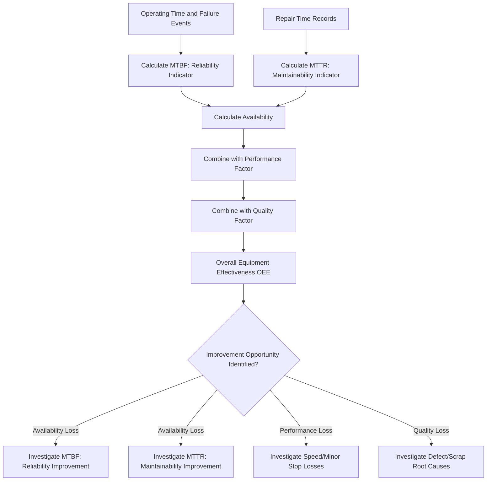

## Measuring Asset Performance through OEE, Availability, MTBF, and MTTR

### Overview

Measuring Asset Performance through OEE, Availability, MTBF, and MTTR encompasses the core quantitative metrics used to evaluate how well an asset is performing during the Operate/Maintain phase, with particular emphasis on reliability and maintainability characteristics. While Monitoring Asset Utilization and Capacity focuses on how intensively an asset is used, this topic focuses specifically on reliability performance: how often the asset fails, how quickly it is restored, and how effectively these factors combine into overall equipment effectiveness. These metrics form the quantitative backbone of reliability engineering and maintenance strategy decisions.

### Purpose and Role in the Asset Lifecycle

**Key Points**

- Provides the standardized, quantifiable metrics used to evaluate asset reliability and maintenance effectiveness across the operate/maintain phase
- Establishes the performance baseline against which maintenance strategy changes (preventive, predictive, reliability-centered) can be objectively evaluated for effectiveness
- Supports data-driven decisions on repair versus replace, spare parts stocking levels, and maintenance resource allocation
- Feeds into future Business Case and Needs Assessment processes by providing historical reliability performance data relevant to replacement timing decisions
- Enables benchmarking across similar assets within a fleet or against industry standards to identify underperforming assets warranting focused investigation

### Overall Equipment Effectiveness (OEE)

OEE is a composite metric combining availability, performance, and quality into a single effectiveness score, providing a holistic view of how well an asset is being utilized relative to its full productive potential.

$$OEE = Availability \times Performance \times Quality$$

**Key Points**

- OEE decomposes total effectiveness loss into three distinct categories, allowing maintenance and operations teams to target the specific loss driver rather than treating underperformance as an undifferentiated single issue
- Availability loss reflects downtime (both planned and unplanned); performance loss reflects running below ideal rate (minor stops, reduced speed); quality loss reflects defective output requiring rework or scrap
- OEE was addressed in detail under Monitoring Asset Utilization and Capacity; this topic builds on that foundation by focusing on the reliability-specific inputs (MTBF, MTTR) that directly drive the Availability component

### Availability

Availability measures the proportion of time an asset is capable of performing its intended function when required, distinguishing operational readiness from actual utilization.

$$Availability\ (\%) = \frac{Uptime}{Uptime + Downtime} \times 100$$

An equivalent and often more diagnostically useful formulation expresses availability directly in terms of reliability and maintainability metrics:

$$Availability = \frac{MTBF}{MTBF + MTTR}$$

**Key Points**

- This formulation reveals that availability can be improved either by increasing MTBF (making failures less frequent) or by decreasing MTTR (restoring function faster after a failure), representing two distinct improvement strategies
- Availability should be distinguished from utilization: an asset can have high availability (capable of running) while having low utilization (not actually scheduled to run), and vice versa
- Inherent availability (accounting only for corrective maintenance downtime) is distinguished from operational availability (also accounting for preventive maintenance, logistics delays, and administrative downtime), and the appropriate measure depends on the decision being supported

### Mean Time Between Failures (MTBF)

MTBF measures the average operating time between successive failures of a repairable asset, serving as a primary indicator of reliability.

$$MTBF = \frac{Total\ Operating\ Time}{Number\ of\ Failures}$$

**Key Points**

- MTBF applies specifically to repairable systems; for non-repairable components, the equivalent metric is Mean Time To Failure (MTTF)
- A higher MTBF indicates greater reliability (failures occur less frequently), making MTBF a key input to preventive maintenance interval design and spare parts stocking decisions
- MTBF is a statistical average and does not describe the distribution or pattern of failures over time; two assets with identical MTBF can have very different failure behavior (e.g., consistent wear-out versus random early failures), which is why MTBF is often used alongside failure distribution analysis (such as Weibull analysis) in mature reliability programs

**Example**

An asset accumulates 8,760 operating hours (one year of continuous operation) and experiences 4 failures during that period. The MTBF is calculated as:

$$MTBF = \frac{8,760\ hours}{4\ failures} = 2,190\ hours$$

This indicates the asset experiences a failure, on average, approximately every 2,190 operating hours.

### Mean Time To Repair (MTTR)

MTTR measures the average time required to restore a failed asset to operational condition, serving as a primary indicator of maintainability.

$$MTTR = \frac{Total\ Repair\ Time}{Number\ of\ Repairs}$$

**Key Points**

- MTTR typically encompasses fault diagnosis, repair execution, and verification/testing time, though some organizations track these as separate sub-components for more granular improvement targeting
- Lower MTTR indicates faster restoration capability, which can be improved through better diagnostic tools, spare parts availability, technician training, or improved accessibility designed into the asset
- MTTR should be distinguished from Mean Logistics Delay Time (the time waiting for parts, personnel, or authorization before repair work can begin), since combining these can obscure whether a maintenance improvement opportunity lies in technical repair efficiency or in logistics/supply chain support

**Example**

Over a reporting period, an asset experiences 4 failures with total repair time (from fault identification to restoration) of 18 hours. The MTTR is calculated as:

$$MTTR = \frac{18\ hours}{4\ repairs} = 4.5\ hours$$

### Combining the Metrics: Availability Calculation

**Example**

Using the MTBF of 2,190 hours and MTTR of 4.5 hours calculated above, availability is:

$$Availability = \frac{2,190}{2,190 + 4.5} = \frac{2,190}{2,194.5} \approx 99.79\%$$

This demonstrates how MTBF and MTTR combine directly into the availability metric, and illustrates why organizations pursuing availability improvement must evaluate both reliability (reducing failure frequency) and maintainability (reducing repair time) as complementary levers.

### Metric Relationship Diagram

### Data Requirements and Collection Practices

**Key Points**

- Accurate MTBF and MTTR calculation depends on consistent, disciplined recording of failure events, repair start/end times, and operating hours, typically captured through the CMMS/EAM system established during Asset Tagging and Registration
- Failure event classification (distinguishing true functional failures from minor stoppages or planned interventions) must be applied consistently to avoid skewing metrics
- Sufficient sample size (number of failure events) is necessary for MTBF/MTTR to be statistically meaningful; a small number of events can produce misleadingly volatile metric values period-to-period [Inference: the specific sample size needed for statistical confidence depends on the underlying failure distribution and desired confidence level, and is a matter of applied reliability engineering judgment rather than a fixed universal threshold]

### Using These Metrics for Maintenance Strategy Decisions

**Key Points**

- Declining MTBF trends over time can indicate accelerating wear-out, informing decisions about preventive maintenance interval adjustment or eventual replacement timing
- High MTTR relative to industry or fleet benchmarks may indicate opportunities in spare parts stocking, diagnostic tooling, technician training, or asset design accessibility
- Comparing MTBF/MTTR across similar assets in a fleet identifies outlier units warranting focused investigation, which may reveal installation defects, environmental factors, or operator practice differences per Standard Operating Procedures adherence
- These metrics collectively support the business case for transitioning from reactive to preventive or predictive maintenance strategies by quantifying the reliability improvement potential

### Common Pitfalls

**Key Points**

- Comparing MTBF or MTTR figures across organizations or industries without accounting for differing definitions of "failure" and "repair," which can vary substantially and undermine benchmarking validity
- Treating MTBF as a guarantee or prediction of when the next specific failure will occur, rather than as a statistical average across a population of failure events
- Combining true repair time with logistics/waiting time within a single MTTR figure, obscuring whether the constraint is technical or supply-chain related
- Calculating metrics from too small a sample of failure events, producing volatile and misleading period-over-period trends
- Focusing exclusively on availability while ignoring the performance and quality components of OEE, missing significant effectiveness losses that availability alone would not reveal
- Inconsistent failure event classification across different technicians or shifts, undermining the reliability and comparability of the underlying data

### Related Topics

- Monitoring Asset Utilization and Capacity
- Preventive Maintenance Program Design
- Reliability-Centered Maintenance Principles
- Root Cause Analysis and Post-Incident Review
- Enterprise Asset Management (EAM) and CMMS Fundamentals
- Weibull Analysis and Failure Distribution Modeling
- Spare Parts Inventory and Criticality Analysis
- Condition Assessment and Asset Renewal Triggers