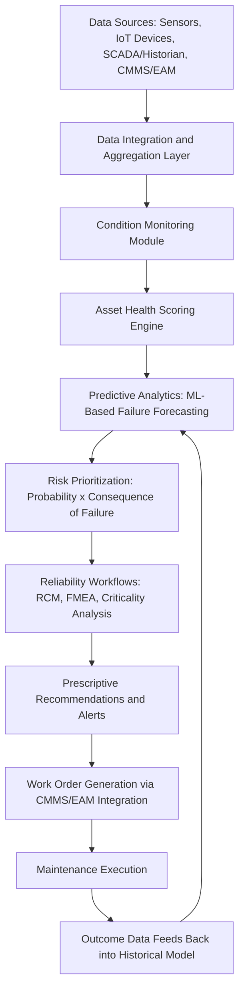
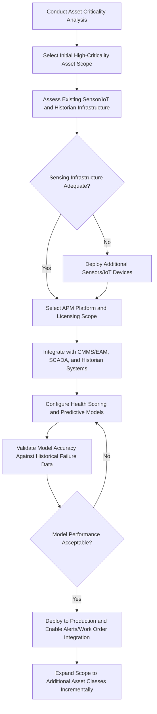

## The Role of Asset Performance Management Systems

### Overview

Asset Performance Management (APM) Systems are integrated software platforms that combine condition monitoring, reliability analytics, and predictive/prescriptive intelligence to help organizations transition from reactive to proactive and predictive maintenance strategies. APM builds directly on the metrics and data foundations established through OEE, Availability, MTBF, and MTTR measurement, aggregating that data alongside sensor/IoT inputs to generate actionable insight into asset health, failure probability, and optimal maintenance timing. APM represents the technology layer that operationalizes reliability engineering principles at scale across an asset portfolio.

### Purpose and Role in the Asset Lifecycle

**Key Points**

- Aggregates condition monitoring, historical performance, and reliability data into a unified system supporting proactive rather than purely reactive maintenance decisions
- Converts raw sensor and operational data into risk-prioritized, actionable maintenance recommendations, reducing dependence on manual analysis
- Provides the analytical foundation for transitioning maintenance strategy from time-based preventive maintenance toward condition-based and predictive maintenance approaches
- Supports portfolio-level risk and investment prioritization by quantifying probability of failure and consequence of failure across large asset populations
- According to industry analysis, predictive maintenance enabled by APM technology can reduce unplanned downtime by 30 to 50 percent and cut maintenance costs by 10 to 25 percent [Unverified: these figures represent industry-reported ranges from third-party analysis rather than universal guarantees, and actual results vary significantly by implementation maturity, asset class, and data quality] [Cryotos](https://www.cryotos.com/blog/top-10-asset-performance-management-apm-software-2026)

### Core Functional Layers of APM

Industry analysis commonly frames APM around a set of functional layers. According to Gartner's definition, APM encompasses four functional layers: asset health management, reliability-centered maintenance, condition monitoring, and predictive analytics.

#### Condition Monitoring

- **Key Points**
  - Continuous or periodic collection of sensor data (vibration, temperature, pressure, oil analysis, thermal imaging) reflecting the real-time physical condition of an asset
  - Data sources may include first-party sensors integrated into the asset, third-party IoT devices, or existing SCADA/historian systems
  - Establishes the raw data foundation on which higher-level analytics and predictive models operate

#### Asset Health Management

- **Key Points**
  - Aggregates condition data, maintenance history, and operating context into a composite health score or health index for each asset
  - Provides a normalized way to compare relative risk and condition across dissimilar asset types within a portfolio
  - Health scoring typically incorporates degradation trending over time rather than relying solely on point-in-time snapshots

#### Predictive Analytics

- **Key Points**
  - Applies machine learning and statistical models to forecast remaining useful life, failure probability, or anticipated failure timing based on historical failure patterns and current condition data
  - Platforms detect anomalies in continuous data streams, such as a slow drift in efficiency, a gradual change in fouling rate, or a subtle shift in a vibration signature that precedes failure [Reliable](https://reliamag.com/guides/best-apm-software-2026/)
  - Predictive model accuracy depends heavily on data quality, historical failure sample size, and the specificity of the model to the asset class in question

#### Reliability-Centered Maintenance Integration

- **Key Points**
  - Supports Reliability-Centered Maintenance (RCM) to prioritize assets based on criticality and impact, connecting analytics output directly to maintenance strategy decisions [Techjockey](https://www.techjockey.com/blog/asset-performance-management-software)
  - Translates analytical findings into prioritized maintenance actions through structured reliability workflows, including criticality analysis and failure mode and effects analysis (FMEA)

### APM System Architecture

### Integration with Existing Enterprise Systems

**Key Points**

- APM platforms typically integrate with existing SCADA, historian (e.g., OSIsoft PI), GIS, and ERP systems rather than functioning as an isolated standalone tool, since pulling data directly from historians and SCADA systems to feed predictive analytics and anomaly detection models is a core architectural pattern [Reliable](https://reliamag.com/guides/best-apm-software-2026/)
- Integration with the Enterprise Asset Management/CMMS system established during Asset Tagging and Registration is essential for closing the loop from analytical insight to executed work order
- Some platforms surface predictions effectively but require connection to separate CMMS or EAM systems for work order creation and maintenance tracking, meaning organizations should evaluate whether closed-loop execution is native to the platform or requires additional integration effort [Decisyon](https://www.decisyon.com/best-apm-software-vendors-comparison-guide-2026/)
- APM solutions commonly integrate with GIS, SCADA, and ERP systems such as SAP or Maximo to align asset performance management with strategic objectives across the wider enterprise technology landscape [IPS ENERGY](https://ips-energy.com/solutions/asset-performance-management-apm/)

### Deployment and Licensing Models

**Key Points**

- APM functionality is frequently delivered through modular, composable architectures rather than a single monolithic product; for example, a composable suite built on microservice architecture where condition monitoring and predictive analytics are delivered through separately licensed applications that map to the customer's existing footprint [Tractian](https://tractian.com/en/blog/best-asset-performance-management-software)
- Platforms are generally available across on-premise, cloud, or hybrid deployment models, with cloud, on-premise, or hybrid deployment and modular licensing allowing organizations to adopt only the functions they need [Techjockey](https://www.techjockey.com/blog/asset-performance-management-software)
- Cloud-first architectures are increasingly common, enabling remote monitoring and multi-site deployment across geographically distributed asset portfolios [Reliable](https://reliamag.com/guides/best-apm-software-2026/)
- Organizations should evaluate whether a modular licensing approach requires assembling multiple separately licensed components to achieve full APM functionality, since reaching a full workflow typically requires composing several applications together rather than functioning on a single capability [Tractian](https://tractian.com/en/blog/best-asset-performance-management-software)

### Implementation Considerations

**Key Points**

- Enterprise-grade APM deployments can involve substantial implementation timelines and resources; deployments often require 12-18 months and substantial consulting resources before meaningful value is realized for large, complex platform implementations [Decisyon](https://www.decisyon.com/best-apm-software-vendors-comparison-guide-2026/)
- A phased rollout approach is commonly recommended, with guidance to start with asset criticality analysis and focus initial predictive analytics efforts on a limited set of high-criticality assets rather than attempting portfolio-wide deployment immediately
- Sensing layer dependency matters: platforms relying on third-party IoT hardware mean the analytics layer inherits whatever fidelity and coverage the underlying sensor stack provides, making sensor strategy a prerequisite consideration rather than an afterthought [Tractian](https://tractian.com/en/blog/best-asset-performance-management-software)
- Data quality and historical failure record completeness (established through disciplined MTBF/MTTR data collection practices) directly determine the accuracy achievable by predictive models

### APM Implementation Process Flow

### Business Value and Use Cases

**Key Points**

- Predictive maintenance enabled by APM supports significant reductions in unplanned downtime and maintenance cost relative to purely reactive or calendar-based preventive approaches, per industry-reported benchmarks
- APM software helps reduce operational costs by enabling organizations to transition from reactive to proactive maintenance strategies, directly supporting the maintenance strategy evolution discussed in reliability-centered maintenance principles [GE Vernova](https://www.gevernova.com/software/products/asset-performance-management)
- Portfolio-level risk scoring supports capital planning by quantifying probability of failure across an asset population, feeding directly into future Business Case development for replacement or refurbishment investment
- Industries with continuous, sensor-rich operating environments — power utilities, oil and gas, and water and wastewater utilities — have historically been early and intensive adopters of APM given the high consequence of unplanned failure in these operating contexts

### Common Pitfalls

**Key Points**

- Underestimating sensing infrastructure gaps before APM deployment, resulting in predictive analytics built on incomplete or low-fidelity condition data
- Attempting portfolio-wide APM rollout immediately rather than a phased approach starting with high-criticality assets, increasing implementation risk and delaying time-to-value
- Assuming APM platform functionality is complete out-of-the-box when modular/composable licensing may require assembling multiple separately licensed components to achieve full closed-loop capability
- Failing to integrate APM predictive output with the CMMS/EAM system, leaving valuable predictions disconnected from actual work order execution
- Underinvesting in data quality and historical failure record completeness, which directly limits the achievable accuracy of predictive models regardless of platform sophistication
- Overlooking the significant implementation timeline and resource commitment required for enterprise-grade deployments, leading to unrealistic value-realization expectations

### Related Topics

- Measuring Asset Performance through OEE, Availability, MTBF, and MTTR
- Reliability-Centered Maintenance Principles
- Preventive Maintenance Program Design
- Enterprise Asset Management (EAM) and CMMS Fundamentals
- Condition Assessment and Asset Renewal Triggers
- Failure Mode and Effects Analysis (FMEA)
- Predictive Maintenance and IoT Sensor Strategy
- Asset Criticality Analysis Frameworks