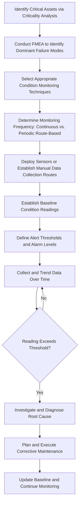

## Condition Monitoring Fundamentals

### Overview

Condition Monitoring Fundamentals covers the techniques and technologies used to observe and measure the physical state of an asset while it operates, in order to detect degradation before it results in functional failure. Condition monitoring is the foundational data-generating layer that feeds Asset Performance Management systems and predictive analytics, and it forms the technical basis for condition-based and predictive maintenance strategies as an alternative or complement to purely time-based preventive maintenance.

### Purpose and Role in the Asset Lifecycle

**Key Points**

- Provides real-time or periodic visibility into an asset's actual physical condition, distinct from and complementary to utilization and reliability metrics such as MTBF and MTTR
- Enables early detection of developing faults before they progress to functional failure, supporting condition-based rather than purely calendar-based maintenance intervention
- Serves as the primary data source feeding Asset Performance Management systems and their predictive/prescriptive analytics capabilities
- Reduces unnecessary maintenance interventions on healthy equipment by providing objective evidence of actual condition rather than relying solely on elapsed time or run hours
- Supports root cause analysis after failures by providing a historical condition trend record leading up to the failure event

### Core Condition Monitoring Techniques

#### Vibration Analysis

- **Key Points**
  - Measures mechanical vibration characteristics (amplitude, frequency, phase) to detect bearing wear, misalignment, imbalance, looseness, and gear defects in rotating equipment
  - Frequency spectrum analysis allows specific fault types to be identified based on characteristic frequency signatures associated with particular failure modes
  - Among the most mature and widely applied condition monitoring technologies for rotating machinery, given decades of established diagnostic correlation between vibration signatures and specific failure modes

#### Thermal Imaging (Infrared Thermography)

- **Key Points**
  - Detects abnormal heat patterns indicating electrical connection issues, insulation breakdown, bearing friction, or fluid blockages
  - Non-contact measurement method allows inspection of energized electrical equipment without direct physical contact, supporting safer inspection practices
  - Particularly effective for electrical switchgear, motor control centers, and mechanical friction-based failure modes

#### Oil Analysis (Lubricant Analysis)

- **Key Points**
  - Analyzes lubricant samples for wear particle content, contamination (water, dirt, coolant), and chemical degradation to assess both the lubricant's remaining service life and the internal condition of lubricated components
  - Particle counting and spectrometric analysis can identify the specific wearing component based on metallic composition of detected wear particles
  - Provides insight into internal component condition without disassembly, making it valuable for enclosed gearboxes, engines, and hydraulic systems

#### Ultrasonic Analysis

- **Key Points**
  - Detects high-frequency sound emissions associated with friction, leaks (compressed air, gas, vacuum), electrical arcing/tracking, and early-stage bearing defects
  - Effective for detecting compressed air and gas leaks that are inaudible to human hearing but represent significant energy and cost losses if undetected
  - Often used as a complementary technique alongside vibration analysis, since ultrasonic methods can detect certain fault types earlier in their development than vibration analysis alone

#### Motor Current Signature Analysis (MCSA)

- **Key Points**
  - Analyzes electrical current waveform patterns drawn by motors to detect rotor bar defects, bearing faults, and mechanical load abnormalities without requiring direct access to the motor itself
  - Enables non-intrusive condition assessment of motors that may be difficult or hazardous to access physically

#### Non-Destructive Testing (NDT) Methods

- **Key Points**
  - Includes techniques such as ultrasonic thickness testing, radiographic testing, magnetic particle inspection, and dye penetrant testing
  - Used primarily to assess structural integrity, wall thickness (corrosion/erosion monitoring), and detect surface or subsurface cracking in pressure vessels, piping, and structural components
  - Often mandated by regulatory or industry code requirements for pressure-retaining or safety-critical equipment, distinct from voluntary condition-based maintenance programs

### Condition Monitoring Technique Selection

| Technique | Primary Fault Types Detected | Best Suited Asset Types |
| --- | --- | --- |
| Vibration analysis | Bearing wear, misalignment, imbalance, gear defects | Rotating machinery (pumps, motors, fans, gearboxes) |
| Thermal imaging | Electrical connection issues, insulation breakdown, friction | Electrical systems, mechanical friction points |
| Oil analysis | Component wear, lubricant degradation, contamination | Gearboxes, engines, hydraulic and enclosed systems |
| Ultrasonic analysis | Leaks, early bearing defects, electrical arcing | Compressed air/gas systems, electrical switchgear |
| Motor current signature analysis | Rotor bar defects, bearing faults, load abnormalities | Electric motors |
| Non-destructive testing | Corrosion, cracking, wall thinning | Pressure vessels, piping, structural components |

**Key Points**

- Technique selection should be driven by the asset's dominant failure modes, ideally identified through a Failure Mode and Effects Analysis (FMEA) rather than applied uniformly across dissimilar asset types
- A combination of complementary techniques often provides more reliable and earlier fault detection than reliance on a single method, since different techniques are sensitive to different fault development stages and mechanisms

### Condition Monitoring Program Development Process

### Continuous vs. Periodic (Route-Based) Monitoring

**Key Points**

- **Continuous monitoring**: Permanently installed sensors provide real-time, ongoing data streams, suited to critical assets where rapid fault development or high consequence of failure justifies the higher implementation cost
- **Periodic/route-based monitoring**: Technicians collect data at scheduled intervals using portable instruments, suited to less critical assets or where continuous instrumentation is not economically justified
- The choice between continuous and periodic monitoring should be informed by asset criticality, failure development speed (how quickly a fault progresses from detectable to functional failure), and the cost of instrumentation relative to asset value
- Hybrid approaches, applying continuous monitoring to the most critical assets while using periodic routes for the broader asset population, are common in mature condition monitoring programs

### Establishing Baselines and Alert Thresholds

**Key Points**

- Baseline readings should be established when the asset is known to be in good condition (ideally during Commissioning) to provide an accurate reference point for detecting future deviation
- Alert thresholds are typically set using a combination of industry standard guidelines (e.g., ISO vibration severity standards), manufacturer recommendations, and asset-specific historical trend data
- Multiple threshold levels (e.g., alert and alarm/danger levels) allow graduated response, distinguishing early-stage developing conditions warranting increased monitoring frequency from advanced conditions requiring immediate intervention
- Thresholds should be periodically reviewed and adjusted based on accumulated operating experience and correlation with actual failure events, rather than treated as permanently fixed at initial setup

### P-F Curve and Lead Time for Intervention

**Key Points**

- Condition monitoring effectiveness is often conceptually framed using the P-F curve, which illustrates the interval between the point a potential failure (P) becomes detectable and the point functional failure (F) actually occurs
- The lead time between P and F varies significantly by failure mode and detection technique; techniques capable of detecting faults earlier in their development (further left on the P-F curve) provide more planning lead time for corrective action
- Effective condition monitoring program design aims to select techniques and monitoring frequency that provide sufficient lead time relative to the specific failure mode's P-F interval, avoiding both wasted early intervention and missed detection windows

### Integration with Maintenance and APM Systems

**Key Points**

- Condition monitoring data feeds directly into Asset Performance Management systems, where it is aggregated into health scores and used as input for predictive analytics models
- Alert conditions should be integrated with the CMMS/EAM system to automatically trigger work order generation or maintenance planning workflows rather than requiring manual handoff
- Condition trend data supports root cause analysis following failures, providing evidence of the degradation pattern that preceded the event

### Common Pitfalls

**Key Points**

- Applying a single condition monitoring technique uniformly across all asset types rather than tailoring technique selection to each asset's dominant failure modes
- Failing to establish accurate baseline readings when equipment is known to be in good condition, undermining the ability to detect meaningful deviation later
- Setting alert thresholds solely from generic industry guidelines without incorporating asset-specific historical data and operating context
- Treating condition monitoring as a standalone activity disconnected from the broader maintenance and APM workflow, resulting in detected issues that do not translate into timely corrective action
- Applying continuous monitoring instrumentation uniformly regardless of asset criticality, resulting in inefficient capital allocation toward monitoring low-consequence assets
- Neglecting to periodically revisit and refine alert thresholds based on accumulated experience, allowing thresholds to become miscalibrated over time

### Related Topics

- The Role of Asset Performance Management Systems
- Measuring Asset Performance through OEE, Availability, MTBF, and MTTR
- Reliability-Centered Maintenance Principles
- Failure Mode and Effects Analysis (FMEA)
- Preventive Maintenance Program Design
- Predictive Maintenance and IoT Sensor Strategy
- Asset Criticality Analysis Frameworks
- Root Cause Analysis and Post-Incident Review