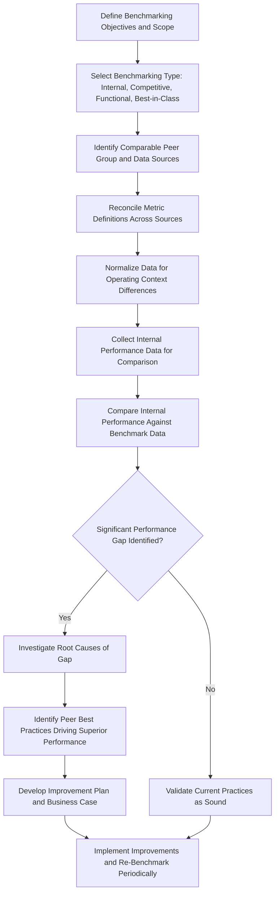

## Benchmarking Asset Performance against Peer Organizations

### Overview

Benchmarking Asset Performance against Peer Organizations is the practice of comparing an organization's asset performance metrics against external reference points — industry peers, cross-industry standards, or best-in-class performers — to identify performance gaps, validate internal targets, and prioritize improvement initiatives. This extends internal performance measurement (OEE, MTBF, MTTR, availability) established through APM and condition monitoring programs by contextualizing those figures against a broader competitive or industry landscape, answering not just "how are we performing" but "how are we performing relative to others facing similar operating conditions."

### Purpose and Role in the Asset Lifecycle

**Key Points**

- Provides external context for internally generated performance metrics, helping distinguish genuinely strong performance from merely adequate performance relative to what is achievable
- Validates or challenges internally set performance targets, preventing organizations from anchoring goals solely on historical internal trends without external reference
- Identifies specific performance gap areas warranting focused investment or process improvement, informed by where peer comparison reveals the largest deviations
- Supports Business Case development by providing external evidence of achievable performance improvement, strengthening the credibility of projected benefits
- Informs strategic asset management planning by revealing whether an organization's asset performance is a competitive advantage, a parity position, or a liability relative to industry peers

### Types of Benchmarking

#### Internal Benchmarking

- **Key Points**
  - Compares performance across similar assets, facilities, or business units within the same organization
  - Useful first step before external benchmarking, since internal data is readily available, directly comparable, and free of external data-sharing complexity
  - Identifies internal best-practice sites or asset owners whose approach might be replicated elsewhere in the organization

#### Competitive/Industry Benchmarking

- **Key Points**
  - Compares performance against direct industry competitors or organizations operating similar asset types under broadly similar conditions
  - Typically requires participation in structured industry benchmarking consortiums, surveys, or third-party data aggregation services, since competitors rarely share performance data bilaterally
  - Provides the most directly relevant comparison but is often the most difficult data to obtain given competitive sensitivity

#### Functional/Generic Benchmarking

- **Key Points**
  - Compares performance against organizations in different industries that share similar underlying asset types or maintenance processes (e.g., comparing pump reliability practices across water utilities, chemical processing, and oil and gas)
  - Can reveal innovative practices not visible within a single industry's conventional approach, since cross-industry comparison escapes the shared blind spots that can develop within a single sector
  - Requires careful normalization since operating context, duty cycle, and environmental conditions may differ meaningfully across industries

#### Best-in-Class Benchmarking

- **Key Points**
  - Compares performance against the top-performing organizations regardless of industry, representing an aspirational rather than typical-peer target
  - Useful for setting stretch targets and understanding the theoretical ceiling of achievable performance with current technology and practices

### Common Benchmarking Metrics and Data Sources

**Key Points**

- Standard reliability and utilization metrics (OEE, MTBF, MTTR, availability) established through internal performance measurement form the basis for external comparison, provided definitions are reconciled across data sources
- Industry associations, professional bodies, and standards organizations (e.g., in specific sectors such as utilities, oil and gas, or manufacturing) frequently publish aggregated benchmark statistics from member surveys
- Third-party benchmarking services and consultancies offer paid access to normalized peer comparison databases, often providing more rigorous data validation than informal industry surveys
- Asset management standards frameworks such as ISO 55000 provide structural guidance for benchmarking maturity and practice, complementing quantitative metric-based comparison with qualitative process maturity assessment

### Benchmarking Process Flow

### Data Normalization Challenges

**Key Points**

- Metric definitions frequently vary across organizations and data sources (what counts as a "failure," how downtime is categorized, how availability denominators are defined), requiring careful reconciliation before valid comparison is possible
- Operating context differences — duty cycle intensity, environmental conditions, asset age profile, regulatory requirements — must be accounted for, since raw metric comparison without context normalization can produce misleading conclusions
- Asset age and technology generation differences between the benchmarking organization and its peers should be considered, since a newer asset fleet may reasonably be expected to outperform an older fleet on raw reliability metrics
- Scale differences (facility size, production volume, geographic dispersion) can affect metrics such as MTTR, since larger organizations may have different logistics and spare parts support capability than smaller peers

### Interpreting Benchmark Results

**Key Points**

- A performance gap relative to peers should prompt investigation into root causes before assuming the gap is closable or that peer practices are directly transferable, since some gaps reflect legitimate differences in operating context rather than performance deficiency
- Performance that exceeds peer benchmarks should still be periodically re-validated, since industry-wide performance can improve over time (benchmark creep), and static internal targets can quietly fall behind an advancing external baseline
- Benchmarking results are most valuable when triangulated with internal root cause analysis and condition monitoring data, connecting the "what" of a performance gap to the "why" needed for effective improvement planning
- Results should be communicated with appropriate caveats regarding data comparability, avoiding overconfident conclusions drawn from imperfectly normalized comparisons [Inference: the degree of achievable normalization varies by data source rigor and peer group homogeneity, and results should be interpreted with corresponding caution]

### Using Benchmarking Results Strategically

**Key Points**

- Benchmark-validated performance targets provide stronger justification within Business Case development than internally generated targets alone, since they demonstrate the target is achievable based on real-world peer evidence
- Significant, well-substantiated performance gaps can support capital investment cases for technology upgrades, APM system implementation, or maintenance strategy transformation
- Benchmarking supports board-level and executive asset management reporting by providing external context that internal-only metrics cannot, informing strategic asset management plan development
- Regular (rather than one-time) benchmarking cycles allow an organization to track relative competitive position over time, rather than relying on a single point-in-time comparison that quickly becomes outdated

### Common Pitfalls

**Key Points**

- Comparing raw metrics across organizations without reconciling differing definitions of failure, downtime, or availability, producing invalid or misleading conclusions
- Treating peer benchmark data as directly actionable without investigating whether the underlying operating context is genuinely comparable
- Relying on informal or anecdotal peer comparison (conference conversations, informal industry reputation) rather than structured, validated benchmarking data sources
- Setting improvement targets based solely on best-in-class benchmarks without considering whether the underlying technology, capital investment, or operating context makes that performance level realistically achievable for the organization
- Conducting benchmarking as a one-time exercise rather than establishing a recurring cycle, allowing the comparison to become outdated as both the organization and its peers evolve
- Failing to combine benchmarking with internal root cause investigation, resulting in awareness of a performance gap without a credible pathway to close it

### Related Topics

- Measuring Asset Performance through OEE, Availability, MTBF, and MTTR
- The Role of Asset Performance Management Systems
- Building the Business Case for Asset Investment
- Strategic Asset Management Plan (SAMP) Development under ISO 55001
- Reliability-Centered Maintenance Principles
- Monitoring Asset Utilization and Capacity
- Root Cause Analysis and Post-Incident Review
- Condition Monitoring Fundamentals