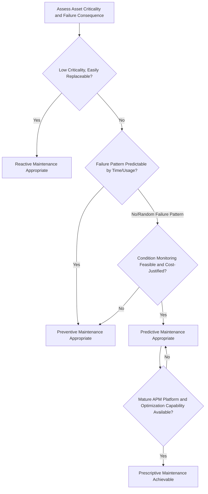

## Comparing Reactive, Preventive, Predictive, and Prescriptive Maintenance

### Overview

Comparing Reactive, Preventive, Predictive, and Prescriptive Maintenance addresses the four principal maintenance strategy paradigms available to an organization, representing an evolutionary spectrum from responding to failures after they occur toward anticipating and preventing them before they happen. Understanding the distinctions, trade-offs, and appropriate application of each strategy is foundational to Reliability Engineering and directly determines how the condition monitoring, APM, and performance measurement capabilities established earlier in the asset lifecycle are actually put to use in maintenance decision-making.

### Purpose and Role in the Asset Lifecycle

**Key Points**

- Establishes the strategic framework guiding how and when maintenance interventions occur across an asset portfolio
- Directly affects total cost of ownership, since different maintenance strategies carry different balances of labor cost, parts cost, downtime cost, and technology investment
- Provides the basis for maintenance strategy selection during Preventive Maintenance Program Design and Reliability-Centered Maintenance analysis
- Determines how effectively an organization leverages condition monitoring and APM system investments, since predictive and prescriptive strategies depend on the data infrastructure established through those capabilities
- Informs resource allocation decisions across maintenance labor, spare parts inventory, and technology investment budgets

### Reactive Maintenance (Run-to-Failure)

Maintenance performed only after an asset has already failed, restoring function without any planned intervention beforehand.

**Key Points**

- Lowest planning overhead and no upfront technology investment required, making it the default state for organizations without a deliberate maintenance strategy
- Appropriate for low-criticality, easily and cheaply replaceable assets where failure consequence is minimal and redundancy or spares are readily available
- Carries the highest risk of unplanned downtime, secondary damage (a failed component causing collateral damage to adjacent systems), and emergency labor/parts premium costs
- Generally the most expensive strategy on a total-cost basis for critical or complex assets, despite appearing cost-minimal in the absence of failure, due to the compounding costs of unplanned downtime and expedited repair

### Preventive Maintenance (Time-Based/Interval-Based)

Scheduled maintenance performed at predetermined time or usage intervals, regardless of the asset's actual condition at the time of intervention.

**Key Points**

- Intervals are typically based on manufacturer recommendations, historical failure data (informed by MTBF analysis), or industry standard practice
- Reduces unplanned failure frequency relative to reactive maintenance by intervening before the statistically expected failure point
- Can result in unnecessary maintenance on components that remain in good condition, consuming labor and parts cost without corresponding reliability benefit
- Risk of "infant mortality" failures introduced by the maintenance intervention itself, since unnecessary disassembly and reassembly can introduce new failure modes not present in undisturbed equipment
- Represents a substantial improvement over pure reactive maintenance in most industrial contexts but does not utilize actual asset condition data in intervention timing decisions

### Predictive Maintenance (Condition-Based)

Maintenance performed based on the actual measured or forecasted condition of an asset, using condition monitoring data and analytics to anticipate failure before it occurs.

**Key Points**

- Relies directly on Condition Monitoring Fundamentals techniques (vibration analysis, oil analysis, thermal imaging, etc.) and Asset Performance Management analytics to determine intervention timing
- Interventions occur only when actual evidence of degradation is present, avoiding both unnecessary maintenance on healthy equipment and unplanned failure on degrading equipment
- Requires greater upfront investment in sensors, monitoring infrastructure, and analytical capability compared to preventive maintenance
- Depends on sufficient historical failure and condition data to establish reliable correlation between monitored parameters and actual failure progression
- Generally achieves better overall cost-effectiveness than preventive maintenance for critical, well-instrumented assets, though the crossover point depends on asset criticality, failure cost, and monitoring investment cost

### Prescriptive Maintenance

An advanced extension of predictive maintenance that not only forecasts when failure is likely to occur, but also recommends or automates the specific corrective action to take, often incorporating optimization across competing constraints.

**Key Points**

- Builds on predictive analytics by adding decision-support or decision-automation logic that recommends specific interventions, timing, and resource allocation
- May incorporate optimization considering multiple constraints simultaneously: production schedule impact, spare parts availability, labor resource constraints, and cost trade-offs
- Represents the most technologically mature and data-intensive maintenance strategy, typically implemented through advanced APM platforms with prescriptive analytics capability
- Still an emerging and less universally adopted practice compared to predictive maintenance, with maturity and capability varying significantly across vendors and industries [Inference: the degree of true prescriptive automation versus decision-support achieved varies substantially by platform and implementation maturity, since this is an actively evolving capability area]

### Comparative Summary

| Dimension | Reactive | Preventive | Predictive | Prescriptive |
| --- | --- | --- | --- | --- |
| Trigger for action | Failure occurrence | Elapsed time/usage | Detected condition/degradation | Forecasted failure + optimized recommendation |
| Planning overhead | None | Low to moderate | Moderate to high | High |
| Technology investment | Minimal | Low | Moderate to high (sensors, analytics) | Highest (advanced analytics, optimization) |
| Unplanned downtime risk | Highest | Moderate | Low | Lowest |
| Unnecessary maintenance risk | None (by definition) | High | Low | Low |
| Data/analytics dependency | None | Historical MTBF only | Condition monitoring data | Condition data + optimization modeling |
| Best fit | Low-criticality, cheap, redundant assets | Assets with predictable, well-understood wear patterns | Critical, well-instrumented, high-consequence-of-failure assets | Highest-criticality assets within mature APM programs |

### Maintenance Strategy Evolution and Selection Process

### Cost-Effectiveness Considerations

**Key Points**

- No single maintenance strategy is universally optimal across an entire asset portfolio; most mature maintenance organizations apply a differentiated mix of strategies matched to each asset's criticality and failure characteristics
- The appropriate strategy for a given asset should be determined through structured analysis such as Reliability-Centered Maintenance or criticality analysis rather than applying a single strategy uniformly
- The total cost curve typically shows reactive maintenance as cheapest in the absence of failure but most expensive when failure costs (downtime, secondary damage, expedited repair) are included; preventive maintenance reduces failure risk at the cost of some unnecessary intervention; predictive and prescriptive maintenance aim to minimize both unnecessary intervention and unplanned failure, at the cost of higher technology investment
- Migration toward predictive and prescriptive strategies should be justified through a Business Case demonstrating that the investment in monitoring and analytics capability is offset by expected reductions in downtime and unnecessary maintenance cost

### Organizational and Cultural Considerations

**Key Points**

- Transitioning from reactive to preventive, predictive, or prescriptive strategies typically requires cultural change management, since reactive maintenance cultures often measure success by rapid firefighting response rather than proactive prevention
- Maintenance workforce skill requirements shift substantially across the spectrum, with predictive and prescriptive strategies requiring greater data analysis and diagnostic technology competency than traditional reactive or preventive approaches
- Organizations often progress through this spectrum incrementally rather than jumping directly to predictive or prescriptive maintenance across an entire asset base, building capability and demonstrating value on a subset of critical assets first

### Common Pitfalls

**Key Points**

- Applying a single maintenance strategy uniformly across an entire asset portfolio without differentiating by criticality and failure characteristics
- Investing in predictive or prescriptive technology for low-criticality assets where the investment cost exceeds any realistic downtime or failure cost avoidance
- Treating preventive maintenance intervals as permanently fixed rather than periodically revisiting them based on accumulated MTBF data and failure experience
- Underestimating the organizational change management effort required to shift maintenance culture from reactive firefighting toward proactive strategy
- Assuming predictive maintenance technology alone guarantees improved outcomes without the underlying data quality, sensor coverage, and organizational process maturity to support it
- Conflating predictive and prescriptive maintenance, when the latter requires additional optimization and recommendation capability beyond simple failure forecasting

### Related Topics

- Preventive Maintenance Program Design
- Reliability-Centered Maintenance Principles
- Condition Monitoring Fundamentals
- The Role of Asset Performance Management Systems
- Measuring Asset Performance through OEE, Availability, MTBF, and MTTR
- Failure Mode and Effects Analysis (FMEA)
- Asset Criticality Analysis Frameworks
- Building the Business Case for Asset Investment