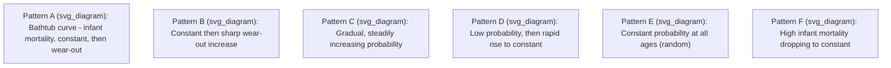
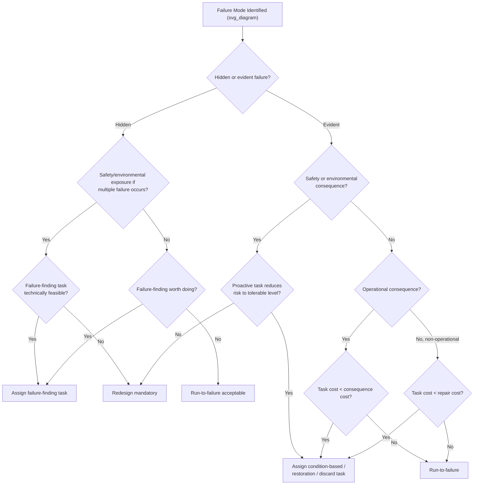

## Reliability-Centered Maintenance Methodology

### Definition and Purpose

Reliability-Centered Maintenance (RCM) is a structured analytical process used to determine the optimal maintenance requirements of a physical asset in its operating context. RCM does not ask "what maintenance should be done" in isolation; it asks a sequence of specific questions about each asset's functions, failure modes, and consequences, and derives maintenance tasks only where they are technically feasible and worth doing. The methodology originated in the commercial aviation industry in the 1960s–70s (documented formally in Nowlan and Heap's 1978 report for the U.S. Department of Defense) and was later standardized for broader industrial use in **SAE JA1011** (evaluation criteria for RCM processes) and **SAE JA1012** (RCM guide).

The core objective is to preserve system function at the lowest overall cost, rather than to maximize equipment life or minimize failures in isolation. This distinguishes RCM from purely time-based or reactive maintenance philosophies.

### The Seven Governing Questions

SAE JA1011 defines RCM as any maintenance process that answers seven questions, in order, for the asset or system under review:

1. **Functions** — What are the functions and associated performance standards of the asset in its present operating context?
2. **Functional Failures** — In what ways can it fail to fulfill its functions?
3. **Failure Modes** — What causes each functional failure?
4. **Failure Effects** — What happens when each failure occurs?
5. **Failure Consequences** — In what way does each failure matter?
6. **Proactive Tasks** — What should be done to predict or prevent each failure?
7. **Default Actions** — What should be done if a suitable proactive task cannot be found?

Each question builds on the previous one. Skipping steps (e.g., jumping straight to selecting tasks without first classifying failure consequences) is the most common way organizations produce a process that resembles RCM but does not meet the SAE JA1011 definition — often called "RCM-lite" or "pseudo-RCM."

### Functions and Performance Standards

A function statement describes what the asset is required to do, including a quantifiable performance standard. Functions are split into two categories:

- **Primary functions**: the main reason the asset exists (e.g., "pump water from Tank A to Tank B at a minimum rate of 200 L/min").
- **Secondary functions**: functions the asset must also perform but which are not the main reason for its existence — containment, structural support, appearance, safety, environmental integrity, economy, and comfort.

Performance standards must be specific and measurable wherever possible. "Pump water" is not a function statement; "pump water at not less than 200 L/min at a discharge pressure of 4 bar" is.

### Functional Failures

A functional failure is any state in which the asset is unable to meet a defined performance standard. Because performance standards can include upper and lower bounds, a single function can have multiple functional failures — e.g., a pump that fails by delivering *too little* flow and a pump that fails by delivering *too much* flow are two distinct functional failures of the same function.

### Failure Modes (FMEA Layer)

Failure modes are the specific events that cause a functional failure — this stage embeds a Failure Mode and Effects Analysis (FMEA) within RCM. Failure modes are typically categorized by cause:

- Capability decreasing below the required standard (wear, corrosion, fatigue, contamination)
- Applied stress exceeding the initial capability (operator error, process upset, external event)
- Design capability inadequate from installation (design deficiency)

Best practice, per SAE JA1012, is to identify failure modes at a level of detail sufficient to select an appropriate management policy — not so granular that the analysis becomes unmanageable, but not so vague that root causes are obscured.

### Failure Effects

Failure effects describe what physically happens when a failure mode occurs: evidence of the failure, safety or environmental hazards, production/operational impact, and physical damage caused. This step feeds directly into consequence classification.

### Failure Consequence Categories

RCM's defining feature is that maintenance tasks are only assigned after a failure's consequence is classified. Four categories are used:

| Category | Description | Task Selection Priority |
| --- | --- | --- |
| Hidden failure consequences | Failure is not evident to operators under normal conditions (e.g., a protective device) | Must ensure adequate protection against multiple failure; failure-finding tasks often mandatory |
| Safety and environmental consequences | Failure could injure/kill someone or breach environmental regulation | Task must reduce risk to tolerable level; if none exists, redesign is mandatory |
| Operational consequences | Failure affects production, output quality, customer service, or operating costs (in addition to repair cost) | Task justified only if cost of task < cost of consequences over time |
| Non-operational consequences | Only the direct cost of repair is involved | Task justified only if cost of task < cost of repair over time |

**Key Points**

- Hidden and safety/environmental failures are addressed on a **must-work** basis — risk reduction, not cost, drives the decision.
- Operational and non-operational failures are addressed on a **worth-it** basis — cost-effectiveness drives the decision.
- This consequence-first logic is what prevents RCM from over-maintaining low-risk components and under-maintaining critical hidden functions.

### Proactive Task Selection Logic

For each failure mode, RCM evaluates proactive tasks against two criteria: technical feasibility and worth-doing (given the consequence category). Three families of proactive tasks exist:

**Condition-based (predictive) tasks**

Applicable when a potential failure (an identifiable warning that a functional failure is about to occur) can be detected. Requires a measurable **P-F interval** — the interval between the point a potential failure becomes detectable (P) and the point it degrades to functional failure (F). The inspection interval must be meaningfully shorter than the P-F interval (commonly recommended at half the P-F interval or less) to guarantee detection before failure. Examples: vibration analysis, oil analysis, thermography, ultrasonic testing, corrosion monitoring.

**Scheduled restoration tasks**

Restoring an item's capability at or before a specified age limit, regardless of condition, requires that the item exhibit a clear increase in conditional probability of failure at an identifiable age (i.e., wear-out characteristics). Examples: engine overhaul at fixed hours, seal replacement at fixed intervals.

**Scheduled discard tasks**

Discarding an item at or before a specified life limit, applicable to items with known safe-life characteristics, typically safety-critical single-use or fatigue-limited components. Example: replacing a fatigue-critical structural bolt after a defined number of load cycles.

The historically significant finding from the Nowlan and Heap study is that **only a minority of components exhibit an age-related wear-out pattern** justifying scheduled restoration or discard; the majority of failure patterns show no strong correlation between age and failure probability, which is why condition-based and default strategies dominate modern RCM outcomes.

### The Six Failure Patterns (Age-Reliability Curves)

RCM literature classifies failure probability behavior into six characteristic conductivity patterns, originally identified in airline maintenance data:

**Key Points**

- Patterns A, B, C (roughly 6–11% of components in the original studies) show age-related wear-out and justify age-based tasks.
- Patterns D, E, F (roughly 89–94% of components) show no strong age correlation, meaning scheduled overhaul provides little or no reliability benefit and may even introduce infant mortality risk (Pattern F, common after intrusive maintenance).
- [Inference] The exact percentages vary across industries and asset classes; the original Nowlan and Heap ratios were derived from commercial aviation fleets and should not be applied uncritically to other domains without local failure data.

### Default Actions (When No Proactive Task Is Feasible)

When no technically feasible and worth-doing proactive task exists, RCM prescribes one of three default strategies:

1. **Failure-finding**: a scheduled task to check whether a hidden function has already failed (applicable only to hidden failures). Interval is derived from the required availability of the protective function.
2. **Redesign**: modifying the asset, process, or procedure to eliminate the failure mode or change its consequence category. Mandatory when a safety or environmental hidden failure has no feasible failure-finding task.
3. **Run-to-failure (no scheduled maintenance)**: a deliberate decision, not neglect, applicable when consequences are non-operational/minor and no proactive task is technically feasible or cost-justified.

### RCM Decision Diagram (Logic Flow)

### RCM Information Worksheet Structure

Practical RCM analysis is documented in two linked worksheets per SAE JA1012:

**Failure Mode and Effects Analysis (FMEA) worksheet** — columns typically include: Function, Functional Failure, Failure Mode, Failure Effect.

**Decision worksheet** — columns typically include: Failure Mode reference, Consequence classification (H/S/O/N), Proactive task feasibility (Y/N), Task selected, Task interval, Task responsibility (operations vs. maintenance), and Default action (if applicable).

### Worked Example

Asset: Centrifugal pump feeding a cooling loop (non-redundant).

| Step | Content |
| --- | --- |
| Function | Circulate coolant at 150–200 L/min at all times the plant is operating |
| Functional Failure | Fails to circulate coolant at ≥150 L/min |
| Failure Mode | Mechanical seal wear leading to internal leakage |
| Failure Effect | Flow drops gradually over days/weeks; audible/visual leak; eventual pump trip on low flow interlock |
| Consequence | Evident, operational (production stoppage if undetected) |
| Proactive Task | Vibration and seal-leak inspection monthly (P-F interval estimated at 8–10 weeks based on OEM data and historical trend) |
| Justification | Task cost (inspection labor) $\ll$ consequence cost (unplanned downtime + collateral pump damage) |

**Example**

If the P-F interval for seal degradation is measured at 8 weeks, the inspection task should be scheduled at approximately every 3–4 weeks to leave margin for corrective scheduling before functional failure — consistent with the "half the P-F interval" heuristic.

### RCM vs. Related Methodologies

| Aspect | RCM | Preventive Maintenance (traditional) | Total Productive Maintenance (TPM) | Predictive Maintenance (PdM) alone |
| --- | --- | --- | --- | --- |
| Starting point | Function and consequence analysis | Manufacturer time intervals | Operator involvement and OEE | Condition monitoring data |
| Task justification | Consequence-driven, technically feasible + worth-doing | Often calendar/usage-driven regardless of failure pattern | Loss elimination and autonomous maintenance | Sensor threshold-driven |
| Scope | All failure modes, all task types (including run-to-failure) | Primarily fixed-interval restoration/discard | Organizational and cultural | One task family only |
| Standardization | SAE JA1011 / JA1012 | Vendor/industry-specific | JIPM framework | Vendor/technology-specific |

**Key Points**

- RCM is a decision-making *framework*, not a single task type — it can output condition-based tasks, scheduled tasks, failure-finding tasks, redesign recommendations, or a deliberate run-to-failure decision.
- PdM and TPM are often implemented as components *within* an RCM-derived maintenance plan rather than as competing methodologies.

### Implementation Process (Program Level)

1. **Asset criticality analysis / system selection** — prioritize systems for RCM analysis using criticality ranking (safety, environmental, production, cost impact).
2. **Functional block diagram development** — define system boundaries, inputs, and outputs.
3. **FMEA facilitation** — conducted by a cross-functional team (operations, maintenance, engineering) led by a trained facilitator, since tacit operational knowledge is essential input.
4. **Consequence classification and task selection** — apply the RCM decision logic per failure mode.
5. **Task packaging** — group tasks into maintenance routines by interval, discipline, and required shutdown state.
6. **CMMS/EAM integration** — load resulting task lists, intervals, and spare-parts requirements into the Computerized Maintenance Management System.
7. **Living program review** — RCM outputs must be revisited when failure data, operating context, or consequence severity changes; RCM is not a one-time study.

**Key Points**

- Facilitator-led group analysis is standard practice because failure mode identification depends heavily on frontline operational and craft knowledge that is rarely fully documented.
- [Inference] The time investment for a full classical RCM analysis is substantial (often cited in practitioner literature as tens of hours per equipment class), which has driven the development of streamlined variants below.

### RCM Variants and Streamlined Approaches

- **Classical RCM (RCM I / RCM II)** — full seven-question process per Nowlan/Heap and Moubray, applied per failure mode.
- **Streamlined RCM (SRCM)** — uses generic failure mode libraries and templated logic trees to reduce analysis time for lower-criticality assets.
- **PMO (PM Optimization)** — reverse-engineers an *existing* maintenance program against RCM logic to eliminate low-value tasks, rather than building a program from a blank sheet.
- **Risk-Based Maintenance (RBM)** — extends consequence classification into quantified risk (probability × severity), often used for regulated/process-safety environments.

[Unverified] Vendor-specific claims about time savings for streamlined variants (commonly cited as 50–70% reduction in analysis effort) vary significantly by implementation and are not independently standardized figures.

### Common Implementation Pitfalls

- Applying RCM logic only to select tasks while skipping formal function/failure-mode definition ("RCM-lite"), which loses traceability and audit defensibility.
- Treating consequence classification as a formality rather than rigorously separating hidden vs. evident failures — this is the most frequent source of under-protected safety-critical hidden functions.
- Setting P-F interval-based inspection frequencies from vendor defaults rather than local failure history, which can produce false confidence in detection windows.
- Failing to revisit the RCM analysis after design changes, process changes, or a run of unexpected failures, allowing the maintenance plan to drift out of alignment with actual failure behavior.

### Related Topics

- Failure Mode, Effects, and Criticality Analysis (FMECA)
- P-F Interval and Condition Monitoring Technique Selection
- Preventive vs. Predictive vs. Prescriptive Maintenance Strategies
- Asset Criticality Analysis and Ranking Methods
- Total Productive Maintenance (TPM) and Autonomous Maintenance
- Risk-Based Inspection (RBI) in Process Industries
- CMMS/EAM Task Library Design and Maintenance Planning
- Weibull Analysis and Age-Reliability Data Modeling
- SAE JA1011 / JA1012 Compliance Auditing