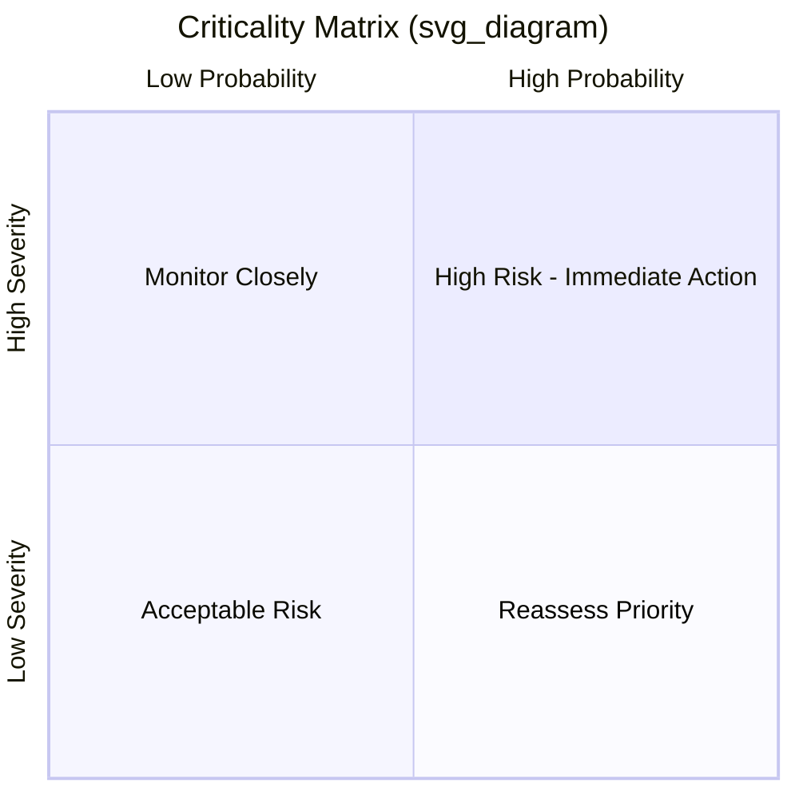

## Failure Mode, Effects, and Criticality Analysis

### Definition and Purpose

Failure Mode, Effects, and Criticality Analysis (FMECA) is a bottom-up, inductive reliability analysis method that identifies how a system, subsystem, or component can fail, what effects each failure produces at local and system levels, and how severe/likely that failure is relative to others. FMECA extends the base Failure Mode and Effects Analysis (FMEA) by adding a formal **criticality** ranking step, allowing failure modes to be prioritized for design change, maintenance action, or risk mitigation resources.

The methodology is standardized primarily in **MIL-STD-1629A** (the original U.S. military standard, technically inactive for new contracts but still the most cited reference), **SAE J1739** (automotive-oriented FMEA/FMECA), and **IEC 60812** (the current international standard covering both FMEA and FMECA). In Asset Lifecycle Management, FMECA is most often used as the analytical engine feeding into Reliability-Centered Maintenance (RCM), spare-parts strategy, and design-for-reliability decisions.

### FMEA vs. FMECA Distinction

**Key Points**

- FMEA identifies failure modes, causes, and effects, and typically ranks them via a qualitative or semi-quantitative **Risk Priority Number (RPN)**.
- FMECA performs the same identification step, then adds a **criticality analysis** — a more formally defined severity × probability calculation, often tied to a specific criticality matrix or mathematical criticality number ($C_r$).
- In practice many organizations use "FMEA" and "FMECA" interchangeably; the distinguishing factor is whether a formal, standards-based criticality calculation is performed, versus an informal RPN scoring exercise.

### Types of FMECA

| Type | Focus | Typical Use Case |
| --- | --- | --- |
| Design FMECA (DFMECA) | Failure modes arising from product/system design | New equipment design, design reviews |
| Process FMECA (PFMECA) | Failure modes arising from manufacturing/assembly/operating processes | Production line qualification, procedure design |
| System FMECA | Interactions and interfaces between subsystems | Complex multi-component asset systems |
| Functional FMECA | Failure modes defined by function loss rather than physical part | Early design stage, before detailed part lists exist |

### Core Analytical Steps

1. **System definition and functional decomposition** — establish system boundaries, block diagrams, and the hierarchical breakdown (system → subsystem → component → part).
2. **Failure mode identification** — for each item, identify all plausible ways it can fail to perform its intended function (e.g., fails open, fails closed, drifts out of tolerance, fractures, seizes, leaks).
3. **Failure cause identification** — the mechanism or root cause producing each failure mode (fatigue, corrosion, contamination, overload, design defect, human error).
4. **Failure effects analysis** — effects are typically documented at three levels:
   - **Local effect**: impact on the immediate component/subsystem
   - **Next higher-level effect**: impact on the parent assembly
   - **End effect**: impact on overall system function, safety, or mission
5. **Failure detection method** — current or proposed means of detecting the failure before it causes higher-level consequences (inspection, alarm, built-in test, operator observation).
6. **Severity classification** — categorical ranking of the worst-case end effect.
7. **Occurrence/probability estimation** — likelihood the failure mode occurs, from historical data, test data, or engineering judgment.
8. **Criticality calculation** — combining severity and probability into a criticality ranking (see methods below).
9. **Recommended actions** — design changes, maintenance tasks, inspection additions, or risk acceptance decisions.
10. **Follow-up and closure tracking** — verifying recommended actions were implemented and re-assessing residual criticality.

### MIL-STD-1629A Severity Classification

| Category | Severity | Description |
| --- | --- | --- |
| I | Catastrophic | Failure may cause death or system loss |
| II | Critical | Failure may cause severe injury, major property damage, or major system damage |
| III | Marginal | Failure may cause minor injury, minor property damage, or degradation |
| IV | Minor | Failure is not serious enough to cause injury or major system damage |

### Criticality Calculation Methods

**Quantitative approach (Criticality Number, $C_r$)**

$$C_r = \sum_{n=1}^{N} \beta \cdot \alpha \cdot \lambda_p \cdot t$$

Where:

- $\beta$ = conditional probability the failure mode results in the identified critical effect
- $\alpha$ = failure mode ratio (fraction of the component's total failure rate attributable to this specific failure mode)
- $\lambda_p$ = part failure rate (failures per operating hour, typically from a reliability database such as MIL-HDBK-217, NPRD, or field data)
- $t$ = operating time (mission duration or duty cycle time of interest)
- $N$ = number of failure modes considered for that item under the given severity classification

**Qualitative approach (Criticality Matrix)**

When failure rate data is unavailable or unreliable, MIL-STD-1629A permits a qualitative matrix plotting **Severity** (categories I–IV) against **Probability of Occurrence** (levels A–E, from "frequent" to "extremely unlikely"), placing each failure mode into the matrix to visually identify high-risk cells.

Note: the quadrant chart above is a conceptual placement aid; actual MIL-STD-1629A practice uses a discrete severity (I–IV) by probability-level (A–E) grid rather than a continuous quadrant plot.

### Risk Priority Number (RPN) Method — Automotive/SAE J1739 Convention

$$RPN = S \times O \times D$$

Where each factor is typically scored 1–10:

- $S$ (Severity) — seriousness of the failure's effect
- $O$ (Occurrence) — likelihood of the failure mode occurring
- $D$ (Detection) — likelihood the failure will be detected before reaching the customer/end user (inverse scale: 10 = very unlikely to detect)

**Key Points**

- RPN ranges from 1 to 1000; higher values indicate higher priority for corrective action.
- [Inference] RPN is widely criticized in reliability literature for weighting all three factors equally and for producing non-unique scores (different S/O/D combinations yielding the same RPN despite very different risk profiles) — this is a documented methodological limitation, not merely an opinion.
- The **AIAG-VDA FMEA Handbook (2019)** — the current joint automotive industry standard — replaced RPN with an **Action Priority (AP)** table (High/Medium/Low) that uses severity as the dominant sorting factor before occurrence and detection, specifically to address the RPN ranking limitation.

### FMECA Worksheet Structure

| Column | Content |
| --- | --- |
| Item/Function ID | Component or function reference number |
| Failure Mode | Specific way the item fails |
| Failure Cause/Mechanism | Root cause producing the failure mode |
| Local Effect | Immediate consequence |
| Next Higher Effect | Consequence at parent assembly level |
| End Effect | System/mission-level consequence |
| Detection Method | Current means of detection |
| Severity Class | I–IV (MIL-STD) or 1–10 (AIAG) |
| Occurrence/Probability | Rate or qualitative level |
| Criticality ($C_r$) or RPN | Calculated value |
| Recommended Action | Design change, task, or acceptance |
| Responsible/Target Date | Owner and closure tracking |

### Worked Example

Asset: Hydraulic actuator on a production line valve.

| Field | Content |
| --- | --- |
| Failure Mode | Internal seal degradation leading to bypass leakage |
| Failure Cause | Elastomer seal material incompatible with hydraulic fluid additive package |
| Local Effect | Reduced actuator force output |
| Next Higher Effect | Valve fails to reach commanded position within cycle time |
| End Effect | Process interruption; potential product quality deviation |
| Detection Method | Position feedback deviation alarm |
| Severity | Category III (Marginal) — production impact, no safety hazard |
| Occurrence | Level C (Occasional) — historical data shows ~2 occurrences/year fleet-wide |
| $\alpha$ (failure mode ratio) | 0.35 (35% of actuator failures attributable to this mode, per field data) |
| $\lambda_p$ | 12 failures per $10^6$ hours (component-level base rate) |
| Recommended Action | Substitute seal material rated for the current fluid additive package; add oil analysis to detect early degradation |

**Example**

Using the quantitative formula with $\beta = 0.8$ (high confidence the seal failure leads to the stated end effect), $\alpha = 0.35$, $\lambda_p = 12 \times 10^{-6}$/hr, and $t = 4000$ operating hours:

$$C_r = 0.8 \times 0.35 \times 12\times10^{-6} \times 4000 = 0.01344$$

This criticality number is then compared against other failure modes' $C_r$ values for the same item to establish relative priority for corrective action.

### FMECA in the Asset Lifecycle Management Context

- **Design phase**: FMECA drives design-for-reliability changes before capital commitment, when modification cost is lowest.
- **Procurement/specification phase**: Criticality outputs justify redundancy requirements, spare-parts holding levels, and vendor reliability requirements written into specifications.
- **Commissioning/operations phase**: FMECA outputs feed directly into RCM's failure mode and failure effects steps, avoiding duplicate analysis effort — many organizations perform a single combined FMECA/RCM failure-mode workshop rather than two separate exercises.
- **Spares and inventory planning**: Criticality rankings inform which components warrant strategic spares holding versus reactive procurement.
- **Obsolescence and end-of-life planning**: High-criticality items with single-source suppliers are flagged for lifetime-buy or redesign decisions before supplier discontinuation.

### FMECA vs. RCM Relationship

| Aspect | FMECA | RCM |
| --- | --- | --- |
| Primary question | How can this fail, and how bad is it? | Given how it fails, what should we do about it? |
| Output | Ranked list of failure modes by criticality | Specific maintenance tasks and default actions |
| Consequence handling | Severity/probability scoring (relative ranking) | Consequence-category logic (hidden/safety/operational/non-operational) tied directly to task justification |
| Typical scope | Often broader, including design-stage analysis | Primarily operations/maintenance-stage, requires an existing or planned physical asset |

**Key Points**

- RCM's failure mode and failure effects steps (questions 3–4 of the seven RCM questions) are structurally identical to FMECA's core steps; RCM adds the consequence-classification and task-selection logic on top.
- Many practitioners treat FMECA as the analytical foundation and RCM as the decision-application layer built on that foundation.

### Common Implementation Pitfalls

- Scoring severity, occurrence, and detection in isolation without cross-functional input, producing scores that reflect individual bias rather than validated failure data.
- Using RPN thresholds as a hard cutoff for action without considering that a single very high severity score (e.g., safety-critical) may warrant action regardless of a moderate composite RPN — this is precisely the limitation the AIAG-VDA Action Priority table was designed to correct.
- Treating FMECA as a one-time document rather than a living analysis updated after design changes, field failure data updates, or incident investigations.
- Conflating "detection" in a Design FMECA (detection during design verification/testing) with "detection" in a Process FMECA (detection during production before shipment) — these represent different points in the lifecycle and should not share a single generic detection scale without adaptation.
- Insufficiently decomposing functions before assigning failure modes, resulting in vague failure mode descriptions ("pump fails") that cannot be meaningfully mapped to a specific cause or corrective action.

### Related Topics

- Reliability-Centered Maintenance (RCM) Methodology
- Fault Tree Analysis (FTA) and Quantitative Risk Modeling
- AIAG-VDA FMEA Handbook and Action Priority Tables
- Weibull Analysis and Failure Rate Data Sources (MIL-HDBK-217, NPRD)
- Root Cause Analysis (RCA) Techniques
- Spare Parts Criticality Ranking and Inventory Optimization
- Design for Reliability (DfR) Principles
- Risk-Based Inspection (RBI) in Process Industries