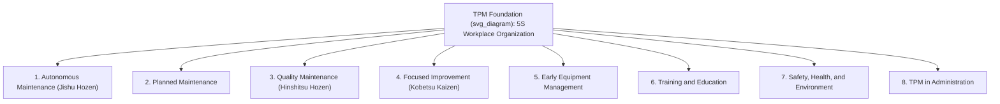

## Total Productive Maintenance Principles

### Definition and Purpose

Total Productive Maintenance (TPM) is a holistic, organization-wide maintenance philosophy that integrates equipment maintenance into the manufacturing/operations culture rather than treating it as a separate specialist function. TPM originated in Japan in the 1970s at Nippondenso (a Toyota Group supplier), building on American preventive maintenance concepts, and was formalized by the **Japan Institute of Plant Maintenance (JIPM)**, which remains the primary certifying and standardizing body (JIPM TPM Excellence Awards).

The defining principle distinguishing TPM from other maintenance strategies is **shared ownership of equipment condition between operators and maintenance specialists**, pursued through structured, incremental improvement activities aimed at eliminating losses that reduce overall equipment effectiveness.

### The Eight Pillars of TPM

**Key Points**

- All eight pillars rest on a **5S** foundation (Sort, Set in order, Shine, Standardize, Sustain — Seiri, Seiton, Seiso, Seiketsu, Shitsuke) — workplace organization is treated as a prerequisite, not an optional add-on.
- The pillars are pursued in parallel by cross-functional teams, not sequentially, though Autonomous Maintenance is typically the first pillar an organization deploys operationally.

### Pillar 1: Autonomous Maintenance (Jishu Hozen)

Operators take ownership of basic equipment care — cleaning, lubrication, inspection, and minor adjustment — that does not require specialized maintenance craft skill. This frees maintenance technicians to focus on higher-skill diagnostic and repair work, and gives operators an intimate understanding of their equipment's normal condition, improving early abnormality detection.

**Seven-Step Autonomous Maintenance Implementation**

| Step | Activity |
| --- | --- |
| 1 | Initial cleaning (cleaning is inspection — expose hidden defects) |
| 2 | Eliminate sources of contamination and inaccessible areas |
| 3 | Establish cleaning, lubrication, and inspection standards |
| 4 | Conduct general inspection training (operators learn equipment fundamentals) |
| 5 | Conduct autonomous inspection (operators perform independently) |
| 6 | Standardize workplace organization and visual management |
| 7 | Full autonomous management (operators contribute to continuous improvement) |

### Pillar 2: Planned Maintenance

A structured, scheduled maintenance program managed by the maintenance department, encompassing preventive, predictive, and corrective strategies. Planned Maintenance in TPM typically incorporates the same task-selection logic found in Reliability-Centered Maintenance (RCM) — condition-based, time-based, and failure-finding tasks — but emphasizes progressive maturity through defined stages:

1. Reduce failure variability (stabilize mean time between failures)
2. Extend equipment life (address deterioration proactively)
3. Periodically restore deterioration (scheduled restoration)
4. Predict equipment life (condition monitoring)

### Pillar 3: Quality Maintenance (Hinshitsu Hozen)

Focuses on preventing quality defects by controlling equipment conditions that affect product quality, using root-cause analysis to establish and maintain **zero-defect conditions** on the equipment itself, rather than inspecting quality into the product after the fact. This pillar establishes condition-quality checkpoints (e.g., specific temperature, pressure, or alignment tolerances) that, if maintained, guarantee defect-free output.

### Pillar 4: Focused Improvement (Kobetsu Kaizen)

Small, cross-functional teams conduct targeted improvement projects to eliminate the **Six Big Losses** (see below) at specific, chronic loss points identified through OEE data analysis. This pillar is the primary mechanism for continuous, incremental gains in equipment effectiveness.

### Pillar 5: Early Equipment Management

Applies lessons learned from operating and maintaining existing equipment to the design and commissioning of new equipment (sometimes called Maintenance Prevention or MP design), aiming to achieve vertical startup — reaching target production speed and quality rapidly after installation — by designing out known failure modes and maintainability problems before purchase.

### Pillar 6: Training and Education

Structured, skills-matrix-driven development for operators (equipment competence), maintenance staff (diagnostic and repair skill progression), and managers (TPM facilitation and leadership). Skill development is typically tracked against defined competency levels rather than treated as ad hoc.

### Pillar 7: Safety, Health, and Environment

Targets a zero-accident, zero-health-damage, zero-fire workplace, integrated with autonomous maintenance activities (since improved equipment condition and operator engagement directly reduce unsafe conditions and unsafe acts).

### Pillar 8: TPM in Administration (Office TPM)

Extends TPM loss-elimination and 5S principles to administrative and support functions (procurement, planning, scheduling) to reduce waste in non-manufacturing processes that indirectly affect equipment uptime, such as delayed spare parts procurement or scheduling errors.

### Overall Equipment Effectiveness (OEE)

OEE is TPM's primary quantitative metric, combining three factors:

$$OEE = Availability \times Performance \times Quality$$

Where:

$$Availability = \frac{Operating\ Time}{Planned\ Production\ Time}$$

$$Performance = \frac{Ideal\ Cycle\ Time \times Total\ Count}{Operating\ Time}$$

$$Quality = \frac{Good\ Count}{Total\ Count}$$

**Key Points**

- A "world-class" OEE benchmark of 85% is commonly cited in TPM literature (JIPM-associated sources), though [Inference] this figure is industry- and process-dependent and should not be treated as a universal target across all equipment types and industries.
- OEE decomposition is the diagnostic tool that directs Focused Improvement (Pillar 4) teams to the specific loss category consuming the most capacity.

### The Six Big Losses

| Loss Category | OEE Factor Affected | Examples |
| --- | --- | --- |
| Equipment failure (breakdowns) | Availability | Unplanned mechanical/electrical failure |
| Setup and adjustment | Availability | Changeover time, tooling adjustment |
| Idling and minor stoppages | Performance | Sensor blocked, jam clearance, misfeed |
| Reduced speed | Performance | Running below designed cycle rate |
| Process defects | Quality | Scrap, rework during stable running |
| Reduced yield (startup) | Quality | Scrap/rework during startup until stable production |

**Example**

A production line planned to run 480 minutes/shift experiences 60 minutes of downtime (breakdowns + changeovers), runs at 90% of ideal speed for the remaining time, and produces 2% defective units.

$$Availability = \frac{420}{480} = 0.875$$

$$Performance = 0.90$$

$$Quality = 0.98$$

$$OEE = 0.875 \times 0.90 \times 0.98 = 0.7718 \approx 77.2\%$$

This result would direct a Focused Improvement team to first investigate the availability loss (60 minutes of downtime), since it represents the largest single deviation from 100% in this example.

### TPM Implementation Roadmap (JIPM 12-Step Model)

1. Announce top management's decision to introduce TPM
2. Launch introductory education and campaign
3. Establish TPM promotion organizational structure
4. Establish basic TPM policies and goals
5. Formulate a master plan for TPM development
6. Hold the TPM kickoff event
7. Improve the effectiveness of each piece of equipment (Kobetsu Kaizen)
8. Establish an Autonomous Maintenance program
9. Establish a Planned Maintenance program
10. Conduct training to improve operation and maintenance skills
11. Establish an early equipment management program
12. Perfect TPM implementation and raise TPM levels (pursue JIPM award / higher targets)

### TPM vs. Related Maintenance Strategies

| Aspect | TPM | RCM | Traditional Preventive Maintenance |
| --- | --- | --- | --- |
| Primary driver | Organizational culture and loss elimination | Function/consequence-driven task logic | Manufacturer/calendar interval |
| Ownership model | Shared (operators + maintenance) | Maintenance/engineering-led analysis | Maintenance department only |
| Primary metric | OEE | Failure consequence risk reduction | Compliance to schedule |
| Scope | Whole-plant/organizational | Per-asset/per-failure-mode analytical | Task scheduling only |

**Key Points**

- TPM and RCM are complementary, not competing: TPM's Planned Maintenance pillar commonly uses RCM logic to select which tasks belong in the scheduled program, while TPM's Autonomous Maintenance pillar supplies the day-to-day condition monitoring and early-detection input that feeds RCM's condition-based tasks.
- Organizations pursuing ISO 55000 asset management frameworks frequently position TPM as the operational/cultural layer and RCM as the analytical/technical layer within the same overall maintenance strategy.

### Common Implementation Pitfalls

- Launching Autonomous Maintenance without adequate initial-cleaning-as-inspection training, causing operators to clean equipment without learning to recognize abnormalities — undermining the pillar's core purpose.
- Treating TPM as a maintenance-department-only initiative rather than securing genuine cross-functional and top-management sponsorship, which JIPM's own 12-step model places as the explicit first step.
- Measuring OEE inconsistently across lines or shifts (differing definitions of "planned production time" or "ideal cycle time"), producing benchmarking data that cannot be meaningfully compared.
- Pursuing Focused Improvement projects without first stabilizing basic conditions (5S and initial cleaning), leading to improvements that do not hold because underlying contamination/deterioration sources remain unaddressed.
- [Inference] Expecting rapid OEE gains; JIPM case studies and practitioner literature generally describe TPM maturation to award-level performance as a multi-year (often 3+ year) organizational process rather than a short-term program.

### Related Topics

- Reliability-Centered Maintenance (RCM) Methodology
- Overall Equipment Effectiveness (OEE) Measurement Systems
- 5S Workplace Organization Methodology
- Autonomous Maintenance Implementation Planning
- Single-Minute Exchange of Die (SMED) for Setup Reduction
- Kaizen and Continuous Improvement Frameworks
- ISO 55000 Asset Management Standard
- Computerized Maintenance Management Systems (CMMS) for TPM Tracking