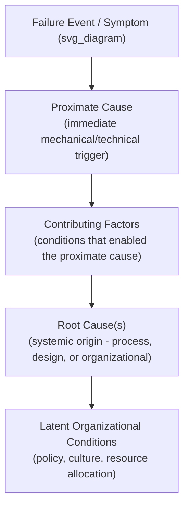
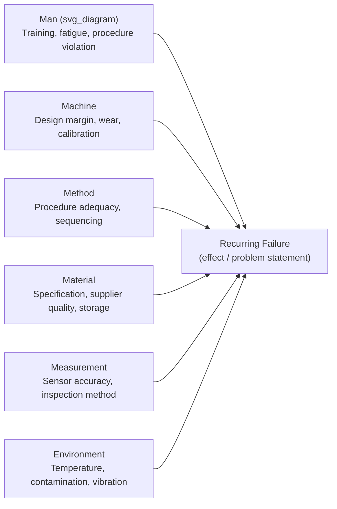
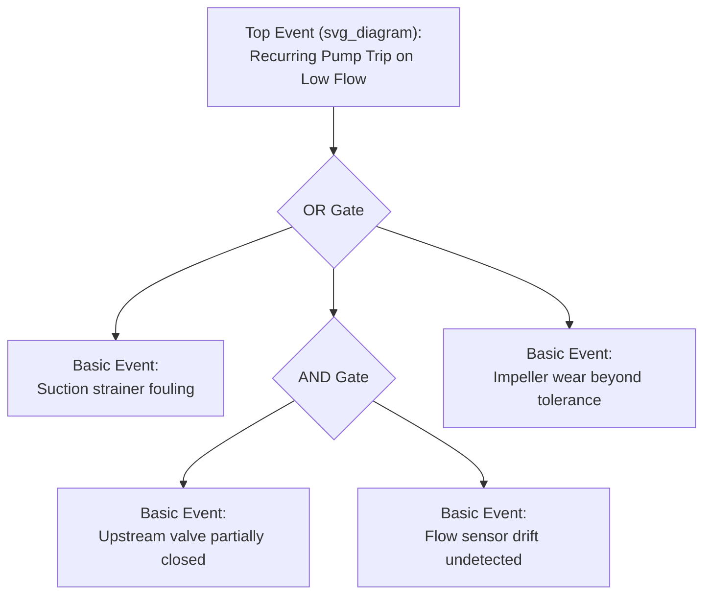
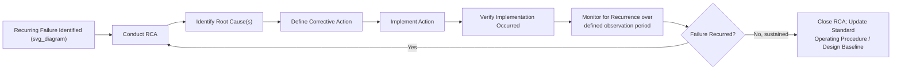

## Root Cause Analysis for Recurring Failures

### Definition and Purpose

Root Cause Analysis (RCA) is a structured investigative process used to identify the fundamental, underlying cause(s) of a failure or problem, as distinct from its symptoms or immediate triggering event. In the context of recurring failures specifically, RCA is applied not merely to explain a single incident but to break a repeating failure pattern by identifying and eliminating the systemic cause that produces the same failure mode across multiple occurrences.

The distinction between a **root cause** and a **contributing factor** is central: a root cause, if eliminated, prevents recurrence; a contributing factor, if eliminated, may reduce likelihood or severity but does not by itself prevent the failure from recurring through another pathway. RCA is referenced in reliability standards including **IEC 60300-3-11** (application guide for reliability centred maintenance) and is a required input to Corrective and Preventive Action (CAPA) systems under **ISO 9001**, **ISO 55001** (asset management), and process-safety frameworks such as **OSHA PSM** and **IEC 61511**.

### Why Recurring Failures Require Distinct RCA Treatment

**Key Points**

- A single-incident RCA can sometimes stop at a proximate cause ("bearing seized due to lubricant starvation") if the consequence is minor and non-repeating.
- A **recurring** failure signals that whatever corrective action followed prior occurrences either did not address the true root cause, was not implemented, or was implemented but subsequently reversed by drift (procedure not followed, design change reverted, training not sustained).
- RCA for recurring failures therefore must explicitly investigate **why previous corrective actions failed**, not only the technical failure mechanism itself — this is a common step omitted in single-pass investigations.

### The Causal Hierarchy

RCA methods generally organize causes into a hierarchy, moving from the visible failure back toward the systemic origin:

**Key Points**

- Root causes are most often categorized into three domains: **physical** (a tangible component failed), **human** (an error or violation occurred), and **latent/organizational** (a system, process, or management condition allowed the physical/human cause to occur and recur).
- Stopping analysis at the physical or human layer without reaching the latent/organizational layer is the most frequently cited reason corrective actions fail to prevent recurrence.

### Common RCA Methodologies

| Method | Approach | Best Suited For |
| --- | --- | --- |
| 5 Whys | Iteratively ask "why" to trace from symptom to root cause | Simple to moderate complexity, single primary causal chain |
| Fishbone / Ishikawa Diagram | Categorize potential causes (Man, Machine, Method, Material, Measurement, Environment) | Brainstorming broad candidate causes before narrowing |
| Fault Tree Analysis (FTA) | Top-down deductive logic tree using Boolean gates (AND/OR) from a top event to basic causes | Complex systems with multiple interacting causal paths |
| Barrier/Layer Analysis | Identify which protective barriers should have prevented the failure and why each failed | Safety-critical or multi-layer-of-protection systems |
| Change Analysis | Compare conditions immediately before/after a failure against a known-good baseline | Failures following a known change (procedure, personnel, material, environment) |
| Pareto Analysis | Statistical ranking of failure frequency/cost to prioritize which recurring failure to investigate first | Prioritizing among many candidate recurring failure types |
| Apollo RCA / RealityCharting | Cause-and-effect charting requiring at least two causes (action + condition) per effect node | Organizational-level investigations with formal documentation needs |

### The 5 Whys Technique in Detail

The 5 Whys method repeatedly asks "why" at each causal layer until a systemic/actionable root cause is reached. The number five is a heuristic, not a fixed rule — analysis stops when further "why" questions no longer identify a new controllable factor, which may occur before or after five iterations.

**Example**

| Iteration | Question | Answer |
| --- | --- | --- |
| Why 1 | Why did the conveyor motor fail? | The motor bearing seized |
| Why 2 | Why did the bearing seize? | Lubricant had degraded and was not replenished |
| Why 3 | Why was lubricant not replenished? | The scheduled lubrication task was not performed |
| Why 4 | Why was the lubrication task not performed? | The task was not visible on the technician's work order due to a CMMS scheduling configuration error |
| Why 5 | Why did the CMMS configuration error go undetected? | No periodic audit process exists to verify scheduled PM tasks are correctly generating work orders |

**Key Points**

- The root cause identified here (absence of a PM-generation audit process) is organizational/systemic, not the bearing itself — corrective action targeting only "replace the bearing" would not prevent recurrence.
- 5 Whys is vulnerable to single-track reasoning; complex recurring failures often have multiple parallel contributing causes that a single linear chain cannot capture, which is why it is frequently paired with a Fishbone diagram for cause generation before the "why" chain is applied.

### Fishbone (Ishikawa) Diagram Structure

Used to generate a comprehensive candidate list of causes across standard categories before narrowing to the verified root cause:

Each branch is populated with candidate causes through team brainstorming, then each candidate is tested against available evidence (data, inspection findings, interviews) to determine which are supported and which are eliminated.

### Fault Tree Analysis (FTA) for Recurring Failures

FTA is a deductive, top-down method starting from the undesired top event (the recurring failure) and working backward through logic gates to basic events.

**Key Points**

- An OR gate means any single basic event beneath it is sufficient to produce the event above it; an AND gate means all basic events beneath it must occur simultaneously.
- FTA is particularly effective for recurring failures with multiple independent causal pathways, since it explicitly maps which pathway was active in each historical occurrence, revealing whether recurrences share the same pathway (pointing to one unaddressed root cause) or arise from different pathways (indicating multiple distinct root causes masquerading as one repeating symptom).
- [Inference] Quantitative FTA (calculating top-event probability from basic-event failure rates) requires reliable failure rate data per basic event; where such data is unavailable, FTA is still valid as a qualitative causal-logic tool.

### Barrier / Layer of Protection Analysis

For safety-critical recurring failures, this method asks: what protective layers (design, procedural, alarm, physical barrier) were supposed to prevent this failure or limit its consequence, and why did each fail or prove absent?

| Barrier | Intended Function | Status at Time of Failure |
| --- | --- | --- |
| Design margin | Prevent operation beyond safe limits | Adequate |
| High-flow alarm | Alert operator before threshold breach | Present but alarm threshold set too high |
| Operator response procedure | Manual intervention before trip | Procedure existed but was not followed under time pressure |
| Automatic trip | Final protective action | Functioned as designed |

This structure is especially useful for recurring failures where the final protective layer keeps activating (masking the problem) while earlier layers repeatedly fail without correction.

### The Corrective Action Verification Loop

For recurring failures specifically, RCA is incomplete without closing the loop on whether the corrective action actually prevented recurrence:

**Key Points**

- Verification of implementation (Step F) is distinct from verification of effectiveness (Step G) — a corrective action can be fully implemented and still fail to prevent recurrence if the root cause identification was incorrect.
- An observation period sufficient to span the failure's typical recurrence interval is necessary before declaring effectiveness; closing an RCA immediately after implementation, before a full failure cycle has elapsed, risks a false conclusion of success.

### Data Sources for RCA on Recurring Failures

- **CMMS/EAM work order history** — frequency, timing, and technician notes across prior occurrences of the same or similar failure mode.
- **Condition monitoring trends** — vibration, thermography, oil analysis, or other sensor data showing whether degradation preceded each occurrence similarly.
- **Maintenance and operator logs** — narrative context (operating conditions, recent changes) at each occurrence.
- **Prior RCA/CAPA records** — critical for recurring failures: reviewing what was previously concluded and implemented, to identify whether the current recurrence indicates an incorrect prior root cause, an unimplemented action, or action decay.
- **Design and specification documents** — to assess whether the asset's design margin is adequate for its actual operating context (a frequent latent root cause in recurring failures).

### Relationship to FMECA and RCM

| Aspect | RCA | FMECA | RCM |
| --- | --- | --- | --- |
| Trigger | Reactive — an actual failure (often recurring) has occurred | Proactive — analysis performed before/independent of actual occurrence | Proactive — analysis performed to define maintenance strategy |
| Direction | Backward from observed effect to cause | Forward from potential cause to potential effect | Forward from function to consequence to task |
| Typical output | Specific corrective action for a specific failure history | Ranked list of potential failure modes by criticality | Maintenance task assignments per failure mode |

**Key Points**

- RCA findings on a recurring failure often reveal a failure mode or cause that was not anticipated in the original FMECA/RCM analysis, and should trigger an update to that analysis (a critical feedback loop that keeps FMECA/RCM current with actual field experience).
- Conversely, a well-executed FMECA/RCM analysis reduces the frequency of failures requiring reactive RCA, since higher-criticality failure modes are proactively addressed with maintenance tasks or redesign before failure occurs.

### Common Implementation Pitfalls

- Stopping the investigation at the first plausible technical cause (often the proximate cause) without probing why the underlying condition existed, especially under pressure to restore production quickly.
- Failing to investigate why a **prior** corrective action for the same failure mode did not prevent this recurrence — treating each occurrence as an isolated event rather than as data in a pattern.
- Assigning root cause based on individual blame ("operator error") without examining the systemic conditions (training adequacy, procedure clarity, workload, alarm design) that made the error possible or likely — a common way latent organizational causes are missed.
- Closing the RCA immediately upon implementing a corrective action, without a monitoring period to verify actual effectiveness against recurrence.
- Using a single RCA method in isolation for complex recurring failures with multiple causal pathways, when a combination (e.g., Fishbone for cause generation, then FTA for logical verification) would more reliably capture parallel causes.
- [Inference] Under-resourcing RCA teams with only maintenance personnel, excluding operations, engineering, and procurement perspectives, tends to bias findings toward causes within the maintenance department's own control and away from cross-functional latent causes — this is a commonly reported pattern in RCA program audits rather than a universal rule.

### Related Topics

- Reliability-Centered Maintenance (RCM) Methodology
- Failure Mode, Effects, and Criticality Analysis (FMECA)
- Fault Tree Analysis and Quantitative Risk Modeling
- Corrective and Preventive Action (CAPA) Program Design
- Mean Time Between Failures (MTBF) and Failure Trend Analysis
- Human Factors and Latent Organizational Failure Models (e.g., Swiss Cheese Model)
- CMMS Failure Coding and Historical Data Structuring
- Pareto Analysis for Maintenance Prioritization