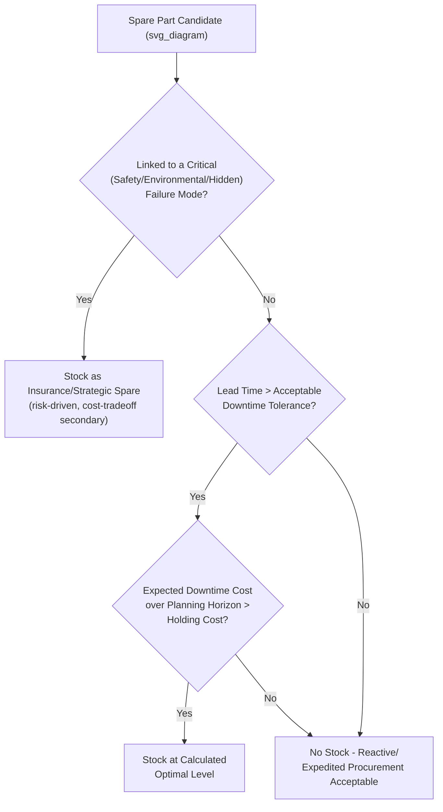
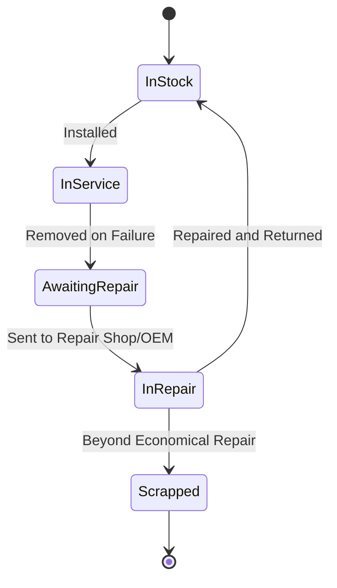

## Spare Parts and MRO Inventory Strategy

### Definition and Purpose

Spare Parts and MRO (Maintenance, Repair, and Operations) Inventory Strategy is the discipline of determining which spare parts to stock, in what quantity, at what location, and under what replenishment policy, to support asset reliability and maintenance execution at the lowest total cost of ownership. Unlike production/finished-goods inventory, MRO inventory demand is typically **intermittent and lumpy** (driven by failure events rather than steady consumption), which makes standard economic order quantity (EOQ) and continuous-demand forecasting models poorly suited without adaptation.

The strategic objective is to balance two opposing costs: the **holding cost and capital tied up in inventory** against the **stockout cost** (extended downtime, expedited freight, production loss) if a needed part is unavailable when a failure occurs. This balance is asset-criticality-dependent — the same part may warrant strategic stock for a critical asset and no stock at all for a non-critical one.

### MRO Inventory vs. Standard Inventory Management

| Aspect | Standard/Production Inventory | MRO/Spares Inventory |
| --- | --- | --- |
| Demand pattern | Continuous, forecastable | Intermittent, often lumpy or sporadic |
| Demand driver | Sales/production schedule | Failure occurrence (largely stochastic) |
| Cost of stockout | Delayed shipment, lost sale | Extended asset downtime, safety/compliance risk, secondary damage |
| Value driver | Turnover ratio, carrying cost minimization | Availability/uptime protection, criticality-weighted risk reduction |
| Typical demand distribution | Normal/approximately continuous | Poisson, or intermittent (many zero-demand periods) |

### Spare Parts Classification Framework

**By Criticality (linked to FMECA/RCM outputs)**

| Class | Description | Stocking Implication |
| --- | --- | --- |
| Critical/Vital | Failure causes safety, environmental, or major production consequence; often single-source or long lead time | Strategic stock held regardless of cost, often calculated via reliability-based methods |
| Essential | Failure causes significant but recoverable operational impact | Stock justified via cost-tradeoff (holding cost vs. expected downtime cost) |
| Desirable/Non-critical | Failure has minor or no operational impact, or item is common/short lead time | Reactive procurement or vendor-managed inventory; minimal or no stock |

**By Demand Pattern (Classical Spares Categorization)**

- **Consumables/Fast-moving**: regularly used items (filters, lubricants, gaskets) — managed with conventional reorder-point/EOQ logic since demand is quasi-continuous.
- **Insurance spares**: very low probability of use but catastrophic consequence if unavailable (e.g., a spare rotor for a unique large machine) — stocking decision driven by risk/criticality analysis, not turnover economics.
- **Rotable/repairable spares**: components that are removed, repaired/overhauled, and returned to stock rather than consumed (e.g., gearboxes, electric motors, pumps) — managed through a repair-and-return pipeline rather than simple replenishment.
- **Insurance vs. rotable distinction**: an insurance spare is typically held new/unused for a rare catastrophic event; a rotable spare cycles continuously between "in service," "in repair," and "in stock" states.

### Criticality-Based Stocking Decision Logic

### Quantitative Stocking Models

**Basic Reorder Point (fast-moving/consumable items)**

$$ROP = (D_{avg} \times LT) + SS$$

Where $D_{avg}$ is average demand rate, $LT$ is lead time, and $SS$ is safety stock.

$$SS = Z \times \sigma_{LT} \times \sqrt{LT}$$

Where $Z$ is the service-level factor (from the standard normal distribution) and $\sigma_{LT}$ is the standard deviation of demand during lead time.

**Poisson-Based Model (intermittent/critical spares)**

For low-usage critical spares, demand during lead time is often modeled as a Poisson process rather than assumed normally distributed, since demand counts are small, discrete, and non-negative:

$$P(X = k) = \frac{e^{-\lambda} \lambda^k}{k!}$$

Where $\lambda$ is the expected number of failures during the lead time period, and $k$ is the number of units demanded. The stocking quantity is then set to achieve a target service level (probability of no stockout) by summing the Poisson cumulative distribution until the desired confidence threshold is reached.

**Example**

A critical bearing has a historical failure rate implying $\lambda = 0.4$ expected failures during the 6-month procurement lead time. To achieve a 95% service level (probability of not stocking out):

| Stock Level ($k$) | $P(X \leq k)$ |
| --- | --- |
| 0 | $e^{-0.4} = 0.670$ |
| 1 | $0.670 + (0.4 \times 0.670) = 0.938$ |
| 2 | $0.938 + \frac{0.4^2}{2}e^{-0.4} = 0.992$ |

A stock level of 2 units achieves approximately 99.2% service level, exceeding the 95% target; a stock level of 1 unit (93.8%) falls short, so 2 units would be the recommended stocking decision at this service level threshold.

**Total Cost of Ownership Tradeoff**

$$TC = C_h \times Q + C_s \times P(\text{stockout}) \times D_{downtime}$$

Where $C_h$ is annual holding cost per unit, $Q$ is stock quantity, $C_s$ is the cost consequence per stockout event, and $D_{downtime}$ is the expected downtime cost multiplier. The optimal $Q$ minimizes total cost across the marginal tradeoff between additional holding cost and the marginal reduction in expected stockout cost.

### ABC / XYZ Classification for Prioritized Management Effort

| Classification | Basis | Typical Treatment |
| --- | --- | --- |
| A items | High annual consumption value | Tight control, frequent review, precise forecasting |
| B items | Moderate annual consumption value | Standard periodic review |
| C items | Low annual consumption value (majority of SKUs by count) | Simple reorder-point or bulk-buy policies, minimal management overhead |
| X items | Stable, predictable demand | Standard statistical forecasting models |
| Y items | Variable but trend-identifiable demand | Adjusted/moving-average forecasting |
| Z items | Sporadic, unpredictable demand (typical of critical spares) | Criticality/risk-based stocking rather than demand forecasting |

**Key Points**

- Combining ABC (value) with XYZ (demand predictability) into a 9-cell matrix is standard practice; a high-value, unpredictable-demand item (AZ) — the profile of many critical spares — requires fundamentally different treatment (risk-based) than a high-value, predictable-demand item (AX), which suits conventional forecasting.
- Pure value-based ABC classification alone is a documented pitfall for MRO specifically, because a low-value, low-consumption part supporting a highly critical asset (e.g., a $50 sensor gating a $2M/day production line) would be misclassified as low-priority under value alone.

### Rotable/Repairable Spares Management

Rotables require a distinct inventory model because the unit is not consumed but cycles through states:

**Key Points**

- The effective spares pool for rotables must account for units in each state simultaneously; sizing the pool based only on "in stock" count without considering repair-turnaround time will understate the true buffer needed.
- Repair turnaround time (RTAT) is the key driver of pool size: $$Pool\ Size \approx \lambda \times RTAT + SS$$ where $\lambda$ is the failure/removal rate and $RTAT$ is the average cycle time to return a unit to usable stock.
- Repair-vs-replace economic thresholds should be formally defined (e.g., repair cost exceeding a percentage of replacement cost triggers scrap-and-replace) to prevent ad hoc, inconsistent decisions at the point of failure.

### Vendor Stocking Strategies

| Strategy | Description | Best Fit |
| --- | --- | --- |
| Owned strategic stock | Organization holds and owns inventory on-site | Critical, long-lead-time, or safety-related parts |
| Vendor-Managed Inventory (VMI) | Supplier monitors and replenishes stock at the buyer's site | High-volume consumables with reliable local suppliers |
| Consignment stock | Supplier-owned inventory held on-site, paid for on use | Reduces buyer's carrying cost while retaining local availability |
| Pooled/shared spares (industry consortia) | Multiple organizations share strategic spares for identical equipment | Very high-cost, low-probability-of-use insurance spares (e.g., large transformers) |
| Framework/blanket agreements | Pre-negotiated pricing and priority lead time without holding stock | Non-critical parts where negotiated lead time reduction substitutes for physical stock |

### Integration with FMECA, RCM, and Criticality Analysis

**Key Points**

- Spare parts stocking decisions should be a direct downstream output of FMECA/RCM analysis: a failure mode classified as having safety or hidden-failure consequences under RCM logic typically drives strategic spares holding for the associated component, independent of pure cost-tradeoff economics.
- Where RCM's proactive task selection identifies a condition-based (predictive) maintenance task with an adequate P-F interval, the spares strategy can shift toward shorter lead-time reactive procurement, since advance warning reduces the need for standing stock.
- Obsolescence risk identified during FMECA (single-source suppliers, discontinued components) should trigger lifetime-buy decisions or design-for-obsolescence-mitigation actions, coordinated with the spares strategy rather than handled reactively at the point of supplier discontinuation.

### CMMS/EAM Integration Requirements

- **Bill of Materials (BOM) linkage**: each asset record should maintain an accurate parts BOM to enable automatic reorder triggering and accurate lead-time-based planning.
- **Failure-to-part linkage**: work order failure codes should link to the specific parts consumed, enabling data-driven refinement of $\lambda$ (demand rate) estimates over time rather than relying solely on initial engineering estimates.
- **Min/max or reorder-point automation**: reorder points and safety stock levels should be reviewed periodically (not set once and left static) as failure data accumulates and asset condition/age changes.
- **Multi-site visibility**: for organizations with multiple facilities using common equipment, shared visibility into spares across sites can substantially reduce total required stock through pooling effects, particularly for AZ-classified (high-value, unpredictable-demand) items.

### Common Implementation Pitfalls

- Applying standard EOQ/continuous-demand forecasting models to genuinely intermittent critical spares, producing systematically incorrect (typically under-stocked) recommendations because the underlying demand distribution assumption does not match actual failure-driven demand.
- Classifying spares by purchase value alone (standard ABC) without incorporating asset criticality, leading to under-stocking of low-cost parts that gate high-consequence failures.
- Sizing rotable spares pools based on stock count alone without accounting for repair turnaround time, understating the effective buffer needed to maintain availability.
- Allowing spares data (BOM linkage, failure-to-part history) in the CMMS to degrade over time, which removes the data foundation needed to periodically re-validate stocking levels against actual field failure rates.
- Treating the initial spares list (often set at commissioning based on OEM recommendations) as static, without revisiting it as actual failure rates, criticality reassessments, or design changes emerge during operation.
- [Inference] Underestimating the cost-effectiveness of pooled/consortium spares arrangements for very high-cost insurance items; this option is frequently overlooked in practice because it requires inter-organizational coordination outside a single maintenance department's typical scope of control.

### Related Topics

- Reliability-Centered Maintenance (RCM) Methodology
- Failure Mode, Effects, and Criticality Analysis (FMECA)
- Obsolescence Management and Lifetime-Buy Decisions
- Computerized Maintenance Management System (CMMS) Data Structuring
- Mean Time Between Failures (MTBF) and Demand Rate Estimation
- Total Cost of Ownership (TCO) Analysis for Physical Assets
- Vendor-Managed Inventory (VMI) and Consignment Stock Agreements
- ISO 55000 Asset Management Standard