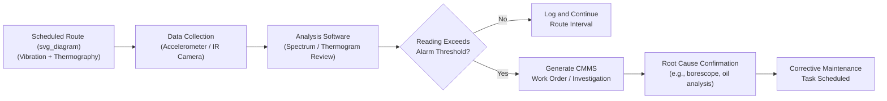

## Vibration Analysis and Thermography

### Definition and Purpose

Vibration Analysis and Infrared Thermography are the two most widely deployed condition-monitoring (predictive maintenance) technologies for rotating and electrical/mechanical assets respectively. Both are non-intrusive techniques that detect a **potential failure** — a measurable early-warning condition — well before functional failure occurs, generating the P-F interval that Reliability-Centered Maintenance (RCM) uses to schedule condition-based inspection tasks. Though frequently deployed together as complementary technologies in a single condition-monitoring program, they detect fundamentally different failure physics and are treated separately below before their integration is addressed.

### Vibration Analysis

#### Physical Basis

All rotating machinery generates vibration as a normal operating characteristic; deviations in vibration amplitude, frequency content, or phase from an established healthy baseline indicate specific developing fault mechanisms. Vibration is measured as displacement, velocity, or acceleration, typically via piezoelectric accelerometers, and analyzed in both time-domain (waveform) and frequency-domain (spectrum, via Fast Fourier Transform) representations.

#### Key Measurement Parameters

| Parameter | Typical Frequency Range Focus | Best Detects |
| --- | --- | --- |
| Displacement | Low frequency (0–10x running speed) | Shaft misalignment, imbalance, looseness |
| Velocity | Mid frequency (10 Hz – 1 kHz) | General mechanical fault severity (ISO 10816/20816 standard metric) |
| Acceleration | High frequency (1 kHz – 20+ kHz) | Bearing defects, gear mesh faults, early-stage fatigue |
| Envelope/Demodulation (high-frequency enveloping) | Very high frequency, demodulated to low frequency | Early bearing defect frequencies buried in noise |

#### Common Fault Signatures (Frequency-Domain)

| Fault | Characteristic Spectral Signature |
| --- | --- |
| Imbalance | Dominant peak at 1x running speed (1x RPM) |
| Misalignment | Strong peaks at 1x and 2x running speed, often with high axial vibration |
| Mechanical looseness | Peaks at 1x, 2x, 3x running speed and harmonics, sometimes with sub-harmonics (0.5x) |
| Bearing defects | Non-synchronous frequencies calculated from bearing geometry: BPFO (ball pass frequency outer race), BPFI (inner race), BSF (ball spin frequency), FTF (fundamental train frequency) |
| Gear mesh faults | Gear mesh frequency (GMF = number of teeth × shaft speed) with sidebands spaced at shaft running speed |
| Resonance | Amplification at a specific frequency matching a structural natural frequency, independent of running speed |

**Bearing Defect Frequency Calculation**

$$BPFO = \frac{n}{2} \times f_r \times \left(1 - \frac{d}{D}\cos\phi\right)$$

$$BPFI = \frac{n}{2} \times f_r \times \left(1 + \frac{d}{D}\cos\phi\right)$$

Where $n$ is the number of rolling elements, $f_r$ is shaft running speed (Hz), $d$ is rolling element diameter, $D$ is pitch diameter, and $\phi$ is the contact angle.

**Example**

A bearing with $n = 9$ rolling elements, $d/D = 0.25$, $\phi = 0°$, running at $f_r = 29.5$ Hz (1770 RPM):

$$BPFO = \frac{9}{2} \times 29.5 \times (1 - 0.25) = 99.6\ Hz$$

A distinct spectral peak appearing at approximately 99.6 Hz (and its harmonics) in the vibration spectrum indicates an outer race defect developing on this specific bearing.

#### Severity Standards

**ISO 10816 / ISO 20816** define vibration severity zones (A–D) for different machine classes based on measured RMS velocity:

| Zone | Description |
| --- | --- |
| A | Newly commissioned machine condition — good |
| B | Acceptable for unrestricted long-term operation |
| C | Unsatisfactory for long-term continuous operation; corrective action should be planned |
| D | Vibration severity sufficient to cause damage; immediate action typically required |

[Inference] The exact velocity thresholds (mm/s RMS) for each zone vary by machine class (small machines vs. large rigid foundations vs. flexible foundations) as defined in the specific ISO 20816 part applicable to the machine type; a single universal numeric threshold should not be applied across all machine classes without confirming the correct standard subsection.

#### P-F Interval for Vibration-Detectable Faults

**Key Points**

- Bearing defects typically provide a relatively long P-F interval (weeks to months) when high-frequency envelope/demodulation techniques are used, since early-stage spalling generates detectable high-frequency energy well before amplitude increases at fundamental running-speed frequencies.
- Gear tooth cracking can present a comparatively shorter P-F interval once propagation begins, since crack growth to tooth fracture can accelerate rapidly relative to bearing spall progression.
- [Inference] Specific P-F interval durations are highly asset- and failure-mode-specific; documented ranges in condition-monitoring literature should be treated as general guidance requiring validation against an organization's own failure history, per RCM's requirement that inspection intervals be set at a fraction of the demonstrated P-F interval.

#### Vibration Analysis Program Components

1. **Route-based data collection**: portable data collectors following a fixed route and interval (weekly/monthly), suited to non-critical/moderate-criticality assets.
2. **Continuous/online monitoring**: permanently installed sensors with continuous or high-frequency sampling, reserved for critical, high-consequence-of-failure assets where a rapid-developing fault could otherwise go undetected between route intervals.
3. **Baseline establishment**: initial spectral signature captured on known-good equipment, against which future readings are compared for trend deviation.
4. **Alarm limit setting**: statistical (e.g., based on historical population data) or standards-based (ISO 20816 zones) thresholds triggering investigation or work order generation.
5. **Trending and reporting**: overlay of successive spectra/trend plots to distinguish gradual degradation from a sudden step-change fault.

### Infrared Thermography

#### Physical Basis

Infrared thermography measures the infrared radiation emitted from a surface and converts it to a temperature map (thermogram) using a calibrated infrared camera. Elevated or asymmetric temperature patterns relative to a normal baseline or comparable component indicate developing faults, primarily in electrical connections and equipment, and in mechanical systems exhibiting friction-related heating.

#### Primary Application Domains

| Domain | Fault Detected |
| --- | --- |
| Electrical switchgear/panels | Loose connections, overloaded circuits, unbalanced phase loading, deteriorating contacts |
| Motors and transformers | Winding insulation degradation, cooling system blockage, bearing friction (secondary indicator) |
| Mechanical systems | Bearing/coupling friction heating, misalignment-induced heating |
| Building envelope/insulation | Heat loss, moisture intrusion, insulation gaps |
| Steam systems | Failed steam traps (via characteristic temperature differential across the trap) |

#### Emissivity and Measurement Accuracy

Accurate temperature measurement via thermography requires correcting for the **emissivity** of the target surface — the efficiency with which a surface radiates infrared energy relative to a theoretical perfect black body (emissivity = 1.0).

$$T_{true} = f(T_{measured}, \varepsilon, T_{reflected}, T_{ambient})$$

**Key Points**

- Shiny or reflective metallic surfaces (e.g., unpainted aluminum busbars) have low emissivity (often 0.1–0.3) and are prone to significant measurement error if the camera's emissivity setting is not corrected, since reflected ambient infrared radiation can dominate the reading.
- Standard practice is to apply high-emissivity tape or paint to a small area of a low-emissivity target, or to use a known reference emitter, to obtain a reliable emissivity-corrected absolute temperature reading.
- Qualitative thermography (comparing relative temperature patterns and identifying anomalies/asymmetry) is valid and useful even without precise emissivity correction; **quantitative** thermography (citing an exact temperature value for maintenance prioritization decisions) requires emissivity correction to be reliable.

#### Delta-T Severity Classification (Electrical Applications)

A widely used industry convention (referenced in NFPA 70B and various utility/industrial thermography guides) classifies electrical thermal anomalies by temperature rise above a reference (either ambient air temperature or a comparable unloaded/similar component under the same load):

| Temperature Rise (ΔT) | Typical Classification | Recommended Action |
| --- | --- | --- |
| 1–3°C | Minor deviation | Continue routine monitoring |
| 4–15°C | Moderate | Investigate at next scheduled opportunity |
| 16–40°C | Serious | Repair as soon as possible |
| >40°C | Critical | Immediate repair/de-energization |

[Unverified] The specific numeric breakpoints for these classification bands vary somewhat across industry guides and individual utility/corporate thermography standards; the table above reflects a commonly cited convention but should be confirmed against the specific standard or internal procedure governing a given thermography program.

#### Thermography Program Components

1. **Load verification**: readings should be taken under representative (ideally near-full) load conditions, since a loose connection under light load may not yet exhibit a significant temperature rise — this is a critical limitation distinct from vibration analysis, which is less load-dependent for many fault types.
2. **Comparative analysis**: comparing temperature of a suspect component against a healthy, identically loaded reference component (e.g., comparing three phases of the same circuit) is often more reliable than absolute temperature thresholds alone.
3. **Baseline and trending**: repeat surveys (commonly annual for electrical switchgear, more frequent for critical circuits) trend temperature rise over time to detect progressive degradation.
4. **Environmental controls**: wind, solar loading, and rain can significantly distort thermal readings for outdoor equipment; surveys are typically scheduled to avoid direct solar heating and high wind conditions that would mask or exaggerate genuine anomalies.

### Comparative Summary: Vibration vs. Thermography

| Aspect | Vibration Analysis | Infrared Thermography |
| --- | --- | --- |
| Primary failure physics detected | Mechanical dynamic behavior (imbalance, misalignment, bearing/gear wear, looseness) | Thermal anomalies (resistive heating, friction, insulation degradation) |
| Best-fit asset types | Rotating machinery (motors, pumps, fans, gearboxes, turbines) | Electrical systems, and secondarily rotating/mechanical friction points |
| Load dependency | Moderate — some faults evident across load range | High — many electrical faults require significant load to manifest |
| Typical P-F interval characteristic | Often weeks to months for bearing/gear faults with proper technique | Often shorter and more load-condition-dependent for electrical faults |
| Contactless/non-intrusive | Requires sensor contact or proximity (accelerometer mounting) | Fully non-contact, line-of-sight only |

**Key Points**

- The two technologies are complementary rather than substitutable: thermography cannot detect an early-stage bearing spall before it generates measurable friction heat (well after vibration envelope analysis would already detect it), while vibration analysis provides no direct indication of an overheating electrical connection with no associated mechanical vibration signature.
- A comprehensive condition-monitoring program for a rotating asset with an electric motor driver commonly applies both technologies to the same asset: vibration analysis on the mechanical drivetrain, thermography on the motor windings, terminal box, and associated electrical switchgear.

### Integration into RCM and Maintenance Planning

**Key Points**

- Both technologies are the primary technical enablers of RCM's **condition-based (predictive) task** category, since both require a detectable, quantifiable potential-failure condition with an established P-F interval to justify their use over scheduled restoration or run-to-failure defaults.
- Inspection interval selection (per RCM logic) should be set at a fraction — commonly cited as half or less — of the demonstrated P-F interval for the specific fault type being monitored, meaning vibration and thermography surveys may warrant different intervals even on the same asset, depending on which fault mechanisms are being screened for.
- Findings from both technologies should feed back into FMECA/RCM failure mode libraries: a fault mechanism detected in the field that was not anticipated in the original analysis (e.g., an unusual resonance-driven failure) should trigger a review and update of the governing FMECA.

#### Route-Based Condition Monitoring Data Flow

### Common Implementation Pitfalls

- Relying on vibration analysis alone for assets with significant electrical fault risk, or thermography alone for assets with significant mechanical fault risk, when the asset's actual dominant failure modes (per FMECA) warrant both.
- Taking thermography readings under low or partial load and concluding a connection is healthy, when the fault would only manifest thermally near full load — a frequently cited source of missed detections.
- Failing to correct for emissivity on reflective/metallic surfaces, leading to falsely low absolute temperature readings that mask a genuine developing fault.
- Setting a single universal vibration alarm threshold across dissimilar machine classes rather than applying the correct ISO 20816 machine-class-specific zone boundaries.
- Extending route-based (rather than continuous online) monitoring intervals beyond half the demonstrated P-F interval for the fault type being screened, undermining the fundamental logic that justifies the condition-based task under RCM.
- [Inference] Treating a single point-in-time reading (either technology) as conclusive, rather than establishing a trend; both technologies are substantially more diagnostic when a documented baseline and trend history exist for comparison, since absolute values alone can be ambiguous without a machine-specific reference.

### Related Topics

- Oil Analysis and Tribology-Based Condition Monitoring
- Ultrasonic Testing for Leak and Electrical Fault Detection
- Motor Current Signature Analysis (MCSA)
- Reliability-Centered Maintenance (RCM) Methodology and P-F Interval Determination
- ISO 10816 / ISO 20816 Vibration Severity Standards
- Failure Mode, Effects, and Criticality Analysis (FMECA)
- Condition Monitoring Data Integration with CMMS/EAM Systems
- NFPA 70B Electrical Equipment Maintenance Standard