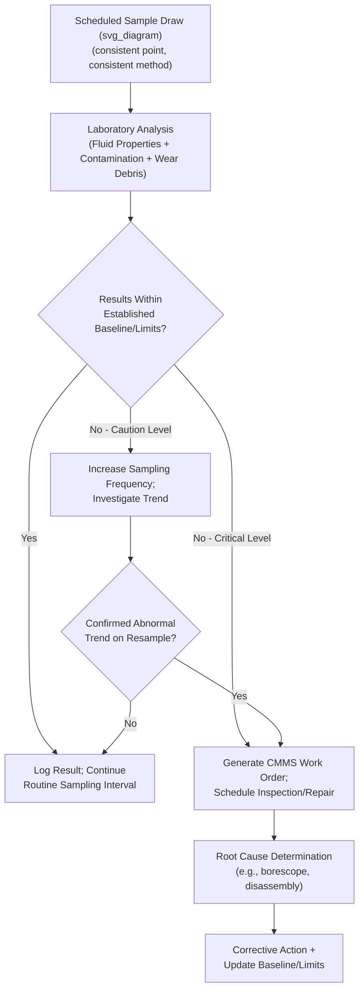

## Oil Analysis and Lubrication Programs

### Definition and Purpose

Oil Analysis (also called lubricant analysis or tribology-based condition monitoring) is a predictive maintenance technique that evaluates lubricant samples to assess both the **health of the lubricant itself** and the **condition of the machine components** it lubricates. It is one of the three pillars of route-based condition monitoring alongside vibration analysis and thermography, and is distinguished by its ability to detect wear mechanisms and contamination sources that are invisible to both vibration and thermal techniques — particularly at the earliest stages of component degradation, before measurable vibration signatures develop.

A **Lubrication Program** is the broader operational discipline governing lubricant selection, application, storage, and routine maintenance (relubrication, oil changes, filtration) that oil analysis data is used to optimize. The two are treated together because oil analysis findings directly drive lubrication program decisions (interval extension, contamination control investment, lubricant reformulation) and vice versa.

### The Three Analytical Categories of Oil Analysis

| Category | What It Assesses | Key Question Answered |
| --- | --- | --- |
| Fluid properties | Condition of the lubricant itself | Is the oil still fit for service, or has it degraded? |
| Contamination | Foreign material present in the oil | Is water, dirt, coolant, or fuel entering the system? |
| Wear debris | Metallic particles generated by component wear | Which components are wearing, and how severely? |

### Fluid Property Tests

| Test | Method/Standard | Purpose |
| --- | --- | --- |
| Viscosity | ASTM D445 (kinematic viscosity) | Detects shear breakdown, wrong lubricant top-up, or thermal degradation |
| Viscosity Index | ASTM D2270 | Measures viscosity's resistance to change with temperature |
| Total Acid Number (TAN) | ASTM D664 | Detects oxidation and acidic byproduct formation indicating degradation |
| Total Base Number (TBN) | ASTM D2896 | Measures remaining alkaline reserve to neutralize acids (critical for engine oils) |
| Oxidation/Nitration (FTIR) | ASTM D7414/D7624 | Infrared spectroscopy detecting chemical breakdown products |
| Flash Point | ASTM D92/D93 | Detects fuel dilution (lowered flash point indicates contamination) |
| Additive Depletion | ICP spectroscopy (elemental) | Tracks consumption of anti-wear, anti-oxidant, and detergent additive packages |

### Contamination Tests

| Test | Method | Detects |
| --- | --- | --- |
| Water content (Karl Fischer titration) | ASTM D6304 | Free/dissolved water — a primary driver of corrosion and additive depletion |
| Particle counting | ISO 4406 / ISO 11171 (automatic particle counter) | Solid particulate contamination (dirt ingress, wear debris volume) |
| Fuel dilution | Gas chromatography or FTIR | Fuel entering lubricating oil (combustion engines) |
| Glycol/coolant contamination | Colorimetric test or FTIR | Coolant leak into lubrication system |
| Elemental analysis (silicon) | ICP spectroscopy | Dirt/sand ingress (silicon is the primary marker) |

**ISO 4406 Cleanliness Code**

Particle contamination is reported as a three-number code representing the number of particles per milliliter greater than 4 μm, 6 μm, and 14 μm respectively, each mapped to a standardized range code.

$$\text{ISO Code} = [\text{Range}]_{>4\mu m} / [\text{Range}]_{>6\mu m} / [\text{Range}]_{>14\mu m}$$

**Example**

A hydraulic system sample returns particle counts of 5,000/mL (>4μm), 650/mL (>6μm), and 40/mL (>14μm), which map to ISO range codes 18/16/12 respectively. If the target cleanliness for that hydraulic system's component sensitivity is 17/15/11, this result indicates the system exceeds its target cleanliness by roughly one range code across all three size bins, warranting investigation into filtration effectiveness or an ingress point.

### Wear Debris Analysis

| Technique | Method | Detects |
| --- | --- | --- |
| Elemental spectroscopy (ICP-OES/AES) | Atomic emission/absorption spectroscopy | Wear metal concentration (iron, copper, chromium, aluminum, etc.) at the elemental (dissolved/small particle) level, typically limited to particles below ~5–8 μm |
| Ferrography (analytical) | Magnetic particle deposition on a slide, microscopic examination | Particle size, shape, and morphology of larger wear particles — distinguishes normal rubbing wear from severe/abnormal wear modes |
| Particle Quantifier (PQ) Index | Magnetic susceptibility measurement | Rapid screening indicator of total ferrous wear debris, including larger particles missed by elemental spectroscopy alone |
| Patch testing / membrane filtration | Physical filtration and microscopic/visual examination | Larger particle capture for morphology assessment when severe wear is suspected |

**Key Points**

- Elemental spectroscopy has a critical limitation: standard rotating disc electrode (RDE) spectroscopy loses sensitivity for particles larger than approximately 5–10 μm, meaning severe wear (which generates larger particles) can be **underrepresented** by elemental analysis alone — a frequently cited reason to pair spectroscopy with ferrography or PQ index for critical equipment.
- Wear particle **morphology** (identified via analytical ferrography) distinguishes failure mechanisms: rubbing wear (normal, platelet-shaped), cutting wear (abrasive contamination, sharp curled particles), fatigue chunks (spalling, indicating advanced bearing/gear distress), and severe sliding wear (large, striated particles indicating inadequate lubrication film).

### Elemental Wear Metal Source Identification

| Element | Typical Component Source |
| --- | --- |
| Iron (Fe) | Gears, bearings, shafts, cylinder liners |
| Copper (Cu) | Bearing cages/bushings, thrust washers, oil coolers |
| Aluminum (Al) | Pistons, some bearing materials, housings |
| Chromium (Cr) | Piston rings, some bearing coatings |
| Silicon (Si) | Dirt/sand ingress (contamination, not wear, in most contexts) |
| Sodium (Na) / Potassium (K) | Coolant contamination markers |
| Tin (Sn) / Lead (Pb) | Babbitt bearings, solder |

**Key Points**

- Silicon is unusual in that it typically indicates **contamination** (dirt ingress) rather than wear, since silicon-containing components are uncommon in most machinery — a distinction important for correct root-cause routing of an abnormal reading.
- Elevated readings should always be interpreted as a **ratio and trend**, not an isolated absolute value — a gradual, proportional rise across iron, chromium, and copper together may indicate normal generalized wear progression, while a sudden spike in a single element (e.g., copper alone) points toward a specific, localized component distress (e.g., a single bearing).

### Oil Analysis Program Workflow

**Key Points**

- Consistent sampling technique (same sample point, same running condition — ideally while equipment is warm and operating, not immediately after startup or shutdown) is essential; inconsistent sampling introduces variability that can mask genuine trends or create false alarms.
- A single abnormal result should generally trigger a **resample** before a major maintenance action is taken, since sampling contamination (a dirty sample bottle, sampling immediately after a top-up with fresh oil) is a common source of false positives.

### Lubrication Program Fundamentals

**Key Points**

- A structured lubrication program defines, for every lubricated component: the correct lubricant type/grade, the correct quantity, the correct application method, and the correct interval — deviations in any one of these four elements (the "four rights," commonly summarized as right lubricant, right amount, right place, right time) are a leading cause of premature bearing and gear failure independent of any inherent design or manufacturing defect.
- **Lubricant consolidation** (reducing the number of distinct lubricant types/grades used across a facility) reduces the risk of cross-contamination and application errors while simplifying inventory, provided consolidation does not compromise performance requirements for any individual application.

### Lubrication Task Types

| Task Type | Description | Typical Interval Basis |
| --- | --- | --- |
| Relubrication (grease) | Periodic grease replenishment via grease gun or automatic lubricator | Time-based (running hours) or condition-based (grease analysis/consistency check) |
| Oil top-up | Replenishing oil level lost to consumption/minor leakage | Level-based, verified during routine inspection |
| Scheduled oil change | Full lubricant replacement at a defined interval | Time/usage-based, or condition-based per oil analysis results (condition-based oil changes increasingly replace fixed-interval changes where analysis data supports extension) |
| Filtration/purification | Continuous or periodic removal of contaminants without full oil change | Continuous (kidney-loop filtration) or triggered by particle count/water content results |
| Automatic lubrication system maintenance | Verification and refill of single-point or centralized auto-lubricators | Per manufacturer schedule, supplemented by visual/output verification |

### Contamination Control Strategy

Since the majority of documented bearing and hydraulic component failures are attributable to contamination (particulate and water) rather than inherent lubricant chemical exhaustion, contamination control is often the highest-leverage lubrication program investment:

- **Sealed/desiccant breathers**: prevent moist, particulate-laden ambient air from being drawn into reservoirs during thermal cycling (the primary water/dirt ingress mechanism for many gearboxes and hydraulic tanks).
- **Kidney-loop (offline) filtration**: continuous circulation of reservoir oil through a fine filter independent of the main system flow path, used to proactively reduce particle counts below the system's target ISO 4406 cleanliness code.
- **Sealed transfer and storage practices**: preventing contamination introduction during lubricant storage, transfer, and top-up — a commonly cited source of contamination that is entirely within maintenance program control (unlike operational ingress sources).
- **Color-coded lubrication identification systems**: standardized labeling of lubrication points, containers, and application tools by lubricant type to prevent cross-contamination from incorrect lubricant application.

### P-F Interval Characteristics for Oil Analysis

**Key Points**

- Oil analysis frequently provides one of the **longest P-F intervals** among condition-monitoring technologies for gradual wear mechanisms, since elemental wear metal trends and fluid degradation markers typically develop gradually over weeks to months before reaching a severity that would manifest as measurable vibration or produce a functional failure.
- However, for contamination-driven failures (e.g., a sudden water ingress event or a seal failure introducing rapid particulate ingress), the effective P-F interval can be substantially shorter, since damage progression from severe contamination can accelerate rapidly relative to gradual normal wear — reinforcing that P-F interval is failure-mode-specific, not a single fixed property of the technology.
- [Inference] As with other condition-monitoring technologies, documented P-F interval ranges in industry literature should be validated against an organization's own equipment and failure history rather than applied as universal constants, consistent with RCM's requirement that inspection intervals be set from demonstrated, asset-specific P-F data.

### Integration with Vibration Analysis and Thermography

| Aspect | Oil Analysis | Vibration Analysis | Thermography |
| --- | --- | --- | --- |
| Earliest detectable fault stage | Very early (dissolved wear metal, sub-visible particle generation) | Early-to-moderate (measurable dynamic force change) | Later stage (requires measurable heat generation) |
| Best for | Lubricant condition, contamination ingress, generalized/early wear | Mechanical dynamic faults (imbalance, misalignment, developing bearing/gear defects) | Electrical connections, friction-driven heating |
| Complementary role | Confirms root cause suggested by vibration (e.g., elevated iron confirms a bearing fault flagged by envelope vibration analysis) | Confirms and localizes a fault suggested by abnormal wear debris trend | Screens for secondary thermal consequences of mechanical distress |

**Key Points**

- A mature condition-monitoring program typically uses oil analysis as an early, gradual-trend indicator and vibration analysis as a corroborating, more precisely localizing technique once a wear-related anomaly is suspected — the two data streams are commonly cross-referenced rather than used in isolation, since a wear metal trend alone cannot pinpoint which specific bearing or gear stage is affected as precisely as a vibration frequency-domain signature can.

### Integration with RCM and FMECA

**Key Points**

- Oil analysis is a primary technical enabler of RCM's condition-based (predictive) task category for gearboxes, hydraulic systems, engines, and oil-lubricated bearings, following the same RCM logic requiring a defined, exploitable P-F interval to justify the task over scheduled restoration or run-to-failure defaults.
- Findings that reveal a contamination ingress pathway not anticipated in the original FMECA (e.g., a breather design inadequate for the actual ambient environment) should trigger both a corrective design action and an update to the governing FMECA's failure mode and cause documentation.
- Extending scheduled oil-change intervals based on demonstrated condition-based evidence (rather than fixed OEM defaults) is a common outcome of a mature oil analysis program and represents a direct, quantifiable maintenance cost reduction achieved through RCM-aligned proactive task selection.

### Common Implementation Pitfalls

- Inconsistent sample point location or technique across sampling events, introducing variability that masks genuine degradation trends or triggers false alarms.
- Relying on elemental spectroscopy alone for critical rotating equipment without ferrography or PQ index screening, risking underrepresentation of severe wear due to spectroscopy's particle-size sensitivity limitation.
- Treating a single abnormal reading as conclusive without a confirmatory resample, given that sampling error is a common and correctable source of false positives.
- Neglecting contamination control (breathers, filtration, storage practices) while over-investing in analytical testing frequency — since contamination is a leading root cause of failure, testing alone without corresponding ingress-prevention investment addresses detection but not prevention.
- Applying a single universal ISO 4406 cleanliness target across dissimilar equipment types, when target cleanliness should be set according to the specific sensitivity of the most contamination-sensitive component in that system (e.g., high-precision hydraulic servo valves require substantially tighter cleanliness targets than a general industrial gearbox).
- [Inference] Underutilizing oil analysis trend data to justify interval extension opportunities, defaulting instead to conservative OEM fixed intervals even where sustained clean analysis results would support a condition-based extension — this is a commonly reported missed-value pattern in maturity assessments of lubrication programs, though the degree varies significantly by organization.

### Related Topics

- Vibration Analysis and Thermography for Condition Monitoring
- Reliability-Centered Maintenance (RCM) Methodology and P-F Interval Determination
- Failure Mode, Effects, and Criticality Analysis (FMECA)
- ISO 4406 Fluid Cleanliness Standard
- Contamination Control and Filtration System Design
- Lubricant Selection and Consolidation Strategy
- Analytical Ferrography and Wear Particle Morphology
- CMMS Integration for Condition Monitoring Data