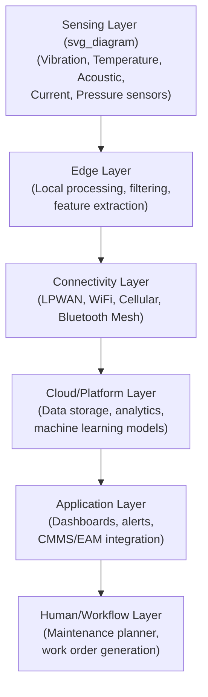
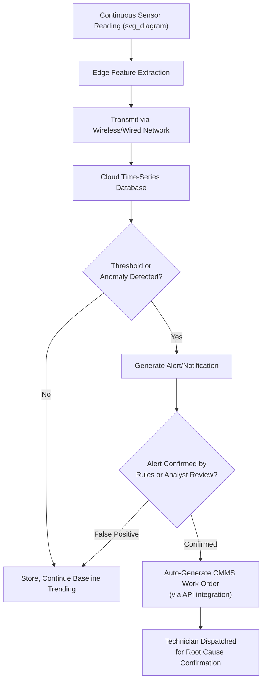

## IoT Sensors and Real-Time Condition Monitoring

### Definition and Purpose

IoT (Internet of Things) Sensors and Real-Time Condition Monitoring refers to the deployment of networked, low-power sensing devices that continuously or near-continuously measure asset health parameters and transmit that data to cloud or edge computing platforms for analysis, alerting, and long-term trending — without requiring a technician to physically visit the asset with a portable instrument. This represents an architectural shift from the **route-based** condition monitoring model (vibration analysts and thermographers walking fixed routes on a periodic schedule) toward **continuous, always-on** monitoring, enabled by the convergence of low-cost MEMS sensors, low-power wireless communication protocols, and cloud-based analytics infrastructure.

The core value proposition is closing the detection gap that exists between route intervals: a fault that develops and progresses to failure faster than the route interval can be entirely missed by periodic monitoring, whereas continuous monitoring detects it as soon as it crosses a meaningful threshold.

### Architectural Layers

**Key Points**

- Each layer introduces distinct engineering tradeoffs: sensing layer choices drive battery life and fault-detection capability; connectivity layer choices drive range, bandwidth, and power consumption; edge processing choices drive how much raw data must traverse the network versus being reduced locally to features or alarms.
- A common architectural mistake is treating this as a purely IT/cloud project without adequate attention to the sensing layer's physical mounting, calibration, and failure-mode-appropriate parameter selection — the analytics layer cannot compensate for poorly specified or poorly mounted sensors.

### Sensor Types for Asset Condition Monitoring

| Sensor Type | Measures | Typical Application |
| --- | --- | --- |
| MEMS accelerometer (tri-axial) | Vibration (acceleration, velocity-derived) | Rotating machinery — bearings, motors, pumps, fans |
| RTD/thermocouple/IR temperature | Surface or process temperature | Bearing housings, motor windings, process equipment |
| Acoustic emission sensor | High-frequency structural sound/ultrasound | Early-stage bearing defects, valve leakage, partial discharge |
| Current transformer (CT) / Rogowski coil | Electrical current draw | Motor Current Signature Analysis (MCSA), load monitoring |
| Pressure transducer | Fluid/gas pressure | Hydraulic/pneumatic systems, pump/compressor performance |
| Ultrasonic level/flow sensor | Liquid level or flow rate | Tank monitoring, pipeline flow verification |
| Strain gauge | Mechanical deformation/load | Structural health monitoring, load cell applications |
| Oil condition sensor (inline) | Dielectric constant, particle count proxy, moisture | Continuous lubricant health screening (complementing periodic lab oil analysis) |

**Key Points**

- Inline oil condition sensors provide continuous screening-level indicators but typically do not replace full laboratory oil analysis (elemental spectroscopy, ferrography); they are generally used to trigger more frequent lab sampling rather than as a full substitute, since their sensing principles (dielectric, capacitive) are less specific than laboratory elemental and morphological analysis.

### Wireless Connectivity Protocols

| Protocol | Range | Power Profile | Bandwidth | Typical Use Case |
| --- | --- | --- | --- | --- |
| LoRaWAN | Long (km-scale, especially outdoor/line-of-sight) | Very low power (multi-year battery life) | Low (small payloads, infrequent transmission) | Distributed outdoor assets, wide-area facility monitoring |
| Bluetooth Low Energy (BLE) / Bluetooth Mesh | Short-to-medium (10s of meters, extended via mesh) | Low power | Low-to-moderate | Dense indoor sensor deployment, mesh relay topologies |
| WiFi (802.11) | Medium (building-scale) | Higher power (shorter battery life or requires wired power) | High | High-frequency vibration waveform streaming where bandwidth matters more than battery life |
| Cellular (NB-IoT, LTE-M, 4G/5G) | Long (wide-area, no local gateway needed) | Moderate-to-low (NB-IoT/LTE-M optimized for IoT) | Low-to-moderate | Remote/mobile assets without existing site network infrastructure |
| Zigbee | Short-to-medium (mesh-capable) | Low power | Low-to-moderate | Industrial mesh networks, legacy industrial IoT deployments |
| Wired (4-20mA, Modbus, industrial Ethernet) | Site-dependent | N/A (wired power) | High | Critical assets where wireless reliability/latency is unacceptable, or where existing wired infrastructure exists |

**Key Points**

- Protocol selection is fundamentally a tradeoff between **battery life**, **data richness**, and **latency**: full-resolution vibration waveform data (needed for detailed frequency-domain fault diagnosis) is bandwidth-intensive and favors WiFi or wired connectivity, while simple threshold/trend alerting (sufficient for many screening applications) favors LPWAN protocols optimized for infrequent, small-payload transmission.
- Wireless sensor battery life is a critical total-cost-of-ownership factor at scale — a sensor requiring annual battery replacement across thousands of monitoring points introduces significant recurring labor cost that can offset apparent hardware cost savings versus wired alternatives, particularly for hard-to-access mounting locations.

### Edge Processing and Feature Extraction

Rather than transmitting raw high-frequency waveform data continuously (which would rapidly exhaust battery-powered wireless sensor bandwidth budgets), most IoT condition-monitoring sensors perform **on-device (edge) feature extraction**, computing summary statistics or spectral features locally and transmitting only the reduced feature set under normal conditions.

| Edge-Computed Feature | Purpose |
| --- | --- |
| Overall RMS velocity/acceleration | Summary vibration severity trend (ISO 20816-aligned) |
| Peak/Crest factor | Early bearing defect indicator (impulsive signal characteristic) |
| Kurtosis | Statistical indicator of impulsive/non-Gaussian signal content, associated with early bearing defects |
| FFT peak extraction (selected bins) | Reduced-bandwidth spectral fault signature without transmitting the full spectrum |
| Temperature min/max/average over interval | Trend without continuous streaming |

**Key Points**

- A common edge-computing design pattern is **exception-based full-data transmission**: the sensor transmits only reduced features during normal operation, but automatically triggers a full-resolution waveform capture and transmission when a monitored feature (e.g., RMS velocity or kurtosis) crosses a pre-set threshold — balancing battery life against the need for detailed diagnostic data when an anomaly is detected.
- [Inference] The specific feature set and thresholds appropriate for exception-based triggering should be tuned to the asset class and known dominant failure modes (per FMECA); a generic default threshold set is a reasonable starting point but typically requires site-specific refinement as false-alarm and missed-detection rates are observed in practice.

### Data Platform and Analytics Layer

**Time-Series Database Architecture**

IoT condition-monitoring platforms typically rely on time-series-optimized data storage (rather than conventional relational databases) to efficiently handle high-frequency, timestamped sensor readings at scale across potentially thousands of monitoring points.

**Analytics Approaches**

| Approach | Description | Maturity Level Required |
| --- | --- | --- |
| Threshold/rule-based alerting | Fixed or statistically-derived limits (e.g., ISO 20816 zones) trigger alerts on breach | Baseline — achievable immediately with adequate historical data |
| Trend/rate-of-change analysis | Alerts on the rate of degradation, not just absolute level, catching accelerating faults earlier | Requires sufficient historical baseline per asset |
| Anomaly detection (unsupervised ML) | Statistical models flag deviation from a learned "normal" multivariate operating envelope without pre-labeled failure examples | Requires substantial baseline data per asset class; more complex to validate and explain |
| Predictive/prognostic models (supervised ML, RUL estimation) | Models trained on historical failure examples to estimate Remaining Useful Life or failure probability | Requires a substantial labeled failure history dataset — often the hardest data requirement to satisfy in practice |

**Key Points**

- [Inference] Organizations frequently underestimate the labeled failure history data volume required for reliable supervised prognostic (RUL) models; many industrial assets fail infrequently enough that accumulating a statistically adequate labeled failure dataset for a specific asset class can take years, which is a widely discussed practical limitation in industrial IoT/predictive analytics literature rather than a vendor-specific issue.
- Threshold and trend-based approaches remain the dominant, most reliably deployable analytics tier in current industrial practice; advanced ML-based anomaly detection and RUL prediction are valuable but should be treated as a maturity progression built on top of a solid threshold/trend foundation, not a replacement starting point.

### Real-Time Condition Monitoring Workflow

### Comparison: IoT/Continuous Monitoring vs. Route-Based Monitoring

| Aspect | Route-Based Monitoring | IoT/Continuous Monitoring |
| --- | --- | --- |
| Detection latency | Limited by route interval (days to months) | Near-real-time (minutes to hours) |
| Coverage | Limited by technician time/route capacity | Scalable to large asset populations without proportional labor increase |
| Data richness per reading | High (full-resolution waveform, expert-operated instrument) | Variable — often reduced/feature-based unless exception-triggered |
| Upfront cost | Lower (instrument + labor cost only) | Higher (sensor hardware, network infrastructure, platform licensing) |
| Best fit | Non-critical to moderate-criticality assets; assets with slow-developing, well-understood failure modes | Critical assets; assets with potentially fast-developing failure modes; assets in inaccessible/hazardous locations |
| Analytical depth per event | Deep (skilled analyst interpretation) | Requires either skilled analyst review of flagged exceptions or mature automated analytics |

**Key Points**

- IoT/continuous monitoring does not eliminate the need for skilled vibration analysts, thermographers, and lubrication engineers; it changes their role from primary data collector to exception investigator and model/threshold curator, since raw sensor data still requires expert interpretation, particularly for confirmed alerts before work order generation.
- A pragmatic hybrid deployment model — continuous IoT monitoring on the highest-criticality assets identified through FMECA/RCM criticality ranking, with route-based monitoring retained for lower-criticality assets — is a commonly adopted approach that concentrates the higher IoT infrastructure cost where it delivers the greatest risk-reduction value, rather than a uniform blanket deployment.

### Integration with CMMS/EAM and RCM

**Key Points**

- API-based integration between the IoT condition-monitoring platform and the CMMS/EAM system enables automatic work order generation directly from a confirmed alert, closing the loop from detection to corrective action without manual data re-entry — a common practical integration requirement when evaluating platform vendors.
- The shift to continuous monitoring can materially shorten the effective, exploitable P-F interval available to RCM task planning: where route-based monitoring required setting inspection intervals conservatively (well inside the demonstrated P-F interval to guarantee detection between visits), continuous monitoring can detect a potential failure almost immediately after it becomes measurable, allowing maintenance response planning to use a larger fraction of the total P-F interval for scheduling flexibility.
- Continuous monitoring data provides a substantially richer dataset for refining FMECA occurrence/probability estimates and validating or challenging previously assumed P-F intervals, since it captures degradation trajectories with much finer time resolution than periodic route data.

### Common Implementation Pitfalls

- Deploying IoT sensors broadly across low-criticality assets before establishing infrastructure, analytics maturity, and organizational alert-response workflows on a smaller set of high-criticality pilot assets — often resulting in alert fatigue and poor return on the infrastructure investment.
- Selecting a wireless protocol based on hardware cost alone without modeling total cost of ownership, including battery replacement labor at scale and network infrastructure/gateway costs.
- Under-specifying sensor mounting practices (e.g., inadequate mechanical coupling for vibration sensors, incorrect line-of-sight or emissivity considerations for non-contact temperature sensors), which degrades data quality regardless of platform analytics sophistication.
- Setting alert thresholds without site-specific baseline data or FMECA-informed failure mode context, producing either excessive false alarms (thresholds too tight) or missed detections (thresholds too loose).
- Treating an IoT/analytics platform deployment as a standalone IT project disconnected from the CMMS/EAM work order system and existing RCM task framework, resulting in confirmed alerts that do not translate efficiently into scheduled corrective action.
- [Inference] Overestimating near-term readiness for supervised machine-learning-based Remaining Useful Life prediction given typically sparse labeled failure history; organizations new to industrial IoT condition monitoring are commonly advised in practitioner literature to establish reliable threshold/trend-based alerting first, then layer more advanced analytics as historical data accumulates, though the appropriate pace varies by organization and asset population size.

### Related Topics

- Vibration Analysis and Thermography for Condition Monitoring
- Oil Analysis and Lubrication Programs
- Motor Current Signature Analysis (MCSA)
- Reliability-Centered Maintenance (RCM) and P-F Interval Determination
- Digital Twin Applications in Asset Management
- Edge Computing Architecture for Industrial IoT
- CMMS/EAM API Integration Patterns
- Remaining Useful Life (RUL) Prognostics and Machine Learning Models