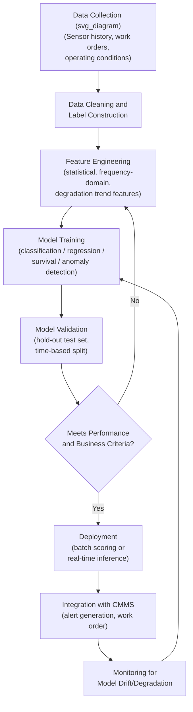
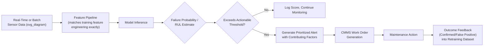

## Machine Learning Models for Failure Prediction

### Definition and Purpose

Machine Learning (ML) Models for Failure Prediction apply statistical learning algorithms to historical and real-time asset data — sensor readings, maintenance records, operating conditions, and failure history — to estimate the probability, timing, or remaining useful life of equipment failure, going beyond the fixed-threshold and rule-based alerting typical of conventional condition monitoring. Where threshold-based monitoring (covered under IoT/real-time condition monitoring) answers "has this parameter crossed a known limit," ML-based failure prediction attempts to answer "given the full pattern of available data, what is the probability this asset fails within a defined future window, and what is driving that risk."

This chapter item sits at the top of the predictive maintenance analytics maturity progression: threshold alerting → trend/rate-of-change analysis → anomaly detection → supervised failure/RUL prediction, with each stage requiring progressively more historical data, modeling sophistication, and organizational data infrastructure.

### Problem Framings

ML failure prediction is not a single algorithm but a family of related problem formulations, each suited to different data availability and business needs:

| Framing | Question Answered | Typical Output |
| --- | --- | --- |
| Binary failure classification | Will this asset fail within the next $N$ days/hours? | Probability of failure (0–1) within a fixed horizon |
| Remaining Useful Life (RUL) regression | How much operating time/life remains before failure? | A continuous estimate (e.g., hours, cycles) |
| Survival analysis | What is the probability of surviving beyond time $t$, and how does that change with covariates? | A survival function / hazard rate over time |
| Anomaly detection (unsupervised) | Does the current operating pattern deviate from established normal behavior? | An anomaly score, without requiring labeled failure examples |
| Multi-class failure mode classification | If a failure occurs, which specific failure mode is most likely? | A probability distribution across known failure mode categories |

**Key Points**

- Binary classification and RUL regression require **labeled failure history** — actual documented failure events tied to the preceding sensor/operational data — which is often the single hardest data requirement to satisfy for physical assets with low failure frequency.
- Anomaly detection avoids the labeled-failure-data requirement by learning a model of "normal" operation and flagging deviation, making it the more immediately achievable approach for asset classes with sparse failure history, at the cost of not directly predicting time-to-failure or failure probability.
- Survival analysis is particularly well suited to censored data — common in reliability contexts, where many assets in the dataset have not yet failed by the time of analysis (their true failure time is unknown, only that it exceeds their current age).

### General ML Pipeline for Failure Prediction

### Data Requirements and Label Construction

**Key Points**

- A failure prediction dataset requires three linked data sources: **time-series sensor/operational data** (vibration, temperature, load, etc.), **asset metadata** (equipment class, age, operating environment), and **maintenance/failure event records** (from the CMMS/EAM, ideally with reliable failure-mode coding) — the quality of the CMMS failure coding directly determines the quality of the resulting labels, making clean, consistent failure coding a prerequisite rather than an afterthought.
- Labels are typically constructed by defining a **prediction horizon** (e.g., "will this asset fail within the next 14 days") and labeling all data points within that window before a documented failure event as positive examples, with all other periods as negative examples — the choice of horizon length is a business decision balancing early-warning value against achievable prediction accuracy (very short horizons are easier to predict accurately but leave less time to act; very long horizons provide more lead time but are harder to predict reliably).
- [Inference] For most industrial asset classes, class imbalance is severe — failures are, by design of a well-maintained asset base, relatively rare events compared to total operating time — which typically requires specific techniques (resampling, class-weighting, or precision/recall-focused evaluation rather than raw accuracy) rather than standard balanced-classification approaches.

### Feature Engineering for Physical Asset Data

| Feature Category | Examples |
| --- | --- |
| Statistical time-domain | Mean, RMS, standard deviation, skewness, kurtosis, crest factor over rolling windows |
| Frequency-domain | FFT peak amplitudes at known fault frequencies (e.g., bearing BPFO/BPFI), spectral energy in defined bands |
| Trend/degradation | Rate of change over time, cumulative degradation slope, time since last maintenance action |
| Operational context | Load, speed, ambient temperature, duty cycle, startup/shutdown counts |
| Maintenance history | Time since last overhaul, cumulative running hours since installation, count of prior repairs |
| Domain-derived ratios | Vibration-to-temperature ratio, wear-metal-to-baseline ratio from oil analysis |

**Key Points**

- Domain-informed features derived from established condition-monitoring physics (bearing fault frequencies, ISO 20816 zones, oil analysis wear ratios) generally outperform purely generic statistical features, since they encode known failure mechanisms rather than requiring the model to rediscover physically meaningful patterns from raw data alone.
- Feature engineering quality is frequently the dominant factor in model performance for industrial failure prediction — more so than the specific choice of algorithm — because physical failure mechanisms are well understood in reliability engineering and that domain knowledge is a strong prior that generic black-box feature learning does not automatically capture with limited failure-labeled data.

### Common Algorithm Families

| Algorithm Family | Typical Application | Characteristics |
| --- | --- | --- |
| Random Forest / Gradient Boosted Trees (XGBoost, LightGBM) | Binary failure classification, RUL regression | Strong baseline performance on tabular/engineered features; relatively interpretable via feature importance |
| Support Vector Machines | Binary classification with moderate-dimensional feature sets | Effective with clear margin separation; less common as a first choice for large modern datasets |
| Recurrent Neural Networks (LSTM/GRU) | Sequence-based RUL estimation from raw or lightly processed time-series | Captures temporal dependencies directly; requires larger datasets than tree-based methods to train reliably |
| Convolutional Neural Networks (1D-CNN) | Pattern recognition directly on raw vibration/acoustic waveforms | Can learn fault signatures without manual frequency-domain feature engineering, at the cost of reduced interpretability |
| Cox Proportional Hazards Model | Survival analysis with covariates | Statistically well-established, interpretable hazard ratios, handles censored data natively |
| Weibull Analysis (parametric survival) | Population-level failure rate modeling by failure mode | Classical reliability engineering tool, directly compatible with RCM's age-reliability pattern classification |
| Isolation Forest / Autoencoders | Unsupervised anomaly detection | Do not require labeled failure data; flag deviation from learned normal operating envelope |
| One-Class SVM | Unsupervised anomaly detection | Alternative to Isolation Forest/autoencoders for boundary-based normal-operation modeling |

**Key Points**

- Gradient-boosted tree methods are frequently reported as the strongest general-purpose baseline for tabular, engineered-feature failure prediction problems in industrial settings, largely because well-engineered domain features on moderate dataset sizes often favor tree ensembles over deep learning architectures that typically require substantially larger training datasets to outperform them.
- Deep learning approaches (LSTM, 1D-CNN) become more competitive as raw time-series data volume increases and when manual feature engineering is impractical or when subtle temporal/waveform patterns are suspected to carry predictive signal not captured by conventional engineered features — but they introduce higher data volume requirements and reduced interpretability as tradeoffs.

### Weibull Analysis as a Foundational Statistical Method

Weibull analysis deserves specific attention as the classical statistical bridge between traditional reliability engineering and modern ML failure prediction, since it directly parametrizes the same age-reliability failure patterns referenced in RCM methodology.

$$R(t) = e^{-\left(\frac{t}{\eta}\right)^{\beta}}$$

Where $R(t)$ is the reliability (survival probability) at time $t$, $\eta$ is the scale parameter (characteristic life), and $\beta$ is the shape parameter.

**Key Points**

- The shape parameter $\beta$ directly indicates the failure pattern type: $\beta < 1$ indicates a decreasing failure rate (infant mortality, consistent with RCM's Pattern F), $\beta = 1$ indicates a constant failure rate (random failures, consistent with RCM's Pattern E, and mathematically equivalent to an exponential distribution), and $\beta > 1$ indicates an increasing failure rate (wear-out, consistent with RCM's Patterns A/B/C).
- Weibull analysis requires substantially less data than most ML approaches to produce a statistically meaningful population-level result, since it fits only two parameters, but it typically operates at the population/fleet level (all pumps of a given model) rather than predicting the specific remaining life of an individual asset instance based on its unique condition data — this is the key distinction from individual-asset ML-based RUL prediction.

### Model Validation for Time-Series Failure Data

**Key Points**

- Standard random train/test splitting is generally inappropriate for time-series failure prediction, since it can allow information from the future to leak into training data (e.g., training on data from after a test-set failure event) — a **time-based split** (training strictly on data preceding a cutoff date, testing on data after it) is standard practice to produce a realistic estimate of how the model would perform when deployed.
- Evaluation metrics should reflect the actual business cost asymmetry: a missed failure (false negative) typically carries a much higher cost (unplanned downtime, safety risk) than a false alarm (false positive, which costs an unnecessary inspection) — this generally favors optimizing for **recall** (catching true failures) at an acceptable precision level, rather than optimizing for raw accuracy, which is a poor metric under severe class imbalance.
- [Inference] Reported model performance metrics (precision, recall, AUC) from a training/validation dataset should be treated cautiously when extrapolated to deployment on a different but similar asset population, since failure patterns, sensor placement, and operating conditions often vary meaningfully between even nominally identical equipment across different sites — this generalization gap is a commonly discussed practical limitation rather than a given model's specific flaw.

### Model Deployment and Integration

**Key Points**

- The feature engineering pipeline used at inference time must exactly match the pipeline used during training — a common and well-documented source of production model failure ("training-serving skew") occurs when real-time feature computation subtly differs from the batch feature computation used to build the training dataset.
- Including **explainability output** alongside a failure probability score (e.g., which specific features/sensors contributed most to a given prediction, via methods such as SHAP values for tree-based models) is important for maintenance technician trust and actionability — a bare probability score without indication of which parameter is driving the risk gives a technician little basis for targeted investigation.
- A feedback loop capturing the actual outcome of each generated alert (confirmed failure, false positive, or unconfirmed) is essential both for ongoing model performance monitoring and for accumulating higher-quality labeled data over time, directly addressing the labeled-data scarcity that constrains initial model development.

### Model Drift and Retraining

**Key Points**

- Asset behavior changes over time due to component wear, seasonal operating condition shifts, process changes, and maintenance interventions — a model trained on historical data can gradually lose accuracy as the underlying data-generating process shifts, a phenomenon generally termed model or concept drift.
- A scheduled or trigger-based retraining process (e.g., retraining when validation performance on recent data drops below a defined threshold, or on a fixed periodic schedule) is standard practice for maintaining model reliability over an asset's operating life, rather than treating a deployed model as a permanent, static artifact.

### Integration with RCM, FMECA, and Existing Condition Monitoring

**Key Points**

- ML failure prediction should be understood as an analytical layer built on top of, not a replacement for, the condition-monitoring technologies and RCM decision framework already established: raw vibration, thermography, oil analysis, and IoT sensor data are frequently the direct feature inputs to these models, and RCM's failure mode/consequence classification provides the business logic for setting decision thresholds and prioritizing which assets or failure modes warrant the investment in a dedicated predictive model.
- FMECA's failure mode taxonomy provides a natural structure for multi-class failure mode prediction models (predicting *which* failure mode is likely, not only *that* failure is likely), since the failure mode categories and their associated detection signatures have typically already been documented during FMECA.
- A pragmatic prioritization approach, consistent with RCM's own consequence-driven logic, is to reserve ML-based predictive modeling investment for high-criticality asset classes with adequate sensor instrumentation and sufficient failure history, while retaining threshold-based condition monitoring and RCM-derived scheduled tasks for lower-criticality assets where the additional modeling investment is unlikely to be cost-justified.

### Common Implementation Pitfalls

- Attempting supervised failure classification or RUL regression on an asset class with too few historical labeled failure events to support statistically meaningful model training — a frequently underestimated data requirement, particularly for reliable, well-maintained critical equipment that, by design, fails infrequently.
- Using raw accuracy as the primary evaluation metric under severe class imbalance, producing a model that appears highly accurate by simply predicting "no failure" for nearly all cases while providing little real predictive value.
- Applying random (non-time-based) train/test splitting to time-series failure data, allowing data leakage that produces artificially inflated validation performance not representative of real deployment conditions.
- Deploying a model without an explainability/contributing-factor output, resulting in low technician trust and poor adoption of generated alerts regardless of underlying model accuracy.
- Treating a deployed model as static and neglecting drift monitoring and retraining processes, allowing performance to silently degrade as operating conditions or asset population characteristics shift over time.
- Building model features inconsistently between training and production inference pipelines (training-serving skew), a well-documented general MLOps failure mode that applies directly to industrial failure prediction deployments.
- [Inference] Over-investing in deep learning approaches before establishing solid feature engineering and a validated threshold/trend-based baseline; practitioner literature commonly recommends progressing through the analytics maturity stages (threshold → trend → anomaly detection → supervised prediction) rather than beginning with the most complex modeling approach, though the appropriate pace depends on data availability and organizational analytics capability.

### Related Topics

- IoT Sensors and Real-Time Condition Monitoring
- Vibration Analysis and Thermography for Condition Monitoring
- Oil Analysis and Lubrication Programs
- Reliability-Centered Maintenance (RCM) Methodology
- Failure Mode, Effects, and Criticality Analysis (FMECA)
- Weibull Analysis and Age-Reliability Data Modeling
- Remaining Useful Life (RUL) Prognostics
- MLOps Practices for Industrial Predictive Maintenance Deployment