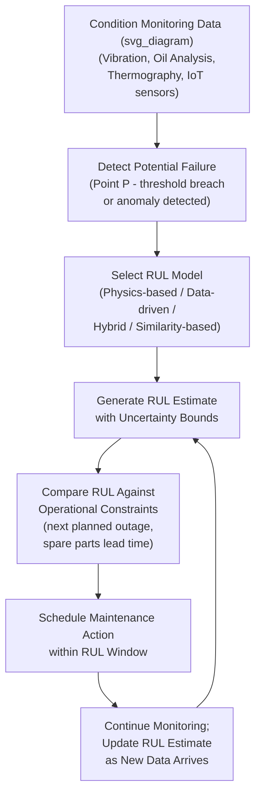

## Remaining Useful Life Estimation

### Definition and Purpose

Remaining Useful Life (RUL) Estimation is the process of predicting the amount of time, operating cycles, or usage remaining before an asset or component can no longer perform its required function within acceptable limits. RUL is fundamentally different from a binary failure classification: rather than answering "will this fail soon," RUL estimation produces a continuous quantity — expressed in hours, cycles, distance, or calendar time — representing the interval between the current assessment point and the projected end of useful life.

RUL is the quantitative backbone connecting condition-monitoring data (vibration, oil analysis, thermography, IoT sensor streams) to actionable maintenance scheduling: it is the specific output that lets a planner convert "this bearing is degrading" into "this bearing has an estimated 340 operating hours remaining, so schedule replacement within the next 250 hours." This directly operationalizes the P-F interval concept from Reliability-Centered Maintenance (RCM) into a continuously updated, asset-specific estimate rather than a fixed population-level interval.

### RUL in the Context of the P-F Curve

**Key Points**

- RUL estimation is most meaningful and most commonly applied within the degradation zone between point P (potential failure detected) and point F (functional failure) — before point P, there is typically no reliable condition signal from which to estimate a specific remaining life, so RUL estimates during healthy operation tend to be population-level (Weibull-based) rather than individual-asset-specific.
- As an asset progresses further into the degradation zone, RUL estimates generally become more accurate (narrower confidence interval) since more condition data reflecting the specific degradation trajectory becomes available — early-stage RUL estimates necessarily carry wider uncertainty bands.

### RUL Estimation Approaches

| Approach Category | Description | Data Requirement |
| --- | --- | --- |
| Physics-based (model-driven) | Uses a mathematical degradation model derived from known physical failure mechanics (fatigue crack growth, wear rate equations) | Requires validated physical model parameters for the specific failure mechanism and material |
| Data-driven (statistical/ML) | Learns degradation patterns directly from historical sensor data and failure history without an explicit physical model | Requires substantial historical run-to-failure data with condition monitoring history |
| Hybrid (physics-informed ML) | Combines a physical degradation model structure with data-driven parameter estimation/correction | Requires both a credible physical model and supporting historical data |
| Similarity-based | Compares current degradation trajectory against a library of historical run-to-failure trajectories from similar assets, finding the closest matches | Requires a library of complete historical degradation-to-failure curves from comparable assets |

### Physics-Based RUL Models

Physics-based models apply established degradation mechanics equations to project forward from a current measured or inferred damage state to a failure threshold.

**Paris' Law (Fatigue Crack Growth)**

$$\frac{da}{dN} = C(\Delta K)^m$$

Where $\frac{da}{dN}$ is crack growth rate per load cycle, $\Delta K$ is the stress intensity factor range, and $C$ and $m$ are material-specific constants determined experimentally.

**Key Points**

- Integrating Paris' Law from a currently measured or inspected crack length to a critical (failure) crack length yields an estimated number of remaining load cycles, directly usable as an RUL estimate for fatigue-critical structural components.
- [Inference] Physics-based models require accurate, asset-specific input parameters (current crack length, applied stress range, validated material constants); when these inputs are estimated rather than directly measured, resulting RUL predictions inherit that estimation uncertainty, and this should be reflected in the confidence bounds communicated alongside any point estimate.

**Archard's Wear Equation (Adhesive/Abrasive Wear)**

$$Q = K \frac{W L}{H}$$

Where $Q$ is volume of material removed, $K$ is a dimensionless wear coefficient, $W$ is applied load, $L$ is sliding distance, and $H$ is material hardness. Comparing projected cumulative wear volume against a known failure threshold (e.g., a maximum allowable clearance or wall-thickness loss) yields an RUL estimate in terms of remaining sliding distance or operating time.

### Data-Driven RUL Models

**Degradation Trend Extrapolation**

The simplest data-driven approach fits a trend line (linear, exponential, or power-law) to a condition indicator's historical trajectory and extrapolates forward to a defined failure threshold.

$$RUL = \frac{X_{threshold} - X_{current}}{\text{rate of change}}$$

**Example**

A gearbox's oil analysis iron content has risen from 15 ppm to 45 ppm over the past 90 days of operation (a linear rate of approximately 0.33 ppm/day). If the established failure threshold for that gearbox's iron content is 100 ppm:

$$RUL = \frac{100 - 45}{0.33} \approx 167\ \text{days}$$

This straightforward extrapolation assumes the degradation rate remains constant; more sophisticated approaches account for the frequently observed acceleration of degradation rate as a component approaches failure (many wear and fatigue mechanisms exhibit an accelerating, not linear, trajectory in their final stages).

**Machine Learning Regression Models**

Supervised regression models (gradient-boosted trees, recurrent neural networks, and other architectures discussed under general ML failure prediction) can be trained directly to predict RUL as a continuous target variable, typically using run-to-failure datasets where every historical time point is labeled with the actual number of cycles/hours remaining until the eventual observed failure.

**Key Points**

- The widely used NASA C-MAPSS turbofan engine degradation dataset is a commonly referenced public benchmark in RUL research literature, illustrating the standard data structure required: multiple run-to-failure trajectories with multivariate sensor readings recorded at each time step, each ultimately ending in a documented failure event.
- Sequence models (LSTM, GRU, temporal convolutional networks) are frequently applied to RUL regression because degradation trajectories are inherently sequential and the recent trend/rate of change often carries more predictive signal than any single instantaneous reading — but as with general ML failure prediction, these approaches generally require larger historical datasets than tree-based methods to train reliably.

### Similarity-Based RUL Estimation

This approach maintains a library of complete historical degradation trajectories (each ending in a documented failure) and, for a currently degrading asset, identifies which historical trajectories most closely match the current asset's observed degradation pattern up to the present point. The RUL of the closest-matching historical trajectories (adjusted for the current asset's progress along that pattern) informs the estimate for the asset under assessment.

**Key Points**

- This approach is intuitive and interpretable (a maintenance planner can be shown "this asset's degradation pattern most closely resembles these three historical failures, which had X, Y, Z remaining life at this point") but requires a sufficiently large and diverse library of complete historical run-to-failure trajectories, which is a similarly demanding data requirement to that of ML regression approaches.

### Uncertainty Quantification in RUL Estimates

**Key Points**

- A single point-estimate RUL value (e.g., "167 days remaining") is generally less useful for maintenance planning than an estimate accompanied by a confidence interval or probability distribution (e.g., "50% probability of failure within 140–200 days, 90% probability within 100–260 days"), since planning decisions differ substantially depending on whether the estimate is tightly or widely bounded.
- Common approaches to expressing RUL uncertainty include Bayesian methods (producing a posterior probability distribution over RUL), ensemble methods (using variance across multiple model predictions as an uncertainty proxy), and quantile regression (directly predicting multiple percentiles of the RUL distribution rather than a single mean/median value).
- [Inference] Communicating RUL uncertainty effectively to maintenance planners who may be more accustomed to fixed-interval scheduling is itself a practical adoption challenge, distinct from the technical modeling challenge — this organizational/communication dimension is commonly discussed in industrial predictive maintenance case studies alongside the purely technical aspects.

### RUL Estimation Workflow

**Key Points**

- RUL estimation is not a one-time calculation but a continuously updated process: as new condition data arrives, the estimate should be recalculated, typically narrowing in confidence and shifting in value as the asset progresses through its degradation trajectory.
- The practical value of an RUL estimate depends on comparing it against operational planning constraints — a 167-day RUL estimate is actionable only in the context of factors such as spare parts lead time, the next scheduled production outage, and available maintenance labor capacity; RUL estimation and maintenance scheduling should be treated as linked, not sequential-and-separate, activities.

### Comparison of RUL Approaches

| Aspect | Physics-Based | Data-Driven (ML) | Similarity-Based |
| --- | --- | --- | --- |
| Interpretability | High (grounded in known physical mechanism) | Variable (lower for deep learning, higher for tree-based with feature importance) | High (direct comparison to historical cases) |
| Data requirement | Validated material/mechanism parameters, less dependent on large failure datasets | Substantial run-to-failure historical datasets | Library of complete historical degradation-to-failure trajectories |
| Generalization to novel failure modes | Limited to the specific mechanism modeled | Can capture unanticipated patterns present in training data | Limited to patterns present in the historical trajectory library |
| Best fit | Well-understood, single dominant failure mechanism (fatigue, wear) with established physical models | Complex assets with multiple interacting degradation mechanisms and adequate historical data | Fleet assets with many comparable units and accumulated failure history |

**Key Points**

- Hybrid physics-informed approaches are an active area of practical interest because they aim to combine physics-based models' interpretability and lower data requirements with data-driven methods' ability to correct for factors the physical model does not fully capture (e.g., using measured data to recalibrate a physics model's parameters for a specific asset instance rather than relying solely on generic material constants).

### Integration with RCM, FMECA, and Maintenance Planning

**Key Points**

- RUL estimation is the natural quantitative refinement of RCM's condition-based task logic: RCM establishes that a condition-based task is technically feasible and worth-doing given a population-level P-F interval, while RUL estimation refines the specific timing decision for an individual asset instance based on its actual observed degradation trajectory, rather than relying solely on a generic interval applied uniformly across a fleet.
- FMECA's failure mode taxonomy determines which physics-based degradation model (if any) is appropriate for a given failure mode — a fatigue-driven failure mode points toward Paris' Law-based crack growth modeling, while an abrasive wear failure mode points toward Archard's equation, meaning FMECA output should directly inform RUL model selection rather than defaulting to a generic data-driven approach for every failure mode regardless of its underlying physics.
- Spare parts and MRO inventory strategy benefits directly from reliable RUL estimates: a component with a well-bounded RUL estimate approaching its failure threshold can trigger just-in-time procurement rather than requiring standing strategic stock, provided the RUL estimate's lead time exceeds the part's procurement lead time with adequate margin.

### Common Implementation Pitfalls

- Communicating a single point-estimate RUL value without accompanying uncertainty bounds, leading to overconfident scheduling decisions that do not account for genuine prediction variability.
- Applying a constant-rate linear extrapolation to a degradation mechanism known to accelerate near failure (common in fatigue and advanced wear/spalling mechanisms), producing an RUL estimate that is systematically too optimistic (overestimates remaining life) in the critical final stage.
- Selecting a data-driven ML approach by default without first assessing whether a well-established physics-based model exists for the dominant failure mechanism (per FMECA), missing an opportunity for a more interpretable, lower-data-requirement solution.
- Treating an RUL estimate as static after initial calculation rather than continuously updating it as new condition data arrives, causing maintenance scheduling decisions to rely on stale information as the asset's actual degradation trajectory evolves.
- Failing to link the RUL estimate to actual operational planning constraints (spare parts lead time, outage windows, labor availability), producing a technically accurate estimate that does not translate into an actionable maintenance schedule.
- [Inference] Applying an RUL model trained or calibrated on one asset population directly to a nominally similar but operationally distinct asset population (different load profile, environment, or duty cycle) without validation, given that degradation trajectories are frequently sensitive to operating context in ways that may not transfer directly between installations — this generalization risk is a commonly discussed limitation in prognostics literature rather than specific to any one model type.

### Related Topics

- Machine Learning Models for Failure Prediction
- IoT Sensors and Real-Time Condition Monitoring
- Reliability-Centered Maintenance (RCM) and P-F Interval Determination
- Failure Mode, Effects, and Criticality Analysis (FMECA)
- Weibull Analysis and Age-Reliability Data Modeling
- Vibration Analysis and Thermography for Condition Monitoring
- Oil Analysis and Lubrication Programs
- Spare Parts and MRO Inventory Strategy