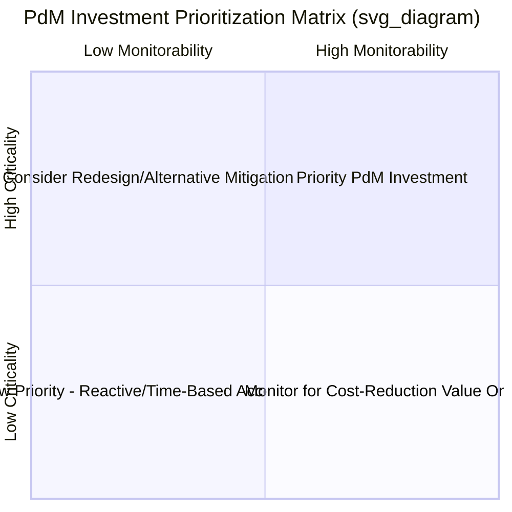
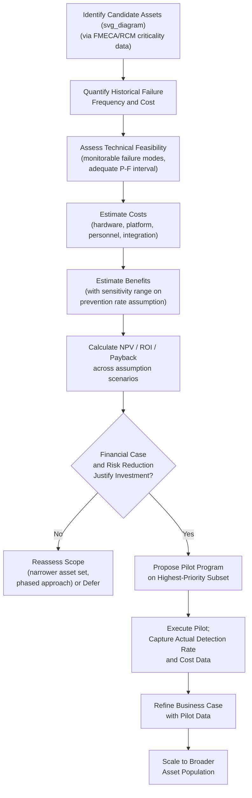

## Building the Business Case for Predictive Maintenance Adoption

### Definition and Purpose

Building the Business Case for Predictive Maintenance (PdM) Adoption is the structured process of quantifying costs, benefits, risks, and organizational readiness to justify investment in condition-monitoring technologies, IoT infrastructure, and analytics capability over continuing with existing reactive or time-based preventive maintenance approaches. Unlike the preceding technical chapter items (vibration analysis, oil analysis, IoT sensors, ML failure prediction, RUL estimation), this item addresses the **decision-making and financial justification layer** that determines whether, where, and how aggressively an organization should invest in those technologies.

A well-constructed business case translates technical capability into financial and risk language that capital allocation decision-makers require, and — critically — uses the same criticality and consequence framework established in RCM and FMECA to ensure investment is directed toward assets where it delivers genuine value, rather than applied uniformly across a facility regardless of actual risk profile.

### Why a Formal Business Case Is Necessary

**Key Points**

- PdM technology investment (sensors, connectivity infrastructure, analytics platforms, and the specialist skills to operate them) competes for capital against other organizational priorities; without a quantified case, funding decisions default to qualitative arguments that are more easily deprioritized against competing projects with explicit financial justification.
- PdM benefits are frequently diffuse and realized over an extended period (avoided failures that did not happen), which are inherently harder to demonstrate than the visible, immediate cost of the investment itself — this asymmetry is a well-documented general challenge in justifying preventive/predictive investments across many industries, not specific to any particular technology vendor or sector.
- A rigorous business case also serves an internal risk-management function: it forces explicit identification of which assets and failure modes are being targeted and why, which itself often surfaces gaps or misalignments in the current maintenance strategy independent of whether the specific PdM investment proceeds.

### Cost Categories

| Cost Category | Includes |
| --- | --- |
| Capital/hardware | Sensors, gateways, edge computing devices, installation labor |
| Software/platform | Analytics platform licensing, cloud data storage/compute, CMMS integration development |
| Ongoing operational | Sensor battery replacement, calibration, network connectivity fees, platform subscription renewal |
| Personnel/skills | Analyst training or hiring (vibration analysts, data scientists, reliability engineers), change management effort |
| Integration | CMMS/EAM integration engineering, data pipeline development, IT/OT network security review |

### Benefit Categories

| Benefit Category | Description | Quantification Approach |
| --- | --- | --- |
| Avoided unplanned downtime | Failures detected and addressed proactively before functional failure | (Historical failure frequency) × (average downtime cost per failure) × (assumed detection/prevention rate) |
| Reduced secondary/collateral damage | Early detection prevents a minor fault from cascading into major component damage | Difference between typical planned-repair cost and typical failure-driven repair cost for the same failure mode |
| Extended maintenance intervals | Condition-based evidence supports extending fixed-interval PM tasks (e.g., oil changes, overhauls) without added risk | (Reduced task frequency) × (labor + parts + production interruption cost per task avoided) |
| Reduced inventory/spares carrying cost | Improved failure timing visibility allows just-in-time procurement rather than standing strategic stock | Reduction in required safety stock/insurance spares, per the criticality-based stocking logic |
| Extended asset life | Reduced secondary damage and optimized lubrication/operating conditions extend overall service life | Deferred capital replacement cost, discounted to present value |
| Improved safety/compliance | Reduced probability of safety-consequence or environmental-consequence failures | Often expressed qualitatively or via risk-reduction framing rather than direct monetization, though incident cost avoidance can be estimated where historical data exists |
| Labor productivity | Shift from route-based manual inspection to exception-based investigation frees skilled labor for higher-value work | (Reduced route time) × (labor rate), net of any new analyst time required |

**Key Points**

- Avoided unplanned downtime is typically the largest and most defensible benefit category for critical, high-consequence assets, since downtime cost (lost production, expedited repair, secondary damage) is usually already tracked or estimable from historical incident records.
- The "assumed detection/prevention rate" in the avoided-downtime calculation is the single most consequential and most frequently contested assumption in a PdM business case — it should be grounded in documented case studies or pilot results specific to the failure modes and technology being proposed, rather than an optimistic generic industry figure, since detection effectiveness varies substantially by failure mode, asset type, and monitoring technology maturity.

### Core Financial Justification Framework

**Net Present Value (NPV) of the Investment**

$$NPV = \sum_{t=0}^{n} \frac{B_t - C_t}{(1+r)^t}$$

Where $B_t$ is total benefit in year $t$, $C_t$ is total cost in year $t$, $r$ is the discount rate, and $n$ is the evaluation horizon.

**Return on Investment (ROI)**

$$ROI = \frac{\text{Total Benefit} - \text{Total Cost}}{\text{Total Cost}} \times 100\%$$

**Payback Period**

$$\text{Payback Period} = \frac{\text{Initial Investment}}{\text{Average Annual Net Benefit}}$$

**Example**

An organization considers deploying continuous vibration monitoring on 20 critical pumps at a total upfront cost of $180,000 (sensors, gateways, platform setup) plus $25,000/year ongoing (platform subscription, battery replacement). Historical data shows these pumps experience an average of 4 unplanned failures/year across the fleet, each costing an average of $45,000 in downtime and secondary damage. If the deployment is conservatively assumed to prevent 60% of these failures through earlier detection and planned intervention:

$$\text{Annual Avoided Cost} = 4 \times 0.60 \times \$45{,}000 = \$108{,}000$$

$$\text{Annual Net Benefit} = \$108{,}000 - \$25{,}000 = \$83{,}000$$

$$\text{Payback Period} = \frac{\$180{,}000}{\$83{,}000} \approx 2.2\ \text{years}$$

This payback period, combined with the qualitative safety and spares-reduction benefits, forms the core quantitative argument; sensitivity analysis (see below) should then test how this conclusion holds under more conservative assumptions.

### Sensitivity Analysis

**Key Points**

- Because the detection/prevention rate assumption carries the most uncertainty, a credible business case should present the financial outcome across a range of assumptions (e.g., 30%, 45%, 60% prevention rate) rather than a single point estimate, allowing decision-makers to see how conclusions change under more conservative scenarios.
- Sensitivity analysis should also test the downtime cost estimate itself, particularly where downtime cost varies significantly by season, production schedule, or market conditions (e.g., a failure during peak production season may cost substantially more than the same failure during a planned low-demand period) — using a single average annual downtime cost figure can obscure this variability.

### Asset Prioritization for PdM Investment

**Key Points**

- PdM investment should be prioritized using the same criticality classification developed through FMECA and RCM analysis, not deployed uniformly: assets with safety, environmental, or high-operational-consequence failure modes and adequate technical feasibility for condition monitoring represent the strongest business case candidates, while low-criticality assets with inexpensive, readily available replacements are typically poor candidates for PdM investment regardless of technical feasibility.
- A criticality-versus-monitorability matrix is a useful prioritization tool: assets that are both highly critical **and** have failure modes that are technically well-suited to condition monitoring (measurable, adequate P-F interval) represent the highest-value initial deployment targets; highly critical assets whose dominant failure modes are not well-suited to available condition-monitoring techniques may instead warrant redesign or different risk-mitigation strategies rather than PdM investment.

### Pilot Program Approach

**Key Points**

- A phased pilot deployment — targeting a limited, well-chosen subset of high-criticality, high-monitorability assets before broader rollout — is widely recommended in industrial PdM adoption practice as a way to validate detection effectiveness, refine alert thresholds, and generate organization-specific benefit data before committing to full-scale investment.
- Pilot results should specifically capture the actual detection/prevention rate achieved and the actual cost of false alarms/investigation effort, since these organization-specific figures substantially strengthen the business case for subsequent phases compared to relying solely on generic industry benchmark figures cited in vendor literature.
- [Inference] A pilot program duration sufficient to observe at least one or two genuine failure/near-failure events for the monitored asset population is generally necessary to produce meaningful detection-effectiveness data; for low-failure-frequency critical assets, this may require a longer pilot period than initially planned, which should be communicated as an expectation to stakeholders at the outset rather than discovered as a delay partway through the pilot.

### Organizational Readiness Factors

| Factor | Consideration |
| --- | --- |
| Existing CMMS/EAM data quality | Poor historical failure-coding data undermines both benefit quantification and future ML model development; may require a data-quality remediation effort before or alongside PdM deployment |
| Skills availability | Vibration analysis, oil analysis, and data science skills may need to be developed internally or sourced externally; the business case should include this cost explicitly |
| IT/OT network readiness | Existing network infrastructure, cybersecurity policy, and IT/OT integration maturity affect both feasibility and cost of connectivity layer deployment |
| Change management | Shifting maintenance planners and technicians from schedule-based to condition/alert-based workflows requires process redesign and workforce buy-in, not solely a technology deployment |
| Existing RCM/FMECA maturity | Organizations with mature RCM/FMECA analysis already have the failure mode and criticality data needed to prioritize PdM investment efficiently; organizations without this foundation may need to invest in it concurrently |

**Key Points**

- [Inference] Organizational and process readiness factors are commonly cited in industrial case studies as being as significant to PdM program success as the underlying sensor and analytics technology itself; a technically sound deployment can still underperform its business case if the maintenance planning workflow is not adapted to actually act on the generated alerts in a timely manner.

### Business Case Development Workflow

### Integration with Broader Reliability and Asset Management Strategy

**Key Points**

- A PdM business case should not be built in isolation from the organization's broader RCM program; PdM technologies are, from the RCM decision-logic perspective, simply the technical means of executing condition-based tasks — the business case is strongest when framed as investment in *executing* already-justified RCM task recommendations more precisely, rather than as a standalone technology initiative disconnected from existing maintenance strategy.
- Where an organization lacks a mature RCM/FMECA foundation, a candid business case should acknowledge that some portion of the investment (or a preceding phase) may need to fund that foundational analysis work, since prioritizing PdM investment without reliable criticality and failure-mode data risks misallocating capital toward assets that appear urgent anecdotally rather than assets that are genuinely highest-risk.
- Benefits realized from a PdM program (extended intervals, reduced spares, avoided downtime) should be fed back into updating the organization's RCM task assignments and spare parts stocking strategy, closing the loop between the investment and the broader maintenance strategy documents it was intended to support.

### Common Implementation Pitfalls

- Using generic industry-average benefit figures (e.g., a commonly cited but non-organization-specific "X% reduction in downtime") without validating them against the specific organization's failure history, asset condition, and technology maturity, producing an overly optimistic case that underdelivers post-implementation.
- Applying a single point-estimate for detection/prevention rate without sensitivity analysis, leaving the business case vulnerable to being discredited if actual results fall short of the optimistic assumption.
- Deploying PdM technology uniformly across an asset population without first applying FMECA/RCM criticality prioritization, diluting investment across low-value applications and weakening the overall demonstrated ROI.
- Omitting ongoing operational costs (battery replacement, platform subscription renewal, recurring analyst time) from the financial model, understating true total cost of ownership and overstating apparent payback speed.
- Treating the business case as a one-time approval gate rather than a living document updated with actual pilot and early-deployment data, missing the opportunity to strengthen (or appropriately revise) the case for subsequent phased investment.
- Underestimating the organizational change management effort required to shift maintenance planning workflows from schedule-driven to alert-driven, resulting in generated alerts that are not acted upon promptly enough to realize the modeled downtime-avoidance benefit.
- [Inference] Failing to align the PdM business case explicitly with existing RCM/FMECA documentation is a commonly observed gap in practice; treating PdM as a standalone digital transformation initiative rather than as the technical execution layer for already-justified maintenance strategy decisions tends to weaken both the credibility of the financial case and its integration into ongoing maintenance operations.

### Related Topics

- Reliability-Centered Maintenance (RCM) Methodology
- Failure Mode, Effects, and Criticality Analysis (FMECA)
- IoT Sensors and Real-Time Condition Monitoring
- Machine Learning Models for Failure Prediction
- Spare Parts and MRO Inventory Strategy
- Total Cost of Ownership (TCO) Analysis for Physical Assets
- Change Management for Maintenance Organization Transformation
- ISO 55000 Asset Management Standard