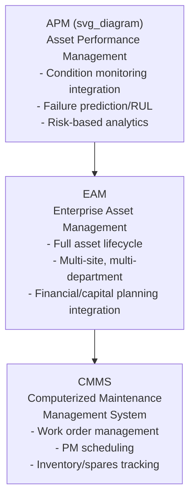
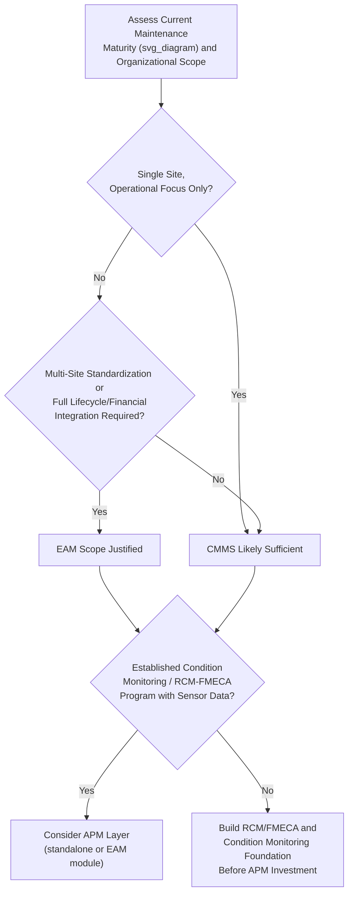

## Comparing CMMS, EAM, and APM Scope and Selection Criteria

### Definition and Purpose

CMMS (Computerized Maintenance Management System), EAM (Enterprise Asset Management), and APM (Asset Performance Management) are three overlapping but distinct categories of software systems supporting physical asset operations. Vendors and practitioners frequently use these terms inconsistently — many commercial products market themselves under more than one label, and functional overlap has increased over time — but the categories originated with distinct scopes and design intents that remain useful for selection criteria even where product marketing blurs the boundaries.

Understanding the distinction matters because selecting a system based on category label alone, without evaluating actual functional scope against organizational requirements, is a common and costly procurement mistake.

### Core Scope Distinctions

| System | Primary Scope | Core Question Answered |
| --- | --- | --- |
| CMMS | Maintenance work management | What maintenance work needs to be done, and has it been done? |
| EAM | Full asset lifecycle management | What is the total cost, condition, and value of this asset across its entire life, across the enterprise? |
| APM | Asset health, risk, and performance analytics | How is this asset performing relative to its potential, and what is its failure risk? |

**Key Points**

- The diagram's containment relationship reflects a common conceptual model (CMMS functionality nested within EAM, which is often complemented by APM analytics) but is a simplification — in practice, many organizations run a standalone CMMS without any EAM layer, and APM capability is increasingly offered both as a standalone analytics platform and as an add-on module to EAM suites, so the boundary is not a strict architectural hierarchy in every deployment.

### CMMS: Core Functional Scope

| Function | Description |
| --- | --- |
| Work order management | Creation, assignment, tracking, and closure of maintenance work orders (reactive, preventive, predictive) |
| Preventive maintenance scheduling | Time- or usage-based triggering of recurring maintenance tasks |
| Asset/equipment registry | Basic asset hierarchy, identification, and specification records |
| Inventory/spare parts management | Stock levels, reorder points, parts-to-work-order linkage |
| Labor and resource scheduling | Technician assignment, craft/skill matching, scheduling against availability |
| Basic reporting | Work order history, PM compliance, backlog tracking |

**Key Points**

- CMMS systems are typically scoped to a single facility or a moderate number of sites, and are historically the entry point for organizations digitizing paper-based or spreadsheet-based maintenance tracking.
- A mature RCM program's task outputs (from the seven-question RCM process) are operationalized directly in a CMMS as scheduled PM work orders and failure-finding tasks — CMMS is the execution layer for RCM-derived maintenance strategy, not itself an analytical tool for deriving that strategy.

### EAM: Extended Functional Scope

EAM includes all core CMMS functionality plus:

| Additional Function | Description |
| --- | --- |
| Multi-site/enterprise asset hierarchy | Standardized asset structure and reporting across multiple facilities, business units, or geographies |
| Full asset lifecycle tracking | From capital planning and procurement through commissioning, operation, and disposal/decommissioning |
| Financial/capital integration | Depreciation tracking, capital expenditure planning, total cost of ownership analysis, often integrated with ERP financial modules |
| Procurement and contract management | Vendor management, purchase order integration, warranty tracking |
| Regulatory/compliance management | Audit trails, inspection compliance records, environmental/safety regulatory documentation |
| Project/capital work management | Distinguishing capital project work from operational maintenance work within a unified system |

**Key Points**

- EAM's defining distinction from CMMS is enterprise scope (multi-site standardization) and lifecycle scope (cradle-to-grave asset tracking including financial/capital dimensions), rather than any single additional feature — an organization with a single facility and no capital planning integration need may find a well-featured CMMS functionally sufficient without requiring EAM's broader scope.
- EAM systems commonly integrate with, or are modules within, broader ERP (Enterprise Resource Planning) platforms, reflecting their role in connecting maintenance operations data to enterprise financial and procurement systems — this integration requirement is frequently a significant factor in EAM implementation cost and complexity relative to standalone CMMS deployment.

### APM: Analytical and Risk-Focused Scope

APM adds a distinct analytical layer, typically including:

| Function | Description |
| --- | --- |
| Condition monitoring integration | Ingestion of vibration, thermography, oil analysis, and IoT sensor data streams |
| Failure prediction / RUL modeling | Machine learning-based failure probability and remaining useful life estimation |
| Risk-based asset health scoring | Composite asset health indices combining multiple condition indicators and criticality weighting |
| Reliability analytics | Weibull analysis, MTBF/MTTR trending, failure pattern analysis feeding back into RCM/FMECA refinement |
| Digital twin / simulation integration | Physics-based or data-driven models simulating asset behavior under varying operating conditions |
| Prescriptive recommendations | System-generated maintenance action recommendations derived from combined condition, risk, and criticality data |

**Key Points**

- APM is the natural home for the ML failure prediction, RUL estimation, and IoT sensor integration analytics discussed elsewhere in this curriculum — it is fundamentally an analytics and decision-support layer rather than a transactional work-management system, and in many implementations it operates alongside a CMMS/EAM rather than replacing its work order management function.
- Many organizations implement APM as a complementary analytics layer that generates prioritized alerts and recommendations, which are then converted into actual work orders within the existing CMMS/EAM system via integration — meaning APM adoption frequently does not eliminate the need for CMMS/EAM, but rather extends its analytical sophistication.

### Comparative Selection Matrix

| Selection Criterion | Favors CMMS | Favors EAM | Favors APM (as an addition) |
| --- | --- | --- | --- |
| Number of sites | Single site or few sites | Multiple sites requiring standardization | Site count less relevant than asset criticality concentration |
| Asset lifecycle scope needed | Operational maintenance only | Full cradle-to-grave including capital planning | Focused on operating-phase health/risk, not full lifecycle |
| Financial/ERP integration need | Minimal | Significant (depreciation, capital budgeting) | Not a primary driver |
| Regulatory/compliance complexity | Low-to-moderate | High (multi-jurisdiction, audit-intensive industries) | Not a primary driver |
| Condition monitoring/IoT maturity | Not yet established | Not yet established | Established or actively being deployed |
| Organizational maintenance maturity | Reactive to basic preventive | Established preventive program, seeking enterprise standardization | Established RCM/FMECA program seeking predictive analytics extension |
| Budget/implementation complexity tolerance | Lower cost, faster implementation | Higher cost, longer implementation, more change management | Additive cost/complexity layered on existing CMMS/EAM |

**Key Points**

- Organizational maintenance maturity is often the most reliable practical selection guide: an organization still establishing basic reactive-to-preventive maintenance discipline is generally poorly positioned to derive value from APM's advanced analytics regardless of the sophistication of the platform selected, since APM analytics require a foundation of reliable condition data and failure history that an immature program has not yet accumulated.
- [Inference] A commonly observed selection pitfall is procuring EAM or APM capability significantly ahead of organizational readiness (data quality, process maturity, skills availability) to actually use the additional scope, resulting in underutilized functionality that does not justify the incremental cost and implementation complexity over a simpler CMMS — this pattern is frequently discussed in enterprise software adoption literature generally, not uniquely to maintenance systems.

### Selection Process Workflow

### Vendor Landscape Considerations

**Key Points**

- Because vendor marketing terminology is inconsistent, selection evaluation should be based on a detailed functional requirements checklist mapped against the organization's actual needs (per the selection matrix above) rather than relying on a vendor's self-applied category label (CMMS, EAM, or APM) as a reliable indicator of actual functional scope.
- Many established EAM vendors have added APM-labeled analytics modules to their platforms, and many originally CMMS-focused vendors have expanded into EAM-scope functionality over time — the competitive landscape has generally trended toward convergence, making functional due diligence more important than category-based shortlisting.
- [Unverified] Specific vendor product capabilities, pricing models, and module boundaries change frequently and should be verified directly against current vendor documentation and, where possible, reference customer feedback, rather than relying on general category descriptions during actual procurement decisions.

### Implementation Considerations by System Type

| Consideration | CMMS | EAM | APM |
| --- | --- | --- | --- |
| Typical implementation timeline | Weeks to a few months | Several months to over a year (multi-site rollout, ERP integration) | Additive timeline once condition data pipelines and CMMS/EAM integration exist |
| Data migration complexity | Moderate (asset registry, work order history) | High (multi-site asset standardization, financial data reconciliation) | Requires reliable historical condition/failure data as a prerequisite |
| Change management scope | Maintenance department | Cross-functional (maintenance, finance, procurement, multiple sites) | Maintenance planners and reliability engineers adapting to alert-driven workflows |
| Integration requirements | Minimal (may integrate with basic accounting) | Significant (ERP, procurement, financial systems) | Significant (condition monitoring platforms, CMMS/EAM for work order generation) |

### Integration with RCM, FMECA, and Broader Asset Management Strategy

**Key Points**

- CMMS is the operational execution system for RCM-derived maintenance tasks; the quality of CMMS failure coding and work order history directly determines the quality of data available for subsequent FMECA refinement and RCA investigations, reinforcing why CMMS data discipline matters regardless of whether an organization later adds EAM or APM scope.
- EAM's asset lifecycle and financial integration provides the total-cost-of-ownership data needed to support the business case calculations for both RCM task justification (operational/non-operational consequence cost-effectiveness) and PdM/APM investment decisions, connecting this item directly to the financial justification concepts covered under business case development.
- APM represents the natural home for the condition-monitoring, ML failure prediction, and RUL estimation capabilities covered earlier in the curriculum; selecting or evaluating an APM platform should be informed by the specific analytical maturity stage (threshold alerting through supervised prognostics) the organization has actually reached, rather than acquiring the most advanced available analytics capability independent of that readiness.
- ISO 55000 asset management principles are generally agnostic to the specific CMMS/EAM/APM category selected, but the standard's emphasis on a documented, lifecycle-oriented asset management system aligns most directly with EAM's broader scope, making ISO 55001 certification aspirations a relevant factor in the CMMS-versus-EAM scope decision for organizations pursuing that certification.

### Common Implementation Pitfalls

- Selecting a system category based on vendor marketing labels rather than a detailed functional requirements analysis, given documented inconsistency in how CMMS, EAM, and APM terms are applied across the vendor landscape.
- Procuring EAM or APM scope significantly ahead of organizational process maturity, resulting in expensive, underutilized functionality that does not deliver proportional value relative to a simpler system matched to current maturity.
- Underestimating EAM implementation complexity and timeline, particularly around multi-site asset hierarchy standardization and ERP financial system integration, relative to a standalone CMMS deployment.
- Adopting APM analytics capability without first establishing the underlying condition-monitoring data pipeline and CMMS/EAM integration needed to convert generated insights into actual maintenance action, resulting in analytical output that does not translate into operational impact.
- Neglecting data migration and historical data quality assessment during CMMS-to-EAM or EAM-to-APM transitions, carrying forward poor failure-coding practices that limit the value of the more sophisticated analytics the new system scope is intended to enable.
- [Inference] Underestimating the cross-functional change management effort required for EAM adoption specifically, since EAM implementation typically requires cooperation and process alignment across maintenance, finance, and procurement functions that a single-department CMMS implementation does not — this is a commonly cited factor in enterprise software adoption timelines extending beyond initial project estimates, though the degree varies by organizational complexity.

### Related Topics

- Reliability-Centered Maintenance (RCM) Methodology
- Failure Mode, Effects, and Criticality Analysis (FMECA)
- Building the Business Case for Predictive Maintenance Adoption
- IoT Sensors and Real-Time Condition Monitoring
- ISO 55000 Asset Management Standard
- Spare Parts and MRO Inventory Strategy
- CMMS Data Structuring and Failure Coding Best Practices
- Machine Learning Models for Failure Prediction