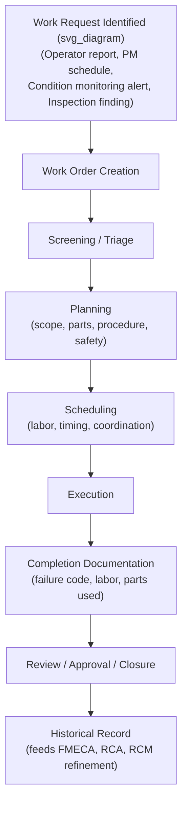
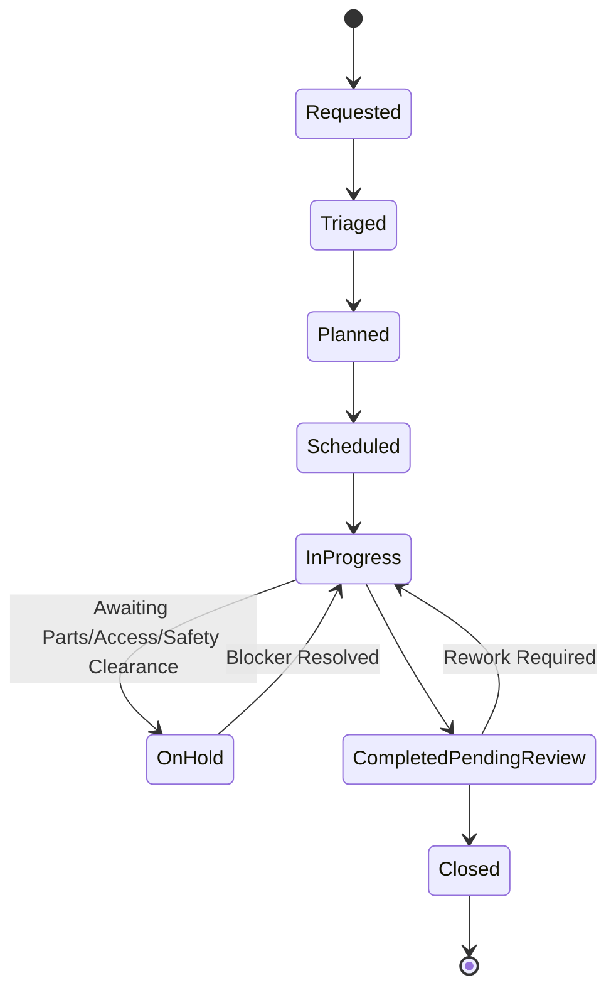

## Work Order Management and Maintenance Workflow Design

### Definition and Purpose

Work Order Management is the structured process by which maintenance work — reactive, preventive, predictive, or capital/project-related — is requested, planned, scheduled, executed, documented, and closed within a CMMS/EAM system. Maintenance Workflow Design is the broader discipline of designing the sequence of states, approvals, and handoffs a work order passes through, ensuring that work is prioritized correctly, resourced appropriately, and documented in a way that supports both immediate execution and long-term reliability analysis (feeding FMECA, RCA, and RCM refinement).

A well-designed work order workflow is the operational backbone connecting every other topic in this curriculum: RCM task assignments, FMECA failure-mode documentation, condition-monitoring alerts, and RCA findings all become actionable only when they translate into correctly structured, prioritized, and tracked work orders.

### The Work Order Lifecycle

### Work Order Types

| Type | Trigger | Planning Characteristics |
| --- | --- | --- |
| Reactive/emergency | Unplanned failure requiring immediate response | Minimal advance planning; prioritized by consequence severity |
| Corrective (planned) | Identified deficiency not requiring immediate action | Scheduled into upcoming planning cycle with normal lead time |
| Preventive (PM) | Time- or usage-based trigger from RCM-derived task schedule | Fully planned in advance; parts and labor pre-staged where possible |
| Predictive/condition-based | Condition monitoring alert or RUL threshold breach | Planning window determined by remaining P-F interval/RUL estimate |
| Project/capital | Planned modification, upgrade, or installation | Extended planning horizon, often requiring EAM-level capital tracking |
| Standing/routine | Recurring operational task not tied to a specific failure mode (e.g., housekeeping) | Simplified workflow, often batch-scheduled |

**Key Points**

- The distribution of work order types across these categories is itself a key reliability program health metric: a maintenance organization dominated by reactive/emergency work orders indicates an immature or poorly functioning RCM/PM program, while a healthy program shows the majority of work orders as planned preventive/predictive/corrective work, with reactive work limited to genuinely unpredictable or accepted-risk (run-to-failure) failure modes.
- Each work order type should carry distinct default priority and planning-lead-time expectations within the CMMS, since applying uniform workflow rules across fundamentally different urgency profiles typically produces either excessive reactive-work delay or unnecessary planning overhead on genuinely urgent work.

### Work Order Creation and Triage

**Key Points**

- Multiple work order sources feed into the same intake workflow: operator-reported issues, automatically generated PM schedule triggers, condition-monitoring/APM alerts, inspection findings, and RCA-driven corrective actions — a consistent intake and triage process is needed regardless of source to ensure appropriate prioritization.
- Triage should apply a **consequence-based priority classification** directly analogous to RCM's failure consequence categories (hidden, safety/environmental, operational, non-operational) rather than a generic urgency scale disconnected from the underlying failure mode's actual criticality — this ensures the same criticality logic governing which maintenance tasks exist in the first place also governs how competing work orders are prioritized against each other.

| Priority Level | Typical Criteria | Target Response Time |
| --- | --- | --- |
| Emergency/Critical | Safety/environmental risk, or complete stoppage of critical production asset | Immediate (minutes to hours) |
| High | Significant operational impact, degraded but not stopped critical function | Same shift to 24 hours |
| Medium | Moderate operational impact, non-critical asset, or planned corrective work | Days to weeks (next planning cycle) |
| Low | Minor/cosmetic issue, non-critical asset, no near-term operational risk | Weeks to months, batched with related work |

### Planning

Planning determines the full scope of work before scheduling, distinct from scheduling itself (which determines timing and resource allocation).

**Key Points**

- Effective planning specifies: the detailed job scope and procedure/task list, required parts (verified against spares availability per the MRO inventory strategy), required tools and equipment, required safety permits/lockout-tagout procedures, and estimated labor hours and craft/skill requirements — incomplete planning is a frequently cited root cause of schedule delays and extended equipment downtime during execution, since gaps discovered mid-execution (missing parts, unanticipated procedure steps) force work to pause.
- **Backlog management** — maintaining a prioritized queue of fully planned, ready-to-schedule work orders — is a standard best practice distinguishing planning from scheduling: work should generally not enter the schedule until planning is complete, since scheduling incompletely planned work reintroduces the delays planning is intended to prevent.

### Scheduling

**Key Points**

- Scheduling allocates planned work orders to specific time windows, technicians, and, where relevant, coordinated production/operations shutdown windows — this requires visibility into technician availability/skill, asset operational schedule (planned outages, production windows), and interdependencies between work orders (e.g., sequencing tasks that require the same equipment access).
- Predictive/condition-based work orders introduce a distinct scheduling constraint relative to standard preventive work: the available scheduling window is bounded by the remaining RUL/P-F interval estimate, meaning these work orders often require schedule flexibility (ability to insert into an already-planned schedule) rather than fitting into a purely fixed, pre-established preventive maintenance calendar.
- **Schedule compliance** (percentage of scheduled work actually completed within the scheduled window) is a standard maintenance workflow performance metric; persistent low schedule compliance typically indicates either unrealistic scheduling (insufficient labor capacity relative to planned work volume) or excessive reactive work disruption displacing planned work.

### Execution

**Key Points**

- Execution should be guided by the planned procedure/task list and should capture, at minimum: actual labor hours, actual parts consumed, and — critically for reliability engineering purposes — a **failure code** identifying the failure mode addressed (for corrective/reactive work) using a standardized taxonomy, ideally aligned with the organization's FMECA failure mode categories.
- Mobile/field-based CMMS access (technicians completing work orders directly at the asset via a mobile device rather than paper forms transcribed later) is widely adopted in current practice because it improves both data accuracy (reduced transcription error) and timeliness (real-time status visibility) relative to delayed paper-based documentation, though the specific mobile capability required depends on field connectivity conditions at a given site.

### Completion Documentation and Failure Coding

**Key Points**

- Consistent, structured failure coding at work order completion is the single most important data quality factor determining whether subsequent FMECA refinement, RCA investigations, and ML-based failure prediction models can be built on reliable historical data — free-text-only completion notes without structured failure codes severely limit the ability to perform quantitative reliability analysis later, regardless of how much historical work order volume accumulates.
- A standardized failure code taxonomy typically captures, at minimum: failure mode (what happened), cause (why it happened), and action taken (what was done) — these three fields, consistently populated, directly support the failure mode/cause/effect structure used in FMECA and RCA methodologies.
- [Inference] Achieving consistent failure coding compliance across a technician workforce is commonly reported as an ongoing organizational challenge rather than a one-time system configuration task; standardized dropdown-based code selection (rather than free text) and periodic data quality auditing are commonly cited practices for sustaining coding consistency, though the degree of effort required varies by organization size and workforce turnover.

### Review, Approval, and Closure

**Key Points**

- A closure review step — verifying the work order is complete, correctly coded, and (where applicable) confirming repair effectiveness — should precede final closure, since work orders closed without review are more prone to accumulating incomplete or inconsistent historical data over time.
- For high-criticality or safety-related work, a formal sign-off/approval step (supervisor or engineering review) is typically warranted before closure, distinguishing this from routine low-criticality work where a technician's own completion may be sufficient for closure without additional review.

### Work Order Workflow States (Standard State Model)

**Key Points**

- The **OnHold** state deserves specific workflow design attention: work orders frequently stall awaiting parts, access, or safety clearance, and a well-designed workflow should track hold reason and hold duration explicitly (rather than leaving work orders indefinitely "in progress" while effectively stalled), since hold-reason data is itself valuable for identifying systemic planning or spares-availability gaps.
- Workflow states should map to meaningful CMMS reporting categories (e.g., backlog = Requested + Triaged + Planned, active work = Scheduled + InProgress + OnHold) to support standard maintenance management metrics without requiring ad hoc data manipulation outside the system.

### Key Performance Indicators for Work Order Workflow

| Metric | Formula/Description | What It Indicates |
| --- | --- | --- |
| Schedule compliance | (Work orders completed within scheduled window) / (Total scheduled work orders) | Planning/scheduling realism and execution discipline |
| PM compliance | (PM work orders completed within due window) / (Total PM work orders due) | Adherence to RCM-derived preventive task schedule |
| Backlog (in weeks of labor) | Total estimated labor hours in backlog / available weekly labor hours | Whether planned work volume matches available labor capacity |
| Mean Time to Repair (MTTR) | Average time from work order creation (or failure occurrence) to completion | Maintenance execution efficiency, and a direct input to downtime cost calculations used in PdM business cases |
| Reactive vs. planned work ratio | Percentage of total work orders that are reactive/emergency vs. planned (PM, predictive, planned corrective) | Overall maintenance program maturity indicator |
| Failure code completion rate | Percentage of corrective/reactive work orders with a valid, non-blank failure code | Data quality supporting FMECA/RCA/ML analytics |

**Key Points**

- These metrics should be reviewed together rather than in isolation: for example, an improving schedule compliance metric alongside a worsening reactive-vs-planned ratio may indicate that reactive work is being handled efficiently once it occurs, while the underlying preventive strategy is not adequately preventing failures in the first place — a distinction a single metric would not reveal.

### Integration with RCM, FMECA, and Condition Monitoring

**Key Points**

- RCM's proactive task outputs (condition-based, scheduled restoration, scheduled discard, failure-finding) become the specific PM work order templates configured in the CMMS, with task intervals, procedures, and required parts populated directly from the RCM decision worksheet.
- IoT/APM-generated alerts and RUL estimates should trigger automatic work order creation (or at minimum, prioritized triage queue placement) via system integration, with the work order's target completion window derived from the remaining RUL/P-F interval rather than a generic default priority — this connects the analytical output covered in the predictive maintenance chapter directly to the operational workflow covered here.
- Completed work order failure-code data is the primary feedback loop refining FMECA occurrence/probability estimates and validating or challenging RCM's assumed failure consequence classifications and P-F intervals over time — this feedback loop only functions if completion documentation practices (discussed above) are consistently followed.

### Common Implementation Pitfalls

- Allowing reactive/emergency work to consistently displace planned preventive and predictive work without a formal schedule protection mechanism, gradually eroding PM compliance and increasing future reactive work in a self-reinforcing negative cycle.
- Scheduling work orders before planning is complete, causing execution delays discovered mid-job (missing parts, unanticipated procedure steps, inadequate safety preparation) that could have been identified during a proper planning phase.
- Permitting free-text-only failure documentation without structured failure codes, severely limiting the organization's ability to perform meaningful FMECA refinement, RCA, or ML-based failure prediction on the resulting historical data regardless of accumulated work order volume.
- Leaving work orders in an ambiguous "in progress" state while genuinely on hold for parts or access, obscuring true backlog and blocker patterns that would otherwise be visible through explicit hold-reason tracking.
- Applying a uniform priority/workflow treatment across fundamentally different work order types (reactive emergency vs. routine PM) rather than differentiated default priorities and lead-time expectations matched to each type's actual urgency profile.
- Closing work orders without a review step for high-criticality or safety-related work, risking incomplete documentation or unverified repair effectiveness entering the historical record unchecked.
- [Inference] Underinvesting in mobile/field data capture capability where field connectivity supports it, resulting in delayed or transcription-error-prone paper-based documentation that degrades the timeliness and accuracy of the historical data record — the appropriate mobile solution and its priority varies by site connectivity and workforce technology adoption readiness.

### Related Topics

- Reliability-Centered Maintenance (RCM) Methodology
- Failure Mode, Effects, and Criticality Analysis (FMECA)
- Root Cause Analysis for Recurring Failures
- Comparing CMMS, EAM, and APM Scope and Selection Criteria
- Spare Parts and MRO Inventory Strategy
- IoT Sensors and Real-Time Condition Monitoring
- Maintenance Planning and Scheduling Best Practices
- Key Performance Indicators for Maintenance Organizations